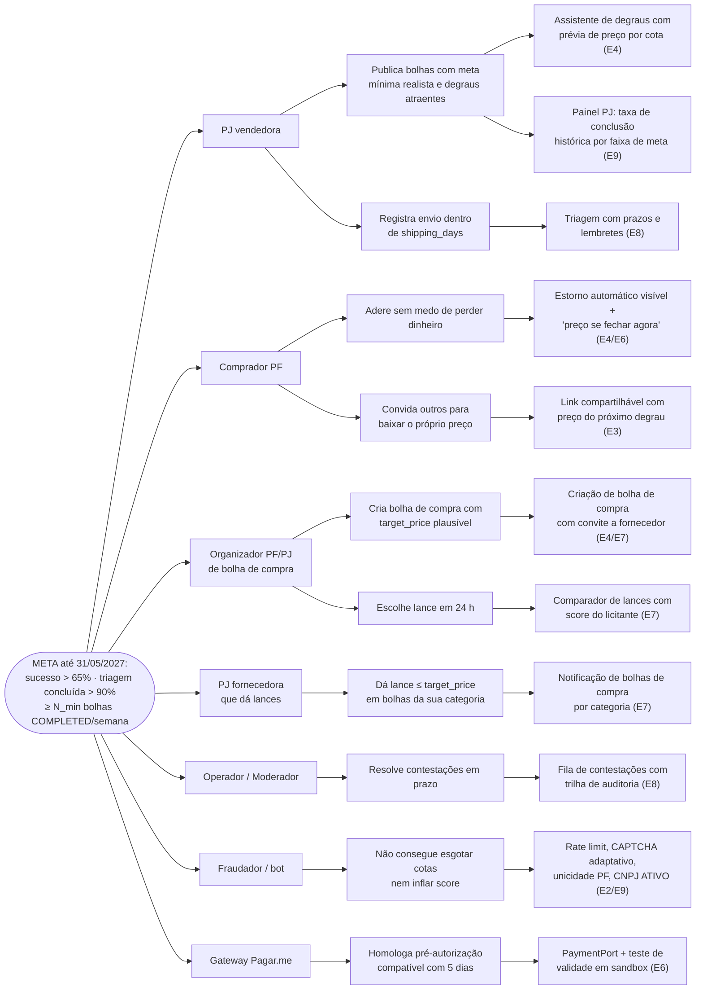

# Business Case — Bolha Venda

**Versão:** 1.0 · **Data:** 06/10/2026 · **Status:** Rascunho para revisão
**Base:** [PRD v2.1](../../PRD.MD) · [Spec do Produto](../../SPEC.md) · [Plano de Projeto v2](../planing-project.md) · [Viabilidade Jurídica](../judicial-viability.md) · [MVP](../mvp.md) · `001-brain/` (conceito fundador, read-only)

> **Regra deste documento:** nenhum número de mercado é apresentado como fato. Todo valor que não vem do PRD, da Spec, do plano ou dos fatos canônicos é uma **hipótese (Hxx)** com experimento e critério de sucesso definidos *antes* de rodar o teste. Unit economics são **fórmulas parametrizadas**; os parâmetros serão preenchidos com dados do beta fechado (S8) e do beta público (a partir de 01/03/2027). Em conflito, a **Spec prevalece** (parâmetros na Spec §5; questões em aberto Q1–Q6 na Spec §9).
>
> Decisões D1–D8 estão com status **Proposto** (aguardam o Gate A) e são referenciadas como "(ADR-xxxx, proposto)".

---

## 1. Problema

O conceito fundador (`001-brain/001 product.md`) define o produto como "a evolução da compra coletiva" em quatro modalidades (B2B, B2C, C2B, C2C). O PRD (§2) descreve dois problemas, um de cada lado do mercado:

| Lado | Quem | Problema observado (PRD §2) | Consequência |
| :--- | :--- | :--- | :--- |
| Demanda | Consumidor PF / solopreneur (Carlos Silva) | Não tem poder de barganha individual nem visibilidade de outros compradores com o mesmo interesse | Desiste de comprar em volume por falta de "parceiros de lote" (perda de conversão) |
| Oferta | Empresa PJ — distribuidora, atacado, varejo (TecnoLotes Ltda) | CAC alto e incerteza de demanda ao lançar lotes promocionais | Dá desconto **sem garantia** de volume mínimo (risco comercial) |
| Demanda organizada | PF ou PJ que precisa de um item que ninguém oferta em lote | Não há mecanismo nativo de **agregar demanda primeiro e chamar fornecedores depois** (C2B) | A demanda latente fica em grupos informais, sem preço, sem garantia e sem reputação |

**Lacunas das soluções atuais (por categoria, sem dados de empresas específicas):**
1. O e-commerce tradicional é estático e unilateral (PRD §2.2): o preço não reage ao volume agregado em tempo real.
2. No modelo clássico de cupons de compra coletiva, o desconto é fixo e o vendedor assume o risco de volume. Não há curva visível nem condição de meta mínima com estorno automático.
3. Grupos informais de compra (mensageiros, redes sociais) não têm garantia de pagamento, estorno, reputação nem proteção do CDC operacionalizada.

## 2. Proposta de valor

**Frase de valor (UVP):**
> *"Junte-se a quem quer o mesmo que você: quanto mais cotas, menor o preço para todos — e se a meta não for atingida, o dinheiro volta 100%, automaticamente."*

| Para | O Bolha Venda entrega | Mecanismo concreto (fatos canônicos) |
| :--- | :--- | :--- |
| Comprador PF | Preço de lote sem precisar comprar o lote, com risco zero se a bolha falhar | 1 cota por bolha; preço final único = degrau atingido na explosão (ADR-0004, proposto); pré-autorização do cartão / Pix com estorno; `EXPIRED_FAILED → CANCELLED` com estorno 100% automático (ADR-0009, proposto) |
| Vendedor PJ (bolha de venda) | Desconto **condicionado** ao volume: só vende no preço baixo se o volume vier | `min_quotas` (meta mínima) + `price_tiers` definidos pelo próprio vendedor; teto por PJ compradora (`max_pj_share`, ADR-0006, proposto) |
| Organizador PF/PJ (bolha de compra) | Transforma demanda dispersa em pedido firme e coloca fornecedores para competir | Participantes autorizam até `target_price`; PJs dão lances ≤ `target_price`; criador escolhe em 24 h, com fallback de menor preço (ADR-0005, proposto) |
| Fornecedor PJ (lances C2B) | Acesso a demanda **já agregada e pré-autorizada**, sem custo de aquisição até vencer | Bolha de compra em `EXPIRED_SUCCESS` só abre a seleção com cotas pré-autorizadas |
| Todos | Confiança entre desconhecidos | Score 0–1000 com eventos objetivos, contestação em até 5 dias (ADR-0007, proposto); CNPJ com situação ATIVA (ADR-0008, proposto); pseudônimo no canvas (LGPD) |
| Todos | Descoberta lúdica e senso de urgência | Canvas infinito com bolhas crescendo em tempo real; flags `is_near_full` e `is_expiring` |

**Diferencial estrutural (não é feature):** o comprador tem **incentivo econômico direto** para trazer outros compradores, porque cada nova cota pode baixar o seu próprio preço até o próximo degrau. A viralidade de valor está embutida no mecanismo de preço. Isso é a hipótese H6 (seção 8).

## 3. Lean Canvas

Ordem de preenchimento e de teste segundo a "cadeia de crenças" de Ash Maurya: **Problema + Segmento primeiro**, porque os blocos seguintes herdam esse risco.

| # | Bloco | Conteúdo — Bolha Venda |
| :---: | :--- | :--- |
| 1 | **Problema** | (1) PF não consegue preço de lote sozinho e não encontra outros compradores. (2) PJ dá desconto sem garantia de volume e paga CAC alto por venda avulsa. (3) Demanda coletiva (C2B) não tem onde se formalizar com pagamento garantido. **Alternativas atuais:** comprar no varejo pelo preço cheio; grupos informais em mensageiros; cotação manual com vários fornecedores; liquidação de estoque com desconto incondicional. |
| 2 | **Segmentos de clientes** | Oferta: PJ com estoque a girar ou lote promocional (distribuidoras, atacado, varejo de nicho). Demanda: PF compradora de bens de ticket médio para cima, sensível a preço. PF vendedora (C2C) só com cadastro de recebedor aprovado no gateway (Spec §2 e Q2). Organizadores: PF/PJ que já organizam compras em grupo (clubes, associações, condomínios, pequenas empresas comprando insumos). **Early adopters (hipótese H1/H2):** as 5 PJs parceiras do beta fechado e cerca de 50 usuários (plano, S8), concentrados em **uma vertical** (seção 7.3). |
| 3 | **Proposta de valor única** | "Quanto mais gente, mais barato para todos, e se não fechar o dinheiro volta." Curva de preço visível em tempo real num canvas vivo. |
| 4 | **Solução** | Bolhas de venda (`SALE`) e de compra (`PURCHASE`) com cotas, degraus de preço e explosão automática; pré-autorização/captura e estorno via gateway (ADR-0003, proposto); lances de PJs em bolhas de compra; triagem pós-explosão (envio, recebimento, arrependimento, repasse); score com contestação. |
| 5 | **Canais** | Oferta: venda consultiva direta às PJs da vertical-alvo (concierge). Demanda: compartilhamento de link da bolha pelos próprios participantes (viralidade de valor); convite a até 5 fornecedores sugeridos pelo criador da bolha de compra (Spec F4); conteúdo/SEO das bolhas públicas (hipótese, pós-R1). |
| 6 | **Fontes de receita** | Take rate sobre o GMV de bolhas **concluídas**, cobrado do vendedor (hipótese canônica: 6%). Taxa do gateway repassada. Bolha de compra sem taxa para o comprador PF. Receitas futuras (fora da R1, a validar): destaque de bolha no canvas e plano PJ com analytics. |
| 7 | **Estrutura de custos** | Time da R1 (plano §2); infraestrutura (Vercel, contêineres da API e dos workers, Postgres e Redis gerenciados, observabilidade); custo do gateway **não recuperado** em bolhas que falham (ver C_falha, seção 5); verificação de CNPJ; suporte e moderação (triagem e contestações); jurídico consultivo; aquisição da oferta (venda direta). |
| 8 | **Métricas-chave** | Taxa de sucesso (`EXPIRED_SUCCESS ÷ publicadas`) > 65% e conclusão da triagem > 90% (PRD v2.1 §10); mediana do tempo até o sucesso < 48 h; guardrails (estorno na triagem < 5%, contestações procedentes < 2%); GMV concluído; take efetivo; % de bolhas de compra com ≥ 1 lance válido; taxa de arrependimento; taxa de contestação procedente; k-fator por bolha. |
| 9 | **Vantagem injusta** | Nenhuma na largada (honestamente). Candidatas a construir: (a) **histórico de score** cruzado comprador/vendedor, que não se transfere para concorrentes; (b) **liquidez local** numa vertical (efeito de rede de dois lados); (c) base de demanda pré-autorizada que atrai fornecedores para o C2B. |

## 4. Impact Map

**Por quê (meta):** até **31/05/2027** (3 meses após o go-live de 01/03/2027), atingir as metas do PRD v2.1 §10:
- **taxa de sucesso de bolhas** (`EXPIRED_SUCCESS ÷ bolhas publicadas`, coorte mensal) **> 65%**;
- **taxa de conclusão da triagem** (`COMPLETED ÷ IN_TRIAGE`) **> 90%**;
- guardrails respeitados: estorno por cancelamento na triagem < 5% e contestações procedentes < 2%;
- **≥ N_min bolhas `COMPLETED` por semana** na vertical-alvo. O valor de `N_min` é definido pelo patrocinador no Gate A a partir do ponto de equilíbrio `N*` da seção 5.3.

O PRD §10 trata essas metas como hipóteses do beta, a recalibrar com 60 dias de dados reais.

> O nível **Como (impactos)** é a mudança de comportamento necessária em cada ator. É o nível mais valioso e o mais pulado. As entregas (O quê) só entram no backlog se estiverem ligadas a um impacto.



| Ator | Impacto (mudança de comportamento) | Entrega | Épico | Indicador de impacto |
| :--- | :--- | :--- | :--- | :--- |
| PJ vendedora | Publica com `min_quotas` atingível | Assistente de degraus com prévia | E4 | % de bolhas `SALE` em `EXPIRED_SUCCESS` |
| PJ vendedora | Envia no prazo | Triagem com prazos | E8 | % de itens com `ShipmentRegistered` ≤ `shipping_days` |
| Comprador PF | Adere apesar de pagar antes | Estorno automático comunicado na adesão | E4/E6 | Conversão da tela de detalhe para `QuotaAcquired` |
| Comprador PF | Convida outros | Link compartilhável | E3 | k-fator por bolha (seção 7.4) |
| Organizador | Cria bolha de compra plausível | Criação com `target_price` e convite | E4/E7 | % de bolhas `PURCHASE` com ≥ 1 lance válido |
| Organizador | Decide em 24 h | Comparador de lances | E7 | % de seleções manuais × fallback |
| PJ fornecedora | Dá lance | Notificação por categoria | E7 | Lances por bolha `PURCHASE` |
| Moderador | Decide contestações | Fila com SLA | E8 | % decidido antes do prazo |
| Fraudador (ator negativo) | Não consegue abusar | Controles antiabuso | E2/E9 | Contas bloqueadas / cotas liberadas por abuso |
| Gateway | Viabiliza a pré-autorização | `PaymentPort` + teste de validade | E6 | Validade confirmada ≥ duração máxima (R5) |

## 5. Modelo de receita e unit economics (parametrizados)

### 5.1 Modelo de receita (hipótese canônica)

- **Take rate `t` = 6%** (hipótese; Spec Q5: "taxa de 6% e quem a paga", a validar com entrevistas de PJs na S0). A Spec F6 define a base como **6% do valor capturado, descontado do repasse ao vendedor**: o criador PJ/PF na bolha `SALE` ou a PJ do lance vencedor na bolha `PURCHASE`.
- O repasse (`PayoutReleased`) só ocorre quando o item chega a `COMPLETED`, depois da janela de arrependimento (7 dias após o recebimento). Itens estornados não geram repasse, então na prática o take incide sobre o capturado **líquido de arrependimentos e cancelamentos**. ⚠ Os fatos canônicos dizem "GMV de bolhas concluídas" e a Spec diz "valor capturado"; a fórmula abaixo assume que não há take sobre item estornado.
- **Frete incluso no preço da cota** (Spec Q6, recomendação para a R1). Como o preço por cota é **único** (ADR-0004, proposto), o vendedor precisa embutir o frete do pior caso ou restringir a região atendida. Ver H12.
- **Taxa do gateway: repassada.** ⚠ Ambíguo nos fontes: repassada **a quem** e **em que eventos**? Ver C_falha abaixo e a lacuna L-03.
- Comprador PF em bolha de compra: **sem taxa**.

### 5.2 Variáveis

| Símbolo | Significado | Fonte do valor |
| :--- | :--- | :--- |
| `q_i` | Cotas preenchidas na bolha *i* na explosão (`filled_quotas`) | Banco |
| `p_i` | Preço final por cota (degrau atingido ou lance vencedor), em centavos | Banco |
| `GMV_i` | `q_i × p_i` | Derivado |
| `a` | Fração do GMV estornada por arrependimento ou cancelamento na triagem | Beta |
| `t` | Take rate (hipótese 6%) | H4 |
| `g` | Custo do gateway por transação capturada, se **não** for repassado | Contrato Pagar.me |
| `c_f` | Custo por bolha que falha: pré-autorizações não capturadas, Pix cobrado e estornado, notificações | Contrato + infra |
| `c_s` | Custo variável de suporte/moderação por bolha concluída (triagem, contestações) | Beta |
| `c_v` | Custo de verificação de CNPJ por PJ (BrasilAPI é gratuita, ReceitaWS no fallback, revalidação a cada 30 dias) | ADR-0008 |
| `π` | Probabilidade de a bolha publicada chegar a `COMPLETED`: `π ≈ s × c_t`, onde `s` = taxa de sucesso (meta > 65%) e `c_t` = conclusão da triagem (meta > 90%). Nas metas do PRD, `π` alvo ≈ 0,585 | PRD v2.1 §10 |
| `F` | Custo fixo mensal (time + infra base) | Plano §2 + orçamento |

### 5.3 Fórmulas

```text
Receita da bolha concluída       R_i  = t × GMV_i × (1 − a)
Margem de contribuição (concl.)  MC_i = R_i − g_i − c_s
Margem esperada por bolha publicada
                                 E[MC] = π × MC̄ − (1 − π) × c_f
Bolhas publicadas/mês para equilíbrio
                                 N*   = F / E[MC]          (só existe se E[MC] > 0)
Take mínimo para E[MC] > 0
                                 t_min = [ g + c_s + ((1−π)/π) × c_f ] / [ GMV̄ × (1 − a) ]
```

**Leitura importante:** `t_min` cresce quando `π` cai. Com `π` baixo, cada bolha concluída paga o custo das que falharam. As metas de 65% (sucesso) e 90% (triagem) do PRD não são só métricas de produto: são a **condição de viabilidade** do take de 6%.

### 5.4 Unit economics por lado (aquisição)

```text
LTV_PJ  = (bolhas concluídas/mês por PJ) × GMV̄_PJ × t × (1 − a) × margem_líquida × vida_média_meses
LTV_PF  = (cotas/mês por PF) × p̄ × t × (1 − a) × vida_média_meses   (receita atribuída à demanda)
Payback_PJ (meses) = CAC_PJ / (LTV_PJ / vida_média_meses)
Condição de saúde:  LTV_lado / CAC_lado ≥ L*     (L* definido pelo patrocinador no Gate A)
```

- O **motor de crescimento pago** (Ries) só funciona se o LTV de cada lado superar o custo de alcançá-lo. No lado PF, a hipótese é que `CAC_PF` tende a ser baixo **por causa** da viralidade de valor (seção 7.4). No lado PJ, a aquisição é consultiva e cara no início.
- **Análise de sensibilidade:** depois do beta, variar um fator por vez (`t`, `π`, `a`, `c_f`) e medir `ΔE[MC]/Δfator`. O fator de maior inclinação vira o foco da próxima rodada de experimentos.

### 5.5 Riscos econômicos específicos do modelo

| Risco | Por que é específico do Bolha Venda | Hipótese / ação |
| :--- | :--- | :--- |
| Custo de Pix em bolha que falha | Pix é cobrado na adesão e estornado 100% se a bolha falhar. Se o gateway cobrar tarifa no recebimento e não a devolver no estorno, a plataforma paga para a bolha fracassar | H8: confirmar com o Pagar.me na S0 (caminho crítico D2) |
| Pré-autorização expira | Duração máxima de 5 dias depende da validade da pré-autorização (R5) | H7 |
| Captura parcial | Cartão: pré-autoriza `initial_price × cotas` e captura o preço final (menor). Precisa de captura parcial suportada | H7 |
| Take sobre bolha de compra | Na bolha `PURCHASE`, o vendedor (PJ licitante) já competiu em preço. O take de 6% pode empurrar lances para cima | H4b |

## 6. Alternativas e concorrência (por categoria)

> Sem afirmações sobre empresas reais: as categorias abaixo descrevem **modelos**, não participantes específicos. Antes de qualquer material externo, o mapeamento nominal deve ser feito com pesquisa verificável (ver `product-management:competitive-brief`).

| Categoria (alternativa do cliente) | O que resolve | Onde falha para o nosso segmento | Como o Bolha Venda se diferencia | Risco de reação |
| :--- | :--- | :--- | :--- | :--- |
| Marketplaces generalistas de e-commerce | Sortimento, logística, confiança | Preço não reage à demanda agregada; não há C2B | Curva de degraus + meta mínima + C2B | Alto: podem copiar "compra em grupo" como feature |
| Sites de cupom / compra coletiva clássica | Desconto por volume | Desconto fixo, vendedor assume o risco de volume, sem curva visível | Meta mínima condicional com estorno; preço único por degrau | Médio |
| Grupos informais (mensageiros, redes sociais) | Agregam demanda de graça e com confiança social | Sem pagamento garantido, estorno, reputação nem CDC operacionalizado | Pré-autorização, triagem, score, arrependimento | Baixo (não evoluem), mas é a **principal alternativa** do organizador |
| Plataformas B2B de cotação / RFQ / atacado | Comprador PJ cota com vários fornecedores | Pouco acessíveis a PF; não agregam pequenos compradores | Bolha de compra que soma PFs e PJs num único pedido | Médio |
| Leilões e leilão reverso | Descoberta de preço | Um comprador por vez; leilão reverso é B2B | Lance C2B sobre demanda **coletiva** pré-autorizada | Baixo |
| Outlet / liquidação de estoque | Giro de estoque | Desconto incondicional, sem garantia de volume | Desconto condicionado ao volume | Médio |
| **Não fazer nada** (comprar no varejo a preço cheio) | Simplicidade | Paga mais | Tempo de espera (≤ 5 dias) em troca de preço | É o concorrente real a vencer em H1 |

## 7. Go-to-market e cold start

### 7.1 Diagnóstico

É um mercado de dois lados com **dependência assimétrica**:
- A **bolha de venda** precisa primeiro da oferta (PJ publica) e depois da demanda (PF adere).
- A **bolha de compra** precisa primeiro da demanda (organizador + participantes) e depois da oferta (PJ dá lance). O plano classifica isso como **R9 — probabilidade alta**.

Estratégia: **oferta primeiro, em uma vertical**, porque uma única PJ cria N oportunidades de demanda (bolhas `SALE`) e porque o C2B só funciona se já houver PJs cadastradas, com CNPJ ATIVO, para notificar.

### 7.2 Fases

| Fase | Período (plano) | Lado oferta (PJ) | Lado demanda (PF) | Critério de passagem |
| :--- | :--- | :--- | :--- | :--- |
| 0 — Recrutamento concierge | S0 (12/10–23/10/2026) | Recrutar **5 PJs parceiras** na vertical-alvo; entrevistas sobre lotes, margem e prazo de envio; cartas de intenção | Lista de espera via landing page (smoke test) com a promessa de valor | 5 PJs com carta de intenção; lista de espera ≥ W_min (definido no Gate A) |
| 1 — Protótipo | S0 → Gate A | PJs validam o assistente de degraus no Figma | 5 usuários validam o canvas (critério do Gate A) | Gate A |
| 2 — Beta fechado | S8 (15/02–26/02/2027) | Cada PJ publica ≥ 2 bolhas `SALE` reais ("bolhas-semente"); equipe faz *concierge* do C2B: para cada bolha `PURCHASE`, prospecta manualmente fornecedores (Mágico de Oz) | ≈ 50 usuários convidados; incentivo para compartilhar o link | Nenhum bug S1; π medido |
| 3 — Beta público | a partir de 01/03/2027 | Abrir cadastro PJ na vertical; painel de resultados como argumento de venda | Viralidade de valor + convite a fornecedor | Meta do Impact Map (31/05/2027) |
| 4 — Expansão | pós-R1 | Segunda vertical **somente** se a primeira atingir a meta | — | Decisão pivotar/perseverar |

### 7.3 Escolha da vertical (hipótese H3)

Critérios: (a) ticket por cota alto o bastante para o take cobrir `c_s`; (b) produto padronizado (a cota é fungível, sem variação de tamanho ou cor); (c) a PJ consegue enviar dentro de `shipping_days` (padrão 7, faixa 1–30) com **frete incluso** no preço da cota (Spec Q6, H12); (d) existe comunidade organizada (clubes, associações) para o lado C2B. A persona TecnoLotes sugere **eletrônicos/informática em lote** como candidata, e o conceito fundador cita **peças** como caso C2B. A decisão sai de entrevistas na S0, não deste documento.

### 7.4 Viralidade embutida (lado demanda)

```text
k_bolha = i × c
  i = convites (links compartilhados) por participante
  c = fração dos convidados que adquirem cota na mesma bolha
```
Diferente de um produto social genérico, aqui o participante **ganha** com o convite: se a bolha está a `Δq` cotas do próximo degrau, o convite reduz o seu próprio preço final. A UI deve mostrar "faltam Δq cotas para o preço cair para R$ X". Não é preciso `k > 1` para dar certo: basta `k` alto o suficiente para levar a bolha até `min_quotas` antes de `expires_at`.

### 7.5 Mensagem por público

| Público | Mensagem | Prova |
| :--- | :--- | :--- |
| PJ vendedora | "Desconto só se o volume vier." | `min_quotas` + estorno automático + repasse garantido |
| PF compradora | "Preço de lote, risco zero." | Estorno 100% em `EXPIRED_FAILED` |
| Organizador | "Junte o grupo e faça os fornecedores disputarem." | Lances ≤ `target_price`; você escolhe em 24 h |
| PJ fornecedora | "Demanda pronta, já autorizada." | Lances só em bolhas `EXPIRED_SUCCESS` com pré-autorização |

## 8. Hipóteses críticas — mapa de suposições

Priorização: **importância para o modelo × evidência disponível**. As mais arriscadas (importância alta, pouca evidência) são testadas primeiro. O critério de sucesso é fixado **antes** do teste.

| ID | Hipótese | Tipo | Experimento | Critério de sucesso (decidido antes) | Quando | Se falhar |
| :--- | :--- | :--- | :--- | :--- | :--- | :--- |
| **H1** | PF aceita pagar/pré-autorizar agora e esperar até 5 dias pelo preço coletivo | Desejabilidade | Protótipo navegável + 5 entrevistas (Gate A); no beta, conversão detalhe → cota | 4/5 entrevistados completam a adesão no protótipo sem dúvida sobre o estorno; conversão no beta ≥ C_min | S0; S8 | Reduzir duração padrão; reforçar comunicação do estorno |
| **H2** | PJ publica lotes com degraus e meta mínima | Desejabilidade | Concierge com as 5 PJs: montar degraus juntos | 5/5 assinam carta de intenção; ≥ 2 bolhas reais por PJ no beta | S0; S8 | Rever a vertical (H3) |
| **H3** | Existe uma vertical com cota fungível e envio ≤ 7 dias | Viabilidade | Entrevistas com PJs de 2–3 verticais candidatas | 1 vertical atende aos 4 critérios da seção 7.3 | S0 | Não iniciar o beta |
| **H4** (Spec Q5) | Vendedor aceita take de 6% do valor capturado, descontado do repasse | Viabilidade | Pergunta de preço nas entrevistas + aceite contratual no beta | ≥ 4/5 PJs aceitam sem negociação para baixo | S0; S8 | Testar take escalonado |
| **H4b** | Take em bolha `PURCHASE` não inviabiliza lances | Viabilidade | Comparar o lance médio com o `target_price` no beta | Mediana do lance vencedor ≤ `target_price` com o take embutido | S8+ | Take reduzido no C2B |
| **H5** | Taxa de sucesso > 65% e conclusão da triagem > 90% (PRD v2.1 §10) | Viabilidade | Medição por coorte mensal (E9) | Sucesso > 65% e triagem > 90% nas coortes de mar–mai/2027, com guardrails respeitados | Mar–mai/2027 | Ajustar o assistente de meta mínima |
| **H6** | Participantes compartilham porque o próprio preço cai | Desejabilidade | Link com UTM por participante; medir `k_bolha` | k medido em ≥ 30 bolhas; bolhas com ≥ 1 convite convertido têm π maior que as sem convite | S8+ | Incentivo explícito (pós-R1) |
| **H7** (Spec Q1) | Pré-autorização com captura parcial é válida por ≥ 5 dias | Viabilidade técnica | Research spike no sandbox do Pagar.me (R5) | Captura parcial bem-sucedida no dia 5 em 100% dos casos de teste | S0–S5 | Encurtar a duração máxima ou usar só Pix |
| **H8** | O custo de Pix cobrado e estornado em bolha que falha é aceitável | Viabilidade | Ler o contrato e testar no sandbox | `c_f` conhecido e `E[MC] > 0` com π = 65% | S0 | Pix só na captura (mudaria a D2) |
| **H9** | O canvas ajuda a descobrir bolhas melhor que uma lista | Usabilidade | Teste de protótipo A/B (canvas × lista) com 5+5 usuários | Tempo até achar uma bolha de interesse no canvas ≤ lista | S0 | Lista como visão primária, canvas como secundária |
| **H10** | PJs dão lances em bolhas de compra (R9) | Desejabilidade | Concierge: 3 bolhas `PURCHASE` reais no beta, com prospecção manual | ≥ 2 lances válidos em ≥ 2/3 das bolhas | S8 | C2B como recurso secundário na R1 |
| **H11** | O score reduz não envio e não pagamento | Viabilidade | Comparar a taxa de cancelamento por culpa por faixa de score | Faixa "Bom/Excelente" com cancelamento por culpa menor que "Regular" | Pós-R1 | Recalibrar pesos (`score_model_version`) |
| **H12** (Spec Q6) | Frete incluso no preço único da cota é viável para o vendedor | Viabilidade | Nas entrevistas da S0, simular com cada PJ o frete do pior CEP × o preço do degrau-alvo; no beta, medir o cancelamento por região | ≥ 4/5 PJs mantêm o `target_price` competitivo com frete incluso, atendendo pelo menos à sua região | S0; S8 | Restringir a bolha por região (UF/raio) ou frete à parte (pós-R1) |

## 9. Recomendação

Seguir para o **Gate A** sob a condição de que H3, H7 (Spec Q1), H8 e H12 (Spec Q6) (as hipóteses que podem matar o modelo econômico) tenham resposta **antes** do Gate A, e que H1, H2 e H4 (Spec Q5) tenham evidência qualitativa das entrevistas de S0. H5, H6 e H10 só são testáveis com produto no ar e entram como critérios de decisão pivotar/perseverar em 31/05/2027.

## 10. Lacunas registradas

| ID | Lacuna | Onde resolver |
| :--- | :--- | :--- |
| L-01 | Patrocinador/financiador e orçamento `F` não constam dos fontes | Gate A |
| L-02 | A vertical-alvo não está definida | S0 (H3) |
| L-03 | "Taxa do gateway repassada": a quem? Em bolha que falha, quem paga? | ADR-0003 (proposto) |
| L-04 | Nota fiscal / intermediação fiscal do take (a plataforma emite NF de serviço sobre o take?) não aparece nos fontes | Jurídico + contábil antes do Gate E |
| L-05 | O conceito fundador prevê usuários "acrescentando produtos" à bolha de pedidos; o modelo canônico é 1 item por bolha | Backlog pós-R1 |

---

## Fontes consultadas (AlterEgo)

- **business-analyst** — *Impact Mapping, Lean Canvas, Story Mapping* (extração de fontes primárias: Ash Maurya, "Lean Canvas" e "Reorder your Chain of Beliefs"; Gojko Adzic / impactmapping.org e Open Practice Library): os 9 blocos, a ordem de teste "Problem + Customer Segment primeiro", os níveis Why/Who/How/What e a ênfase no nível de impacto.
- **asias-product-management** — Teresa Torres, *Assumption Testing: Everything You Need to Know to Get Started* (Product Talk), incluindo o assumption mapping de David Bland (*Testing Business Ideas*): tipos de suposição, priorização por importância × evidência, critério de sucesso definido antes do teste.
- **comercial-vendas** — "MVP como oferta mínima testável para B2B" e "Ciclo Construir-Medir-Aprender aplicado à qualificação B2B" (síntese de *A Startup Enxuta*, Eric Ries): MVP concierge, Mágico de Oz, cartas de intenção, landing page como smoke test, foco em early adopters.
- **marketing** — Eric Ries, *A Startup Enxuta*, pp. 156–157 (motor de crescimento pago, LTV versus custo de aquisição).
- **asias-plg** — *08 Virality Guide* (ProductLed): fórmula do coeficiente k (`k = i × c`), virality de efeito de rede e de valor.
- **financeiro** — *Corporate finance* (Wikipedia), seção "Sensitivity and scenario analysis": variar um fator por vez e medir ΔNPV/Δfator.
