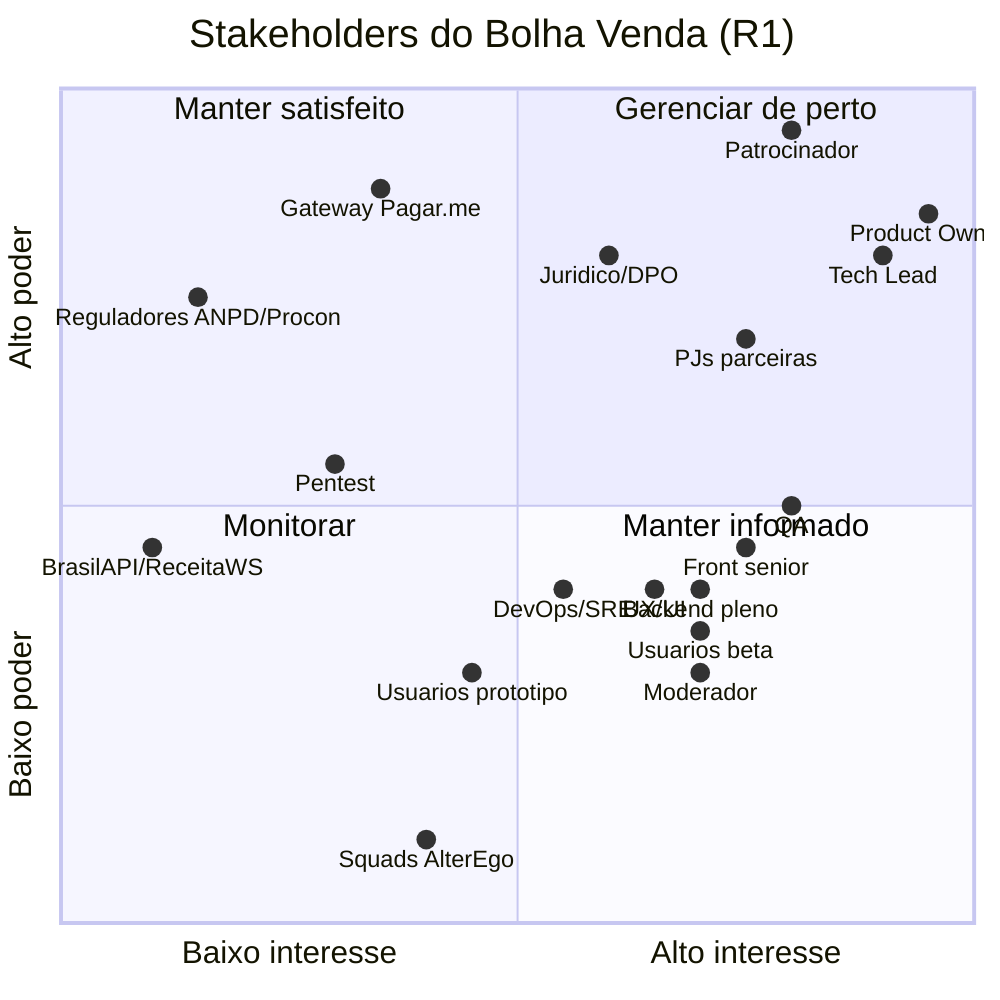

# Stakeholders, RACI e Plano de Comunicação — Bolha Venda

**Versão:** 1.0 · **Data:** 06/10/2026 · **Status:** Rascunho para revisão
**Base:** [PRD v2.1](../../PRD.MD) · [Spec do Produto](../../SPEC.md) (papéis §2, moderação F12) · [Plano de Projeto v2](../planing-project.md) (time §2, gates §3, riscos §7) · [Business Case](business-case.md)

> Gates, aprovadores e papéis vêm do plano v2. Onde o plano não define alguém (patrocinador, moderação, DPO), o documento propõe e marca como **(proposto)**. Decisões D1–D8 seguem com status Proposto até o Gate A.

---

## 1. Inventário de stakeholders

| ID | Stakeholder | Tipo | Alocação / relação | Interesse principal | Poder sobre o projeto |
| :--- | :--- | :--- | :--- | :--- | :--- |
| S01 | **Patrocinador / Fundador** (proposto: não nomeado nos fontes) | Interno | Financia, define a meta de negócio | Viabilidade econômica (`E[MC] > 0`), prazo de 01/03/2027 | Muito alto: decide pivotar/perseverar e orçamento `F` |
| S02 | **Product Owner** | Interno | 50% | Escopo da R1, backlog, metas do PRD §10 | Alto: aprova os Gates A, C, D e E |
| S03 | **Tech Lead / Backend sênior** | Interno | 100% | ADRs, arquitetura, RNF | Alto: aprova os Gates A, B e E |
| S04 | Backend pleno | Interno | 100% | Clareza de regras (estados, pagamento) | Médio |
| S05 | Frontend sênior (canvas/WebGL) | Interno | 100% | 60 FPS com 500 bolhas (R1) | Médio |
| S06 | Frontend pleno | Interno | 100% | Fluxos de UI estáveis | Baixo/médio |
| S07 | QA | Interno | 100% | Critérios testáveis, concorrência da última cota | Médio: co-aprova o Gate C |
| S08 | UX/UI Designer | Interno | 50% (S0–S3), 25% depois | Protótipo validado, acessibilidade | Médio |
| S09 | DevOps/SRE | Interno | 25% | Staging, observabilidade, runbooks | Médio |
| S10 | **Jurídico (consultivo)** | Interno/externo | Sob demanda | CDC, LGPD, Termos, Marco Civil | Alto: co-aprova os Gates A e E (pode vetar o go-live) |
| S11 | **Encarregado de dados (DPO)** (proposto: pode ser o Jurídico) | Interno | Sob demanda | RIPD/DPIA, direitos do titular, incidente em 72 h | Alto em LGPD |
| S12 | **Operador / Moderador** (papel definido na Spec §2/F12; sem alocação no plano) | Interno | A partir de S8 | Fila de moderação: denúncias, casos de triagem, contestações (decisão em até 5 dias úteis) | Médio (operação): suspende bolha/conta, decide casos e contestações |
| S13 | **Gateway Pagar.me** | Externo (fornecedor) | Contrato | Homologação, volume | Muito alto sobre o caminho crítico (D2 → E6 → E8 → Gate D) |
| S14 | BrasilAPI / ReceitaWS | Externo (serviço) | Sem contrato (BrasilAPI) | — | Médio: indisponibilidade bloqueia o cadastro PJ |
| S15 | **PJs parceiras do beta** (5, recrutadas em S0) | Externo (cliente) | Carta de intenção | Vender lotes, take aceitável | Alto: sem elas não há cold start (R9) |
| S16 | Usuários do beta fechado (≈ 50) | Externo (cliente) | Convite | Preço, segurança, facilidade | Médio |
| S17 | Usuários do protótipo (5, Gate A) | Externo | Sessão de teste | — | Médio: validam o Gate A |
| S18 | Pentest (fornecedor) | Externo | Contrato pontual | Escopo claro | Médio: achado crítico/alto bloqueia o Gate E |
| S19 | ANPD / Procon / consumidor.gov (reguladores e canais do consumidor) | Externo (regulador) | — | Conformidade | Alto, mas latente |
| S20 | Squads AlterEgo (Discovery, Architecture Council, Design, Dev Core, Operations) | Apoio | Consulta | Qualidade dos artefatos | Baixo (consultivo) |

## 2. Mapa poder × interesse

| Quadrante | Stakeholders | Estratégia |
| :--- | :--- | :--- |
| **Gerenciar de perto** (alto poder, alto interesse) | Patrocinador, PO, Tech Lead, Jurídico/DPO, PJs parceiras | Participam das decisões. Revisões 1:1 antes de cada gate, mostrando o trabalho em andamento e não só as conclusões |
| **Manter satisfeito** (alto poder, baixo interesse) | Gateway Pagar.me, reguladores, pentest | Contato formal e pontual com prazos explícitos. O gateway tem acompanhamento semanal até a homologação porque está no caminho crítico |
| **Manter informado** (baixo poder, alto interesse) | QA, Front, Back, UX, DevOps, Moderador, usuários beta | Cerimônias Scrum, canal do time, changelog do beta |
| **Monitorar** | BrasilAPI/ReceitaWS, squads AlterEgo | Alertas de disponibilidade (status de provedores); consulta sob demanda |

## 3. Níveis de envolvimento

| Nível | Quem |
| :--- | :--- |
| **Controla o resultado** | Patrocinador, PO, Tech Lead, Jurídico (veto no Gate E) |
| **Parceiro de desenvolvimento** | Time de engenharia, QA, UX, DevOps, Gateway (homologação), PJs parceiras (co-desenho dos degraus) |
| **Consultado** | DPO, Moderador, pentest, squads AlterEgo, usuários do protótipo |
| **Informado** | Usuários beta, reguladores (quando houver incidente ou consulta) |

## 4. Matriz RACI por entregável e gate

Legenda: **R** = executa · **A** = aprova e responde pelo resultado (**um único A por linha**) · **C** = consultado antes · **I** = informado depois.
Colunas: **Pat** Patrocinador · **PO** · **TL** Tech Lead · **BE** Backend pleno · **FE** Front sênior + pleno · **QA** · **UX** · **Ops** DevOps/SRE · **Jur** Jurídico/DPO · **Mod** Moderador · **GW** Gateway · **PJ** PJs parceiras.

### Gate A — Escopo (fim da S0, 23/10/2026)

| Entregável | Pat | PO | TL | BE | FE | QA | UX | Ops | Jur | Mod | GW | PJ |
| :--- | :-: | :-: | :-: | :-: | :-: | :-: | :-: | :-: | :-: | :-: | :-: | :-: |
| ADRs ADR-0001…0012 (D1–D8 e as demais) | I | C | **A/R** | R | C | C | – | C | C | – | C | – |
| ADR-0003 (D2) gateway + início do cadastro no Pagar.me | C | **A** | R | R | – | – | – | – | C | – | C | – |
| Event Storming + glossário | I | **A** | R | R | C | C | C | – | – | C | – | C |
| Protótipo navegável validado com 5 usuários | I | **A** | C | – | C | – | R | – | – | – | – | C |
| RIPD/DPIA inicial | I | C | C | C | – | – | – | – | **A/R** | – | – | – |
| Recrutamento das 5 PJs parceiras + vertical (H2/H3) | C | **A/R** | – | – | – | – | C | – | C | – | – | R |
| Business case + hipóteses H3/H7/H8 respondidas | **A** | R | C | – | – | – | – | – | C | – | C | C |
| **Aprovação do Gate A** | I | **A** | R | I | I | I | I | I | R | – | – | – |

> No plano, os aprovadores do Gate A são "PO + Tech Lead + Jurídico". Para manter um único A, o **PO é o A** e o Tech Lead e o Jurídico **assinam como R** (condição de aprovação). Um veto de qualquer um dos três bloqueia o gate.

### Gate B — Skeleton (S1–S2, 20/11/2026)

| Entregável | Pat | PO | TL | BE | FE | QA | UX | Ops | Jur | Mod | GW | PJ |
| :--- | :-: | :-: | :-: | :-: | :-: | :-: | :-: | :-: | :-: | :-: | :-: | :-: |
| Monorepo `003-project/apps/{web,api,worker}` + CI/CD + staging | – | I | **A** | R | R | C | – | R | – | – | – | – |
| Login PF/PJ + CNPJ via BrasilAPI/ReceitaWS (ADR-0008) | – | C | **A** | R | R | C | C | – | C | – | – | – |
| Criptografia de PII em coluna (ADR-0012) | – | I | **A** | R | – | C | – | C | C | – | – | – |
| Canvas com bolhas reais do banco + benchmark em CI (R1) | – | C | **A** | C | R | C | C | – | – | – | – | – |
| Observabilidade básica (OTel, Sentry) | – | I | **A** | R | R | – | – | R | – | – | – | – |
| **Aprovação do Gate B** | I | I | **A** | R | R | C | – | R | – | – | – | – |

### Gate C — Ciclo de vida (S3–S4, 18/12/2026)

| Entregável | Pat | PO | TL | BE | FE | QA | UX | Ops | Jur | Mod | GW | PJ |
| :--- | :-: | :-: | :-: | :-: | :-: | :-: | :-: | :-: | :-: | :-: | :-: | :-: |
| Máquina de estados D8 no `core-domain` (testes exaustivos) | – | C | **A** | R | – | R | – | – | – | – | – | – |
| Aquisição de cota D1 + teste de 100 requisições paralelas | – | I | **A** | R | – | R | – | – | – | – | – | – |
| Degraus de preço D3 + "preço se fechar agora" | – | **A** | C | R | R | C | C | – | – | – | – | C |
| Timers BullMQ + reconciliador (ADR-0011) | – | I | **A** | R | – | R | – | C | – | – | – | – |
| Broadcast WS via outbox (ADR-0010) | – | I | **A** | R | R | R | – | C | – | – | – | – |
| **Aprovação do Gate C** | I | **A** | C | I | I | R | – | – | – | – | – | – |

> No plano, o Gate C é aprovado por "PO + QA": o PO é o A e o QA assina como R.

### Gate D — Feature complete (S5–S7, 12/02/2027)

| Entregável | Pat | PO | TL | BE | FE | QA | UX | Ops | Jur | Mod | GW | PJ |
| :--- | :-: | :-: | :-: | :-: | :-: | :-: | :-: | :-: | :-: | :-: | :-: | :-: |
| Pré-autorização/captura/estorno em sandbox (D2) | – | C | **A** | R | R | R | – | – | C | – | R | – |
| Lances C2B + seleção em 24 h (D4) | – | **A** | C | R | R | R | C | – | – | – | – | C |
| Teto PJ `max_pj_share` (D5) | – | **A** | C | R | R | R | – | – | – | – | – | C |
| Triagem: envio, recebimento, arrependimento, repasse | – | **A** | C | R | R | R | C | – | C | C | C | C |
| Score D6 + contestação em 5 dias | I | **A** | C | R | R | R | C | – | C | C | – | – |
| Termos de Uso (momento do fechamento, score, arrependimento) | C | C | – | – | – | – | – | – | **A/R** | C | – | C |
| **Aprovação do Gate D** | I | **A** | C | I | I | R | – | – | C | – | – | – |

### Gate E — Go-live (S8, 01/03/2027)

| Entregável | Pat | PO | TL | BE | FE | QA | UX | Ops | Jur | Mod | GW | PJ |
| :--- | :-: | :-: | :-: | :-: | :-: | :-: | :-: | :-: | :-: | :-: | :-: | :-: |
| Teste de carga (k6): 500 bolhas, rajada na última cota, WS < 200 ms p99 | – | I | **A** | R | R | R | – | R | – | – | – | – |
| Checklist LGPD (direitos do titular, retenção, incidente em 72 h) | I | C | C | R | – | – | – | – | **A/R** | – | – | – |
| Pentest sem achado crítico/alto aberto | I | I | **A** | R | R | C | – | R | C | – | – | – |
| Runbooks RB-xx + alertas + backup/restore testado | – | I | **A** | R | – | – | – | R | – | C | – | – |
| Procedimentos de moderação e contestação | – | **A** | C | – | – | – | – | – | C | R | – | – |
| Beta fechado (≈ 50 usuários, 5 PJs) sem bug S1 | C | **A** | R | R | R | R | C | R | – | R | – | R |
| Homologação de produção do gateway | – | C | **A** | R | – | – | – | – | – | – | R | – |
| **Aprovação do Gate E / go-live** | C | **A** | R | I | I | I | I | I | R | I | I | I |

> No plano, os aprovadores do Gate E são "PO + Tech Lead + Jurídico": o PO é o A e o Tech Lead e o Jurídico assinam como R (com veto).

### Fora dos gates (contínuo)

| Atividade | Pat | PO | TL | Jur | Mod |
| :--- | :-: | :-: | :-: | :-: | :-: |
| Decisão pivotar/perseverar (31/05/2027) | **A** | R | C | C | C |
| Mudança de escopo após o Gate A (R10) | C | **A** | C | – | – |
| Incidente de PII (R6) | I | C | R | **A** | – |
| Decisão de contestação de score (≤ 5 dias úteis) | – | C | – | C | **A/R** |
| Decisão de caso de triagem (estorno total/parcial ou liberar repasse) | – | C | – | C | **A/R** |
| Triagem de denúncias e suspensão de conta | – | I | – | C | **A/R** |
| Suspensão de bolha por moderação (`ACTIVE → CANCELLED`, estorno 100%) | – | C | – | C | **A/R** |

## 5. Plano de comunicação

| Comunicação | Audiência | Cadência | Canal | Responsável | Conteúdo / formato |
| :--- | :--- | :--- | :--- | :--- | :--- |
| Daily | Time de engenharia, QA, UX | Diária, 15 min | Chamada | Time | Impedimentos |
| Sprint Review | Time + PO + Patrocinador (opcional) + PJs parceiras (a partir de S5) | Quinzenal, 1 h | Chamada + demo em staging | PO | Incremento demonstrado; release burndown |
| Retrospectiva | Time | Quinzenal, 1 h | Chamada | Scrum/TL | ≥ 1 ação concreta |
| Status executivo | Patrocinador | Semanal, 1 página | Mensagem assíncrona | PO | Semáforo por gate, riscos R1–R10 com mudança, decisão pedida (se houver). Atualização curta e frequente em vez de relatório longo |
| Pré-gate 1:1 | Cada aprovador do gate | 3–5 dias antes de cada gate | Reunião individual | PO | Mostra o trabalho (mapas, protótipo, ADRs), não só a conclusão. Coleta objeções antes da reunião de grupo |
| Reunião de gate | Aprovadores (seção 4) | Gates A–E | Reunião + ata | PO | Checklist do critério de saída; decisão registrada em `001 log/` |
| Comitê de ADR | TL, BE, FE, QA (+ Jur quando houver PII ou CDC) | Na S0; depois sob demanda | Pull request no repositório de ADRs | TL | ADR em revisão por ≥ 48 h |
| Acompanhamento do gateway | Gateway (gerente de conta) + TL + PO | Semanal até a homologação | E-mail + chamada | PO | Pendências de cadastro, validade da pré-autorização (H7), tarifas (H8) |
| Jurídico | Jurídico/DPO | Quinzenal na S0–S1; depois a cada gate | Reunião | PO | Termos, RIPD, arrependimento, score |
| Parceiros PJ | 5 PJs | Quinzenal (S0, S5–S8) | Chamada + grupo dedicado | PO | Protótipo, degraus, prazos de envio, feedback do beta |
| Comunicado ao beta | Usuários beta | A cada deploy relevante + semanal | E-mail + notificação in-app | PO | Changelog, problemas conhecidos, canal de feedback |
| Alerta operacional | TL, BE, Ops, Mod | Em tempo real | Canal de incidentes + pager | Ops | Timer travado, fila parada, webhook falhando (runbooks) |
| Incidente de PII | Jur/DPO, TL, Patrocinador; ANPD/titulares se aplicável | Imediato; ANPD em até 72 h | Telefone + registro formal | Jur | Plano de incidente (E9) |

**Princípios:** (1) atualizações curtas e frequentes; (2) mostrar o trabalho em andamento (mapas, árvores, protótipos) em vez de só conclusões; (3) feedback de stakeholders sêniores colhido **1:1**, nunca primeiro em grupo; (4) todo feedback recebido gera uma mudança visível ou uma resposta explícita de "não faremos, porque…".

## 6. Lacunas

| ID | Lacuna | Proposta |
| :--- | :--- | :--- |
| G-01 | O plano não nomeia patrocinador/financiador | Nomear antes do Gate A (dono da meta do Impact Map) |
| G-02 | O papel de **Moderador** está na Spec (§2, F12: denúncias, casos de triagem, contestações em até 5 dias úteis), mas não tem alocação no plano §2 | Alocar a partir da S8 (pode ser o PO em tempo parcial no beta) e dimensionar pelo volume de casos |
| G-03 | DPO/Encarregado não designado | Jurídico acumula na R1 |
| G-04 | O plano grava ADRs em `002 Docs/adr/`; a organização nova usa `05-arquitetura/adr/` | Adotar `05-arquitetura/adr/` |

---

## Fontes consultadas (AlterEgo)

- **produto** — Dean Leffingwell, *Agile Software Requirements*, cap. 7 "Stakeholders, User Personas, and User Experiences", pp. 158–159: níveis de envolvimento (informado, consultado, parceiro de desenvolvimento, controla o resultado), confiança por transparência, decisões em tempo hábil; cap. 11 (responsabilidades do Product Owner), pp. 244–245.
- **asias-product-management** — *The Art of Managing Stakeholders Through Product Discovery* (Product Talk): mostrar o trabalho em vez de conclusões, atualizações curtas e frequentes, feedback 1:1, integrar o feedback recebido.
