# Event Storming — Bolha Venda

**Versão:** 1.0 · **Data:** 06/10/2026 · **Status:** Rascunho para revisão
**Base:** [PRD v2.1](../../PRD.MD) · [Spec do Produto](../../SPEC.md) (prevalece em conflito) · [Plano de Projeto v2](../planing-project.md) (E0, D1–D8) · [Glossário](glossario.md) · [Personas e Jornadas](personas-jornadas.md)

> **Natureza deste documento:** é a **preparação** e o registro do workshop de Event Storming da S0 (épico E0), não um substituto dele. O board abaixo foi montado a partir do PRD v2.1, da Spec, do plano e dos fatos canônicos para servir de **ponto de partida** e de checklist de hotspots. No workshop real, com PO, Tech Lead, QA, Jurídico, um moderador e uma PJ parceira na sala, a timeline deve ser refeita do zero (exploração caótica individual), e este documento depois é atualizado com o que divergir.
>
> Estados seguem a ADR-0009 (D8, proposto): `NEAR_FULL` e `EXPIRING` **não** são estados, são flags derivadas. Eventos marcados com **\*** são **candidatos**: não estão na lista canônica de eventos e foram derivados de comportamentos da Spec (reserva Pix, denúncia, caso de triagem, verificação de conta). Precisam entrar na lista canônica antes do Gate A (ver L-01).

---

## 0. Legenda de cores (padrão ddd-crew)

| Cor | Elemento | Uso neste documento |
| :--- | :--- | :--- |
| 🟧 Laranja | **Evento de domínio** | Algo que aconteceu, no passado (`BubblePublished`) |
| 🟧 Laranja claro tracejado | **Evento candidato \*** | Proposto a partir da Spec, ainda não canônico |
| 🟦 Azul | **Comando / ação** | Intenção ou decisão (`AdquirirCota`) |
| 🟪 Lilás | **Política** | "Sempre que X acontecer, fazemos Y" (automática ou manual) |
| 🟩 Verde | **Read model** | Informação de que o ator precisa **antes** de decidir o comando |
| 🟨 Amarelo pequeno | **Ator** | Pessoa ou papel |
| 🟨 Amarelo grande | **Constraint / agregado** | Quem garante as invariantes (o glossário ddd-crew prefere "constraint" a "aggregate" com o negócio) |
| 🩷 Rosa largo | **Sistema externo** | Pagar.me, BrasilAPI, ReceitaWS, e-mail, BullMQ (timer) |
| 🟥 Vermelho | **Hotspot aberto** | Conflito, dúvida ou dor sem resposta |
| ⬜ Cinza | **Hotspot resolvido pela Spec** | Mantido no board para rastreabilidade |

Fluxo de ligação usado: `Read Model → Ator → Comando → Constraint → Evento → Política → Comando…`. Comandos disparados por **timer** (BullMQ) ou política não têm ator, e isso não é board incompleto.

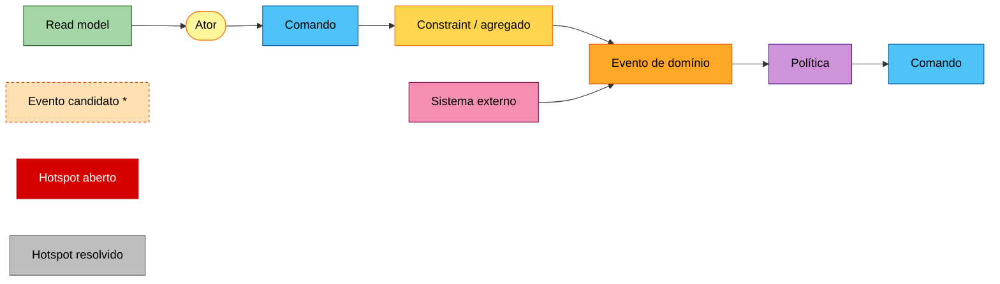

---

## 1. Big Picture

### 1.1 Atores

| Ator | Descrição |
| :--- | :--- |
| Visitante | Navega no canvas e vê detalhes públicos; não age |
| Criador PJ | Publica bolha `SALE` (B2C/B2B) ou `PURCHASE` (B2B) |
| Criador PF | Publica bolha `SALE` (C2C, só com cadastro de recebedor aprovado, Spec Q2) ou `PURCHASE` (C2B) |
| Participante PF | Adquire 1 cota por bolha |
| Participante PJ | Adquire N cotas, até `max_pj_share × max_quotas` |
| PJ licitante | Dá lances em bolhas `PURCHASE` (CNPJ ATIVO; 1 lance ativo por bolha) |
| Vendedor | Na triagem: criador da `SALE` ou PJ do lance vencedor da `PURCHASE` |
| Comprador | Na triagem: titular de cota(s), com 1 item de triagem por conta |
| Denunciante | Qualquer usuário logado que denuncia uma bolha |
| Moderador | Fila de moderação: denúncias, casos de triagem, contestações; suspende bolha ou conta |
| Timer (BullMQ + reconciliador) | `bubble-expire`, `bubble-expiring`, `bid-selection-timeout`, `triage-deadline`, expiração da reserva Pix (15 min), retentativa de CNPJ (15 min por 24 h) |

### 1.2 Sistemas externos

Pagar.me v5 (pré-autorização, captura, Pix, estorno, recebedor/split, webhooks HMAC) · BrasilAPI (CNPJ, primário) · ReceitaWS (CNPJ, fallback) · provedor de e-mail · rastreio (código informado manualmente pelo vendedor; frete integrado fora do escopo da R1, Spec §7).

### 1.3 Timeline do ciclo completo

Eventos **pivotais** (com mais interessados, borda grossa): `BubblePublished`, `BubbleExploded`, `TriageOpened`, `TriageClosed`.

```mermaid
flowchart LR
    subgraph F0["Identidade"]
      direction TB
      e01["AccountRegistered *"]:::evtc
      e02["CompanyVerified * / CompanyVerificationPending *"]:::evtc
      e03["CompanyBecameIrregular * (revalidação 30 d)"]:::evtc
    end
    subgraph F1["Publicação"]
      direction TB
      e10["BubblePublished"]:::piv
      e11["BubbleCancelled (criador · moderação · falha)"]:::evt
      e12["BubbleReported *"]:::evtc
    end
    subgraph F2["Adesão (ACTIVE)"]
      direction TB
      e20["QuotaReserved * (Pix, 15 min)"]:::evtc
      e21["QuotaReservationExpired *"]:::evtc
      e22["PaymentAuthorized"]:::evt
      e23["QuotaAcquired"]:::evt
      e24["QuotaReleased"]:::evt
      e25["BidSubmitted / BidWithdrawn"]:::evt
    end
    subgraph F3["Explosão"]
      direction TB
      e30["BubbleExploded (outcome, reason)"]:::piv
    end
    subgraph F4["Pós-explosão"]
      direction TB
      e40["BidSelected (só PURCHASE)"]:::evt
      e41["PaymentCaptured"]:::evt
      e42["PaymentRefunded"]:::evt
      e43["PaymentFailed"]:::evt
    end
    subgraph F5["Triagem (IN_TRIAGE)"]
      direction TB
      e50["TriageOpened"]:::piv
      e51["ShipmentRegistered"]:::evt
      e52["DeliveryConfirmed"]:::evt
      e53["WithdrawalRequested"]:::evt
      e54["TriageCaseOpened * / TriageCaseResolved *"]:::evtc
      e55["TriageItemCompleted / TriageItemCancelled"]:::evt
      e56["PayoutReleased"]:::evt
      e57["TriageClosed"]:::piv
    end
    subgraph F6["Reputação e moderação"]
      direction TB
      e60["ScoreChanged"]:::evt
      e61["ScoreDisputeOpened"]:::evt
      e62["ScoreDisputeResolved"]:::evt
      e63["AccountSuspended *"]:::evtc
    end
    F0 --> F1 --> F2 --> F3 --> F4 --> F5 --> F6
    F3 -- "FAILED" --> e42
    e42 -.-> e11

    classDef evt fill:#FFA726,stroke:#E65100,color:#000
    classDef piv fill:#FF6D00,stroke:#000,stroke-width:3px,color:#000
    classDef evtc fill:#FFE0B2,stroke:#E65100,stroke-dasharray:4 3,color:#000
```

**Narrativa (leitura em voz alta para validar a ordem):**
1. Uma PJ se cadastra e tem o CNPJ verificado como ATIVO. Se o provedor estiver fora, a conta fica `PENDING_VERIFICATION` e o sistema tenta de novo a cada 15 min por 24 h.
2. A PJ publica uma bolha de venda (`BubblePublished`). O sistema posiciona a bolha no cluster da categoria.
3. Participantes entram:
   - no **cartão**, a pré-autorização sai na hora (`PaymentAuthorized`) e a cota é adquirida (`QuotaAcquired`);
   - no **Pix**, a cota fica reservada por 15 min (`QuotaReserved*`) até o pagamento ser confirmado. Se não for, a reserva expira (`QuotaReservationExpired*`).
4. Alguém pode denunciar a bolha (`BubbleReported*`), e o moderador pode suspendê-la (`BubbleCancelled`, com estorno de 100%).
5. A bolha explode por tempo ou lotação (`BubbleExploded`).
6. Se teve sucesso, o preço final é capturado (`PaymentCaptured`) e a diferença do Pix é devolvida (`PaymentRefunded`).
7. A triagem abre (`TriageOpened`):
   - o vendedor envia;
   - o comprador confirma o recebimento, ou abre um caso (`TriageCaseOpened*`) que pausa o repasse;
   - pode haver arrependimento;
   - cada item conclui ou cancela;
   - o repasse sai quando o item conclui;
   - a triagem fecha (`TriageClosed`).
8. Cada desfecho gera `ScoreChanged`, contestável em até 5 dias.
9. Se a bolha falhou, tudo é estornado e ela é cancelada.

### 1.4 Máquina de estados de referência (ADR-0009, proposto)

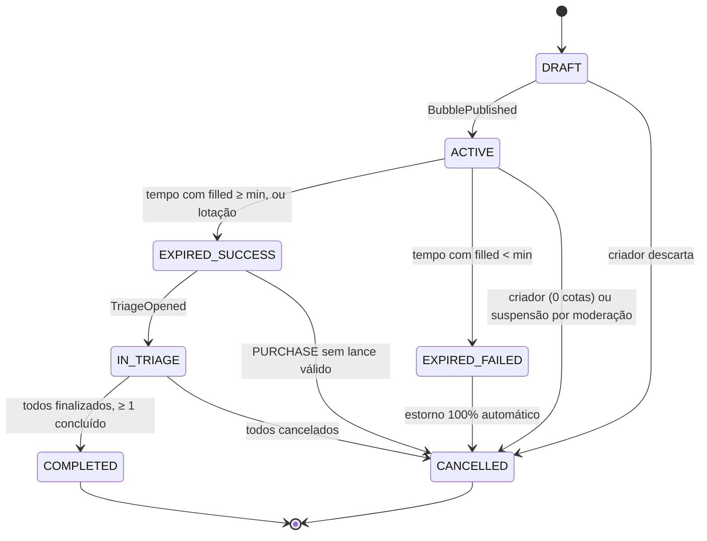

### 1.5 Estados do item de triagem (Spec F9)

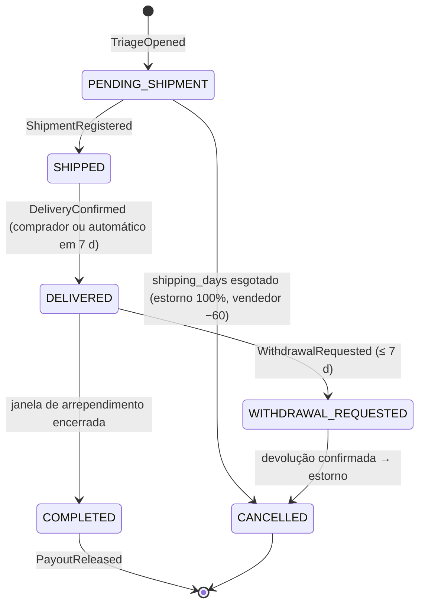

Um **caso de triagem** ("Não recebi", "Produto diferente") pode ser aberto sobre um item em `SHIPPED` ou `DELIVERED`. O caso não é um estado do item: é uma pendência paralela que **pausa o repasse** até a decisão do moderador. ⚠ A Spec não diz em quais estados o caso pode ser aberto (HS-20).

---

## 2. Process Level

### 2.1 Publicar bolha

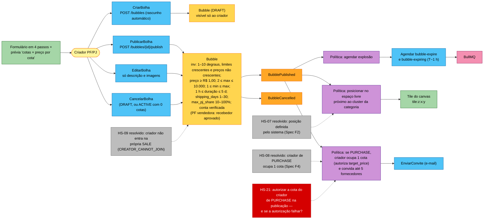

### 2.2 Adquirir cota (cartão e Pix) e sair da cota

```mermaid
flowchart LR
    rm1["Resumo de entrada:<br/>venda: preço atual, degrau, próximos degraus, meta, prazo de envio<br/>compra: target_price, lances até agora"]:::rm --> a1(["Participante PF/PJ"]):::actor
    a1 --> c1["AdquirirCota(n, meio)<br/>POST /bubbles/{id}/quotas<br/>Idempotency-Key"]:::cmd
    c1 --> p0["Política: pré-checagem<br/>BUBBLE_NOT_ACTIVE · PF_QUOTA_LIMIT ·<br/>PJ_SHARE_EXCEEDED · CREATOR_CANNOT_JOIN ·<br/>ACCOUNT_NOT_VERIFIED"]:::pol
    p0 --> c2["AutorizarPagamento<br/>valor_reserva × n<br/>(venda: initial_price · compra: target_price)"]:::cmd --> x1["Pagar.me"]:::ext
    x1 -- "cartão" --> e1["PaymentAuthorized"]:::evt
    x1 -- "recusado" --> e2["PaymentFailed<br/>(PAYMENT_DECLINED)"]:::evt
    x1 -- "Pix: cobrança gerada" --> e3["QuotaReserved *<br/>segura capacidade por 15 min,<br/>não conta para a meta"]:::evtc
    e3 --> x2["Webhook Pix pago"]:::ext --> e1
    e3 --> t1["Timer 15 min"]:::ext --> e4["QuotaReservationExpired *<br/>cota volta a ficar livre"]:::evtc
    e1 --> p1["Política: registrar cota"]:::pol --> c3["RegistrarCota<br/>UPDATE condicional (ADR-0002)"]:::cmd --> g1["Bubble + Quota<br/>inv: filled + n ≤ max;<br/>índice único parcial PF;<br/>soma PJ ≤ max_pj_share × max"]:::agg
    g1 --> e5["QuotaAcquired"]:::evt
    g1 --> e6["Rejeitada (409 QUOTA_SOLD_OUT)"]:::evt
    e6 --> p2["Política: anular pré-auth /<br/>estornar Pix — 'nenhum valor foi cobrado'"]:::pol --> e7["PaymentRefunded"]:::evt
    e5 --> p3["Política: se filled = max,<br/>explodir na MESMA transação"]:::pol --> e8["BubbleExploded<br/>(SUCCESS, FULL)"]:::evt
    e5 --> p4["Política: publicar via outbox<br/>(≤ 1 atualização visual / 100 ms)"]:::pol --> rm2["bubble.updated<br/>(filled_quotas, current_price, flags, version)"]:::rm
    a1 --> c5["SairDaCota<br/>DELETE /bubbles/{id}/quotas/me"]:::cmd --> g2["Bubble<br/>inv: ACTIVE e is_expiring = false"]:::agg --> e9["QuotaReleased"]:::evt --> p2
    r1["HS-03 resolvido: reserva Pix de 15 min<br/>(Spec F5, §6)"]:::hok -.-> e3
    h1["HS-22: a reserva Pix ocupa capacidade.<br/>Se a última vaga estiver reservada,<br/>conta como lotação? Explode FULL?"]:::hot -.-> e3
    h2["HS-23: Pix não pago — −40 (Spec F10)<br/>ou sem penalidade (Spec §6)?"]:::hot -.-> e4
    h3["HS-10: bots e PJs fantasmas<br/>(rate limit, CAPTCHA, CNPJ ATIVO)"]:::hot -.-> c1

    classDef evt fill:#FFA726,stroke:#E65100,color:#000
    classDef evtc fill:#FFE0B2,stroke:#E65100,stroke-dasharray:4 3,color:#000
    classDef cmd fill:#4FC3F7,stroke:#01579B,color:#000
    classDef pol fill:#CE93D8,stroke:#4A148C,color:#000
    classDef rm fill:#A5D6A7,stroke:#1B5E20,color:#000
    classDef actor fill:#FFF59D,stroke:#F57F17,color:#000
    classDef agg fill:#FFD54F,stroke:#FF6F00,color:#000
    classDef ext fill:#F48FB1,stroke:#880E4F,color:#000
    classDef hot fill:#D50000,stroke:#B71C1C,color:#fff
    classDef hok fill:#BDBDBD,stroke:#616161,color:#000
```

### 2.3 Explosão

```mermaid
flowchart LR
    x0["BullMQ: bubble-expire<br/>em expires_at"]:::ext --> c1["ExplodirPorTempo"]:::cmd
    x1["Reconciliador (1 min)<br/>Postgres = fonte da verdade"]:::ext --> c1
    x2["BullMQ: bubble-expiring<br/>T−1 h"]:::ext --> p0["Política: is_expiring = true (flag);<br/>bloquear saídas; notificar<br/>participantes e criador"]:::pol --> rm0["bubble.updated"]:::rm
    c1 --> g1["Bubble<br/>inv: só se ACTIVE (idempotente);<br/>reservas Pix pendentes NÃO contam;<br/>outcome = filled ≥ min ? SUCCESS : FAILED"]:::agg
    g1 --> e1["BubbleExploded<br/>(SUCCESS | FAILED, TIME)"]:::evt
    e0["BubbleExploded (SUCCESS, FULL)<br/>vindo da última cota"]:::evt --> p1
    e1 --> p1["Política: SUCCESS + SALE →<br/>capturar preço final de todos"]:::pol --> c2["CapturarPagamentos<br/>cartão: captura parcial<br/>Pix: estorno da diferença"]:::cmd --> x3["Pagar.me"]:::ext
    x3 --> e2["PaymentCaptured"]:::evt
    x3 --> e3["PaymentRefunded (diferença)"]:::evt
    x3 --> e4["PaymentFailed<br/>(ex.: pré-auth expirada)"]:::evt
    e2 --> p2["Política: abrir triagem"]:::pol --> c3["AbrirTriagem<br/>(1 item por conta compradora)"]:::cmd --> e5["TriageOpened<br/>Bubble → IN_TRIAGE"]:::evt
    e4 --> p3["Política: item daquele comprador cancelado,<br/>score do comprador NÃO afetado;<br/>os demais seguem"]:::pol
    e1 --> p4["Política: SUCCESS + PURCHASE →<br/>janela de 24 h"]:::pol --> c4["Agendar bid-selection-timeout<br/>+ aviso em T−2 h"]:::cmd
    e1 --> p5["Política: FAILED → estorno 100%<br/>(inclui Pix pendentes)"]:::pol --> c5["EstornarTodos"]:::cmd --> e6["PaymentRefunded (total)"]:::evt --> e7["BubbleCancelled"]:::evt
    e1 --> p6["Política: notificar (in-app + e-mail)<br/>e animar explosão"]:::pol --> rm1["bubble.exploded +<br/>notification.created"]:::rm
    h1["HS-04: falhas de captura deixam o total<br/>pago abaixo de min_quotas.<br/>Mantém o degrau da explosão?"]:::hot -.-> e4
    h2["HS-05: validade da pré-auth<br/>× 5 dias (R5, Spec Q1)"]:::hot -.-> c2

    classDef evt fill:#FFA726,stroke:#E65100,color:#000
    classDef cmd fill:#4FC3F7,stroke:#01579B,color:#000
    classDef pol fill:#CE93D8,stroke:#4A148C,color:#000
    classDef rm fill:#A5D6A7,stroke:#1B5E20,color:#000
    classDef actor fill:#FFF59D,stroke:#F57F17,color:#000
    classDef agg fill:#FFD54F,stroke:#FF6F00,color:#000
    classDef ext fill:#F48FB1,stroke:#880E4F,color:#000
    classDef hot fill:#D50000,stroke:#B71C1C,color:#fff
```

### 2.4 Seleção de lance (bolha de compra)

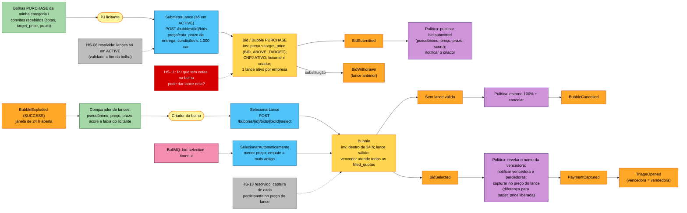

### 2.5 Triagem (com caso de triagem)

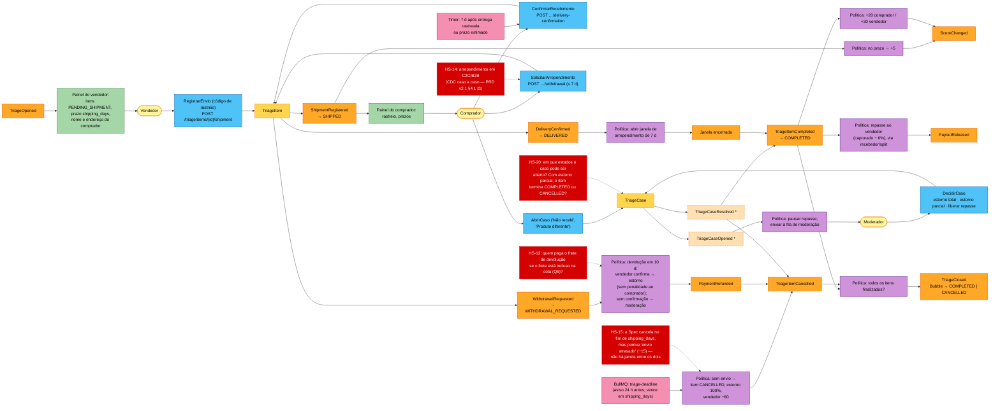

### 2.6 Contestação de score

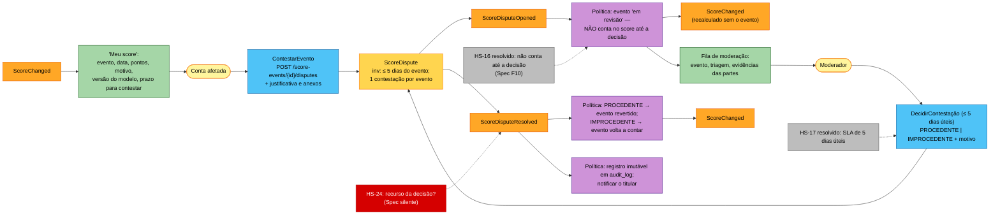

### 2.7 Denúncia e moderação de bolha/conta

```mermaid
flowchart LR
    rm0["Detalhe da bolha"]:::rm --> a1(["Usuário logado"]):::actor
    a1 --> c1["DenunciarBolha<br/>categoria: proibido · enganoso · fraude · outro"]:::cmd --> g1["Report"]:::agg --> e1["BubbleReported *"]:::evtc
    e1 --> p1["Política: enviar à fila de moderação"]:::pol --> rm1["Fila de moderação<br/>(denúncias · casos de triagem · contestações)"]:::rm --> a2(["Moderador"]):::actor
    a2 --> c2["SuspenderBolha (motivo obrigatório)"]:::cmd --> g2["Bubble<br/>inv: ACTIVE"]:::agg --> e2["BubbleCancelled<br/>(motivo: MODERATION)"]:::evt
    e2 --> p2["Política: estorno 100% de tudo;<br/>notificar participantes"]:::pol --> e3["PaymentRefunded"]:::evt
    a2 --> c3["SuspenderConta (motivo obrigatório)"]:::cmd --> g3["Account"]:::agg --> e4["AccountSuspended *"]:::evtc
    a2 --> c4["ArquivarDenúncia (motivo)"]:::cmd --> g1 --> e5["ReportDismissed *"]:::evtc
    e2 --> p3["Política: registro imutável<br/>em audit_log"]:::pol
    e4 --> p3
    h1["HS-25: suspender conta com bolhas<br/>e triagens em andamento — o que<br/>acontece com elas?"]:::hot -.-> c3
    h2["HS-26: categorias proibidas<br/>(Spec Q3) ainda não listadas"]:::hot -.-> c1

    classDef evt fill:#FFA726,stroke:#E65100,color:#000
    classDef evtc fill:#FFE0B2,stroke:#E65100,stroke-dasharray:4 3,color:#000
    classDef cmd fill:#4FC3F7,stroke:#01579B,color:#000
    classDef pol fill:#CE93D8,stroke:#4A148C,color:#000
    classDef rm fill:#A5D6A7,stroke:#1B5E20,color:#000
    classDef actor fill:#FFF59D,stroke:#F57F17,color:#000
    classDef agg fill:#FFD54F,stroke:#FF6F00,color:#000
    classDef hot fill:#D50000,stroke:#B71C1C,color:#fff
```

---

## 3. Derivação dos bounded contexts

Critério: agrupar os eventos pelo **dono da invariante** (a constraint que decide) e pela **linguagem**. Onde a mesma palavra muda de significado, a fronteira passa ali. Exemplo: "Bolha" em `bubble` é o agregado com degraus e cotas; em `realtime` é só uma projeção num tile.

| Contexto (módulo) | Propósito | Classificação | Constraints / agregados | Eventos de que é dono | Tabelas |
| :--- | :--- | :--- | :--- | :--- | :--- |
| **bubble** | Ciclo de vida da bolha, degraus, cotas, reservas, explosão, denúncias de bolha | **Core** (gera receita) | `Bubble` (com `PriceTier[]`), `Quota` (inclui a reserva Pix), `Report` (proposto) | BubblePublished, BubbleCancelled, QuotaAcquired, QuotaReleased, BubbleExploded; QuotaReserved\*, QuotaReservationExpired\*, BubbleReported\*, ReportDismissed\* | bubbles, price_tiers, quotas (+ reports, a criar) |
| **bidding** | Lances C2B/B2B e escolha do vencedor | **Core** | `Bid`, seleção (janela de 24 h) | BidSubmitted, BidWithdrawn, BidSelected | bids |
| **reputation** | Score, eventos ponderados, contestação | **Core** (diferencial de confiança) | `ScoreLedger` por conta, `ScoreDispute` | ScoreChanged, ScoreDisputeOpened, ScoreDisputeResolved | score_events, score_disputes |
| **triage** | Pós-explosão: envio, recebimento, arrependimento, devolução, casos, fechamento | Supporting | `TriageItem`, `Shipment`, `TriageCase` (proposto) | TriageOpened, ShipmentRegistered, DeliveryConfirmed, WithdrawalRequested, TriageItemCompleted, TriageItemCancelled, TriageClosed; TriageCaseOpened\*, TriageCaseResolved\* | triage_items, shipments (+ triage_cases, a criar) |
| **payment** | Autorizar, capturar, estornar, repassar | Generic (via gateway) com regras próprias | `Payment`, `Refund`, `Payout` | PaymentAuthorized, PaymentCaptured, PaymentRefunded, PaymentFailed, PayoutReleased | payments, refunds, payouts, webhook_events |
| **identity** | Contas PF/PJ, auth, CNPJ, consentimentos, pseudônimo, recebedor PF, suspensão | Generic | `Account`, `CompanyProfile`, `Consent` | AccountRegistered\*, CompanyVerified\*, CompanyVerificationPending\*, CompanyBecameIrregular\*, AccountSuspended\* | accounts, company_profiles, consents, sessions/refresh_tokens |
| **notification** | In-app e e-mail (transacional × não transacional) | Generic | `Notification` | — (consome eventos) | notifications |
| **realtime** | Gateway WS, rooms por tile e por bolha | Supporting | — (projeção) | — (emite `bubble.updated`, `bubble.state_changed`, `bubble.exploded`, `bid.submitted`, `notification.created`) | — |
| **platform** | Outbox, auditoria, jobs; **fila de moderação** como read model que agrega denúncias, casos e contestações | Generic | — | — | outbox_events, audit_log |

**Notas de fronteira:**
- **Triagem × reputação.** O plano (E0) agrupa "Triage & Reputation" num só contexto. Os fatos canônicos os separam porque a linguagem diverge: na triagem, "cancelamento" é o estado de um item; na reputação, "cancelamento por não envio" é um **evento ponderado** com meia-vida de 180 dias e modelo versionado. A separação permite recalcular o score (`score_model_version`) sem tocar na triagem.
- **Moderação.** A Spec (F12) cria uma capacidade de **moderação** que atravessa três contextos. A decisão sobre cada objeto fica no contexto **dono** dele: a bolha em `bubble`, o caso em `triage`, a contestação em `reputation` e a conta em `identity`. Só a **fila** é transversal, como projeção em `platform`. Se o volume crescer, `moderation` pode virar um módulo próprio (ver L-05).

## 4. Context map

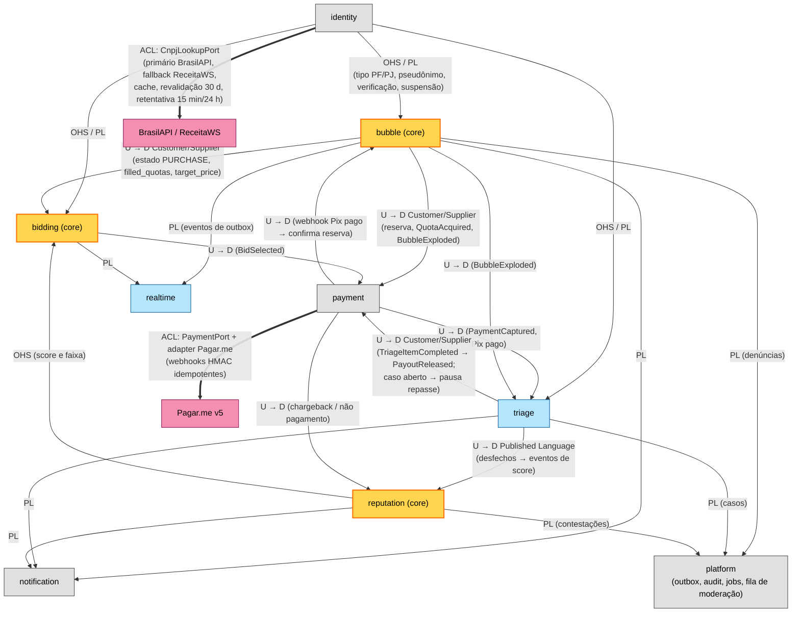

| Relação | Padrão | Justificativa |
| :--- | :--- | :--- |
| payment → Pagar.me | **ACL** (`PaymentPort`) | ADR-0003 (proposto): troca para Stripe possível. O modelo do gateway (status, *charges*, *recipients*) não vaza para o domínio. Webhooks entram por `POST /webhooks/payments/pagarme`, são deduplicados em `webhook_events` pelo ID do evento do gateway e traduzidos para PaymentAuthorized/Captured/Refunded/Failed |
| identity → BrasilAPI/ReceitaWS | **ACL** (`CnpjLookupPort`) | ADR-0008 (proposto): dois provedores com formatos diferentes normalizados em `situação = ATIVA`; indisponibilidade vira `PENDING_VERIFICATION` |
| identity → demais | **Open Host Service / Published Language** | Todos precisam de `account_type`, pseudônimo e status de verificação/suspensão. Nenhum contexto lê CPF/CNPJ em claro (ADR-0012) |
| bubble → bidding, payment, triage | **Customer/Supplier** (bubble upstream) | As invariantes de cota, reserva e estado são do `bubble` |
| triage → payment (repasse) | **Customer/Supplier** (triage upstream) | O repasse é comandado pelo `COMPLETED` do item e pausado por caso aberto |
| triage/payment → reputation | **Published Language** (eventos via outbox) | O score é derivado de fatos; reputation não comanda nada de volta |
| bubble/triage/reputation → platform (fila de moderação) | **Published Language** | A fila só projeta; a decisão volta ao contexto dono |
| * → realtime / notification | **Conformist** (downstream) | Só projetam eventos já publicados |
| platform ↔ módulos (outbox, audit) | **Shared Kernel** | Código comum do monólito modular (ADR-0001, proposto) |

---

## 5. Hotspots → decisões

Status: **Resolvido (Spec)** = a Spec responde; **Aberto** = levar ao workshop ou à ADR.

| ID | Hotspot | Processo | Decisão | Status / proposta |
| :--- | :--- | :--- | :--- | :--- |
| HS-01 | PRD v2.0 citava Redlock **e** `UPDATE` condicional; `tecnologias.md` cita `SERIALIZABLE` | Adquirir cota | **D1** → ADR-0002 | Resolvido no PRD v2.1 (concorrência unificada). `tecnologias.md` ainda diverge |
| HS-02 | Ordem da saga: autorizar antes de reservar a cota? | Adquirir cota | **D1 + D2** | **Resolvido (Spec F5):** pagamento autorizado → aquisição atômica; recusa posterior anula/estorna |
| HS-03 | Pix assíncrono × cota | Adquirir cota | **D2 + D8** | **Resolvido (Spec F5/§6):** reserva de 15 min; pendente não conta para a meta |
| HS-22 | A reserva Pix **segura capacidade**, mas não conta como cota. Se `filled + reservadas = max`, a bolha está "lotada" para novos participantes, mas não explode por FULL | Adquirir cota | **D1 + D8** | Aberto. Proposta: explosão FULL só com `filled_quotas = max_quotas` (cotas pagas); expor "N cotas em reserva" no detalhe |
| HS-23 | Pix não pago: a Spec F10 aplica −40 ("Pix não pago após a reserva"), a Spec §6 diz "sem penalidade de score" | Adquirir cota | **D6** | Aberto (contradição interna da Spec). Proposta: sem penalidade (§6), reservando −40 para chargeback |
| HS-04 | Falhas de captura deixam o total pago abaixo de `min_quotas` | Explosão | **D3 + D8** | Parcial: a Spec cancela só o item, sem afetar o score do comprador. Proposta: manter o degrau calculado na explosão (preço único, D3) |
| HS-05 | Validade da pré-autorização × 5 dias | Explosão | **D2** (R5) | Aberto (Spec Q1; business case H7) |
| HS-06 | Janela de lances | Lance | **D4** | **Resolvido (Spec F8):** só em `ACTIVE`; validade = fim da bolha |
| HS-07 | Posicionamento no canvas (o plano o rotula como "D8") | Publicar | — | **Resolvido (Spec F2):** sistema posiciona perto do cluster da categoria. Registrar em ADR própria |
| HS-08 | O criador de PURCHASE ocupa uma cota? | Publicar | **D4** | **Resolvido (Spec F4):** sim, 1 cota automática |
| HS-21 | E se a autorização da cota automática do criador de PURCHASE falhar na publicação? | Publicar | **D2** | Aberto. Proposta: a publicação falha (bolha continua `DRAFT`) |
| HS-09 | O criador participa da própria SALE? | Publicar | **D5** | **Resolvido (Spec §2):** não (`CREATOR_CANNOT_JOIN`) |
| HS-10 | Bots e PJs fantasmas esgotando cotas (R8) | Adquirir cota | **D5 + D7** | Aberto (E9): teto PJ + CNPJ ATIVO + rate limit + CAPTCHA adaptativo |
| HS-11 | Uma PJ com cotas na PURCHASE pode dar lance nela? | Lance | **D4** | Aberto. Proposta: proibir (conflito de interesse) |
| HS-12 | Frete de devolução no arrependimento com frete incluso (Q6) | Triagem | **Nova** | Aberto: Termos de Uso (Jurídico) |
| HS-13 | O lance atende a todas as `filled_quotas`? | Lance | **D4** | **Resolvido (Spec F8):** captura de cada participante no preço do lance |
| HS-14 | Arrependimento de 7 dias em C2C/B2B | Triagem | **Nova** (Jurídico) | Aberto: o PRD v2.1 §4.1 marca o B2B como ⚖️ caso a caso |
| HS-15 | "Envio atrasado" (−15) não tem janela: a Spec F9 cancela no fim de `shipping_days` | Triagem | **D6** | Aberto (contradição interna da Spec). Proposta: tolerância de N dias após `shipping_days` antes de cancelar |
| HS-16 | Evento negativo pesa durante a revisão? | Contestação | **D6** | **Resolvido (Spec F10):** não conta até a decisão |
| HS-17 | SLA do moderador | Contestação | **D6** | **Resolvido (Spec F10):** 5 dias úteis |
| HS-24 | Recurso da decisão de contestação | Contestação | **D6** | Aberto. Proposta: sem recurso na R1 |
| HS-18 | Duração da triagem: repasse só em `COMPLETED`, depois de `shipping_days` + transporte + 7 + 7 dias | Triagem | **D8** | Aceito (canônico/Spec). Impacto no caixa da PJ registrado no business case |
| HS-19 | Métrica "explodem com sucesso" ambígua | Big Picture | **D8** | **Resolvido (PRD v2.1 §10):** `EXPIRED_SUCCESS ÷ publicadas` + conclusão da triagem `COMPLETED ÷ IN_TRIAGE`. O plano §1 ainda usa `COMPLETED/(COMPLETED+CANCELLED)` |
| HS-20 | Caso de triagem: em que estados pode ser aberto? Com estorno parcial, o item termina `COMPLETED` ou `CANCELLED`? E o score? | Triagem | **D6 + D8** | Aberto. Proposta: aberto em `SHIPPED`/`DELIVERED` até o fim da janela; estorno parcial → `COMPLETED` com repasse reduzido |
| HS-25 | Suspender conta com bolhas e triagens em andamento | Moderação | **Nova** | Aberto. Proposta: bolhas `ACTIVE` do suspenso são suspensas (estorno); triagens seguem até o fim |
| HS-26 | Categorias proibidas | Denúncia | **Nova** | Aberto (Spec Q3) |

## 6. Lacunas encontradas

| ID | Lacuna |
| :--- | :--- |
| L-01 | A lista canônica de eventos (fatos §8) não cobre comportamentos da Spec: reserva Pix (`QuotaReserved*`, `QuotaReservationExpired*`), denúncia (`BubbleReported*`, `ReportDismissed*`), caso de triagem (`TriageCaseOpened*`, `TriageCaseResolved*`), identidade e suspensão (`AccountRegistered*`, `CompanyVerified*`, `CompanyVerificationPending*`, `CompanyBecameIrregular*`, `AccountSuspended*`) |
| L-02 | Não há evento canônico para "janela de arrependimento encerrada" (usado aqui como evento interno) nem para a devolução confirmada |
| L-03 | `shipping_days` está na Spec (§1, F3), mas não nas colunas-chave canônicas de `bubbles`. O modelo canônico também não tem tabelas para denúncias, casos de triagem e reservas (se a reserva não for um status de `quotas`) |
| L-04 | `requirements.md` RF05.2 permite que "o criador **ou os participantes**" aceitem lances; a D4 e a Spec F8 dão a escolha só ao criador |
| L-05 | Moderação não é um bounded context na lista canônica (fatos §6). Este documento a distribui pelos contextos donos e mantém a fila em `platform` |

---

## Fontes consultadas (AlterEgo)

- **event-storming** — *EventStorming Glossary & Cheat Sheet* (ddd-crew, baseado em Alberto Brandolini, *Introducing EventStorming* e *Discovering Bounded Contexts with EventStorming*): passos da Big Picture (exploração caótica, timeline, hotspots), pivotal events, cores de atores e sistemas, política "sempre que X, fazemos Y", emerging bounded contexts.
- **event-storming** — *Board Pizzaria das Galáxias* (prática de praticante, PT-BR): cadeia `Read Model → Ator → Comando → Aggregate → Evento → Política`, comando sem ator disparado por timer, leitura da timeline em voz alta, "constraint" como nome preferido a "aggregate" com o negócio.
- **event-storming** — *DDD Starter Modelling Process* (ddd-crew): decompor o event storm em subdomínios e context maps.
- **event-storming** — *Bounded Context Canvas* (ddd-crew): classificação estratégica core/supporting/generic e o papel do contexto no modelo de negócio.
