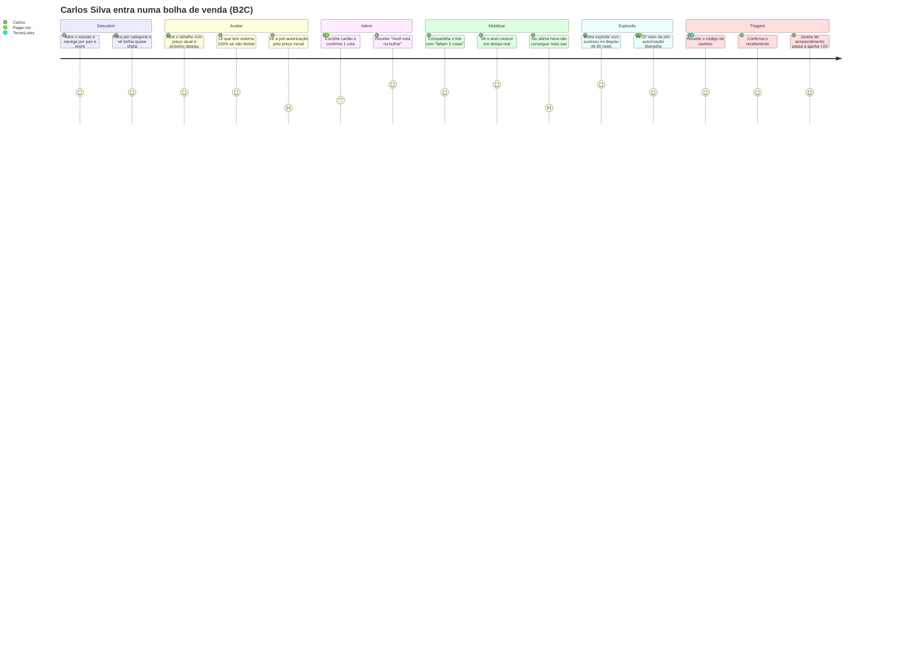
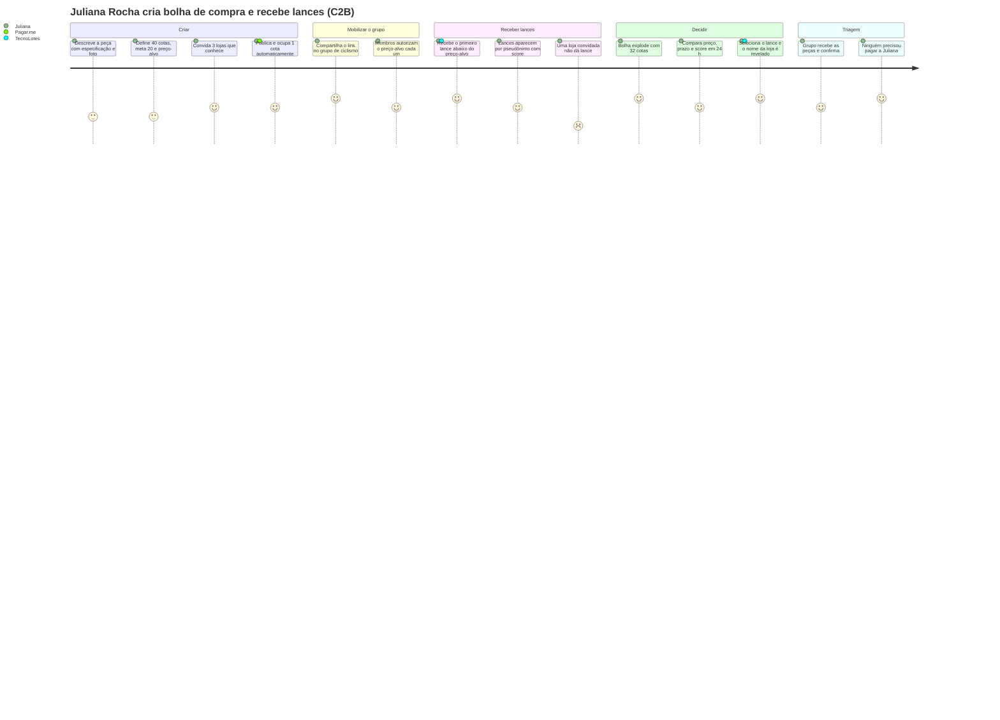
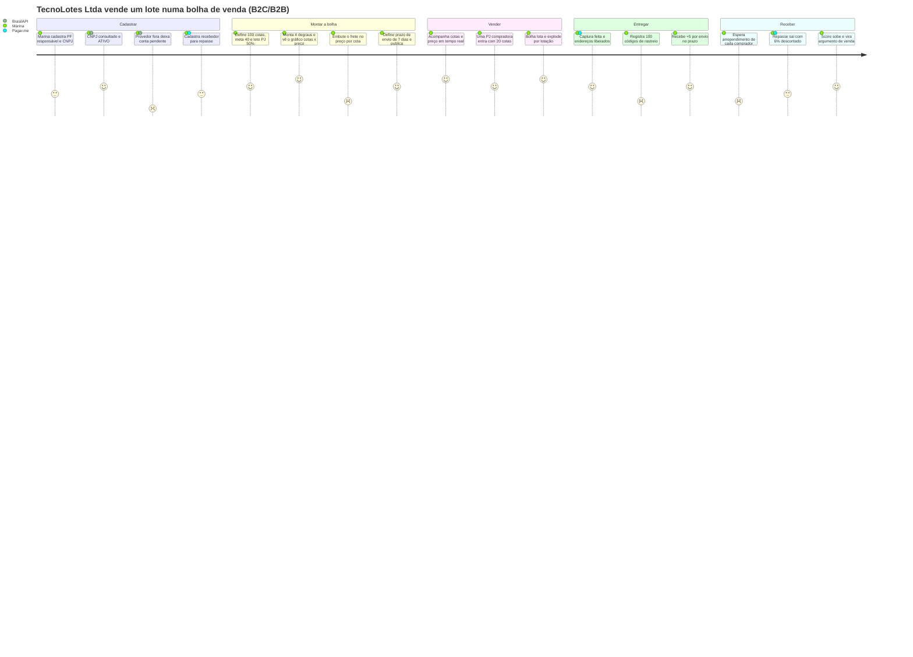
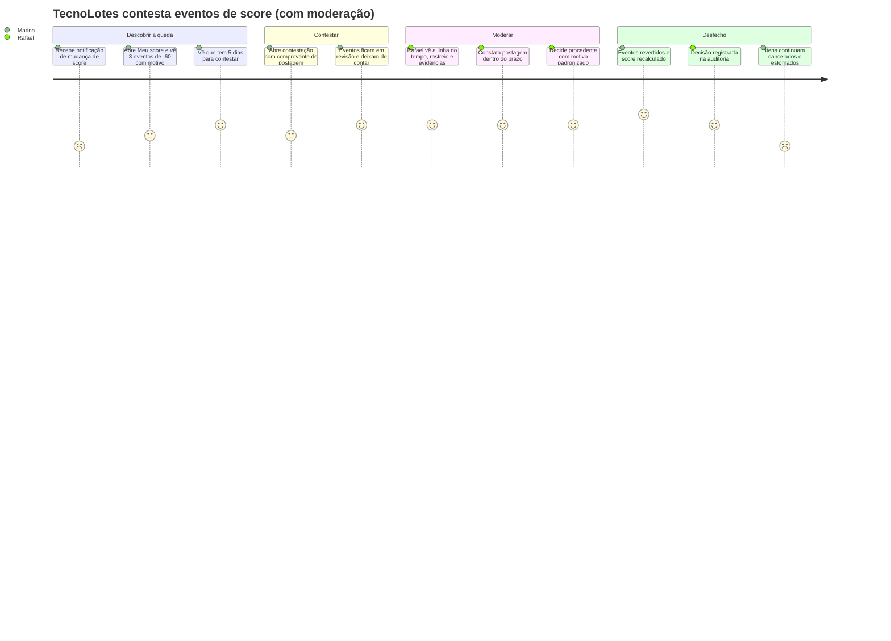

# Personas, Jobs-to-be-done e Jornadas — Bolha Venda

**Versão:** 1.0 · **Data:** 06/10/2026 · **Status:** Rascunho para revisão
**Base:** [PRD v2.1](../../PRD.MD) (§3 personas) · [Spec do Produto](../../SPEC.md) (prevalece em conflito) · [Event Storming](event-storming.md) · [Glossário](glossario.md) · [Business Case](../01-negocio/business-case.md)

> **Status epistêmico.** Carlos Silva e TecnoLotes Ltda vêm do PRD §3. A Organizadora (Juliana Rocha) e o Moderador (Rafael Lima) foram criados neste documento: a primeira a partir do caso C2B do conceito fundador ("usuários podem indicar empresas que vendem peças"), o segundo a partir do papel de Moderador da Spec (§2, F12).
>
> Detalhes biográficos, citações e notas de satisfação das jornadas são **hipóteses de pesquisa**, não dados. Eles servem de roteiro para as entrevistas e o teste de protótipo da S0 (Gate A: 5 usuários) e devem ser substituídos pelo que for observado.

---

## 1. Mapa de personas

| Persona | Tipo | Papel principal | Modalidades | Classificação | Interface própria |
| :--- | :--- | :--- | :--- | :--- | :--- |
| **Carlos Silva** | PF | Participante de bolhas de venda | B2C, C2C (comprador) | **Primária** | Canvas/lista, detalhe, adesão, triagem (comprador) |
| **TecnoLotes Ltda** (operada por Marina Duarte) | PJ | Vendedora; compradora B2B; licitante C2B | B2C, B2B, C2B (vendedora) | **Primária** | Criação de bolha, painel de vendas, lances, triagem (vendedor) |
| **Juliana Rocha** | PF | Organizadora de bolhas de compra | C2B (criadora) | **Primária** | Criação de bolha de compra, comparador de lances |
| **Rafael Lima** | Interno | Operador/Moderador | — | Primária do backoffice | Fila de moderação |

Pelo critério de personas primárias e secundárias (Cooper, via Leffingwell), as três personas externas são **primárias** porque cada uma precisa de uma interface desenhada para ela: comprar não é vender, e organizar uma compra coletiva não é comprar. O visitante é **secundário**: usa o canvas desenhado para o Carlos.

---

## 2. Personas

### 2.1 Carlos Silva — Consumidor coletivo (PF)

| Campo | Conteúdo |
| :--- | :--- |
| Perfil (PRD §3.1) | Entusiasta de tecnologia e de compras em grupo |
| Hipóteses de perfil | 30–40 anos, capital, compra eletrônicos e acessórios online, compara preço em 3+ sites, participa de grupos de "achadinhos" em mensageiros |
| Regra que o afeta | **1 cota por bolha** (`PF_QUOTA_LIMIT`); não pode sair na última hora (`is_expiring`) |
| Meio de pagamento provável | Cartão (pré-autorização) ou Pix (reserva de 15 min) |
| Dores | Não alcança o preço de atacado sozinho; desconfia de "promoção" que some; medo de pagar e não receber; grupos informais sem garantia |
| Ganhos esperados | Preço de lote, transparência ("faltam 5 cotas para R$ 80"), estorno automático se falhar, arrependimento de 7 dias |
| Objeções prováveis | "Vou ficar com o limite do cartão preso por até 5 dias?" · "E se o vendedor sumir?" · "Por que esperar se compro hoje?" |
| Sinal de sucesso | Volta a entrar em outra bolha em até 30 dias; compartilha o link da bolha |
| Citação (hipótese) | *"Se o preço cai pra todo mundo, eu mesmo chamo meus amigos."* |

### 2.2 TecnoLotes Ltda — Distribuidora (PJ), operada por Marina Duarte, gerente comercial

| Campo | Conteúdo |
| :--- | :--- |
| Perfil (PRD §3.2) | Distribuidora/fabricante com estoque a girar ou lotes em promoção. Cria bolhas de venda, compra cotas como B2B e dá lances em C2B |
| Hipóteses de perfil | Distribuidora de informática de porte pequeno a médio, 10–50 funcionários, vende por representantes e marketplaces; Marina responde pela meta de giro de estoque |
| Regras que a afetam | CNPJ ATIVO (BrasilAPI/ReceitaWS); `max_pj_share` quando compra; um lance ativo por bolha de compra; `shipping_days` (padrão 7); frete incluso no preço da cota (Spec Q6); taxa de 6% no repasse (Spec Q5); repasse só em `COMPLETED` |
| Dores | Dar desconto sem garantia de volume; CAC alto; estoque parado; o fluxo de caixa do repasse demora (envio + transporte + 7 + 7 dias) |
| Ganhos esperados | "Desconto só se o volume vier"; demanda C2B já autorizada; reputação (score) como argumento de venda |
| Objeções prováveis | "6% é muito sobre margem de atacado" · "Frete incluso num preço único para o Brasil inteiro?" · "E se o comprador abrir caso de má-fé?" |
| Sinal de sucesso | ≥ 2 bolhas `COMPLETED` por mês; faixa de score Bom/Excelente; vence lances C2B |
| Citação (hipótese) | *"Eu topo dar 25% de desconto se me garantirem 100 unidades. Para 10 unidades, não."* |

### 2.3 Juliana Rocha — Organizadora de compra coletiva (PF)

| Campo | Conteúdo |
| :--- | :--- |
| Origem | Caso C2B do conceito fundador ("usuários criarem bolhas de pedidos… indicar empresas que vendem peças… empresas podem dar lances") |
| Hipóteses de perfil | Coordena um grupo de ciclismo de ~80 pessoas; organiza compras conjuntas de peças e acessórios (pneus, câmaras, capacetes) por planilha e mensageiro, cobrando cada um por Pix |
| Regras que a afetam | Ao publicar, **ocupa 1 cota automaticamente**; define `target_price` (preço máximo por cota) e `min_quotas`; convida até 5 fornecedores; tem **24 h** após a explosão para escolher o lance, senão vence o menor preço |
| Dores | Hoje ela é o "banco" do grupo: cobra, adianta dinheiro e corre atrás de quem não pagou. Negocia sozinha com fornecedores; não tem como provar ao grupo que escolheu a melhor oferta |
| Ganhos esperados | Para de intermediar dinheiro (cada um autoriza o seu); fornecedores competem; transparência do comparador de lances com o score do licitante |
| Objeções prováveis | "E se nenhuma empresa der lance?" (R9) · "O grupo vai achar que eu ganho comissão?" · "Especificar a peça certa é difícil" |
| Sinal de sucesso | Bolha de compra com ≥ 2 lances válidos e seleção manual dentro das 24 h; repete no mês seguinte |
| Citação (hipótese) | *"Eu só quero juntar a turma e fazer as lojas brigarem pelo nosso pedido. Não quero ser o caixa de ninguém."* |

### 2.4 Rafael Lima — Operador/Moderador (interno)

| Campo | Conteúdo |
| :--- | :--- |
| Origem | Spec §2 (papel Moderador) e F12 (fila de moderação) |
| Responsabilidades | Triar denúncias (proibido, enganoso, fraude, outro); decidir casos de triagem (estorno total, parcial ou liberar o repasse); decidir contestações de score em ≤ 5 dias úteis; suspender bolha (estorno de 100%) ou conta; tudo com motivo e auditoria |
| Dores | Evidências espalhadas (rastreio, mensagens, fotos); SLA apertado; decisões que afetam dinheiro e reputação de terceiros |
| Ganhos esperados | Fila única priorizada por prazo; visão consolidada do item (linha do tempo de eventos, pagamentos, rastreio, evidências das duas partes); motivos padronizados |
| Risco | Viés e inconsistência entre decisões. Mitigação: motivos padronizados e guardrail de contestações procedentes < 2% (PRD v2.1 §10) |
| Citação (hipótese) | *"Preciso ver a história inteira do item numa tela só, senão decido no escuro."* |

---

## 3. Jobs-to-be-done

Formato: **Quando** (situação) · **quero** (motivação) · **para** (resultado esperado). As colunas "Funcional/Emocional/Social" indicam a dimensão dominante do job.

| Persona | Job | Dimensão | Como o produto atende |
| :--- | :--- | :--- | :--- |
| Carlos | Quando vejo um produto que quero mas acho caro, quero me juntar a outros compradores para pagar preço de lote sem comprar o lote | Funcional | Bolha de venda com degraus; 1 cota |
| Carlos | Quando adiro antes de saber o preço final, quero ter certeza de que não vou perder dinheiro se o grupo não fechar | Emocional | Estorno de 100% em `EXPIRED_FAILED`; "preço se fechar agora" |
| Carlos | Quando falta pouco para o próximo degrau, quero chamar amigos e mostrar que todos ganham | Social | Link compartilhável com "faltam N cotas para R$ X" |
| Carlos | Quando o produto chega diferente, quero desistir ou reclamar sem brigar com o vendedor | Funcional | Arrependimento de 7 dias; caso de triagem |
| TecnoLotes | Quando tenho estoque parado, quero dar desconto **só se** o volume mínimo vier, para proteger a margem | Funcional | `min_quotas` + degraus definidos por ela |
| TecnoLotes | Quando uma demanda agregada aparece na minha categoria, quero disputá-la com um lance, sem gastar com aquisição antes de vencer | Funcional | Lances C2B; convites; notificação por categoria |
| TecnoLotes | Quando compro insumos de outra PJ, quero entrar com várias cotas sem que um concorrente monopolize a bolha | Funcional | N cotas até `max_pj_share` |
| TecnoLotes | Quando sou avaliada, quero que a reputação reflita fatos e que eu possa me defender | Social/Emocional | Score por eventos objetivos; contestação em 5 dias |
| Juliana | Quando o grupo precisa da mesma peça, quero reunir os pedidos num lugar só sem virar a tesouraria | Funcional | Bolha de compra; cada participante autoriza o seu |
| Juliana | Quando as empresas fazem propostas, quero comparar e escolher com argumentos que o grupo aceite | Social | Comparador com preço, prazo e score; seleção em 24 h ou fallback de menor preço |
| Juliana | Quando conheço lojas boas, quero convidá-las para dar lance | Funcional | Até 5 fornecedores sugeridos |
| Rafael | Quando chega um caso ou contestação, quero ver toda a história e decidir dentro do prazo com um motivo registrável | Funcional | Fila de moderação; linha do tempo; auditoria |
| Rafael | Quando uma bolha parece fraudulenta, quero interrompê-la sem deixar ninguém no prejuízo | Funcional/Emocional | Suspensão com estorno de 100% |

---

## 4. Jornadas

Escala de satisfação: 1 (muito ruim) a 5 (muito boa). Os valores são **hipóteses** a validar no teste de protótipo.

### 4.1 Carlos entra numa bolha de venda

| Momento | Dor / risco | Oportunidade | Referência |
| :--- | :--- | :--- | :--- |
| Pré-autorização pelo preço inicial | Limite do cartão "preso" por até 5 dias com valor acima do preço final provável | Mostrar "você paga no máximo R$ 100; hoje fecharia em R$ 90"; explicar a captura parcial | ADR-0004 (proposto); H1, H7 |
| Pix | Reserva de 15 min; se a meta só fechar com Pix pendente, a bolha falha | Contador da reserva visível; nudge para pagar | HS-22, HS-23 |
| Última hora | Saída bloqueada gera frustração | Mensagem da Spec: "protege o grupo"; avisar na adesão | Spec F5 |
| Explosão | Recebe notificação, mas não entende a diferença de valor | Recibo "pré-autorizado R$ 100 → cobrado R$ 80" | F7 |

### 4.2 Juliana cria uma bolha de compra e recebe lances

| Momento | Dor / risco | Oportunidade | Referência |
| :--- | :--- | :--- | :--- |
| Especificar o item | Especificação vaga gera lances incomparáveis | Campos guiados por categoria; foto de referência | Spec F4 |
| Definir o preço-alvo | Alvo baixo demais = zero lances; alto demais = participantes desconfiam | Mostrar faixa de preço histórica de bolhas parecidas (pós-R1) | H10 |
| Cold start C2B | Nenhuma PJ dá lance | Concierge no beta: equipe prospecta fornecedores | R9, H10 |
| PJ com cotas dá lance | Conflito de interesse | Regra a decidir | HS-11 |
| 24 h | Juliana pode perder o prazo | Aviso em T−2 h (Spec F11); fallback de menor preço | ADR-0005 (proposto) |
| Autorização da cota dela falha na publicação | Bolha não publica | Mensagem clara e retentativa | HS-21 |

### 4.3 TecnoLotes vende um lote como PJ

| Momento | Dor / risco | Oportunidade | Referência |
| :--- | :--- | :--- | :--- |
| `PENDING_VERIFICATION` | Não pode criar bolha durante a indisponibilidade do provedor | Retentativa a cada 15 min por 24 h; aviso por e-mail | Spec F1; ADR-0008 (proposto) |
| Frete incluso | Preço único para todo o país com frete embutido | Hipótese H12; restrição por região como saída | Spec Q6 |
| Edição após publicar | Erro de preço não pode ser corrigido (oferta vinculante) | Revisão final forte no passo 4 | Spec F3; CDC art. 30 |
| Registrar rastreio em massa | 100 itens um a um | Upload em lote (CSV) — candidato pós-R1 | E8 |
| Caixa | Repasse só depois de envio + transporte + 7 + 7 dias | Comunicar a linha do tempo do repasse antes de publicar | HS-18; business case §5 |

### 4.4 Contestar o score

Cenário: Marina postou 3 pacotes no prazo, mas registrou os códigos depois de `shipping_days`. Os itens foram cancelados por não envio (−60 cada) e estornados. Ela contesta com o comprovante de postagem.

| Momento | Dor / risco | Oportunidade | Referência |
| :--- | :--- | :--- | :--- |
| Notificação | Queda abrupta sem contexto | "Por que meu score mudou" com evento, peso, data e versão do modelo | Spec F10; ADR-0007 (proposto) |
| Revisão | — | O evento não conta até a decisão (Spec) | HS-16 (resolvido) |
| Decisão | Moderador sem histórico consolidado | Tela única de evidências; motivos padronizados | Spec F12 |
| Desfecho | Score revertido, mas a venda perdida não volta | Lembrete de rastreio em T−24 h (Spec F11) para prevenir | HS-15 |
| Recurso | Não há segunda instância | Decidir se a R1 terá recurso | HS-24 |

---

## 5. Implicações para requisitos (resumo)

| ID | Implicação | Persona | Destino |
| :--- | :--- | :--- | :--- |
| PJ-01 | Recibo de explosão "pré-autorizado × cobrado × liberado" | Carlos | F7/F11 |
| PJ-02 | Contador da reserva Pix e regra de lotação com reservas | Carlos | HS-22 |
| PJ-03 | Especificação guiada por categoria na bolha de compra | Juliana | F4 |
| PJ-04 | Comparador de lances com score e aviso em T−2 h | Juliana | F8/F11 |
| PJ-05 | Linha do tempo do repasse antes de publicar | TecnoLotes | F3/F9 |
| PJ-06 | Simulador de frete incluso × preço por cota | TecnoLotes | H12 |
| PJ-07 | Tela de evidências unificada para o moderador | Rafael | F12 |
| PJ-08 | Tolerância entre "atraso" e "cancelamento por não envio" | TecnoLotes | HS-15 |

---

## Fontes consultadas (AlterEgo)

- **produto** — Dean Leffingwell, *Agile Software Requirements*, cap. 7 "User Personas", pp. 163–165: personas primárias e secundárias (Alan Cooper, *The Inmates Are Running the Asylum*), identificação de personas a partir dos papéis das histórias.
- **asias-product-management** — Teresa Torres, *Assumption Testing* (Product Talk): story mapping da jornada para gerar suposições de desejabilidade e usabilidade, tratadas aqui como hipóteses a validar no protótipo.
- **comercial-vendas** — "MVP como oferta mínima testável para B2B" (síntese de *A Startup Enxuta*): MVP concierge e foco em early adopters, aplicados ao cold start C2B da jornada da Juliana.
