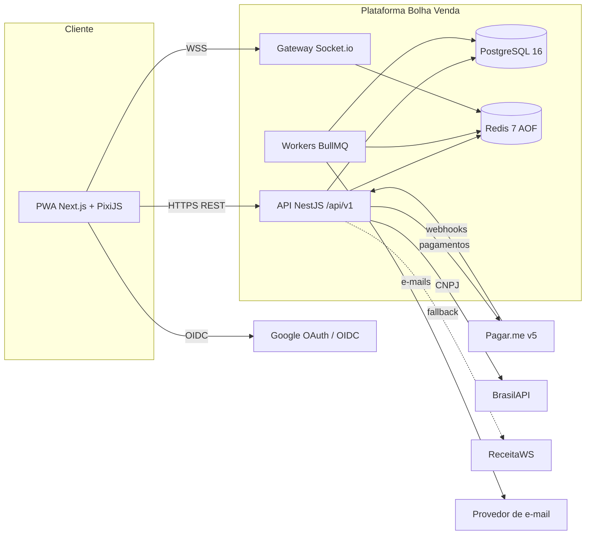
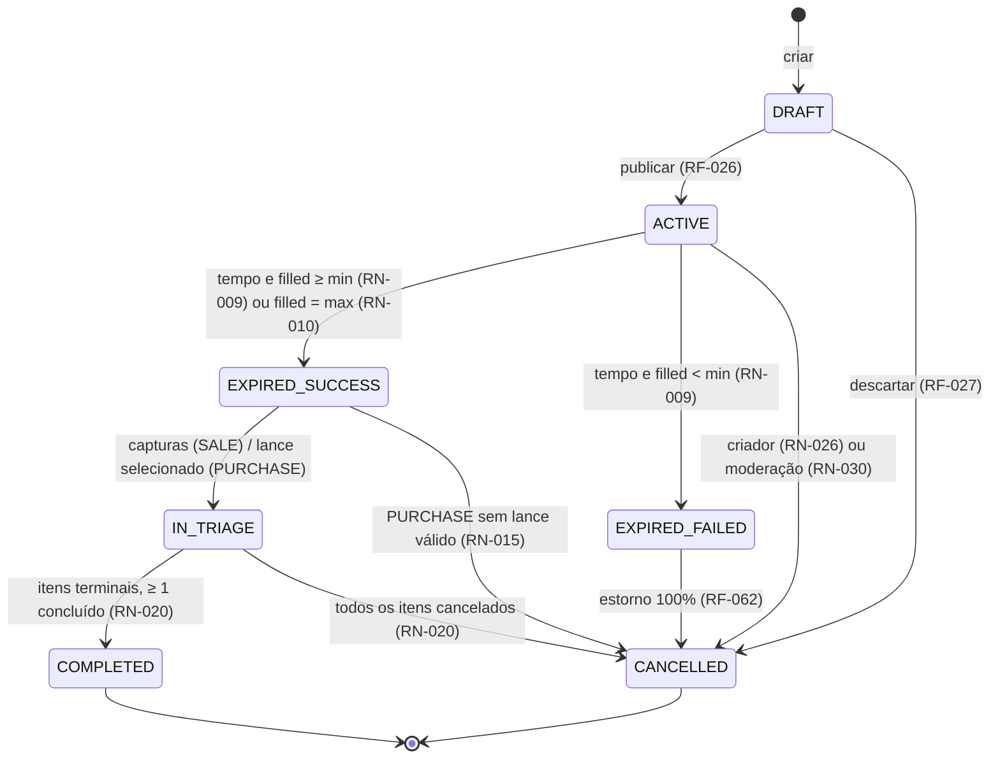
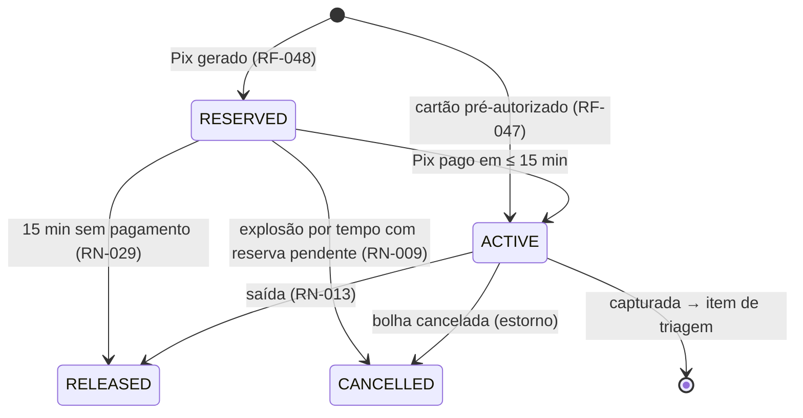
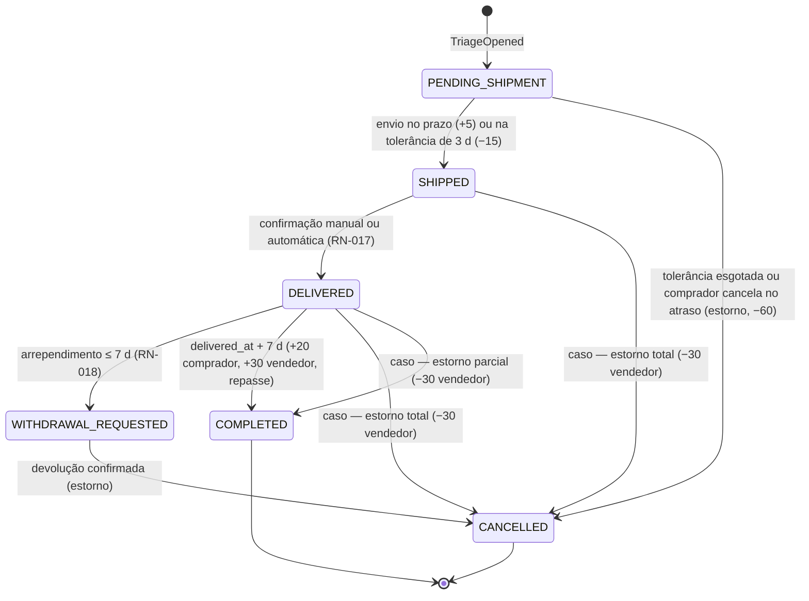

# Especificação de Requisitos de Software (ERS) — Bolha Venda

**Versão:** 1.0 · **Data:** 06/10/2026 · **Status:** Rascunho para revisão
**Base:** [PRD v2.1](../../PRD.MD) · [Spec do Produto v1.1](../../SPEC.md) · [Relatório de validação do PRD](validacao-prd.md)

> **Formato:** IEEE 830 adaptado. Para a Release 1.0, esta ERS substitui a especificação preliminar em [requirements.md](../requirements.md), que fica como histórico.
>
> **Hierarquia das fontes:** a [Spec](../../SPEC.md) define o comportamento detalhado e **prevalece em caso de conflito**. O PRD v2.1 define os itens de origem (RF01–RF09, RNF01–RNF06).
>
> **ADRs:** as decisões D1–D8 do [plano de projeto](../planing-project.md) entram aqui como ADRs com status **proposto**, que aguardam o Gate A. Todo requisito que depende de uma delas leva a marca "(ADR-xxxx, proposto)" ou cita o ADR no campo **ADR**.

---

## Sumário

1. [Introdução](#1-introdução)
2. [Descrição geral](#2-descrição-geral)
3. [Requisitos específicos](#3-requisitos-específicos)
   - 3.1 [Requisitos funcionais (RF)](#31-requisitos-funcionais-rf)
   - 3.2 [Regras de negócio (RN)](#32-regras-de-negócio-rn)
   - 3.3 [Requisitos não funcionais (RNF)](#33-requisitos-não-funcionais-rnf)
   - 3.4 [Interfaces externas](#34-interfaces-externas)
   - 3.5 [Requisitos de dados e retenção](#35-requisitos-de-dados-e-retenção)
4. [Modelos de apoio](#4-modelos-de-apoio)
5. [Questões em aberto](#5-questões-em-aberto)

---

## 1. Introdução

### 1.1 Propósito

Esta ERS especifica, para a **Release 1.0 (Beta Público, go-live em 01/03/2027)** da plataforma Bolha Venda:
- o comportamento externo;
- as regras de negócio;
- os atributos de qualidade.

Público e uso:

| Leitor | Uso |
| :--- | :--- |
| Product Owner | Valida e prioriza |
| Time de engenharia | Implementa |
| QA | Deriva os casos de teste (CT-xxx) |
| Jurídico | Confere a aderência ao CDC, Código Civil, Marco Civil da Internet e LGPD |

Todo requisito é:
- **identificável** — ID estável;
- **atômico**;
- **verificável** — tem critério de aceite;
- **rastreável** — tem origem.

O vínculo com histórias, sprints, ADRs e testes está em [matriz-rastreabilidade.md](matriz-rastreabilidade.md).

### 1.2 Escopo

**Produto:** Bolha Venda é uma plataforma web (PWA) de compras e vendas coletivas, organizada como um canvas infinito. Cada "bolha" é uma oferta (`SALE`) ou uma demanda (`PURCHASE`) com cotas e prazo. Na bolha de venda, o preço por cota cai em degraus; na de compra, o preço é definido por lances de empresas.

**Dentro do escopo da R1:**
- **Contas:** PF (CPF) e PJ (CNPJ verificado); login por e-mail/senha e Google; pseudônimo público.
- **Canvas:** pan/zoom, nível de detalhe (LOD) e atualização em tempo real, com lista alternativa acessível.
- **Bolhas:**
  - de venda (B2C, B2B, C2C), com degraus de preço e preço final único;
  - de compra (C2B, B2B), com lances de PJs.
- **Cotas:** aquisição sem overbooking, com PF = 1 cota, teto por PJ e reserva Pix de 15 min.
- **Pagamento via gateway (Pagar.me v5):**
  - pré-autorização e captura no cartão;
  - Pix com estorno;
  - repasse ao vendedor.
- **Pós-explosão:**
  - explosão automática por tempo ou por lotação;
  - triagem (envio, recebimento, arrependimento, devolução);
  - score informativo com contestação.
- **Operação e privacidade:** notificações in-app e por e-mail, moderação com denúncias, auditoria e direitos do titular (LGPD).

**Fora do escopo da R1 (Won't), alinhado a PRD §9 e Spec §7:**
- processamento financeiro próprio;
- app nativo;
- ERP/WMS e gestão de estoque de lotes (UC10 do [diagrama de casos de uso](../../003%20diagrams/use-case.md));
- frete integrado;
- chat livre entre as partes;
- avaliação textual recíproca (o score vem só de eventos objetivos);
- bloqueio automático por score;
- programa de indicação;
- múltiplas moedas.

**Metas de negócio (PRD §10):**

| Métrica | Meta |
| :--- | :--- |
| Taxa de sucesso: `EXPIRED_SUCCESS ÷ publicadas` | > 65% |
| Mediana do tempo até o sucesso | < 48 h |
| Taxa de conclusão da triagem | > 90% |
| Tempo real, p99 | < 200 ms |
| Pontualidade da explosão, p99 | ≤ 2 s |
| *Guardrail:* estorno na triagem | < 5% |
| *Guardrail:* contestações procedentes | < 2% |

### 1.3 Definições, acrônimos e abreviações

Os termos do domínio estão no **[Glossário](../02-discovery/glossario.md)**: bolha, cota, meta mínima, capacidade, explosão, triagem, score, pseudônimo, degrau, lance. Os termos abaixo são próprios desta ERS:

| Termo | Definição |
| :--- | :--- |
| MoSCoW | Prioridade: **Must** (obrigatório na R1), **Should** (importante; pode ir para a R1.1 se ameaçar o go-live), **Could** (desejável), **Won't** (fora da R1). |
| `filled_quotas` | Cotas `ACTIVE` (cartão autorizado ou Pix pago). Base da meta, do degrau de preço, da lotação e de `is_near_full`. |
| `reserved_quotas` | Cotas `RESERVED` (Pix aguardando pagamento, até `min(15 min, tempo restante)`). Ocupam capacidade, mas **não** contam para meta, preço nem lotação. |
| Preço atual | Preço unitário do degrau vigente para o `filled_quotas` atual ("preço se fechar agora"). |
| Preço final | Preço unitário do degrau no instante da explosão (venda) ou do lance vencedor (compra). É único para todos. |
| `valor_reserva` | `initial_price` (venda) ou `target_price` (compra), por cota. |
| Pré-autorização | Reserva de limite no cartão, sem captura. Depois é desfeita (void) ou capturada. |
| Item de triagem | Relação entre o vendedor e um comprador (1 por cota ou grupo de cotas de uma conta) dentro de uma bolha em triagem. |
| Caso | Problema aberto pelo comprador num item ("Não recebi", "Produto diferente"). Pausa o repasse e vai à moderação. |
| Outbox | Tabela `outbox_events`, gravada na mesma transação da mudança de estado e publicada de forma assíncrona. |
| p95 / p99 | Percentis 95 e 99 da distribuição medida. |
| SLO | Objetivo de nível de serviço, medido no mês civil (RNF04). |
| RPO / RTO | Perda máxima de dados tolerada / tempo máximo de restauração. |
| PII | Dado pessoal identificável (LGPD art. 5º, I). |

### 1.4 Referências

| Ref. | Documento |
| :--- | :--- |
| [PRD] | [PRD v2.1](../../PRD.MD), 06/10/2026: RF01–RF09, RNF01–RNF06 |
| [SPEC] | [Spec do Produto v1.1](../../SPEC.md): F1–F12, parâmetros (§5), casos de borda (§6), códigos de recusa (F5) |
| [VAL] | [Relatório de validação do PRD](validacao-prd.md): achados C1–C6, O1–O9, V1–V5, D1–D2 |
| [PLANO] | [Plano de Projeto v2.0](../planing-project.md): épicos E0–E9, decisões D1–D8, riscos R1–R10, sprints S0–S8, gates A–E |
| [API] | [api-rest.md](../05-arquitetura/api-rest.md) (catálogo de erros §1.4.1, rate limits §1.6) e [api-websocket.md](../05-arquitetura/api-websocket.md) |
| [DADOS] | [modelo-dados.md](../05-arquitetura/modelo-dados.md) (decisão §1.1 sobre a reserva Pix) |
| [SLO] | [slo-observabilidade.md](../09-operacao/slo-observabilidade.md) |
| [REQ-v1] | [requirements.md](../requirements.md) (especificação preliminar) |
| [JUR] | [judicial-viability.md](../judicial-viability.md) |
| [DIAG] | [003 diagrams](../../003%20diagrams/): casos de uso, atividades, classes, sequência, fluxos |
| [ADR] | ADR-0001 a ADR-0012 em [../05-arquitetura/adr/](../05-arquitetura/adr/) (status: proposto) |
| [US] / [RTM] | [historias-usuario.md](historias-usuario.md) / [matriz-rastreabilidade.md](matriz-rastreabilidade.md) |
| Leis | CDC (Lei 8.078/1990, arts. 6º, 27, 30, 31, 49); Código Civil (Lei 10.406/2002, arts. 5º, 421, 422, 427–435); Marco Civil da Internet (Lei 12.965/2014, arts. 15 e 19); LGPD (Lei 13.709/2018, arts. 6º, 7º, 8º, 15, 16, 18, 37, 41, 46, 48) |
| Normas | WCAG 2.1 (W3C), RFC 9457 (Problem Details), OWASP ASVS 4.0, IEEE 830-1998 |

---

## 2. Descrição geral

### 2.1 Perspectiva do produto

O Bolha Venda é um produto novo, sem sistema legado.

**Arquitetura:** monólito modular em NestJS (ADR-0001, proposto).
- Os bounded contexts viram módulos: `identity`, `bubble`, `bidding`, `payment`, `triage`, `reputation`, `notification`, `realtime`, `platform`.
- Os workers de timers rodam em processo separado, com o mesmo código.



### 2.2 Funções do produto

| Módulo | Funções principais | PRD v2.1 | Spec |
| :--- | :--- | :--- | :--- |
| identity | Cadastro PF/PJ, verificação de CNPJ, login JWT/Google, pseudônimo, consentimentos | RF01.1–RF01.3 | F1 |
| canvas / realtime | Pan/zoom, LOD, carga por viewport, tempo real, lista acessível, filtros | RF02.1–RF02.3 | F2 |
| bubble | Criação de bolha de venda e de compra, validação, publicação, cancelamento, imutabilidade | RF06.1–RF06.4 | F3, F4 |
| quotas / pricing | Aquisição atômica, PF = 1, teto PJ, reserva Pix, degraus e preço final único, saída | RF03.1–RF03.5 | F5, F6 |
| bidding | Lances de PJs, seleção do vencedor | RF04.1–RF04.3 | F8 |
| payment | Pré-autorização/captura, Pix/estorno, webhooks, conciliação, repasse | RF07.1–RF07.4 | F5–F8 |
| explosion / timers | Timers, explosão por tempo e por lotação, reconciliador | RF05.1 | F7 |
| triage | Itens de triagem, envio, recebimento, arrependimento, devolução, casos | RF05.2 | F9 |
| reputation | Score 0–1000 informativo, extrato, contestação | RF05.3 | F10 |
| notification | In-app, e-mail, avisos de prazo, preferências | RF08.1 | F11 |
| moderação / admin | Fila, denúncias, suspensão de bolha e conta, decisões, auditoria | RF09.1 | F12 |
| LGPD | Acesso/portabilidade, correção, exclusão, revogação, encarregado, retenção | RF01.4, RNF03 | F1 |

### 2.3 Classes de usuários

Permissões conforme a Spec §2.

**Visitante** — não autenticado.
- **Pode:** navegar no canvas e ver os detalhes públicos.
- **Não pode:** criar, aderir, dar lance ou ver o extrato de score.

**PF** (persona Carlos Silva) — conta com CPF.
- **Pode:**
  - criar bolha de venda C2C (com recebedor aprovado);
  - criar bolha de compra;
  - aderir com **1 cota** por bolha;
  - usar a triagem;
  - contestar o score.
- **Não pode:** dar lances, ter mais de 1 cota por bolha ou participar da própria bolha de venda.

**PJ** (persona TecnoLotes Ltda) — conta com CNPJ verificado e situação ATIVA.
- **Pode:**
  - criar bolhas de venda e de compra;
  - aderir com **N cotas**, até o teto;
  - dar lances em bolhas de compra.
- **Não pode:**
  - operar sem CNPJ ATIVO verificado;
  - passar do `max_pj_share`;
  - participar ou dar lance na própria bolha.

**Moderador** — membro interno, com MFA.
- **Pode:** gerir a fila; suspender bolhas e contas; decidir contestações e casos; ver o painel operacional.
- **Não pode:** aderir ou dar lances com a conta de moderação; ver CPF/CNPJ completo sem justificativa registrada.

**Frequência esperada:**
- PF: maioria dos usuários, mais pelo celular.
- PJ: mais pelo desktop, em horário comercial.
- Moderador: só desktop.

### 2.4 Ambiente operacional

- **Cliente:** navegadores e dispositivos de RNF-013; PWA instalável (RNF-014).
- **Servidor:** Node.js 24 LTS + NestJS (o Node 20 saiu de suporte em 30/04/2026) + Prisma; PostgreSQL 16; Redis 7 com AOF; BullMQ; Socket.io com `@socket.io/redis-adapter`.
- **Hospedagem:**
  - web na Vercel;
  - API e workers em plataforma de contêiner (Railway ou Cloud Run, a decidir na S1);
  - Postgres e Redis gerenciados, na região Brasil (São Paulo) sempre que o provedor oferecer.
- **Observabilidade:** OpenTelemetry, Grafana/SigNoz e Sentry.

### 2.5 Restrições de projeto e implementação

| # | Restrição | Origem |
| :--- | :--- | :--- |
| C-01 | Monólito modular, sem microsserviços na R1 | ADR-0001 (proposto); PRD §5.1 |
| C-02 | A concorrência de cota é resolvida por `UPDATE` condicional em Read Committed e pelo índice único parcial de PF (sobre `RESERVED` e `ACTIVE`). Redlock e `SERIALIZABLE` são proibidos nesse fluxo | ADR-0002 (proposto); PRD §5.2.3; DADOS §1.1 |
| C-03 | Pagamentos só via gateway, atrás de `PaymentPort`. A plataforma nunca armazena PAN/CVV | ADR-0003 (proposto); PRD §9 |
| C-04 | Dinheiro em centavos (`bigint`), BRL; IDs UUID v7; timestamps `timestamptz` em UTC | Fatos canônicos §7 |
| C-05 | API: REST em `/api/v1`, JSON, erros RFC 9457 com `code` do catálogo [API] §1.4.1, paginação por cursor, `Idempotency-Key` obrigatório em POST de cota, lance e pagamento | API §1.4 |
| C-06 | O PostgreSQL é a fonte da verdade; o Redis guarda só estado derivado | ADR-0011 (proposto) |
| C-07 | PWA responsiva, sem app nativo | PRD §9 |
| C-08 | Idioma pt-BR; fuso de exibição America/Sao_Paulo | Mercado-alvo |
| C-09 | Duração máxima da bolha limitada pela validade da pré-autorização de cartão (5 dias) | PRD RF06.3; R5 |

### 2.6 Premissas e dependências

| # | Premissa / dependência | Se falhar |
| :--- | :--- | :--- |
| P-01 | O Pagar.me v5 mantém a pré-autorização com captura parcial por ≥ 5 dias. Em bolhas de compra, por ≥ 6 dias (Q-01) | Reduzir a duração máxima (RN-012) |
| P-02 | Contrato com o gateway e recebedores homologados até a S5 (caminho crítico do plano) | O Gate D desliza |
| P-03 | BrasilAPI ou ReceitaWS disponíveis em ≥ 99% do tempo, retornando a situação cadastral | A PJ fica em `PENDING_VERIFICATION` (RN-027) |
| P-04 | Take rate de 6% sobre o valor capturado, descontado do repasse (hipótese, Spec Q5) | RN-028 é ajustado sem impacto estrutural |
| P-05 | As decisões D1–D8 são aprovadas no Gate A sem mudança de mérito | Revisar os requisitos marcados com o ADR afetado |
| P-06 | A carga nominal da R1 é a de RNF-007 | Replanejar a capacidade |
| P-07 | O Jurídico valida o arrependimento em B2B e C2C (PRD §4.1 ⚖️) | Restringir RF-070 por tipo de comprador |
| P-08 | O frete está incluso no preço da cota na R1 (Spec Q6) | Incluir o campo de frete e revisar RN-007 |

---

## 3. Requisitos específicos

**Convenções:**
- **Prioridade:** MoSCoW (seção 1.3).
- **Origem:** item do PRD v2.1 (RF0x.y, RNF0x, §), funcionalidade da Spec (F1–F12, §6), ADR, lei ou documento de onde o requisito deriva. "Derivado" marca um requisito implícito que esta ERS tornou explícito.
- **Teste:** tipos de verificação previstos (unit, integração, E2E, carga, a11y). O detalhe está na [matriz](matriz-rastreabilidade.md).
- **Erros:** seguem a RFC 9457, com `code` do catálogo [API] §1.4.1. Quando a Spec F5 define outro código, **vale o da Spec** (seção 5, Q-09). Códigos novos, ausentes do catálogo, estão marcados com † e devem ser incluídos nele.

### 3.1 Requisitos funcionais (RF)

#### 3.1.1 Identidade, perfil e privacidade (`identity`) — PRD RF01 · Spec F1

#### RF-001 — Cadastro de Pessoa Física
- **Descrição:** O sistema deve permitir o cadastro de conta PF com nome completo, e-mail, senha, CPF e data de nascimento, mais o aceite dos termos e da política de privacidade. Deve validar o dígito verificador do CPF e garantir a unicidade de CPF e e-mail pelo hash HMAC.
- **Prioridade:** Must · **Origem:** PRD RF01.1; Spec F1 · **ADR:** ADR-0012 · **Teste:** unit, integração, E2E
- **Critério de aceite:**
  - (a) Dígito do CPF inválido → 422 `CPF_INVALID`.
  - (b) CPF já cadastrado → 409 `DOCUMENT_ALREADY_REGISTERED`; e-mail já cadastrado → 409 `EMAIL_ALREADY_REGISTERED`.
  - (c) Idade < 18 anos → 422 `VALIDATION_FAILED` (RN-032).
  - (d) Sucesso → 201, conta `ACTIVE`, CPF e e-mail gravados cifrados (a coluna no banco não tem texto claro).

#### RF-002 — Cadastro de Pessoa Jurídica com verificação de CNPJ
- **Descrição:** O sistema deve permitir o cadastro de conta PJ com os dados da PF responsável e o CNPJ. Deve consultar a BrasilAPI (primária), com fallback na ReceitaWS, e preencher razão social e CNAE quando a situação for ATIVA.
- **Prioridade:** Must · **Origem:** PRD RF01.1, §3.2; Spec F1; JUR §4.3 · **ADR:** ADR-0008 · **Teste:** unit, integração, E2E
- **Critério de aceite:**
  - (a) CNPJ ATIVO → conta `ACTIVE`, com `verified_at`, razão social e CNAE preenchidos.
  - (b) CNPJ inativo, suspenso ou baixado → 422 `CNPJ_NOT_ACTIVE`, com a mensagem "CNPJ com situação cadastral irregular".
  - (c) As duas fontes indisponíveis (timeout de 5 s cada) → conta `PENDING_VERIFICATION`. O usuário pode navegar, mas criar bolha, aderir ou dar lance → 403 `ACCOUNT_NOT_VERIFIED`. O sistema tenta de novo a cada 15 min por 24 h (RN-027).

#### RF-003 — Revalidação periódica de CNPJ
- **Descrição:** O sistema deve revalidar a situação cadastral de cada CNPJ a cada 30 dias. Se ela deixar de ser ATIVA, a conta não pode iniciar novas ações; bolhas, cotas e triagens em andamento continuam normalmente.
- **Prioridade:** Should · **Origem:** PRD §3.2; Spec F1, §6 · **ADR:** ADR-0008 · **Teste:** unit, integração
- **Critério de aceite:** um CNPJ que passa a INAPTO, com uma bolha ACTIVE da conta:
  - na revalidação seguinte, criar bolha, aderir ou dar lance → 403 `ACCOUNT_NOT_VERIFIED`;
  - a bolha ACTIVE segue até a explosão e a triagem dela continua.

#### RF-004 — Login por e-mail e senha com JWT
- **Descrição:** O sistema deve autenticar por e-mail e senha e emitir:
  - um access token JWT válido por 15 min;
  - um refresh token rotativo válido por 30 dias, em cookie `httpOnly`, `Secure`, `SameSite=Strict`.
- **Prioridade:** Must · **Origem:** PRD RF01.2; Spec F1 · **ADR:** — · **Teste:** unit, integração, E2E
- **Critério de aceite:**
  - (a) Credenciais válidas → 200, com access token (`exp` = emissão + 900 s) e cookie de refresh (`Max-Age` = 2.592.000 s).
  - (b) Credenciais inválidas → 401 `INVALID_CREDENTIALS`, sem revelar qual campo está errado.
  - (c) Após 3 falhas → 428 `CAPTCHA_REQUIRED`; acima dos limites de RNF-022 → 429 `RATE_LIMITED`.

#### RF-005 — Login social com Google (OAuth 2.0 / OIDC)
- **Descrição:** O sistema deve permitir entrar com Google via OIDC (Authorization Code + PKCE). Antes de qualquer ação transacional, o usuário precisa completar o cadastro: tipo de conta e CPF ou CNPJ.
- **Prioridade:** Should · **Origem:** PRD RF01.2; Spec F1 · **ADR:** — · **Teste:** integração, E2E
- **Critério de aceite:**
  - (a) Primeiro login Google → conta `INCOMPLETE`; criar bolha, aderir ou dar lance → 403 `ACCOUNT_INCOMPLETE`.
  - (b) Um e-mail Google igual ao de conta existente só é vinculado depois do login com senha dessa conta.
  - (c) `state` ou `nonce` inválido → 400.

#### RF-006 — Renovação e revogação de sessão
- **Descrição:** O sistema deve:
  - renovar o access token com rotação do refresh token;
  - revogar toda a família de tokens quando um refresh já usado for reapresentado;
  - revogar o refresh no logout.
- **Prioridade:** Must · **Origem:** PRD RF01.2; Spec F1 · **ADR:** — · **Teste:** unit, integração
- **Critério de aceite:**
  - (a) Refresh válido → novo par de tokens; o refresh antigo fica inválido.
  - (b) Reuso do refresh antigo → 401 `REFRESH_TOKEN_REUSED` e toda a família revogada.
  - (c) Depois do logout, o refresh → 401.

#### RF-007 — Recuperação de senha
- **Descrição:** O sistema deve permitir redefinir a senha por um link de uso único, enviado ao e-mail cadastrado e válido por 30 min.
- **Prioridade:** Should · **Origem:** Derivado (PRD RF01.2) · **ADR:** — · **Teste:** integração, E2E
- **Critério de aceite:**
  - (a) A resposta é idêntica (202) para e-mail existente e inexistente.
  - (b) Link já usado ou com mais de 30 min → 410.
  - (c) A redefinição revoga todas as sessões ativas.

#### RF-008 — Pseudônimo público
- **Descrição:** O sistema deve atribuir a cada conta um pseudônimo no formato de RN-031. O sufixo é fixo e único; o apelido pode ser trocado. O pseudônimo é o único identificador de participante exibido no canvas, nas listas de cotas e nos lances.
- **Prioridade:** Must · **Origem:** PRD RF01.3, §4.1; Spec F1; JUR §2.4 · **ADR:** ADR-0012 · **Teste:** unit, integração, E2E
- **Critério de aceite:**
  - (a) Nenhuma resposta pública (`GET /bubbles`, `GET /bubbles/{id}`, eventos WS) contém nome, e-mail, CPF ou CNPJ de participante: um teste de contrato varre os payloads e encontra 0 ocorrências.
  - (b) Trocar o apelido mantém o sufixo.

#### RF-009 — Termos de uso e consentimentos versionados
- **Descrição:** O sistema deve registrar em `consents` o aceite dos Termos de Uso e da Política de Privacidade: versão, data/hora UTC, IP e user agent. Quando uma nova versão for publicada, deve exigir novo aceite.
- **Prioridade:** Must · **Origem:** Spec F1; LGPD arts. 7º, 8º, 37 · **ADR:** — · **Teste:** integração, E2E
- **Critério de aceite:**
  - Com nova versão publicada, a próxima requisição autenticada de escrita → 422 `CONSENT_REQUIRED`, até o usuário aceitar.
  - O histórico de aceites é consultável pelo titular (RF-089).

#### RF-010 — Perfis e permissões
- **Descrição:** O sistema deve aplicar controle de acesso por papel (Visitante, PF, PJ, Moderador), conforme a Spec §2, verificado no backend em todos os endpoints.
- **Prioridade:** Must · **Origem:** PRD §3; Spec §2; REQ-v1 RF01.2 · **ADR:** — · **Teste:** unit, integração
- **Critério de aceite:** a matriz papel × endpoint, executada como teste de integração, retorna 401 sem token e 403 `FORBIDDEN` em 100% das combinações proibidas.

#### RF-011 — Consulta do próprio perfil
- **Descrição:** O sistema deve expor `GET /me` com tipo de conta, pseudônimo, status de verificação, score e faixa. O titular vê o próprio documento mascarado por padrão.
- **Prioridade:** Must · **Origem:** PRD RF01.2; Spec F1 · **ADR:** ADR-0012 · **Teste:** integração
- **Critério de aceite:**
  - `GET /me` traz todos os campos listados.
  - O CPF/CNPJ vem mascarado (`***.456.789-**`). Só aparece completo via `?reveal=document`, e essa ação é registrada em `audit_log`.

#### 3.1.2 Canvas interativo (`canvas` / `realtime`) — PRD RF02 · Spec F2

#### RF-012 — Acesso de visitante ao canvas
- **Descrição:** O sistema deve permitir que visitantes não autenticados naveguem no canvas e abram o detalhe público das bolhas. O login só é exigido numa ação transacional.
- **Prioridade:** Should · **Origem:** PRD §3.3; Spec §2 · **ADR:** — · **Teste:** E2E
- **Critério de aceite:**
  - Sem token, `GET /bubbles?bbox=…` → 200.
  - "Entrar na bolha" leva ao login e, depois dele, volta ao detalhe da mesma bolha.

#### RF-013 — Navegação por pan e zoom
- **Descrição:** O sistema deve permitir:
  - **pan:** arrastar com o mouse, o trackpad ou um dedo, ou usar as setas do teclado, com inércia;
  - **zoom:** roda do mouse, trackpad, pinça ou `+`/`−`, entre 0,1× e 4×.
- **Prioridade:** Must · **Origem:** PRD RF02.1; Spec F2 · **ADR:** — · **Teste:** E2E, a11y
- **Critério de aceite:** no Playwright, cada gesto (drag, wheel, pinça emulada, teclas) move o viewport no sentido esperado, e o zoom fica limitado a [0,1; 4,0].

#### RF-014 — Carga por viewport, culling e nível de detalhe
- **Descrição:** O sistema deve:
  - buscar as bolhas da área visível (`GET /bubbles?bbox=…&zoom=…`);
  - indexá-las numa QuadTree para culling;
  - trocar as assinaturas de tiles quando a câmera se move;
  - renderizar o nível de detalhe por zoom (Spec F2): **< 0,4×** círculo + anel de progresso; **0,4×–1×** + título curto, preço atual e tempo; **> 1×** + meta, próximo degrau, flags e pseudônimo do criador.
- **Prioridade:** Must · **Origem:** PRD RF02.1, §5.2.1; Spec F2; R1 · **ADR:** ADR-0010 · **Teste:** unit, integração, carga
- **Critério de aceite:**
  - (a) A resposta não traz bolhas fora do bbox e tem no máximo 500 itens, com `truncated: true` quando houver mais.
  - (b) Com zoom 0,3×, nenhum sprite desenha texto.
  - (c) Com 5.000 bolhas no banco, o cliente mantém ≤ 500 sprites ativos.

#### RF-015 — Representação visual da bolha
- **Descrição:** O sistema deve exibir em cada bolha:
  - o tipo (Venda/Compra, com cor e ícone);
  - o título;
  - o anel/barra `filled_quotas / max_quotas`, com marcador da meta;
  - o tempo restante;
  - o preço atual, o próximo degrau ("faltam N cotas para R$ X") e o preço-alvo.

  O tamanho da bolha é proporcional a `max_quotas`, em escala logarítmica, com limites mínimo e máximo.
- **Prioridade:** Must · **Origem:** PRD RF02.2; Spec F2, F6 · **ADR:** ADR-0004 · **Teste:** unit, E2E, a11y
- **Critério de aceite:** na fixture `filled=7`, `min=10`, `max=20`, degraus 0→R$100 · 10→R$90 · 20→R$80, com zoom > 1×, a bolha mostra:
  - "7/20", com marcador em 10;
  - "R$ 100,00";
  - "faltam 3 cotas para R$ 90,00";
  - "alvo R$ 80,00".

#### RF-016 — Flags derivadas e bolhas encerradas
- **Descrição:** O sistema deve sinalizar `is_near_full` (ícone e borda âmbar) e `is_expiring` (contador em destaque e pulso), conforme RN-011, sempre com ícone e texto, nunca só com cor. Deve manter as bolhas encerradas visíveis e esmaecidas por 24 h após a explosão e depois tirá-las do canvas (RN-034).
- **Prioridade:** Must · **Origem:** PRD RF02.2; Spec F2 · **ADR:** ADR-0009 · **Teste:** unit, E2E, a11y
- **Critério de aceite:**
  - Com `filled = ceil(0,8 × max)` → selo "Quase cheia".
  - Com `expires_at − now < 60 min` → selo "Expirando", com contagem mm:ss.
  - As duas flags podem aparecer juntas.
  - Uma bolha explodida há 24 h + 1 s não volta em `GET /bubbles?bbox`.
  - Com `prefers-reduced-motion`, o pulso é desativado.

#### RF-017 — Atualização em tempo real
- **Descrição:** O sistema deve inscrever o cliente nas rooms dos tiles visíveis e na room da bolha aberta. Deve aplicar `bubble.updated`, `bubble.state_changed`, `bubble.exploded`, `bid.submitted` e `notification.created` sem recarregar a página, com:
  - no máximo 1 atualização visual por bolha a cada 100 ms;
  - descarte de eventos com `version` menor que a atual.
- **Prioridade:** Must · **Origem:** PRD RF02.1, RNF01; Spec F2 · **ADR:** ADR-0010 · **Teste:** integração, E2E, carga
- **Critério de aceite:**
  - (a) Uma cota adquirida pelo cliente A aparece no cliente B, no mesmo tile, com p99 < 200 ms entre o commit e a renderização (RNF-002).
  - (b) Um evento com `version` antiga não altera a UI.
  - (c) 10 eventos da mesma bolha em 100 ms resultam em 1 repintura.

#### RF-018 — Reconexão e ressincronização
- **Descrição:** O sistema deve reconectar o WebSocket automaticamente (backoff exponencial de 1 s a 30 s). Ao reconectar, deve recarregar o snapshot das bolhas visíveis e descartar os eventos com `version` antiga.
- **Prioridade:** Must · **Origem:** Spec §6; derivado (PRD RNF01) · **ADR:** ADR-0010 · **Teste:** integração, E2E
- **Critério de aceite:**
  - Com a rede derrubada por 20 s enquanto outras contas aderem, depois da reconexão o `filled_quotas` exibido é igual ao do banco.
  - Durante a queda, aparece "Reconectando…".

#### RF-019 — Detalhe da bolha
- **Descrição:** O sistema deve exibir num painel lateral:
  - descrição e imagens;
  - tabela e gráfico de degraus;
  - regras: meta, capacidade, teto PJ, prazo de envio, fim da bolha;
  - criador e o score/faixa dele;
  - participantes por pseudônimo, com a quantidade de cotas;
  - lances, se a bolha for `PURCHASE`.
- **Prioridade:** Must · **Origem:** PRD RF02.2; Spec F2, F5; CDC arts. 30–31 · **ADR:** ADR-0004, ADR-0005 · **Teste:** E2E, a11y
- **Critério de aceite:**
  - Todas as condições que vinculam a oferta aparecem antes do botão "Entrar na bolha".
  - O criador PJ aparece com razão social e CNPJ (identificação do anunciante, JUR §2.3).
  - O criador PF aparece só pelo pseudônimo.

#### RF-020 — Lista alternativa acessível
- **Descrição:** O sistema deve oferecer a alternância "Canvas | Lista". A lista mostra as mesmas bolhas da área visível, ordenáveis por tempo restante, preço ou progresso, e é navegável só pelo teclado. As atualizações são anunciadas via `aria-live`, com throttling.
- **Prioridade:** Must · **Origem:** PRD RF02.3, RNF05; Spec F2 · **ADR:** — · **Teste:** E2E, a11y
- **Critério de aceite:**
  - Um usuário de NVDA ou VoiceOver localiza uma bolha, ouve preço, progresso e tempo e entra na bolha sem usar o mouse.
  - O axe-core não acusa violações *serious* ou *critical*.
  - Há no máximo 1 anúncio `aria-live` a cada 5 s por bolha.

#### RF-021 — Posicionamento automático da bolha
- **Descrição:** O sistema deve definir `canvas_x`/`canvas_y` na publicação, num espaço livre próximo ao cluster da categoria, sem sobreposição. O criador não escolhe a posição.
- **Prioridade:** Should · **Origem:** Spec F2; PLANO §6 · **ADR:** — · **Teste:** unit
- **Critério de aceite:** em 1.000 publicações simuladas, nenhum par de bolhas visíveis fica a uma distância menor que a soma dos raios, e a distância média até o centróide da categoria é menor que a distância média até os centróides das outras categorias.

#### RF-022 — Filtros de visualização
- **Descrição:** O sistema deve permitir filtrar as bolhas por tipo (venda/compra), categoria, faixa de preço e "só as que participo".
- **Prioridade:** Should · **Origem:** Spec F2 · **ADR:** — · **Teste:** E2E
- **Critério de aceite:**
  - Com o filtro "Compra" ativo, nenhuma bolha `SALE` aparece no canvas nem na lista.
  - Os filtros persistem na URL.

#### 3.1.3 Criação e publicação de bolhas (`bubble`) — PRD RF06 · Spec F3, F4

#### RF-023 — Criar bolha de venda
- **Descrição:** O sistema deve permitir que contas PF (C2C) e PJ (B2C/B2B) criem uma bolha `SALE` num formulário de 4 passos, com rascunho salvo automaticamente:
  1. **Produto:** título de 5 a 80 caracteres, descrição de até 2.000, categoria, até 5 imagens.
  2. **Cotas:** `max_quotas`, `min_quotas` (padrão 50%), `max_pj_share`.
  3. **Preço:** degraus, com pré-visualização do gráfico cotas × preço.
  4. **Prazos:** duração e `shipping_days`.
- **Prioridade:** Must · **Origem:** PRD RF06.1; Spec F3 · **ADR:** ADR-0004, ADR-0006 · **Teste:** unit, integração, E2E
- **Critério de aceite:**
  - `POST /bubbles` com payload válido → 201, `status = DRAFT`.
  - O rascunho não aparece para outras contas: `GET /bubbles/{id}` → 404 `BUBBLE_NOT_FOUND`.
  - Fechar o navegador no passo 3 e voltar recupera os dados digitados.

#### RF-024 — Criar bolha de compra
- **Descrição:** O sistema deve permitir que contas PF e PJ criem uma bolha `PURCHASE` com:
  - item desejado: título, especificação, categoria e imagens de referência opcionais;
  - `max_quotas`, `min_quotas`, `max_pj_share`;
  - `target_price` (preço máximo aceitável por cota);
  - duração.
- **Prioridade:** Must · **Origem:** PRD RF06.2; Spec F4 · **ADR:** ADR-0005 · **Teste:** unit, integração, E2E
- **Critério de aceite:**
  - `POST /bubbles` com `type = PURCHASE` → 201.
  - A bolha tem um único degrau (`initial_price = target_price`).

#### RF-025 — Validação dos parâmetros da bolha
- **Descrição:** O sistema deve rejeitar a criação ou a publicação que viole RN-002 (faixa de `max_pj_share`), RN-004 (cotas), RN-005 (degraus), RN-012 (duração), RN-016 (prazo de envio) ou os limites de texto e imagens de RF-023, informando cada campo inválido.
- **Prioridade:** Must · **Origem:** PRD RF06.1–RF06.3; Spec F3 · **ADR:** ADR-0004, ADR-0006 · **Teste:** unit, integração
- **Critério de aceite:**
  - Degraus inválidos → 422 `INVALID_PRICE_TIERS`.
  - Duração fora de [1 h; 5 d] → 422 `INVALID_DURATION`.
  - `min_quotas > max_quotas` → 422 `INVALID_QUOTA_RANGE`.
  - `max_pj_share = 5%` → 422 `INVALID_PJ_SHARE`.
  - Várias violações juntas → 422 `VALIDATION_FAILED`, com um item em `errors[]` por campo.

#### RF-026 — Publicar bolha
- **Descrição:** O sistema deve publicar uma bolha `DRAFT` de forma atômica:
  - definir `starts_at = now` e `expires_at = starts_at + duração`;
  - posicioná-la (RF-021);
  - agendar os timers (RF-057);
  - emitir `BubblePublished`.

  Em bolha `PURCHASE`, a publicação cria a cota do criador (RF-035), paga **só com cartão** (pré-autorização de `target_price`). Se o pagamento falhar, a publicação falha.
- **Prioridade:** Must · **Origem:** PRD RF06.4; Spec F3, F4 · **ADR:** ADR-0009, ADR-0011 · **Teste:** unit, integração, E2E
- **Critério de aceite:**
  - (a) A bolha publicada aparece no canvas de outro cliente do mesmo tile em < 1 s.
  - (b) Vendedor sem recebedor aprovado (RF-056) → 422 `RECIPIENT_REQUIRED`†.
  - (c) PJ não verificada → 403 `ACCOUNT_NOT_VERIFIED`.
  - (d) Pagamento do criador da bolha de compra recusado → 402 `PAYMENT_DECLINED`, e a bolha continua `DRAFT`.
  - (e) Publicar uma bolha fora de `DRAFT` → 409 `BUBBLE_NOT_DRAFT`.

#### RF-027 — Editar e descartar rascunho
- **Descrição:** O sistema deve permitir ao criador editar qualquer campo de uma bolha `DRAFT` e descartá-la (`DRAFT → CANCELLED`).
- **Prioridade:** Should · **Origem:** PRD §8.1 (`DRAFT → CANCELLED`); Spec F3 · **ADR:** ADR-0009 · **Teste:** unit, integração
- **Critério de aceite:**
  - `PATCH` em `DRAFT` → 200.
  - Descartar → `CANCELLED`, sem nenhum evento público emitido.

#### RF-028 — Cancelamento pelo criador
- **Descrição:** O sistema deve permitir ao criador cancelar uma bolha `ACTIVE` só enquanto RN-026 for satisfeita. O cancelamento remove os timers, libera a cota/pagamento do próprio criador (bolha de compra) e emite `BubbleCancelled`.
- **Prioridade:** Should · **Origem:** PRD RF06.4; Spec F3 · **ADR:** ADR-0009 · **Teste:** unit, integração
- **Critério de aceite:**
  - Sem cotas nem reservas de terceiros → 200, `status = CANCELLED`.
  - Com ≥ 1 cota ou reserva de terceiro → 409 `BUBBLE_HAS_QUOTAS`.

#### RF-029 — Imutabilidade das condições publicadas
- **Descrição:** Depois da publicação, o sistema deve permitir editar só a descrição e as imagens. Preço/degraus, cotas, `max_pj_share`, prazos, `target_price` e `shipping_days` ficam imutáveis (RN-025), e toda edição é registrada em `audit_log`.
- **Prioridade:** Must · **Origem:** Spec F3; CDC art. 30; JUR §2.1 · **ADR:** — · **Teste:** unit, integração
- **Critério de aceite:**
  - `PATCH` de um campo condicional em `ACTIVE` → 409 `BUBBLE_NOT_DRAFT`.
  - `PATCH` da descrição → 200 e uma linha em `audit_log` com o diff.

#### RF-030 — Imagens da bolha
- **Descrição:** O sistema deve aceitar até 5 imagens por bolha, cada uma em JPEG, PNG ou WebP, com até 5 MB e pelo menos 400 × 400 px. Deve remover os metadados EXIF e gerar miniaturas de 128 px e 512 px.
- **Prioridade:** Should · **Origem:** PRD RF06.1; Spec F3 · **ADR:** — · **Teste:** unit, integração
- **Critério de aceite:**
  - Uma 6ª imagem, um arquivo de 6 MB ou um GIF → 422 `VALIDATION_FAILED`.
  - A imagem servida não contém EXIF (verificado com `exiftool`).

#### RF-031 — Fornecedores sugeridos em bolha de compra
- **Descrição:** O sistema deve permitir ao criador de uma bolha de compra indicar até 5 fornecedores, por CNPJ ou e-mail, convidados a dar lance:
  - PJs cadastradas recebem a notificação in-app e por e-mail;
  - contatos não cadastrados recebem só o e-mail de convite.
- **Prioridade:** Should · **Origem:** PRD RF06.2; Spec F4, F11; REQ-v1 RF03.3; R9 · **ADR:** — · **Teste:** integração
- **Critério de aceite:**
  - Cada indicado recebe o convite em até 1 min da publicação.
  - Uma 6ª indicação → 422 `VALIDATION_FAILED`.

#### 3.1.4 Cotas e preço (`bubble` — quotas/pricing) — PRD RF03 · Spec F5, F6

#### RF-032 — Aquisição atômica de cota
- **Descrição:** O sistema deve ocupar `n` cotas pelo `UPDATE` condicional de RN-003:
  - **cartão:** incrementa `filled_quotas`;
  - **Pix:** incrementa `reserved_quotas`.

  As linhas de `quotas` e `outbox_events` são inseridas na mesma transação. Se o `UPDATE` afetar 0 linhas, a requisição é rejeitada.
- **Prioridade:** Must · **Origem:** PRD RF03.5, RNF02, §5.2.3; Spec F5, §6 · **ADR:** ADR-0002 · **Teste:** unit, integração, carga
- **Critério de aceite:**
  - 100 requisições simultâneas pela última cota → exatamente 1 × 201 e 99 × 409 `QUOTA_SOLD_OUT`, sem cobrança nos 99 casos.
  - Ao final, `filled_quotas + reserved_quotas = max_quotas`.
  - A suíte roda 1.000× no CI noturno sem nenhum overbooking.
  - Uma PJ que pede `n` maior que as vagas restantes → 409 `QUOTA_EXCEEDS_REMAINING`, com `remaining_quotas` no corpo.

#### RF-033 — Limite de 1 cota por PF
- **Descrição:** O sistema deve impedir que uma PF tenha mais de 1 cota `RESERVED` ou `ACTIVE` na mesma bolha, inclusive com requisições paralelas. A garantia vem do índice único parcial `quotas(bubble_id, account_id) WHERE account_type = 'PF' AND status IN ('RESERVED','ACTIVE')`.
- **Prioridade:** Must · **Origem:** PRD RF03.1; Spec F5, §6 · **ADR:** ADR-0002 · **Teste:** unit, integração, carga
- **Critério de aceite:**
  - (a) PF com 1 cota pedindo a 2ª → 409 `PF_QUOTA_LIMIT`.
  - (b) PF que confirma em duas abas, com chaves de idempotência distintas → 1 × 201 e 1 × 409 `PF_QUOTA_LIMIT`.
  - (c) PF pedindo `n = 2` → 422 `VALIDATION_FAILED`.

#### RF-034 — Múltiplas cotas para PJ, com teto
- **Descrição:** O sistema deve permitir que uma PJ adquira `n ≥ 1` cotas por operação, desde que o total da PJ na bolha (`RESERVED` + `ACTIVE`) não passe do teto de RN-002.
- **Prioridade:** Must · **Origem:** PRD RF03.2; Spec F5 · **ADR:** ADR-0006 · **Teste:** unit, integração
- **Critério de aceite:** com `max_quotas = 100` e `max_pj_share = 50%`, uma PJ com 45 cotas:
  - pedindo 6 → 409 `PJ_SHARE_EXCEEDED`, com `max_allowed = 50` e `already_held = 45`, e a mensagem "Sua empresa pode ocupar no máximo 50 cotas nesta bolha";
  - pedindo 5 → 201.

#### RF-035 — Participação do criador
- **Descrição:** O sistema deve impedir que o criador entre em cota ou dê lance na própria bolha. Única exceção: o criador de uma bolha `PURCHASE` ocupa **automaticamente 1 cota** na publicação (RN-024), e não pode adquirir outras.
- **Prioridade:** Must · **Origem:** Spec §2, F4 · **ADR:** — · **Teste:** unit, integração
- **Critério de aceite:**
  - O criador chamando `POST /bubbles/{id}/quotas` na própria bolha → 409 `CREATOR_CANNOT_JOIN`, com "Você não pode participar da própria bolha".
  - Bolha `PURCHASE` publicada → `filled_quotas = 1`, com a cota do criador paga no cartão; para essa cota, Pix não é oferecido.

#### RF-036 — Idempotência da aquisição
- **Descrição:** O sistema deve exigir `Idempotency-Key` em `POST /bubbles/{id}/quotas` e, durante 24 h, devolver a mesma resposta para a mesma chave com o mesmo payload, sem criar uma segunda cota nem uma segunda cobrança.
- **Prioridade:** Must · **Origem:** Spec F5, §6; PLANO E4 · **ADR:** ADR-0003 · **Teste:** unit, integração
- **Critério de aceite:**
  - (a) Sem o header → 400 `IDEMPOTENCY_KEY_MISSING`.
  - (b) A mesma chave e o mesmo payload 5× → 5 respostas idênticas, 1 cota e 1 cobrança.
  - (c) A mesma chave com payload diferente → 422 `IDEMPOTENCY_KEY_REUSED`.
  - (d) Repetição enquanto a original ainda processa → 409 `IDEMPOTENCY_IN_PROGRESS`.

#### RF-037 — Recálculo e exibição do preço
- **Descrição:** O sistema deve recalcular, a cada mudança de `filled_quotas` (`QuotaAcquired`, `QuotaReleased`, pagamento Pix confirmado), o preço atual e o próximo degrau (RN-006) e publicá-los em `bubble.updated`.
- **Prioridade:** Must · **Origem:** PRD RF03.3; Spec F6 · **ADR:** ADR-0004 · **Teste:** unit, integração
- **Critério de aceite:**
  - Com os degraus 0→10000 · 10→9000 · 20→8000 (centavos), a passagem de `filled` de 9 para 10 muda `current_price` de 10000 para 9000 no mesmo evento.
  - Uma reserva Pix pendente não altera o preço.

#### RF-038 — Resumo da adesão
- **Descrição:** O sistema deve abrir um resumo antes da confirmação:
  - **Venda:** preço atual, degrau atingido, próximos degraus, meta e prazo de envio.
  - **Compra:** preço-alvo e lances recebidos.
  - **Sempre:** o `valor_reserva × quantidade` que será autorizado, a regra do preço final único, a política de estorno e a forma de pagamento.

  A quantidade é fixa em 1 para PF e vai de 1 ao limite disponível para PJ.
- **Prioridade:** Must · **Origem:** Spec F5; CDC art. 31; PRD §4.1 · **ADR:** ADR-0004 · **Teste:** E2E, a11y
- **Critério de aceite:**
  - O botão "Confirmar" só fica habilitado depois que o resumo é exibido.
  - O valor exibido é igual ao enviado ao gateway (verificado no mock).

#### RF-039 — Saída de cota
- **Descrição:** O sistema deve permitir ao participante sair da bolha (`DELETE /bubbles/{id}/quotas/me`) enquanto RN-013 permitir. A saída:
  - decrementa o contador atomicamente;
  - emite `QuotaReleased`;
  - libera a pré-autorização ou estorna o Pix integralmente;
  - recalcula o preço para todos.

  Na última hora, o botão aparece desabilitado com a explicação da Spec F5.
- **Prioridade:** Should · **Origem:** PRD RF03.4; Spec F5 · **ADR:** ADR-0002, ADR-0003 · **Teste:** unit, integração, E2E
- **Critério de aceite:**
  - (a) Com `is_expiring = false` → 204, contador decrementado e void ou `PaymentRefunded` registrado.
  - (b) Com `is_expiring = true` → 409 `BUBBLE_EXPIRING_LOCKED`.
  - (c) Depois da explosão → 409 `BUBBLE_NOT_ACTIVE`.
  - (d) O criador de bolha `PURCHASE` tentando sair → 409 `CREATOR_CANNOT_JOIN`; ele deve cancelar a bolha (RF-028).

#### 3.1.5 Lances comerciais (`bidding`) — PRD RF04 · Spec F8

#### RF-040 — Submeter lance
- **Descrição:** O sistema deve permitir que uma PJ verificada submeta um lance em bolha `PURCHASE` `ACTIVE`, com:
  - preço por cota;
  - prazo de entrega em dias;
  - condições (texto de até 1.000 caracteres);
  - validade igual a `expires_at`.
- **Prioridade:** Must · **Origem:** PRD RF04.1; Spec F8 · **ADR:** ADR-0005 · **Teste:** unit, integração, E2E
- **Critério de aceite:** um lance válido → 201, `BidSubmitted` e `bid.submitted` na room da bolha; o criador recebe a notificação "Novo lance".

#### RF-041 — Validação do lance
- **Descrição:** O sistema deve rejeitar os lances que violem RN-014:
  - preço acima de `target_price`;
  - ofertante PF ou PJ não verificada;
  - ofertante criador ou participante da bolha;
  - bolha fora de `ACTIVE`;
  - bolha de tipo `SALE`.
- **Prioridade:** Must · **Origem:** PRD RF04.1; Spec F8 · **ADR:** ADR-0005 · **Teste:** unit, integração
- **Critério de aceite:**
  - `unit_price = target_price + 1` centavo → 422 `BID_ABOVE_TARGET`, com "O lance precisa ser igual ou menor que o preço-alvo de R$ X".
  - `unit_price = target_price` → 201.
  - Conta PF → 403 `FORBIDDEN`.
  - Bolha `SALE` → 409 `WRONG_BUBBLE_TYPE`.
  - Bolha explodida → 409 `BUBBLE_NOT_ACTIVE`.

#### RF-042 — Substituir e retirar lance
- **Descrição:** O sistema deve manter 1 lance ativo por PJ por bolha. Um novo lance da mesma PJ substitui o anterior (que vira `WITHDRAWN`). A PJ pode retirar o lance enquanto a bolha estiver `ACTIVE`.
- **Prioridade:** Should · **Origem:** Spec F8 · **ADR:** ADR-0005 · **Teste:** unit, integração
- **Critério de aceite:**
  - O novo lance → 201, o anterior fica `WITHDRAWN` e o `submitted_at` do novo passa a valer para desempate.
  - Retirar depois da explosão → 409 `BID_WITHDRAW_NOT_ALLOWED`.

#### RF-043 — Visibilidade pseudonimizada dos lances
- **Descrição:** O sistema deve exibir os lances ativos a qualquer usuário durante `ACTIVE` (preço, prazo, condições, score e faixa da empresa), identificando a empresa só pelo pseudônimo até a seleção.
- **Prioridade:** Must · **Origem:** PRD RF04.3; Spec F8 · **ADR:** ADR-0005 · **Teste:** integração, E2E
- **Critério de aceite:** `GET /bubbles/{id}` de uma bolha `ACTIVE` não contém razão social nem CNPJ de nenhum ofertante.

#### RF-044 — Seleção do lance pelo criador
- **Descrição:** O sistema deve permitir ao criador escolher um lance válido nas 24 h seguintes a `exploded_at` de uma bolha `PURCHASE` em `EXPIRED_SUCCESS`, e avisá-lo em T−2 h do fim da janela (RF-081).
- **Prioridade:** Must · **Origem:** PRD RF04.2; Spec F8 · **ADR:** ADR-0005 · **Teste:** unit, integração, E2E
- **Critério de aceite:**
  - (a) Escolha dentro da janela → 200, `selected_bid_id` preenchido e `BidSelected`.
  - (b) Depois de 24 h → 409 `BID_SELECTION_WINDOW_CLOSED`.
  - (c) Bolha fora de `EXPIRED_SUCCESS` → 409 `BID_SELECTION_NOT_OPEN`.
  - (d) Conta que não é a criadora → 403 `FORBIDDEN`.

#### RF-045 — Seleção automática do lance
- **Descrição:** O sistema deve, pelo job `bid-selection-timeout`, selecionar o lance de menor preço (empate: o mais antigo) ao fim da janela sem escolha. Se não houver lance válido, deve cancelar a bolha com estorno integral (RN-015).
- **Prioridade:** Must · **Origem:** PRD RF04.2; Spec F8, §6 · **ADR:** ADR-0005, ADR-0011 · **Teste:** unit, integração
- **Critério de aceite:**
  - Com os lances A (R$ 50,00, 10:00) e B (R$ 50,00, 09:00) e nenhuma escolha, B é selecionado em ≤ 2 s após o fim da janela.
  - Com 0 lances válidos → `CANCELLED` e estorno integral.

#### RF-046 — Revelação do vencedor
- **Descrição:** O sistema deve, depois da seleção:
  - revelar aos participantes a razão social e o CNPJ da PJ vencedora;
  - notificar as empresas ofertantes ("selecionado" ou "não selecionado").
- **Prioridade:** Should · **Origem:** Spec F8, F11; CDC art. 31 · **ADR:** ADR-0005 · **Teste:** integração
- **Critério de aceite:**
  - Em até 1 min após `BidSelected`, todos os participantes têm uma notificação com a identificação da vencedora.
  - Os não vencedores recebem a notificação "não selecionado" sem os dados da vencedora.

#### 3.1.6 Pagamento, estorno e repasse (`payment`) — PRD RF07 · Spec F5–F8

#### RF-047 — Pré-autorização de cartão na adesão
- **Descrição:** Na adesão com cartão, o sistema deve pré-autorizar `valor_reserva × n` no gateway **antes** do `UPDATE` condicional de RF-032. Se a reserva falhar, deve desfazer (void) a pré-autorização.
- **Prioridade:** Must · **Origem:** PRD RF07.1, §8.2; Spec F5 · **ADR:** ADR-0003 · **Teste:** unit, integração, E2E
- **Critério de aceite:**
  - (a) Pré-autorização recusada → 402 `PAYMENT_DECLINED` e nenhuma cota criada.
  - (b) Pré-autorização aprovada e bolha lotada → 409 `QUOTA_SOLD_OUT` ("Nenhum valor foi cobrado") e void enviado em ≤ 10 s.
  - (c) Gateway indisponível → 503 `PAYMENT_PROVIDER_UNAVAILABLE`, sem reserva.
  - (d) Nenhum dado de cartão trafega pela API (tokenização no cliente).

#### RF-048 — Reserva e cobrança Pix
- **Descrição:** Na adesão com Pix, o sistema deve:
  - reservar a cota (`RESERVED`, com `reserved_until = now + min(15 min, expires_at − now)`) pelo `UPDATE` condicional;
  - gerar a cobrança de `valor_reserva × n`;
  - passar a cota a `ACTIVE` quando o pagamento for confirmado (`reserved → filled`, na mesma transação);
  - liberar a reserva se o prazo vencer sem pagamento (RN-029).

  O Pix não é oferecido quando faltam menos de 5 min para o fim da bolha.
- **Prioridade:** Must · **Origem:** PRD RF07.1; Spec F5, §6 · **ADR:** ADR-0002, ADR-0003 · **Teste:** unit, integração, E2E
- **Critério de aceite:**
  - (a) `POST /quotas` com Pix → 201, com QR Code e `reserved_until`.
  - (b) Pagamento confirmado dentro do prazo → cota `ACTIVE`, `filled_quotas` +1, `reserved_quotas` −1 e o preço recalculado.
  - (c) Sem pagamento em 15 min → reserva liberada em ≤ 1 min, vaga devolvida, sem penalidade de score; a consulta à cobrança → 409 `PIX_CHARGE_EXPIRED`.
  - (d) Pix pago depois da expiração ou da explosão → estorno integral automático (`LATE_PAYMENT`) em ≤ 15 min.
  - (e) Faltando 4 min para `expires_at`, Pix → 422 `PAYMENT_METHOD_UNSUPPORTED`. Faltando 10 min, `reserved_until = expires_at`.
  - (f) Com as últimas vagas só reservadas, uma nova entrada → 409 `QUOTA_SOLD_OUT` ("Cotas esgotadas — N reservas aguardando pagamento").

#### RF-049 — Liquidação de bolha de venda com sucesso
- **Descrição:** Em `EXPIRED_SUCCESS` de uma bolha `SALE`, o sistema deve imediatamente:
  - capturar `preço_final × n` de cada pré-autorização (captura parcial);
  - estornar `(initial_price − preço_final) × n` de cada pagamento Pix.

  Uma captura que falha cancela só o item daquele comprador.
- **Prioridade:** Must · **Origem:** PRD RF07.2; Spec F6, F7, §6 · **ADR:** ADR-0003, ADR-0004 · **Teste:** unit, integração
- **Critério de aceite:**
  - Para 3 participantes (cartão, cartão, Pix), com `initial = 10000`, `final = 8000` e `n = 1` → 2 capturas de 8000 e 1 estorno parcial de 2000.
  - Uma pré-autorização expirada → item `CANCELLED` (`CAPTURE_FAILED`), sem evento de score, e os demais seguem para a triagem.

#### RF-050 — Liquidação de bolha de compra
- **Descrição:** Depois de `BidSelected`, o sistema deve capturar `bid.unit_price × n` de cada participante (≤ valor autorizado) e estornar a diferença nos pagamentos Pix.
- **Prioridade:** Must · **Origem:** PRD RF07.2; Spec F8 · **ADR:** ADR-0003, ADR-0005 · **Teste:** unit, integração
- **Critério de aceite:** com `target = 6000` e lance vencedor de 5000, cada cota no cartão é capturada em 5000 e cada cota Pix recebe estorno de 1000.

#### RF-051 — Estorno integral
- **Descrição:** O sistema deve desfazer ou estornar 100% das reservas e pagamentos, sem reter nenhuma taxa do participante, quando:
  - a bolha vai para `CANCELLED` (falha de meta, cancelamento pelo criador ou pela moderação, ausência de lance);
  - o participante sai (RF-039);
  - um item de triagem é cancelado (RF-068, RF-070, RF-071).
- **Prioridade:** Must · **Origem:** PRD RF07.3, §4.1; Spec F7, F9 · **ADR:** ADR-0003, ADR-0009 · **Teste:** unit, integração, E2E
- **Critério de aceite:**
  - Numa bolha que expira sem meta, 100% dos `payments` ficam `VOIDED` ou `REFUNDED`, com o valor autorizado ou pago, em ≤ 15 min.
  - A conciliação seguinte não acusa divergência.

#### RF-052 — Processamento de webhooks do gateway
- **Descrição:** O sistema deve receber `POST /webhooks/payments/pagarme` e:
  - validar a autenticidade (HMAC ou o mecanismo equivalente da v5, Q-02);
  - gravar o evento em `webhook_events`, com unicidade pelo ID do evento do gateway;
  - processá-lo uma única vez.
- **Prioridade:** Must · **Origem:** Spec §6; PLANO E6 · **ADR:** ADR-0003 · **Teste:** unit, integração
- **Critério de aceite:**
  - (a) Assinatura inválida → 401 `WEBHOOK_SIGNATURE_INVALID`, sem nenhum efeito.
  - (b) O mesmo evento entregue 2× → 1 efeito e 2 respostas 200.
  - (c) Eventos fora de ordem levam ao estado final correto.

#### RF-053 — Conciliação diária
- **Descrição:** O sistema deve conciliar, todo dia às 03:00 (America/Sao_Paulo), as transações do gateway do dia anterior com `payments`, `refunds` e `payouts`, gerando um relatório de divergências e um alerta quando houver alguma.
- **Prioridade:** Must · **Origem:** PLANO E6, §9 · **ADR:** ADR-0003 · **Teste:** integração
- **Critério de aceite:** uma divergência injetada (estorno no gateway sem registro local) aparece no relatório e dispara alerta em ≤ 5 min do fim do job.

#### RF-054 — Repasse ao vendedor
- **Descrição:** O sistema deve liberar o repasse de cada item que chega a `COMPLETED` ao recebedor do vendedor, calculado por RN-019. Enquanto houver um caso aberto no item, o repasse fica pausado.
- **Prioridade:** Must · **Origem:** PRD RF07.4; Spec F6, F9 · **ADR:** ADR-0003 · **Teste:** unit, integração
- **Critério de aceite:**
  - Um item com `delivered_at = D`, sem arrependimento, tem `PayoutReleased` até D+7 (23:59:59, America/Sao_Paulo) + 1 h.
  - Nenhum repasse sai antes de `COMPLETED`.
  - Um item com caso aberto não gera repasse.

#### RF-055 — Histórico financeiro do usuário
- **Descrição:** O sistema deve exibir ao usuário as autorizações, capturas, estornos e repasses dele, com bolha, valor, data e status.
- **Prioridade:** Should · **Origem:** CDC art. 6º, III; derivado (PRD RF07) · **ADR:** — · **Teste:** integração, E2E
- **Critério de aceite:** a soma dos itens exibidos é igual à soma registrada em `payments`/`refunds`/`payouts` da conta.

#### RF-056 — Cadastro de recebedor
- **Descrição:** O sistema deve exigir um recebedor aprovado no gateway (dados bancários com titularidade igual à da conta) antes de:
  - publicar uma bolha `SALE` (PJ, ou PF em C2C);
  - submeter um lance.
- **Prioridade:** Must · **Origem:** Spec §2 (nota 1), Q2; PRD RF07.4 · **ADR:** ADR-0003 · **Teste:** integração, E2E
- **Critério de aceite:**
  - Sem recebedor aprovado, publicar e dar lance → 422 `RECIPIENT_REQUIRED`†.
  - Conta bancária com titular diferente do CPF/CNPJ da conta → recebedor recusado.

#### 3.1.7 Explosão e timers (`bubble` / `platform`) — PRD RF05.1 · Spec F7

#### RF-057 — Agendamento de timers
- **Descrição:** Na publicação, o sistema deve agendar os jobs BullMQ:
  - `bubble-expire`, em `expires_at`;
  - `bubble-expiring`, em `expires_at − 1 h`.

  Durante o ciclo de vida, deve agendar também `bid-selection-timeout` e `triage-deadline`. Todos usam `jobId` determinístico, que garante a idempotência.
- **Prioridade:** Must · **Origem:** PRD §5.2.4; Spec F7 · **ADR:** ADR-0011 · **Teste:** unit, integração
- **Critério de aceite:**
  - Publicar a mesma bolha 2× (retry) resulta em 1 job de cada tipo.
  - Cancelar a bolha remove os jobs pendentes.

#### RF-058 — Explosão por tempo
- **Descrição:** Em `expires_at`, o sistema deve:
  - cancelar as reservas Pix pendentes;
  - transicionar a bolha `ACTIVE` para `EXPIRED_SUCCESS` se `filled_quotas ≥ min_quotas`, ou para `EXPIRED_FAILED` caso contrário (RN-009);
  - gravar `exploded_at` e emitir `BubbleExploded{reason: TIME}`.
- **Prioridade:** Must · **Origem:** PRD RF05.1(a); Spec F7, §6 · **ADR:** ADR-0009, ADR-0011 · **Teste:** unit, integração, carga
- **Critério de aceite:**
  - (a) A explosão ocorre ≤ 2 s após `expires_at` no p99, mesmo com o worker reiniciado (RNF-004).
  - (b) Uma bolha com `min = 10`, `filled = 9` e 1 reserva Pix pendente → `EXPIRED_FAILED`.

#### RF-059 — Explosão por lotação
- **Descrição:** O sistema deve transicionar a bolha para `EXPIRED_SUCCESS` na mesma transação que leva `filled_quotas = max_quotas` (todas as vagas pagas, RN-010), inclusive direto de `ACTIVE` quando uma PJ adquire todas as cotas restantes. Deve emitir `BubbleExploded{reason: FULL}`.
- **Prioridade:** Must · **Origem:** PRD RF05.1(b); Spec F7, §6 · **ADR:** ADR-0002, ADR-0009 · **Teste:** unit, integração
- **Critério de aceite:**
  - Depois do commit da última cota paga, `status = EXPIRED_SUCCESS`, e o job `bubble-expire` posterior é no-op.
  - Com `filled + reserved = max` e uma reserva pendente, a bolha continua `ACTIVE`.

#### RF-060 — Reconciliador de timers
- **Descrição:** O sistema deve rodar a cada 1 min uma varredura no PostgreSQL e processar, com a mesma lógica idempotente dos jobs, os itens vencidos e ainda não processados:
  - bolhas `ACTIVE` com `expires_at ≤ now()`;
  - reservas Pix vencidas;
  - janelas de seleção encerradas;
  - prazos de triagem expirados.
- **Prioridade:** Must · **Origem:** PRD §5.2.4; Spec F7, §6; R3 · **ADR:** ADR-0011 · **Teste:** integração
- **Critério de aceite:** com o Redis esvaziado (`FLUSHALL`) depois da publicação, a bolha explode em ≤ 70 s após `expires_at`, e o atraso entra no alerta de SLO.

#### RF-061 — Bloqueio após a explosão
- **Descrição:** O sistema deve rejeitar aquisição, saída de cota e novos lances em bolhas fora de `ACTIVE`.
- **Prioridade:** Must · **Origem:** PRD RF05.1; Spec F5 · **ADR:** ADR-0002 · **Teste:** unit, integração
- **Critério de aceite:** uma requisição de cota que chega depois do commit da explosão → 409 `BUBBLE_NOT_ACTIVE` ("Esta bolha já foi encerrada"), sem cobrança.

#### RF-062 — Desfecho de falha
- **Descrição:** O sistema deve transicionar automaticamente `EXPIRED_FAILED → CANCELLED` e disparar o estorno integral (RF-051).
- **Prioridade:** Must · **Origem:** PRD RF05.1, RF07.3; Spec F7 · **ADR:** ADR-0009 · **Teste:** unit, integração, E2E
- **Critério de aceite:** uma bolha `EXPIRED_FAILED` chega a `CANCELLED` em ≤ 5 s, e todas as reservas ficam estornadas conforme RF-051.

#### RF-063 — Encaminhamento à triagem
- **Descrição:** O sistema deve levar a bolha `EXPIRED_SUCCESS` para `IN_TRIAGE`:
  - **`SALE`:** depois das capturas de RF-049;
  - **`PURCHASE`:** depois de `BidSelected` e das capturas de RF-050, com a PJ vencedora como vendedora.
- **Prioridade:** Must · **Origem:** PRD RF05.2, §8.1; Spec F7, F8 · **ADR:** ADR-0009 · **Teste:** unit, integração
- **Critério de aceite:**
  - Uma bolha `SALE` com as capturas processadas fica `IN_TRIAGE` e emite `TriageOpened`.
  - Uma captura que falha não impede a triagem dos demais.

#### RF-064 — Publicação confiável de eventos (outbox)
- **Descrição:** O sistema deve gravar todo evento de domínio em `outbox_events`, na mesma transação da mudança de estado, e publicá-lo no WebSocket e nos consumidores com entrega pelo menos uma vez e deduplicação por `event_id`.
- **Prioridade:** Must · **Origem:** PRD §5.2.5 · **ADR:** ADR-0010 · **Teste:** integração
- **Critério de aceite:** com o relay derrubado entre o commit e a publicação, ao religar, 100% dos eventos pendentes são publicados e nenhum consumidor aplica o mesmo evento 2×.

#### 3.1.8 Triagem (`triage`) — PRD RF05.2 · Spec F9

#### RF-065 — Abertura dos itens de triagem
- **Descrição:** Ao entrar em `IN_TRIAGE`, o sistema deve criar um `triage_item` por comprador com captura confirmada (1 por cota ou grupo de cotas de uma conta), em `PENDING_SHIPMENT`, com `shipping_deadline` conforme RN-016.
- **Prioridade:** Must · **Origem:** PRD RF05.2; Spec F9 · **ADR:** ADR-0009 · **Teste:** unit, integração
- **Critério de aceite:** uma bolha com 7 compradores capturados gera 7 itens `PENDING_SHIPMENT`, com o prazo correto, e agenda os jobs `triage-deadline`.

#### RF-066 — Painel de triagem
- **Descrição:** O sistema deve exibir:
  - ao vendedor, todos os itens da bolha;
  - a cada comprador, o seu item.

  O painel mostra status, prazos ("quem precisa agir e até quando") e ações disponíveis. Nome e endereço de entrega só aparecem para a contraparte do próprio negócio, e só a partir da captura.
- **Prioridade:** Must · **Origem:** PRD RF05.2; Spec F1, F9 · **ADR:** ADR-0012 · **Teste:** integração, E2E, a11y
- **Critério de aceite:**
  - Um comprador não vê os itens de outros compradores (404 `NOT_FOUND`).
  - Antes da captura, o vendedor não vê o endereço.

#### RF-067 — Registro de envio
- **Descrição:** O sistema deve permitir ao vendedor registrar o envio com transportadora, código de rastreio e prazo estimado de entrega em dias, até o fim da tolerância (`shipping_deadline + 3 d`).
- **Prioridade:** Must · **Origem:** PRD RF05.2; Spec F9 · **ADR:** — · **Teste:** unit, integração, E2E
- **Critério de aceite:**
  - Registro até `shipping_deadline` → item `SHIPPED`, `ShipmentRegistered` e +5 para o vendedor.
  - Registro durante a tolerância → `SHIPPED` e −15 para o vendedor, no lugar do +5.
  - Registro depois do cancelamento → 409 `SHIPPING_DEADLINE_PASSED`.
  - Registro por quem não é o vendedor → 403 `FORBIDDEN`.

#### RF-068 — Atraso e cancelamento por falta de envio
- **Descrição:** O sistema deve tratar o atraso de envio assim:
  - **Aviso:** 24 h antes de `shipping_deadline`, o vendedor é avisado (RF-081).
  - **Prazo vencido sem envio:** o item fica marcado como **atrasado** (`is_shipping_late = true`, ainda em `PENDING_SHIPMENT`), o comprador é avisado e ganha a opção de cancelar.
  - **Fim da tolerância de 3 dias, ou cancelamento pelo comprador durante o atraso:** o item é cancelado (`CANCELLED`, motivo `SHIPPING_TIMEOUT`), o comprador recebe estorno de 100% e o vendedor leva −60.
- **Prioridade:** Must · **Origem:** Spec F9, F10, §5, §6 · **ADR:** ADR-0007, ADR-0011 · **Teste:** unit, integração
- **Critério de aceite:**
  - Em `deadline + 1 s` → atrasado, e o comprador recebe a notificação com a ação "Cancelar".
  - Em `deadline + 3 d + 1 s` sem envio → `CANCELLED`, estorno integral e −60.
  - Comprador cancelando no 1º dia de atraso → o mesmo efeito.

#### RF-069 — Confirmação de recebimento
- **Descrição:** O sistema deve permitir ao comprador confirmar o recebimento e deve confirmar automaticamente conforme RN-017.
- **Prioridade:** Must · **Origem:** PRD RF05.2; Spec F9 · **ADR:** ADR-0011 · **Teste:** unit, integração, E2E
- **Critério de aceite:**
  - Confirmação manual → `DELIVERED`, `delivered_at = now`, `delivery_confirmation = BUYER` e `DeliveryConfirmed`.
  - Sem ação → `DELIVERED` com `AUTO` em entrega rastreada + 7 d, ou na data estimada de entrega + 7 d.
  - Confirmar antes do envio → 409 `TRIAGE_INVALID_TRANSITION`.

#### RF-070 — Arrependimento e devolução
- **Descrição:** O sistema deve permitir ao comprador desistir em até 7 dias após `delivered_at` (RN-018), levando o item a `WITHDRAWAL_REQUESTED` e bloqueando o repasse. A devolução segue assim:
  - o comprador envia em até 10 dias e informa o rastreio;
  - o vendedor confirma o recebimento da devolução → item `CANCELLED` e estorno integral;
  - sem confirmação em 10 dias → caso aberto para a moderação.
- **Prioridade:** Must · **Origem:** PRD RF05.2, §4.1; Spec F9, §6; CDC art. 49 · **ADR:** ADR-0003 · **Teste:** unit, integração, E2E
- **Critério de aceite:**
  - (a) No 7º dia às 23:59 (America/Sao_Paulo) → 202, `WithdrawalRequested`.
  - (b) No 8º dia → 409 `WITHDRAWAL_WINDOW_CLOSED`.
  - (c) Nenhum evento de score negativo para o comprador.
  - (d) Devolução não confirmada em 10 dias → caso aberto na fila de moderação.

#### RF-071 — Caso de problema com o item
- **Descrição:** O sistema deve permitir ao comprador abrir um caso num item em `SHIPPED` ou `DELIVERED`, até o fim da janela de arrependimento, escolhendo o motivo ("Não recebi", "Produto diferente", "Produto com defeito") e anexando uma descrição e até 5 arquivos de até 10 MB. O caso pausa os prazos automáticos e o repasse e vai para a moderação. A decisão pode ser:
  - **estorno total:** o item vai para `CANCELLED`;
  - **estorno parcial:** o item vai para `COMPLETED` com o valor reduzido, e a taxa e o score de "transação concluída" usam o valor final;
  - **improcedente:** o item retoma os prazos de onde parou.

  Se a decisão for procedente contra o vendedor (estorno total ou parcial), ele recebe −30.
- **Prioridade:** Must · **Origem:** Spec F9, F10, F12; DIAG activities (DisputaRegistrada → ModeracaoAdmin) · **ADR:** ADR-0007 · **Teste:** integração, E2E
- **Critério de aceite:**
  - Caso aberto em `PENDING_SHIPMENT`, ou depois de `delivered_at + 7 d` → 409 `TRIAGE_INVALID_TRANSITION`.
  - Com o caso aberto, nenhum job automático altera o item.
  - Estorno parcial de 30% sobre 10000 → item `COMPLETED`, valor 7000, taxa de 420 e −30 para o vendedor.
  - Toda decisão fica registrada em `audit_log`, com o motivo.

#### RF-072 — Encerramento da triagem
- **Descrição:** O sistema deve transicionar a bolha `IN_TRIAGE` para `COMPLETED` ou `CANCELLED` conforme RN-020 e emitir `TriageClosed`.
- **Prioridade:** Must · **Origem:** PRD RF05.2, §8.1; Spec F9 · **ADR:** ADR-0009 · **Teste:** unit, integração
- **Critério de aceite:**
  - 3 itens (`COMPLETED`, `CANCELLED`, `CANCELLED`) → bolha `COMPLETED`.
  - 3 itens `CANCELLED` → bolha `CANCELLED`.
  - Com algum item não terminal, a bolha continua `IN_TRIAGE`.

#### 3.1.9 Reputação (`reputation`) — PRD RF05.3 · Spec F10

#### RF-073 — Score inicial
- **Descrição:** O sistema deve atribuir score 500 (faixa Regular) a toda conta nova, com a `score_model_version` vigente.
- **Prioridade:** Must · **Origem:** PRD RF05.3; Spec F10 · **ADR:** ADR-0007 · **Teste:** unit
- **Critério de aceite:** uma conta recém-criada retorna `score = 500` e `band = REGULAR`.

#### RF-074 — Registro de eventos de score
- **Descrição:** O sistema deve registrar em `score_events` cada evento de RN-021, com conta, pontos, origem, data e versão do modelo, e emitir `ScoreChanged`.
- **Prioridade:** Must · **Origem:** PRD RF05.3; Spec F10 · **ADR:** ADR-0007 · **Teste:** unit, integração
- **Critério de aceite:**
  - Um item `COMPLETED` gera exatamente +20 para o comprador e +30 para o vendedor.
  - Reprocessar o mesmo evento de domínio não duplica o registro (unicidade por `source_event_id`).

#### RF-075 — Cálculo com decaimento e versão
- **Descrição:** O sistema deve calcular o score pela fórmula de RN-021 (meia-vida de 180 dias, limitado a 0–1000), ignorando os eventos em revisão ou revertidos. Quando o modelo mudar de versão, deve permitir o recálculo integral, preservando o histórico por versão.
- **Prioridade:** Must · **Origem:** Spec F10 · **ADR:** ADR-0007 · **Teste:** unit
- **Critério de aceite:**
  - Um evento de −60 com 180 dias contribui −30 (± 0,5).
  - 1.000 eventos positivos não levam o score acima de 1000.

#### RF-076 — "Meu score": exibição e explicação
- **Descrição:** O sistema deve exibir:
  - publicamente, a faixa ao lado do pseudônimo, mais o score no perfil;
  - ao titular, a tela "Meu score", que lista cada evento com data, pontos, motivo, versão do modelo e contribuição atual.

  O score é **apenas informativo** na R1 (RN-033).
- **Prioridade:** Must · **Origem:** PRD RF05.3; Spec F10; JUR §3 · **ADR:** ADR-0007 · **Teste:** integração, E2E
- **Critério de aceite:**
  - O extrato soma exatamente o score exibido.
  - Terceiros não veem o extrato.
  - Nenhuma regra de elegibilidade consulta o score (teste de arquitetura).

#### RF-077 — Abertura de contestação
- **Descrição:** O sistema deve permitir ao titular contestar um evento negativo de score em até 5 dias da criação dele, com justificativa (≥ 20 caracteres) e até 5 anexos. O evento fica "em revisão" e não conta no score até a decisão.
- **Prioridade:** Must · **Origem:** PRD RF05.3; Spec F10; JUR §3 · **ADR:** ADR-0007 · **Teste:** unit, integração, E2E
- **Critério de aceite:**
  - (a) Em 4 d 23 h → 201 e `ScoreDisputeOpened`; o score é recalculado sem o evento.
  - (b) Em 5 d + 1 min → 409 `DISPUTE_WINDOW_CLOSED`.
  - (c) Uma 2ª contestação → 409 `DISPUTE_ALREADY_OPEN`.
  - (d) Evento positivo → 409 `SCORE_EVENT_NOT_DISPUTABLE`.

#### RF-078 — Decisão da contestação
- **Descrição:** O sistema deve permitir que um moderador **diferente** do que gerou o caso original decida a contestação, em até 5 dias úteis, como procedente ou improcedente, com motivo obrigatório. Na R1, a decisão é final na plataforma (não há 2ª instância).
  - **procedente:** reverte o evento;
  - **improcedente:** o evento volta a contar.

  A decisão é notificada e auditada.
- **Prioridade:** Must · **Origem:** PRD RF05.3, RF09.1; Spec F10, F12 · **ADR:** ADR-0007 · **Teste:** unit, integração
- **Critério de aceite:**
  - Decisão procedente → evento `REVERSED`, `ScoreDisputeResolved`, notificação ao titular e uma linha em `audit_log` com moderador, data e motivo.
  - Uma contestação sem decisão em 5 dias úteis aparece como SLA estourado na fila (RF-086).
  - O moderador que decidiu o caso de origem tentando julgar → 403 `FORBIDDEN`.

#### 3.1.10 Notificações (`notification`) — PRD RF08 · Spec F11

#### RF-079 — Notificações in-app
- **Descrição:** O sistema deve criar notificações in-app persistentes, entregues em tempo real (`notification.created`), para os eventos da tabela F11 da Spec:
  - cota confirmada ou liberada;
  - mudança de degrau;
  - `EXPIRING`;
  - explosão;
  - novo lance;
  - seleção de lance;
  - prazos de triagem;
  - estorno;
  - mudança de score e decisões.
- **Prioridade:** Must · **Origem:** PRD RF08.1; Spec F11 · **ADR:** ADR-0010 · **Teste:** integração, E2E
- **Critério de aceite:**
  - Em até 5 s de cada evento listado, o destinatário tem uma notificação não lida.
  - O contador se atualiza sem recarregar a página.

#### RF-080 — E-mails transacionais
- **Descrição:** O sistema deve enviar e-mail para os eventos marcados com "e-mail" na Spec F11, mais:
  - confirmação de cadastro;
  - recuperação de senha;
  - convite de fornecedor sugerido.
- **Prioridade:** Must · **Origem:** PRD RF08.1; Spec F11 · **ADR:** — · **Teste:** integração
- **Critério de aceite:**
  - Cada e-mail é enfileirado em ≤ 1 min do evento.
  - Uma falha temporária do provedor gera até 5 retentativas com backoff.
  - Nenhum e-mail contém CPF ou CNPJ completos.

#### RF-081 — Avisos de prazo
- **Descrição:** O sistema deve avisar:
  - **(a) Bolha `EXPIRING`** (job em T−1 h): participantes e criador, in-app e e-mail, publicando `is_expiring = true`.
  - **(b) Fim da janela de seleção de lance** (T−2 h): o criador, in-app e e-mail.
  - **(c) Prazos de triagem** (24 h antes): quem precisa agir, in-app e e-mail.
- **Prioridade:** Should · **Origem:** PRD RF08.1; Spec F7, F11 · **ADR:** ADR-0011 · **Teste:** integração
- **Critério de aceite:** com relógio controlado, cada aviso é emitido em ± 2 s do instante previsto, e o evento `bubble.updated` traz `is_expiring = true` em T−1 h.

#### RF-082 — Preferências de notificação
- **Descrição:** O sistema deve permitir ao usuário desligar os e-mails não transacionais. Os transacionais (cobrança, estorno, prazos) não podem ser desligados.
- **Prioridade:** Should · **Origem:** Spec F11; LGPD art. 18, IX · **ADR:** — · **Teste:** integração
- **Critério de aceite:**
  - Com "mudança de degrau" desligada, o e-mail não sai, mas a notificação in-app continua sendo criada.
  - O toggle de "estorno realizado" aparece desabilitado.

#### 3.1.11 Moderação e administração — PRD RF09 · Spec F12

#### RF-083 — Suspensão de bolha pela moderação
- **Descrição:** O sistema deve permitir ao moderador suspender uma bolha `ACTIVE` (`ACTIVE → CANCELLED`), com motivo obrigatório, disparando o estorno de 100% e notificando todos os envolvidos.
- **Prioridade:** Must · **Origem:** PRD RF09.1; Spec F12 · **ADR:** ADR-0009 · **Teste:** integração, E2E
- **Critério de aceite:** a suspensão de uma bolha com 12 participantes estorna 12 pagamentos (RF-051), notifica 13 contas e grava `audit_log` com o moderador e o motivo.

#### RF-084 — Suspensão de conta
- **Descrição:** O sistema deve permitir ao moderador suspender uma conta, temporariamente (com data de fim) ou por prazo indeterminado, com motivo obrigatório. Na suspensão:
  - as bolhas `ACTIVE` criadas pela conta são canceladas, com estorno de 100%;
  - as cotas dela em bolhas ativas são liberadas;
  - as triagens em andamento seguem, acompanhadas pela moderação, com o repasse da conta retido até a revisão.
- **Prioridade:** Must · **Origem:** PRD RF09.1; Spec F12, §6 · **ADR:** ADR-0009 · **Teste:** integração
- **Critério de aceite:**
  - A conta suspensa recebe 403 `ACCOUNT_SUSPENDED` em toda rota de escrita.
  - A bolha `ACTIVE` dela vai para `CANCELLED`, com todos os pagamentos estornados.
  - A cota dela em bolha de terceiro fica `RELEASED`, e o preço é recalculado.
  - Os itens de triagem em que ela é vendedora não liberam repasse até a revisão.

#### RF-085 — Denúncia de bolha
- **Descrição:** O sistema deve permitir a qualquer usuário logado denunciar uma bolha, escolhendo a categoria (proibido, enganoso, fraude, outro) e descrevendo o problema. A denúncia vai para a fila de moderação. Com ≥ 3 denúncias distintas em 24 h, a bolha ganha prioridade alta.
- **Prioridade:** Should · **Origem:** Spec F12; Marco Civil art. 19; JUR §2.3 · **ADR:** — · **Teste:** integração
- **Critério de aceite:**
  - A 3ª denúncia distinta em 24 h marca `priority = HIGH`.
  - Duas denúncias do mesmo usuário contam como 1.

#### RF-086 — Fila de moderação
- **Descrição:** O sistema deve oferecer ao moderador uma fila única com denúncias, casos de triagem e contestações de score, ordenada por prazo e prioridade e com o SLA restante de cada item. Toda ação exige motivo.
- **Prioridade:** Must · **Origem:** PRD RF09.1; Spec F12 · **ADR:** — · **Teste:** integração, E2E
- **Critério de aceite:**
  - Uma contestação com 4 dias úteis de espera aparece acima de uma com 1 dia.
  - Um item com SLA estourado é destacado e gera alerta (RNF-015).
  - Uma ação sem motivo → 422 `VALIDATION_FAILED`.

#### RF-087 — Painel operacional
- **Descrição:** O sistema deve exibir ao moderador/operador:
  - bolhas por estado;
  - jobs atrasados por fila;
  - backlog do outbox;
  - webhooks com falha;
  - as últimas execuções do reconciliador e da conciliação.
- **Prioridade:** Should · **Origem:** DIAG UC11; PLANO E9 · **ADR:** ADR-0011 · **Teste:** integração
- **Critério de aceite:** um job de expiração atrasado mais de 5 s aparece no painel em ≤ 1 min.

#### RF-088 — Trilha de auditoria
- **Descrição:** O sistema deve registrar em `audit_log` (somente inserção), com ator, data, IP e diff:
  - as transições de bolha e de item de triagem;
  - as ações de moderação;
  - as decisões de contestação e de caso;
  - o acesso a dado pessoal completo;
  - as alterações cadastrais;
  - as edições pós-publicação.
- **Prioridade:** Must · **Origem:** PRD RF09.1; Spec F12; LGPD art. 37 · **ADR:** ADR-0012 · **Teste:** integração
- **Critério de aceite:**
  - O papel de banco da aplicação não tem `UPDATE` nem `DELETE` em `audit_log` (teste).
  - Cada ação listada gera exatamente 1 linha.

#### 3.1.12 LGPD e direitos do titular — PRD RF01.4, RNF03 · Spec F1

#### RF-089 — Acesso e portabilidade
- **Descrição:** O sistema deve permitir ao titular exportar seus dados pessoais e seu histórico (conta, consentimentos, cotas, lances, pagamentos, triagens, score) em JSON. A exportação fica disponível em até 15 dias, por um link autenticado válido por 7 dias.
- **Prioridade:** Must · **Origem:** PRD RF01.4; Spec F1; LGPD arts. 18 (I, II, V) e 19 · **ADR:** ADR-0012 · **Teste:** integração, E2E
- **Critério de aceite:**
  - A exportação de uma conta de fixture contém 100% das entidades listadas e nenhum dado de terceiros além de pseudônimos.
  - Um 2º pedido em andamento → 409 `EXPORT_ALREADY_IN_PROGRESS`.

#### RF-090 — Correção de dados
- **Descrição:** O sistema deve permitir ao titular corrigir nome, e-mail (com reverificação) e endereço. CPF e CNPJ só são corrigidos via moderação, com comprovação.
- **Prioridade:** Must · **Origem:** LGPD art. 18, III · **ADR:** — · **Teste:** integração
- **Critério de aceite:**
  - A troca de e-mail só vale depois do clique no link enviado ao novo endereço.
  - A alteração fica em `audit_log`.

#### RF-091 — Exclusão de conta
- **Descrição:** O sistema deve permitir ao titular pedir a exclusão da conta.
  - **Bloqueio:** enquanto houver cota ativa ou reservada, triagem aberta ou repasse pendente.
  - **Sem pendências:** os dados pessoais são anonimizados (crypto-shredding da chave da conta) em até 15 dias, e só ficam os registros com retenção legal (seção 3.5), ligados apenas ao pseudônimo.
- **Prioridade:** Must · **Origem:** PRD RF01.4; Spec F1, §6; LGPD arts. 16 e 18, VI · **ADR:** ADR-0012 · **Teste:** integração, E2E
- **Critério de aceite:**
  - (a) Com triagem aberta → 409 `DELETION_BLOCKED_OBLIGATIONS`, listando as pendências.
  - (b) Sem pendências:
    - o login fica bloqueado;
    - nome, e-mail, telefone e endereço ficam ilegíveis;
    - o pseudônimo é exibido como "Conta removida";
    - os registros financeiros são mantidos pelo prazo legal.

#### RF-092 — Revogação de consentimento
- **Descrição:** O sistema deve permitir revogar os consentimentos opcionais (comunicações não transacionais, cookies não essenciais), com efeito em ≤ 24 h. As bases legais de execução de contrato e de obrigação legal continuam valendo.
- **Prioridade:** Must · **Origem:** PRD RNF03; LGPD arts. 8º §5º e 18, IX · **ADR:** — · **Teste:** integração
- **Critério de aceite:** depois da revogação, nenhum envio não transacional sai para a conta (verificado no log do provedor de e-mail).

#### RF-093 — Canal do encarregado e política de privacidade
- **Descrição:** O sistema deve exibir, em todas as páginas, links para a Política de Privacidade e para o canal do encarregado (DPO). O canal tem um formulário que gera protocolo e registra o prazo de resposta.
- **Prioridade:** Must · **Origem:** PRD RNF03; LGPD art. 41 · **ADR:** — · **Teste:** E2E
- **Critério de aceite:**
  - Os links aparecem no rodapé e no menu da PWA.
  - O envio do formulário retorna um número de protocolo e dispara um e-mail de confirmação.

#### RF-094 — Minimização da exposição pública
- **Descrição:** O sistema deve restringir os dados públicos de um participante a pseudônimo, faixa/score e quantidade de cotas. Nome, endereço e contato só ficam visíveis para a contraparte do item, da captura até 30 dias depois do fim da triagem.
- **Prioridade:** Must · **Origem:** PRD RF01.3, §4.1; Spec F1; LGPD art. 6º, III · **ADR:** ADR-0012 · **Teste:** integração, E2E
- **Critério de aceite:** 30 dias depois de `COMPLETED`/`CANCELLED`, o vendedor recebe o endereço do comprador mascarado.

#### RF-095 — Expurgo automatizado por retenção
- **Descrição:** O sistema deve rodar diariamente um job que elimina ou anonimiza os registros com prazo de retenção vencido (seção 3.5) e gera um relatório da execução.
- **Prioridade:** Must · **Origem:** PRD RNF03; LGPD arts. 15 e 16 · **ADR:** ADR-0012 · **Teste:** integração
- **Critério de aceite:**
  - Com fixtures datadas, o job remove 100% dos registros vencidos e 0% dos vigentes.
  - O relatório traz as contagens por tabela.

---

### 3.2 Regras de negócio (RN)

Parâmetros conforme a Spec §5. Mudar um valor é decisão do PO e precisa ser registrada.

| ID | Regra | Fórmula / condição exata | Origem | Usada por |
| :--- | :--- | :--- | :--- | :--- |
| **RN-001** | Cota PF | Para conta PF: `count(quotas WHERE bubble_id = B AND account_id = A AND status IN ('RESERVED','ACTIVE')) ≤ 1` e `n = 1` por operação | PRD RF03.1; Spec §5 | RF-033 |
| **RN-002** | Teto PJ | `max_pj_share ∈ [10%; 100%]`, padrão 50%, definido pelo criador. Para conta PJ: `cotas(A,B, RESERVED+ACTIVE) + n ≤ teto_pj`, com `teto_pj = max(1, floor(max_pj_share × max_quotas))` | PRD RF03.2; Spec F3, §5 · ADR-0006 | RF-025, RF-034 |
| **RN-003** | Capacidade | Reserva válida sse `status = 'ACTIVE' AND filled_quotas + reserved_quotas + n ≤ max_quotas` (no `UPDATE` condicional). Cartão incrementa `filled_quotas`; Pix incrementa `reserved_quotas` | PRD RF03.5; Spec F5; DADOS §1.1 · ADR-0002 | RF-032, RF-048 |
| **RN-004** | Parâmetros de cotas | `2 ≤ max_quotas ≤ 10.000`; `1 ≤ min_quotas ≤ max_quotas`, padrão `ceil(0,5 × max_quotas)`; inteiros | Spec F3 | RF-025 |
| **RN-005** | Degraus de preço (venda) | (a) 1 a 10 degraus; (b) o 1º tem `min_filled_quotas = 0` e `unit_price = initial_price`; (c) `min_filled_quotas` estritamente crescente e ≤ `max_quotas`; (d) `unit_price` não crescente; (e) o último tem `unit_price = target_price`; (f) `unit_price ≥ 100` centavos (R$ 1,00). Na bolha `PURCHASE`: 1 degrau, `initial_price = target_price` | PRD RF06.1; Spec F3 · ADR-0004 | RF-023, RF-025 |
| **RN-006** | Preço atual e preço final | `preço(f) = unit_price` do degrau com o maior `min_filled_quotas ≤ f`. **Preço atual** = `preço(filled_quotas)`. **Preço final (venda)** = `preço(filled_quotas no commit da explosão)`, igual para todos. **Próximo degrau** = menor `min_filled_quotas > f`; faltam `min_filled_quotas − f` cotas. Reservas Pix não entram em `f` | PRD RF03.3; Spec F6 · ADR-0004 | RF-015, RF-037, RF-049 |
| **RN-007** | Valores — venda | Autorizado/cobrado na adesão = `initial_price × n`. Na explosão com sucesso: o cartão captura `preço_final × n`; o Pix estorna `(initial_price − preço_final) × n` | PRD RF07.1–RF07.2; Spec F5, F6 · ADR-0003 | RF-038, RF-047–RF-049 |
| **RN-008** | Valores — compra | Autorizado/cobrado = `target_price × n`. Depois da seleção: captura `bid.unit_price × n`; o Pix estorna `(target_price − bid.unit_price) × n` | PRD RF07.1–RF07.2; Spec F5, F8 · ADR-0005 | RF-047, RF-048, RF-050 |
| **RN-009** | Explosão por tempo | Com `now ≥ expires_at` e `status = ACTIVE`: as reservas pendentes são canceladas; `filled_quotas ≥ min_quotas → EXPIRED_SUCCESS`, senão `→ EXPIRED_FAILED → CANCELLED` | PRD RF05.1(a); Spec F7, §6 · ADR-0009 | RF-058, RF-062 |
| **RN-010** | Explosão por lotação | `filled_quotas = max_quotas` (todas as vagas pagas) → `EXPIRED_SUCCESS` na mesma transação (`reason = FULL`). Com `filled + reserved = max` e `reserved > 0`, a bolha segue `ACTIVE` | PRD RF05.1(b); Spec F7; DADOS §1.1 · ADR-0009 | RF-059 |
| **RN-011** | Flags derivadas | `is_near_full = filled_quotas ≥ ceil(0,8 × max_quotas)`; `is_expiring = status = ACTIVE AND expires_at − now < 60 min`. Não são estados | PRD RF02.2, §5.2.2; Spec §5 · ADR-0009 | RF-016, RF-081 |
| **RN-012** | Duração | `1 h ≤ expires_at − starts_at ≤ 5 d` (120 h); `starts_at` = instante da publicação | PRD RF06.3; Spec §5; R5 | RF-025, RF-026 |
| **RN-013** | Saída de cota | Permitida sse `status = ACTIVE AND is_expiring = false` e quem sai não é o criador. Libera a pré-autorização ou estorna 100% do Pix. Reentrada permitida (sujeita ao rate limit de RNF-022) | PRD RF03.4; Spec F5 | RF-039 |
| **RN-014** | Validade do lance | Ofertante PJ verificada, com recebedor aprovado; bolha `PURCHASE` `ACTIVE`; ofertante ≠ criador e sem cotas na bolha; `100 ≤ unit_price ≤ target_price`; `1 ≤ delivery_days ≤ 60`; condições ≤ 1.000 caracteres; validade = `expires_at`; 1 lance ativo por PJ por bolha (o novo substitui o anterior, que vira `WITHDRAWN`); uma PJ com lance ativo não adquire cotas da mesma bolha | PRD RF04.1; Spec F8 · ADR-0005 | RF-040–RF-042 |
| **RN-015** | Seleção do lance | Janela `[exploded_at, exploded_at + 24 h)` para o criador, com aviso em T−2 h. Sem escolha: vence o menor `unit_price`; empate → menor `submitted_at`. Sem lance válido (inclusive todos retirados) → `CANCELLED` com estorno de 100% | PRD RF04.2; Spec F8, §5 · ADR-0005 | RF-044, RF-045 |
| **RN-016** | Prazo de envio e tolerância | `shipping_days ∈ [1; 30]` dias corridos, padrão 7. `shipping_deadline = captured_at + shipping_days` (às 23:59:59 America/Sao_Paulo do último dia). Na bolha `PURCHASE`, usa o `delivery_days` do lance vencedor. Tolerância: `shipping_deadline < now ≤ shipping_deadline + 3 d` → item "atrasado", ainda aceita envio e permite o cancelamento pelo comprador. `now > shipping_deadline + 3 d` sem envio → `CANCELLED` | PRD RF05.2; Spec F3, F9, §5 | RF-065, RF-067, RF-068 |
| **RN-017** | Confirmação automática | Sem confirmação manual: `delivered_at = entrega_rastreada_em + 7 d`; sem rastreio de entrega: `delivered_at = shipped_at + prazo_estimado_dias + 7 d` | Spec F9, §5 | RF-069 |
| **RN-018** | Arrependimento e devolução | Pedido válido sse `now ≤ delivered_at + 7 d` (até 23:59:59 do 7º dia). O comprador devolve em até 10 d; com a devolução confirmada pelo vendedor → `CANCELLED` e estorno de 100%; sem confirmação em 10 d → caso na moderação. Sem penalidade de score | PRD §4.1; Spec F9, §5; CDC art. 49 | RF-070 |
| **RN-019** | Repasse | Por item: `repasse = valor_final − round(0,06 × valor_final) − tarifa_gateway`, com `valor_final` = capturado − estornos parciais (RN-028). Liberado quando o item chega a `COMPLETED` (`delivered_at + 7 d` sem arrependimento, ou decisão de estorno parcial), sem caso aberto e sem conta suspensa em revisão | PRD RF07.4; Spec F6, F9, §6 | RF-054 |
| **RN-020** | Fechamento da triagem | Estados terminais do item: `COMPLETED`, `CANCELLED`. Bolha → `COMPLETED` sse todos os itens são terminais e ≥ 1 está `COMPLETED`; → `CANCELLED` sse todos estão `CANCELLED` | PRD §8.1; Spec F9 · ADR-0009 | RF-072 |
| **RN-021** | Score | `score = round(clamp(0, 1000, 500 + Σ_i p_i × 0,5^(idade_i_em_dias / 180)))`, somando só os eventos efetivos (fora de revisão e não revertidos). Pontos: transação concluída **+20** comprador / **+30** vendedor; envio no prazo **+5** vendedor; envio atrasado, dentro da tolerância, **−15** vendedor (no lugar do +5); item cancelado por não envio **−60** vendedor; chargeback aberto pelo comprador após `COMPLETED` e julgado improcedente **−40** comprador; caso de triagem procedente contra o vendedor **−30** vendedor; contestação procedente → reverte o evento. Faixas: 0–299 Risco · 300–599 Regular · 600–799 Bom · 800–1000 Excelente | PRD RF05.3; Spec F10, §5 · ADR-0007 | RF-073–RF-076 |
| **RN-022** | Contestação | Só eventos negativos; `now ≤ created_at + 5 d`; 1 contestação por evento; o evento fica "em revisão" e fora do somatório até a decisão; decisão em ≤ 5 dias úteis, por um moderador diferente do que decidiu o caso de origem; procedente → `REVERSED`; improcedente → volta a contar; sem 2ª instância na R1 | PRD RF05.3; Spec F10, §5 · ADR-0007 | RF-077, RF-078 |
| **RN-023** | Penalidades | **Envio atrasado** (−15): envio registrado dentro da tolerância (RN-016). **Não envio** (−60): fim da tolerância sem envio, ou cancelamento pelo comprador durante o atraso. **Caso procedente** (−30 vendedor): decisão de estorno total ou parcial (RF-071). **Chargeback improcedente** (−40 comprador): chargeback aberto depois de `COMPLETED` e julgado improcedente. **Sem penalidade:** reserva Pix expirada, saída de cota, arrependimento e falha de captura por pré-autorização expirada | Spec F9, F10, §6 · ADR-0007 | RF-049, RF-068, RF-071 |
| **RN-024** | Participação do criador | `SALE`: o criador não tem cotas nem lances. `PURCHASE`: o criador ocupa exatamente 1 cota, criada na publicação e paga só com cartão (pré-autorização de `target_price`); se a autorização falhar, a publicação falha; não adquire outras cotas nem dá lance | Spec §2, F4 | RF-035, RF-026 |
| **RN-025** | Imutabilidade | Depois de `DRAFT → ACTIVE`, só `description` e `image_urls` são editáveis. `price_tiers`, `min_quotas`, `max_quotas`, `max_pj_share`, `expires_at`, `target_price` e `shipping_days` ficam somente leitura | Spec F3; CDC art. 30 | RF-029 |
| **RN-026** | Cancelamento pelo criador | `DRAFT → CANCELLED` sempre. `ACTIVE → CANCELLED` sse não há cota `RESERVED` ou `ACTIVE` de outras contas (na `PURCHASE`, a cota do criador não conta e é liberada) | PRD RF06.4; Spec F3 | RF-027, RF-028 |
| **RN-027** | Verificação de CNPJ | Aceito sse `situacao_cadastral = ATIVA` na BrasilAPI (timeout 5 s) ou, se ela falhar, na ReceitaWS (timeout 5 s). Com as duas fora: `PENDING_VERIFICATION`, nova tentativa a cada 15 min por 24 h. Revalidação a cada 30 dias; irregular → sem novas ações (as em andamento continuam). Cache do resultado: 30 dias | PRD §3.2; Spec F1, §5 · ADR-0008 | RF-002, RF-003 |
| **RN-028** | Take rate | 6% sobre o GMV dos itens `COMPLETED` (valor final, já descontados estornos e arrependimentos), retido no repasse ao vendedor; os compradores não pagam taxa; item `CANCELLED` não gera taxa; a tarifa do gateway das bolhas que falham é absorvida pela plataforma (Spec Q9). *(Hipótese, Spec Q5.)* | Spec F6, §5, Q9 | RF-054 |
| **RN-029** | Reserva Pix | Pix disponível sse `expires_at − now ≥ 5 min`. `reserved_until = criação + min(15 min, expires_at − criação)`. A reserva ocupa capacidade (RN-003), mas não conta para meta, preço nem lotação. Pagamento confirmado até `reserved_until`, com a bolha `ACTIVE` → `ACTIVE` (`reserved → filled`, na mesma transação). Depois disso → reserva liberada (`QuotaReleased`), vaga reaberta, sem score; Pix pago depois da liberação ou da explosão → estorno de 100% | PRD RF07.1; Spec F5, §5, §6 | RF-048 |
| **RN-030** | Suspensão pela moderação | `ACTIVE → CANCELLED` com qualquer ocupação; estorno de 100% de todas as reservas e pagamentos; motivo obrigatório | PRD RF09.1; Spec F12 · ADR-0009 | RF-083 |
| **RN-031** | Pseudônimo | `<apelido>#<sufixo>`. Apelido de 3 a 20 caracteres `[A-Za-z0-9_]`, padrão `Bolhista`, alterável. Sufixo de 4 caracteres hexadecimais maiúsculos (6, quando o espaço se esgotar), único e fixo. Exemplo: `Bolhista#4F2A` | PRD RF01.3; Spec F1 | RF-008 |
| **RN-032** | Capacidade civil | Conta PF exige idade ≥ 18 anos na data do cadastro *(a validar com o Jurídico, Q-08)* | Código Civil art. 5º | RF-001 |
| **RN-033** | Score informativo | Na R1, nenhuma regra de elegibilidade (criar bolha, aderir, dar lance) depende do score | Spec F10, Q4 | RF-076 |
| **RN-034** | Bolhas encerradas no canvas | Bolhas fora de `ACTIVE` ficam visíveis (esmaecidas) até `exploded_at + 24 h` (ou `cancelled_at + 24 h`); depois, `on_canvas = false` | Spec F2, §5 | RF-016 |

---

### 3.3 Requisitos não funcionais (RNF)

Todo RNF traz métrica, alvo e condição de medição. A carga nominal está definida em RNF-007. Os SLOs operacionais estão detalhados em [SLO].

| ID | Atributo | Requisito (métrica + alvo) | Condição / método de medição | Origem |
| :--- | :--- | :--- | :--- | :--- |
| **RNF-001** | Desempenho do canvas | 500 bolhas renderizadas com **frame time p95 ≤ 16,7 ms** (≥ 60 FPS) durante pan/zoom | Pan/zoom roteirizado por 30 s (Playwright + `requestAnimationFrame`) no CI a cada PR do front, nos **2 dispositivos de referência**: notebook com GPU integrada e smartphone Android de gama média (modelos exatos fixados no S0). Em produção: RUM, com 90% das sessões dentro da meta (SLO-08) | PRD RNF01; R1 |
| **RNF-002** | Latência de tempo real | **p99 < 200 ms** do commit no servidor até a renderização no cliente do update de cota | O evento carrega `committed_at`; o cliente registra o frame aplicado, corrigido pelo offset de relógio; amostra de 5% dos clientes (SLO-04). No teste de carga: janela de 10 min, sob carga nominal | PRD RNF01, §10 |
| **RNF-003** | Latência da API | Leituras (`GET /bubbles`, `GET /bubbles/{id}`, `GET /me`): p95 < 150 ms, p99 < 300 ms. `POST /quotas`, incluindo a pré-autorização: p95 < 1 s, p99 < 2 s; transação de reserva: p99 < 100 ms. Demais escritas: p99 < 500 ms | Span HTTP no servidor, sob carga nominal (k6, S7) e monitorado em produção (SLO-02) | Derivado (PRD RNF01) |
| **RNF-004** | Pontualidade dos timers | `exploded_at − expires_at`: **p99 ≤ 2 s**, inclusive com reinício do worker; **100% ≤ 70 s** com perda de jobs no Redis (reconciliador) | Integração com 1.000 bolhas expirando no mesmo segundo; teste de caos derrubando o worker e o Redis (SLO-05) | PRD RNF02, §10; R3 |
| **RNF-005** | Carregamento | LCP ≤ 2,5 s, INP ≤ 200 ms e CLS ≤ 0,1 no p75; JS inicial ≤ 350 KB gzip | Lighthouse CI com 4G emulado no dispositivo Android de referência; Web Vitals de campo (RUM) | Derivado |
| **RNF-006** | Integridade de cotas | **0** ocorrências de: `filled_quotas + reserved_quotas > max_quotas`; PF com > 1 cota; PJ acima do teto; cobrança dupla com a mesma `Idempotency-Key` | Teste com 100 requisições paralelas na última cota e 10 do mesmo PF, repetido 1.000× no CI noturno. Em produção: query de invariante a cada 5 min (SLO-03); qualquer ocorrência é incidente S1 | PRD RNF02; R2 |
| **RNF-007** | Escalabilidade | Sustentar a carga nominal mantendo RNF-002 e RNF-003: 10.000 conexões WS simultâneas; 2.000 bolhas `ACTIVE`; 50 aquisições de cota/s por 30 min; rajada de 1.000 requisições simultâneas na última cota de uma bolha. API stateless, ≥ 2 réplicas | k6 em staging dimensionado como produção (S7): rampa 1k → 5k → 10k VUs em 10 min, platô de 30 min | PRD RNF01–02; R7 |
| **RNF-008** | Disponibilidade | **SLO de 99,5% no mês** para a API e o WebSocket (orçamento ≈ 3 h 36 min); manutenção programada ≤ 4 h/mês, avisada com 48 h | API: respostas não-5xx ÷ requisições válidas. WS: sonda sintética em 2 regiões a cada 1 min (SLO-01/01b) | PRD RNF04 |
| **RNF-009** | Backup e recuperação | PostgreSQL: **RPO ≤ 15 min** (PITR), **RTO ≤ 4 h**; backups diários cifrados, retidos por 35 dias. Redis com AOF `everysec` (o Postgres é a fonte da verdade) | Teste mensal de restauração cronometrado em ambiente isolado, com evidência no runbook; alerta de backup/WAL atrasado | PRD RNF04; ADR-0011 |
| **RNF-010** | Segurança | TLS ≥ 1.2 (preferência 1.3) e HSTS de 1 ano; senhas com Argon2id (m = 19 MiB, t = 2, p = 1); JWT com chave assimétrica, rotação a cada 90 dias; OWASP ASVS 4.0 nível 2; pentest sem achado crítico/alto aberto no Gate E; 0 dependências com CVE crítica (SCA no CI); MFA obrigatório para o Moderador; cabeçalhos CSP, `X-Content-Type-Options` e `frame-ancestors 'none'` | Checklist ASVS revisado na S8; relatório de pentest; SCA/DAST no CI | PRD RNF03 |
| **RNF-011** | Privacidade | CPF, CNPJ, e-mail, telefone e endereço cifrados em coluna (AES-256-GCM, chave por conta em KMS/secret manager), mais hash HMAC-SHA256 para busca. **0** ocorrências de PII em logs, traces e eventos WS (IP truncado). Acesso a PII completo só por papel autorizado, com auditoria. Plano de incidente com comunicação à ANPD e aos titulares em até 3 dias úteis (Resolução CD/ANPD nº 15/2024) | Scanner de PII (CPF/CNPJ/e-mail) nos logs de staging no CI, falhando com > 0; RIPD revisado no Gate A; simulado de incidente antes do go-live | PRD RNF03, §4.1; LGPD arts. 46, 48; ADR-0012; R6 |
| **RNF-012** | Acessibilidade | **WCAG 2.1 AA** nas telas e na lista alternativa (RF-020); contraste ≥ 4,5:1 (texto) e ≥ 3:1 (componentes); operação completa pelo teclado; cor nunca é o único canal de status; animações (explosão, pulso) substituídas por fade com `prefers-reduced-motion` | axe-core no CI com 0 violações *serious*/*critical*; teste manual com NVDA (Windows/Chrome) e VoiceOver (iOS/Safari) a cada release | PRD RNF05; Spec F2, F7, §8 |
| **RNF-013** | Compatibilidade | As 2 últimas versões estáveis de Chrome, Edge, Firefox e Safari, desktop e mobile; largura ≥ 360 px; sem WebGL → cai para a lista alternativa, com aviso | Matriz Playwright (Chromium, Firefox, WebKit) no CI + device farm nos dispositivos de referência antes de cada release | PRD RNF06 |
| **RNF-014** | PWA | Instalável (manifest + service worker); shell e última lista disponíveis offline, com o aviso "sem conexão"; nenhuma ação transacional offline | Auditoria Lighthouse de instalabilidade no CI; E2E offline | PRD RNF06, §9 |
| **RNF-015** | Observabilidade | `trace_id` propagado em 100% das requisições (front → API → worker); amostragem de 10% (100% em erro); logs JSON estruturados; métricas de negócio do PRD §10 (taxa de sucesso, mediana até o sucesso, conclusão da triagem, guardrails); alertas para atraso de timer, outbox, webhooks, WS p99 e SLA de moderação; MTTD ≤ 5 min | Alertas sintéticos em staging; dashboards revisados na Review da S7 | PRD §10; PLANO §1, E9 |
| **RNF-016** | Manutenibilidade | Cobertura ≥ 90% (linhas e ramos) em `core-domain` e ≥ 70% no total; 100% das transições das máquinas de estado testadas; complexidade ciclomática ≤ 10 por função; TypeScript `strict` sem erros; pipeline de CI ≤ 15 min | Relatórios do CI, com bloqueio do merge abaixo dos limites | PLANO §8 (DoD) |
| **RNF-017** | Idempotência | `Idempotency-Key` guardada por 24 h; mesma chave + mesmo corpo → resposta idêntica; consumidores de evento e de webhook idempotentes por ID | Testes de repetição (5× por endpoint) | Spec F5, §6; ADR-0003 |
| **RNF-018** | Confiabilidade de eventos | Entrega pelo menos uma vez a partir do outbox; p99 < 1 s do commit à publicação; 0 eventos perdidos no reinício do relay | Teste de caos no relay; métrica de idade do outbox | PRD §5.2.5; ADR-0010 |
| **RNF-019** | Localização | Interface em pt-BR; moeda `R$ 1.234,56`; datas `dd/mm/aaaa HH:mm` em America/Sao_Paulo; armazenamento em UTC | Testes de formatação; E2E com o cliente em outro fuso | C-04, C-08 |
| **RNF-020** | Usabilidade | ≥ 80% dos participantes (n ≥ 5 por rodada) encontram uma bolha e concluem a adesão em ≤ 3 min sem ajuda; SUS ≥ 70 | Teste moderado com o protótipo (Gate A) e com o produto (beta fechado, S8) | PLANO Gate A, E3 |
| **RNF-021** | Auditabilidade | `audit_log` somente inserção, com hash encadeado por linha; consulta por entidade com p95 < 1 s sobre 10 milhões de linhas | Teste de adulteração (alterar uma linha quebra a cadeia); teste de volume | PRD RF09.1; LGPD art. 37 |
| **RNF-022** | Antiabuso | Limites de [API] §1.6: login 5/min e 20/h por IP + e-mail (CAPTCHA após 3 falhas); cadastro 3/h por IP; `POST /quotas` 10/min e 60/h por conta, mais 3/min por (conta, bolha); saída de cota 10/h; `POST /bids` 30/h; contestações 10/dia; bolhas `ACTIVE` simultâneas: PF 5, PJ 50. Excesso → 429 `RATE_LIMITED` com `Retry-After` | Testes de integração dos limites; verificação, no teste de carga, de que o tráfego nominal legítimo não recebe 429 | PLANO E9; R8 |

---

### 3.4 Interfaces externas

#### 3.4.1 Interfaces de usuário

A PWA é responsiva a partir de 360 px e tem:
- canvas WebGL (PixiJS) com painel lateral de detalhe;
- lista alternativa acessível;
- formulários de criação em 4 passos;
- painel de triagem;
- "Meu score";
- "Meus dados" (LGPD);
- fila de moderação.

Os padrões visuais estão em [style-guide.md](../style-guide.md) e [04-design/](../04-design/arquitetura-informacao-fluxos.md).

#### 3.4.2 Interfaces de software

**Pagar.me API v5** — gateway de pagamento
- **Finalidade:**
  - pedidos e cobranças: cartão com `capture=false` e Pix com expiração de 15 min;
  - captura total ou parcial, cancelamento (void), estorno total ou parcial;
  - recebedores e split;
  - webhooks.
- **Protocolo:** HTTPS REST/JSON, com chave secreta (Basic) e chave de idempotência por operação. O cartão é tokenizado no cliente.
- **Requisitos de integração:**
  - adaptador atrás de `PaymentPort` (ADR-0003);
  - timeout de 10 s;
  - até 3 retentativas com backoff, só em operações idempotentes;
  - webhooks validados (Q-02) e gravados em `webhook_events`;
  - nenhum PAN/CVV na plataforma (escopo PCI SAQ A).
- **Falha e contingência:**
  - na adesão → 503 `PAYMENT_PROVIDER_UNAVAILABLE`, sem reservar a cota;
  - capturas e estornos ficam em fila, com retentativa por até 24 h e alerta após 15 min.

**BrasilAPI** (`GET /api/cnpj/v1/{cnpj}`) — fonte primária de CNPJ
- **Finalidade:** situação cadastral, razão social e CNAE.
- **Protocolo:** HTTPS REST/JSON, pública.
- **Requisitos de integração:** timeout de 5 s; cache de 30 dias (ADR-0008).
- **Falha e contingência:** erro, timeout ou 429 → ReceitaWS.

**ReceitaWS** (`GET /v1/cnpj/{cnpj}`) — fallback de CNPJ
- **Protocolo:** HTTPS REST/JSON, com limite de requisições por minuto no plano gratuito.
- **Requisitos de integração:** timeout de 5 s; respeitar o rate limit; normalizar a resposta para o DTO da BrasilAPI.
- **Falha e contingência:** se as duas fontes falharem, aplica-se RN-027 (`PENDING_VERIFICATION`).

**Provedor de e-mail transacional** — a definir na S1 (ex.: Amazon SES, Resend, Postmark)
- **Finalidade:** e-mails de RF-080.
- **Protocolo:** API HTTPS ou SMTP com TLS.
- **Requisitos de integração:**
  - SPF, DKIM e DMARC (`p=quarantine`);
  - templates versionados;
  - webhooks de bounce e complaint que suprimem o endereço.
- **Falha e contingência:** 5 retentativas com backoff (até 1 h) e depois alerta; a notificação in-app é sempre criada.

**Google Identity (OAuth 2.0 / OIDC)** — login social (RF-005)
- **Protocolo:** Authorization Code + PKCE; escopos `openid email profile`.
- **Requisitos de integração:**
  - validar o ID token: assinatura via JWKS, `iss`, `aud`, `exp` e `nonce`;
  - aceitar só `email_verified = true`.
- **Falha e contingência:** o login por e-mail e senha continua disponível.

#### 3.4.3 Interfaces de comunicação

- **REST:** `/api/v1` sobre HTTPS.
- **WebSocket (Socket.io) sobre WSS:**
  - autenticação pelo access token no handshake;
  - visitantes só entram em rooms públicas `tile:*` e `bubble:*`;
  - detalhes em [api-websocket.md](../05-arquitetura/api-websocket.md).
- **Eventos ao cliente:**
  - `bubble.updated`: `filled_quotas`, `reserved_quotas`, `current_price`, `next_tier`, `is_near_full`, `is_expiring` e `version`;
  - `bubble.state_changed`;
  - `bubble.exploded`;
  - `bid.submitted`;
  - `notification.created` (só na room privada).

---

### 3.5 Requisitos de dados e retenção

#### 3.5.1 Entidades e classificação

| Tabela | Conteúdo principal | Classificação | Proteção |
| :--- | :--- | :--- | :--- |
| `accounts` | Tipo PF/PJ, nome, e-mail, CPF, data de nascimento, telefone, pseudônimo, status | PII | Colunas cifradas + hash HMAC |
| `company_profiles` | Razão social, CNPJ, CNAE, situação, `verified_at`, responsável | PJ + PII (CNPJ de MEI = dado pessoal, PRD §4.1) | CNPJ cifrado + hash |
| `consents` | Documento, versão, aceite, IP, user agent | PII (prova) | Somente inserção |
| `refresh_tokens` | Hash do token, família, expiração | Técnico | Guarda só o hash |
| `bubbles`, `price_tiers` | Oferta/demanda, categoria, imagens, degraus, contadores, estado, posição | Público | — |
| `quotas` | Bolha, conta, quantidade, status (`RESERVED`/`ACTIVE`/`RELEASED`/`CANCELLED`), `reserved_until` | Pessoal (vínculo) | Exposto só por pseudônimo |
| `bids` | Bolha, PJ, preço, prazo, condições, status | Comercial | Pseudônimo até a seleção |
| `payments`, `refunds`, `payouts` | IDs do gateway, valores, status, motivo | Financeiro | Sem dados de cartão |
| `triage_items`, `shipments` | Partes, status, prazos, endereço, rastreio | PII | Endereço cifrado; visível só à contraparte (RF-094) |
| `score_events`, `score_disputes` | Conta, pontos, origem, revisão, anexos | Pessoal | Anexos em storage privado, com URL assinada de 15 min |
| `reports`, `moderation_cases` | Denúncias e casos de triagem | Pessoal | Acesso restrito ao Moderador |
| `notifications` | Destinatário, tipo, payload | Pessoal | Sem CPF/CNPJ |
| `outbox_events`, `webhook_events` | Eventos e payloads brutos | Técnico (pode conter PII) | Payload bruto cifrado |
| `audit_log` | Ator, ação, entidade, diff, IP | Pessoal (prova) | Somente inserção, com hash encadeado |

#### 3.5.2 Regras gerais de dados

- **RD-01:** dinheiro em centavos (`bigint`), BRL; nunca ponto flutuante.
- **RD-02:** IDs UUID v7; timestamps `timestamptz` em UTC.
- **RD-03:** `bubbles.version` é incrementada a cada mudança e enviada nos eventos WS, para descartar eventos fora de ordem (RF-017).
- **RD-04:** invariantes garantidas por constraint no banco:
  - `filled_quotas + reserved_quotas BETWEEN 0 AND max_quotas`;
  - `min_quotas <= max_quotas`;
  - `target_price <= initial_price`;
  - o índice único parcial de PF (RN-001).
- **RD-05:** nenhum dado de cartão (PAN, CVV, validade) é recebido, processado ou armazenado.

#### 3.5.3 Tabela de retenção

Os prazos são propostos para validação com o Jurídico no RIPD (Gate A). Quando a lei fixa o prazo, isso está indicado.

| Dado | Retenção | Fundamento | Destino ao fim |
| :--- | :--- | :--- | :--- |
| Registros de acesso (IP, data/hora, conta) | **6 meses** (mínimo legal) | Marco Civil art. 15 | Eliminação |
| Conta e dados cadastrais | Enquanto a conta estiver ativa; depois do encerramento, só o necessário por 5 anos | CDC art. 27; LGPD art. 7º, VI | Anonimização (crypto-shredding) |
| Pagamentos, estornos, repasses | 5 anos após o fim do exercício da operação | Legislação fiscal/contábil (a confirmar, Q-04) | Vínculo pessoal anonimizado |
| Consentimentos | Vigência + 5 anos | LGPD art. 8º §2º (prova) | Eliminação |
| `audit_log` | 5 anos | Prova de conduta e de moderação | Eliminação |
| Endereço de entrega e nome na triagem | 30 dias após o fim da triagem (RF-094) | LGPD art. 6º, III | Mascaramento |
| Demais dados de triagem | 5 anos | CDC art. 27 | Anonimização |
| `score_events` e contestações | Enquanto a conta existir; anexos: 1 ano após a decisão | Transparência (JUR §3) | Eliminação dos anexos |
| Denúncias e casos de moderação | 5 anos | Marco Civil art. 19 (prova de atuação) | Anonimização |
| Notificações | 12 meses | Operacional | Eliminação |
| `outbox_events` publicados | 7 dias | Operacional | Eliminação |
| `webhook_events` | Payload bruto: 90 dias; metadados: 5 anos | Conciliação / prova | Eliminação do payload |
| Refresh tokens | Expiração + 30 dias | Segurança | Eliminação |
| Imagens de bolhas | 12 meses após `COMPLETED`/`CANCELLED` | Operacional | Eliminação |
| Cache de consulta de CNPJ | 30 dias | ADR-0008 | Eliminação |
| Backups | 35 dias | RNF-009 | Rotação |
| Exportações LGPD | 7 dias | Operacional | Eliminação |

O expurgo é feito pelo job de RF-095. Um pedido de exclusão (RF-091) antecipa a anonimização de tudo o que não tem obrigação legal de guarda.

---

## 4. Modelos de apoio

### 4.1 Máquina de estados da bolha (ADR-0009, proposto — PRD §8.1 v2.1)



Flags derivadas, que não são estados: `is_near_full` e `is_expiring` (RN-011).

### 4.2 Máquina de estados da cota



### 4.3 Máquina de estados do item de triagem (Spec F9)



Dois atributos não são estados:
- **"Atrasado"** é uma flag (`is_shipping_late`) do `PENDING_SHIPMENT`.
- **O caso aberto** (RF-071) pausa prazos e repasse até a decisão. Se for improcedente, o item retoma o estado e os prazos de onde parou.

### 4.4 Sequência — adesão com cartão na última cota (ADR-0002, ADR-0003)

```mermaid
sequenceDiagram
    autonumber
    actor U as Participante
    participant W as PWA
    participant A as API (bubble/payment)
    participant G as Pagar.me
    participant DB as PostgreSQL
    participant O as Outbox → WS
    U->>W: Confirmar adesão (resumo RF-038)
    W->>A: POST /bubbles/{id}/quotas (Idempotency-Key)
    A->>G: pré-autorizar initial_price × n
    G-->>A: authorized
    A->>DB: BEGIN; UPDATE … WHERE filled + reserved + n ≤ max; INSERT quotas; INSERT outbox; COMMIT
    alt 1 linha afetada
        A-->>W: 201 Created
        O-->>W: bubble.updated / bubble.exploded (p99 < 200 ms)
    else 0 linhas
        A->>G: void da pré-autorização
        A-->>W: 409 QUOTA_SOLD_OUT
    end
```

---

## 5. Questões em aberto

| # | Questão | Impacto | Responsável / prazo |
| :--- | :--- | :--- | :--- |
| Q-01 | Validade real da pré-autorização no Pagar.me, por bandeira. A bolha de compra exige até **5 d + 24 h = 6 dias** entre a autorização (adesão) e a captura (após a seleção) — acima dos 5 dias assumidos (Spec Q1) | RN-012, RN-015, RF-047 | Tech Lead, S0 (R5) |
| Q-02 | Mecanismo de autenticação de webhook na API v5 (HMAC assinado, ou credencial básica + reconsulta do recurso) | RF-052 | Backend, S0 |
| Q-03 | Arrependimento em B2B e C2C: o CDC pode não se aplicar (PRD §4.1 ⚖️; Spec Q7). Até o parecer, a R1 oferece a todas as modalidades | RF-070, RN-018 | Jurídico, Gate A |
| Q-04 | Prazos de retenção fiscal/contábil exatos e base legal de cada um | 3.5.3 | Jurídico, Gate A (RIPD) |
| Q-05 | Composição e escala da equipe de moderação para cumprir 5 dias úteis | RN-022, RF-078, RF-086 | PO, S0 |
| Q-06 | Política de categorias proibidas (Spec Q3) | RF-085 | Jurídico, Gate A |
| Q-07 | Take rate de 6% e quem absorve a tarifa do gateway (Spec Q5) | RN-019, RN-028 | PO, Gate A |
| Q-08 | Idade mínima de 18 anos e tratamento de menores emancipados | RN-032 | Jurídico, Gate A |
| Q-09 | Códigos de erro divergentes entre a Spec F5 e [API] §1.4.1: `CREATOR_CANNOT_JOIN` × `OWN_BUBBLE_FORBIDDEN`; `ACCOUNT_NOT_VERIFIED` × `CNPJ_NOT_VERIFIED`. Esta ERS adota os da Spec. Também falta no catálogo o código `RECIPIENT_REQUIRED`† | RF-002, RF-026, RF-035, RF-056 | Tech Lead, S1 |
| Q-10 | Quem paga o frete da devolução no arrependimento (Spec Q8; proposta: o vendedor) | RF-070 | Jurídico, Gate A |
| Q-11 | Nota fiscal sobre a taxa da plataforma (Spec Q10) | RN-028 | PO + contabilidade, Gate A |

---

## Fontes consultadas (AlterEgo)

- **requirements-engineer** — *Manual de Processo — Fase 3 (Requisitos) e Fase 5 (UX)*:
  - estrutura da ERS baseada na IEEE 830 (introdução, descrição geral, requisitos específicos, modelos, apêndices);
  - RF identificáveis, atômicos, testáveis e priorizados por MoSCoW;
  - RNF quantificáveis por categoria (desempenho, disponibilidade com RTO/RPO, segurança, escalabilidade, WCAG 2.1 AA, compatibilidade, manutenibilidade, observabilidade);
  - regras de negócio catalogadas à parte;
  - "requisito vago é desejo, não requisito".
- **requirements-engineer** — Roger S. Pressman, *Engenharia de Software* (7ª ed.), cap. 5, pp. 146–147: checklist de validação do modelo de requisitos (sem ambiguidade, fonte atribuída, sem conflito, atingível, testável), aplicado aos campos Origem e Critério de aceite.
- **qualidade-qa** — Roger S. Pressman, *Engenharia de Software*:
  - lista de controle de validação ("o requisito está limitado em termos quantitativos?", "pode ser testado?");
  - métricas de qualidade de especificação de Davis et al. (ausência de ambiguidade, rastreabilidade, consistência), usadas para quantificar os RNF.
- **juridico-contratos** — *Q03* (anonimização × pseudonimização): o dado pseudonimizado continua pessoal e exige base legal e direitos do titular → RF-008, RF-094, seção 3.5.
- **juridico-contratos** — *Privacidade, LGPD e Consent Mode — Fundamentos* (síntese ANPD e outros): direitos do titular (art. 18), fluxo com SLA de referência de 15 dias e canal do encarregado visível → RF-089 a RF-093.
- **juridico-contratos** — *00 Skill* (caso de conformidade regulatória):
  - retenção por obrigação legal prevalece sobre a exclusão antecipada;
  - incidente comunicado em 72 h (esta ERS adota o prazo vigente, de 3 dias úteis, da Resolução CD/ANPD nº 15/2024);
  - HMAC em webhook;
  - tudo isso aplicado em RF-091, RNF-011 e RF-052.

  A própria base declara que não cobre direito contratual geral, por isso Q-03, Q-04, Q-06 e Q-08 seguem para o Jurídico.
- **business-analyst** — *Manual de Processo — Fase 2: Descoberta*: glossário do domínio como artefato de discovery (referenciado em 1.3) e inventário da documentação existente como fonte de regras implícitas.
