# Arquitetura de Informação e Fluxos de Interação — Bolha Venda

**Versão:** 1.0 · **Data:** 06/10/2026 · **Status:** Rascunho para revisão
**Base:** [PRD v2.1](../../PRD.MD) · [Spec do Produto](../../SPEC.md) · [Plano v2](../planing-project.md) · [Style guide](../style-guide.md) · [Use flows](../../003%20diagrams/use-flows.md) · [Casos de uso](../../003%20diagrams/use-case.md)

> Entregável do épico E0 ("protótipo navegável do canvas, detalhe da bolha, criação, triagem"). Serve de roteiro para o protótipo Figma testado no Gate A ([plano-pesquisa-usuario.md](plano-pesquisa-usuario.md)) e para a [especificação de telas](especificacao-telas.md). Contratos: [API REST](../05-arquitetura/api-rest.md) e [WebSocket](../05-arquitetura/api-websocket.md). Em conflito, **a Spec prevalece**.
> Assume a máquina de estados **ADR-0009 (proposto)**: `DRAFT → ACTIVE → EXPIRED_SUCCESS | EXPIRED_FAILED → IN_TRIAGE → COMPLETED | CANCELLED`; `NEAR_FULL`/`EXPIRING` são **flags**, não estados.

---

## 1. Princípios de organização

1. **O canvas é a home.** A navegação primária é espacial (pan/zoom 0,1×–4×). Tudo o que se abre a partir de uma bolha abre **sobre** o canvas (drawer no desktop, bottom sheet no mobile), preservando o contexto — o usuário nunca perde o lugar no mapa.
2. **Toda bolha tem URL própria** (`/b/{id}`): compartilhável; abre o canvas centrado na bolha com o detalhe aberto. Sem WebGL, a mesma URL renderiza a página de detalhe completa (SSR).
3. **Alternância "Canvas | Lista"** sempre visível: a lista mostra as mesmas bolhas da área visível, ordenáveis e navegáveis por teclado (Spec F2, RF02.3).
4. **Ações dependem do papel, não da tela:** o detalhe da bolha é um só; os botões vêm de `allowed_actions`/`blocked_actions` da API (visitante, PF, PJ, criador, participante).
5. **"Minha área" reúne o que exige ação** — cotas, bolhas criadas, lances, triagem, score, recebimentos — com contadores de pendência.
6. Navegação global: barra superior (desktop) / barra inferior com 4 itens + botão central "Criar" (mobile).
7. **Visitante navega livremente**; qualquer ação (entrar, criar, dar lance, denunciar) pede login e devolve o usuário ao ponto de origem.

---

## 2. Mapa do site

```mermaid
flowchart TD
    ROOT(("bolhavenda.com.br"))

    ROOT --> PUB["Área pública"]
    PUB --> T01["T01 Canvas /"]
    PUB --> T02["T02 Lista - mesma área visível"]
    T01 --> T03["T03 Detalhe da bolha /b/:id"]
    T02 --> T03
    T03 --> T03b["T03b Aba Lances - bolha de compra"]
    T03 --> T03c["T03c Denunciar bolha"]
    PUB --> T07["T07 Perfil público e score /u/:pseudonimo"]
    PUB --> T08["T08 Termos, Privacidade, Como funciona"]
    PUB --> T09["T09 Ajuda / FAQ"]

    ROOT --> AUTH["Autenticação"]
    AUTH --> T04["T04 Entrar /entrar"]
    AUTH --> T05["T05 Cadastro: PF ou PJ /cadastro"]
    T05 --> T05a["T05a Cadastro PF"]
    T05 --> T06["T06 Cadastro PJ + verificação CNPJ"]
    AUTH --> T04b["T04b Recuperar senha"]

    ROOT --> ACT["Ações transacionais - modais/sheets"]
    ACT --> T12["T12 Entrar na bolha - resumo + pagamento"]
    ACT --> T12p["T12p Pix: QR Code + reserva 15 min"]
    ACT --> T12b["T12b Sair da bolha - confirmação"]
    ACT --> T16a["T16a Enviar / substituir lance"]

    ROOT --> CRIAR["Criar /criar"]
    CRIAR --> T10["T10 Bolha de venda - 4 passos"]
    CRIAR --> T11["T11 Bolha de compra - 5 passos"]

    ROOT --> ME["Minha área /eu"]
    ME --> T13["T13 Minhas bolhas"]
    T13 --> T16["T16 Seleção de lance"]
    T13 --> T17["T17 Triagem do vendedor"]
    ME --> T14["T14 Minhas cotas"]
    T14 --> T18["T18 Item de triagem do comprador"]
    T18 --> T19["T19 Arrependimento"]
    T18 --> T25["T25 Caso de triagem: Não recebi / Produto diferente"]
    ME --> T15["T15 Meus lances - PJ"]
    ME --> T20["T20 Meu score"]
    T20 --> T21["T21 Contestação"]
    ME --> T22["T22 Notificações"]
    ME --> T24["T24 Recebimentos e recebedor"]
    ME --> T23["T23 Conta e privacidade"]
    T23 --> T23a["Dados, apelido e endereço"]
    T23 --> T23b["Empresa e CNPJ - PJ"]
    T23 --> T23c["Consentimentos"]
    T23 --> T23d["Exportar meus dados"]
    T23 --> T23e["Excluir conta"]
    T23 --> T23f["Notificações e acessibilidade - reduzir animações"]

    ROOT --> ADM["Admin /admin"]
    ADM --> A1["A1 Fila de moderação"]
    A1 --> A2["A2 Denúncias de bolha"]
    A1 --> A3["A3 Casos de triagem"]
    A1 --> A4["A4 Contestações de score"]
    ADM --> A5["A5 Contas"]
    ADM --> A6["A6 Saúde de timers e filas"]
    ADM --> A7["A7 Trilha de auditoria"]
```

---

## 3. Inventário de telas

| ID | Tela | Rota | Acesso | Propósito | Endpoints principais |
| :--- | :--- | :--- | :--- | :--- | :--- |
| T01 | Canvas | `/` | público | Explorar bolhas no espaço; progresso, preço e tempo ao vivo; LOD por zoom | `GET /bubbles?bbox`, WS `viewport.set` |
| T02 | Lista | `/?vista=lista` | público | Mesmas bolhas da área visível, ordenáveis por tempo, preço, progresso; `aria-live` | `GET /bubbles?view=list&bbox` |
| T03 | Detalhe da bolha | `/b/{id}` | público (ações exigem login) | Entender oferta/demanda, degraus, meta, prazo; agir | `GET /bubbles/{id}`, WS `bubble:{id}` |
| T03b | Aba Lances | `/b/{id}/lances` | público | Lances em bolha de compra (pseudônimo, preço, prazo, score) | `GET /bubbles/{id}/bids` |
| T03c | Denunciar | sheet sobre T03 | autenticado | Categoria (proibido, enganoso, fraude, outro) + detalhes | `POST /bubbles/{id}/reports` |
| T04 | Entrar | `/entrar` | anônimo | E-mail/senha ou Google | `POST /auth/login` |
| T04b | Recuperar senha | `/senha` | anônimo | Redefinir senha | `POST /auth/password/*` |
| T05 | Cadastro — escolha | `/cadastro` | anônimo | PF ou PJ, explicando 1 cota × N cotas e lances | — |
| T05a | Cadastro PF | `/cadastro/pf` | anônimo | Conta CPF | `POST /auth/register` |
| T06 | Cadastro PJ | `/cadastro/pj` | anônimo | PF responsável + CNPJ com verificação | `POST /auth/register` |
| T07 | Perfil público | `/u/{pseudonimo}` | público | Score, faixa, transações concluídas (sem PII) | `GET /accounts/{id}/score` |
| T08 | Institucional | `/termos`, `/privacidade`, `/como-funciona` | público | Termos versionados, política LGPD, explicação de cotas/explosão/triagem | — |
| T09 | Ajuda | `/ajuda` | público | FAQ por tarefa | — |
| T10 | Criar bolha de venda | `/criar/venda` | PJ verificada ou PF recebedora | Produto → Cotas → Preço (degraus) → Prazos; rascunho automático | `POST /bubbles`, `PATCH`, `POST /publish` |
| T11 | Criar bolha de compra | `/criar/compra` | PF ou PJ verificada | Item → Cotas → Preço-alvo → Fornecedores → Duração + pagamento da cota do criador | `POST /bubbles`, `POST /publish` |
| T12 | Entrar na bolha | modal sobre T03 | autenticado | Resumo, quantidade (PJ), forma de pagamento, reserva × preço final | `POST /bubbles/{id}/quotas` |
| T12p | Pix | modal | autenticado | QR Code, copia-e-cola, contador da reserva `min(15 min, tempo restante)` | `GET /payments/{id}` |
| T12b | Sair da bolha | diálogo | participante | Confirmar saída e liberação | `DELETE /bubbles/{id}/quotas/me` |
| T13 | Minhas bolhas | `/eu/bolhas` | autenticado | Rascunhos, ativas, seleção de lance, envios pendentes | `GET /me/bubbles` |
| T14 | Minhas cotas | `/eu/cotas` | autenticado | Participações, reservas, pagamentos, itens de triagem | `GET /me/quotas` |
| T15 | Meus lances | `/eu/lances` | PJ | Lances ativos, substituídos, selecionados, não selecionados | `GET /me/bids` |
| T16 | Seleção de lance | `/eu/bolhas/{id}/lances` | criador (compra) | Comparar e escolher em 24 h | `POST …/bids/{bidId}/select` |
| T16a | Enviar/substituir lance | sheet sobre T03 | PJ verificada | Preço ≤ preço-alvo, prazo, condições (≤ 1.000 car.) | `POST …/bids` (novo lance substitui o anterior) |
| T17 | Triagem do vendedor | `/eu/bolhas/{id}/triagem` | vendedor | Envios (individual/lote), entregas, devoluções, casos | `GET /triage/items?role=seller`, `POST …/shipment` |
| T18 | Item de triagem | `/eu/cotas/{id}` | comprador | Valor pago e liberado, rastreio, confirmar recebimento | `GET /triage/items/{id}`, `POST …/delivery-confirmation` |
| T19 | Arrependimento | sheet sobre T18 | comprador | Direito de 7 dias, instruções de devolução | `POST …/withdrawal`, `POST …/return-shipment` |
| T25 | Caso de triagem | sheet sobre T18 | comprador (vendedor anexa evidências) | "Não recebi", "Produto diferente", "Produto com defeito" — em `SHIPPED`/`DELIVERED` até o fim da janela de arrependimento | `POST /triage/items/{id}/cases` |
| T20 | Meu score | `/eu/score` | autenticado | Score, faixa, eventos com pontos, motivo e versão do modelo | `GET /me/score/events` |
| T21 | Contestação | `/eu/score/{eventId}/contestar` | dono | Contestar em até 5 dias com anexos | `POST /score-events/{id}/disputes` |
| T22 | Notificações | painel + `/eu/notificacoes` | autenticado | Central (F11) | `GET /me/notifications`, WS `notification.created` |
| T23 | Conta e privacidade | `/eu/conta` | autenticado | Dados, apelido, endereço, CNPJ, consentimentos, exportar/excluir, preferências | `/me`, `/me/consents`, `/me/data-exports`, `/me/deletion-request` |
| T24 | Recebimentos | `/eu/recebimentos` | vendedor | Cadastro de recebedor; repasses (bruto, taxa 6%, líquido, retidos por caso) | `/me/payout-recipient`, `GET /me/payouts` |
| A1–A7 | Admin | `/admin/*` | moderator/admin | Fila única (denúncias, casos, contestações), contas, operação, auditoria | `/admin/*` |

---

## 4. Fluxos de interação

Convenção: retângulos = telas/estados de UI; losangos = decisões; `⚠ CÓDIGO` = erro de negócio da [API REST §1.4.1](../05-arquitetura/api-rest.md) (mensagens exatas em [especificacao-telas.md §3](especificacao-telas.md)).

### 4.1 Onboarding PF / PJ (com verificação de CNPJ)

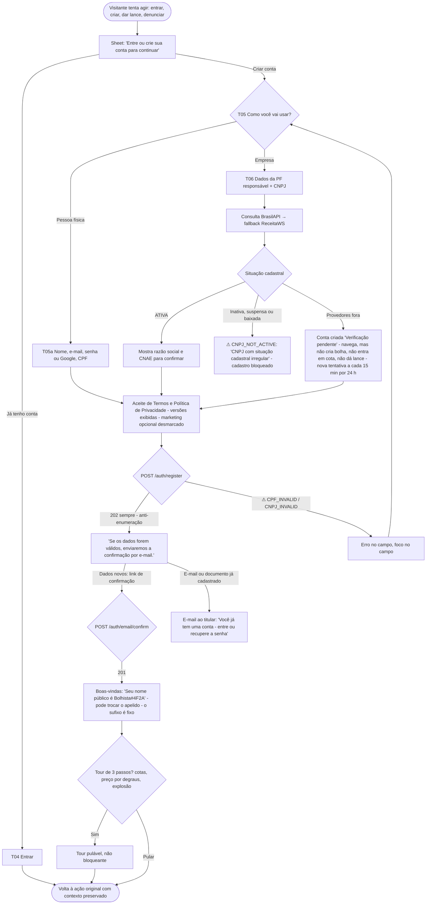

### 4.2 Navegar no canvas

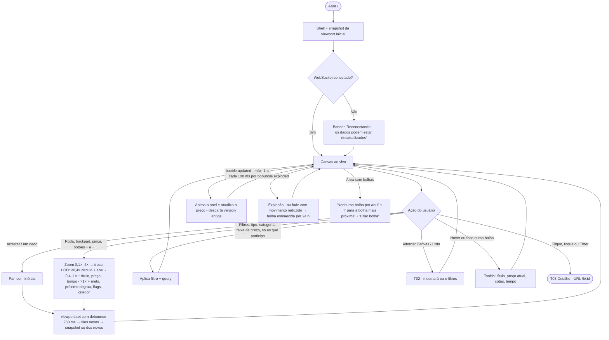

### 4.3 Detalhe da bolha

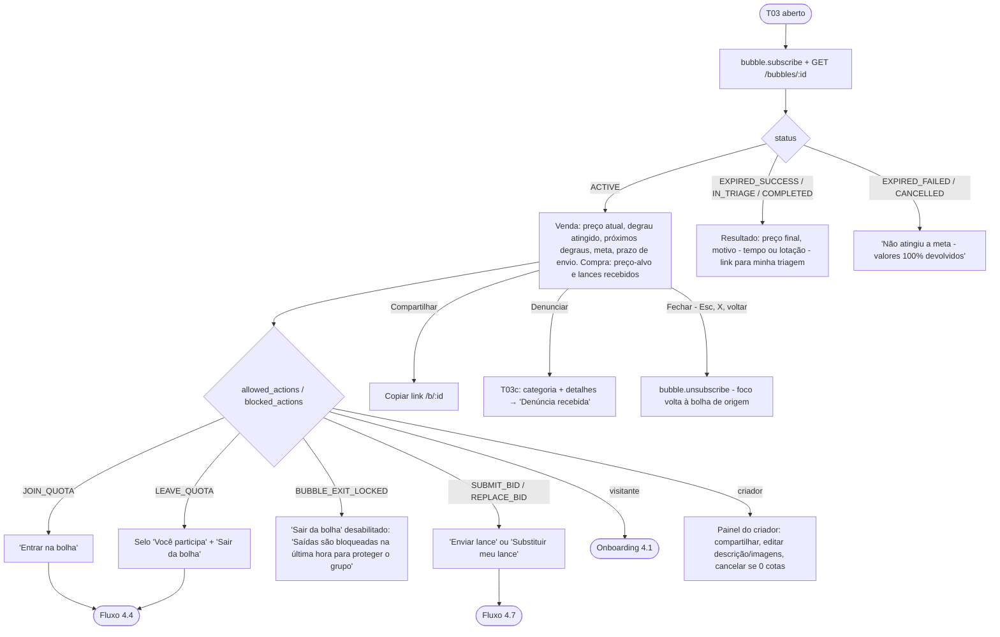

### 4.4 Entrar e sair de cota com pagamento

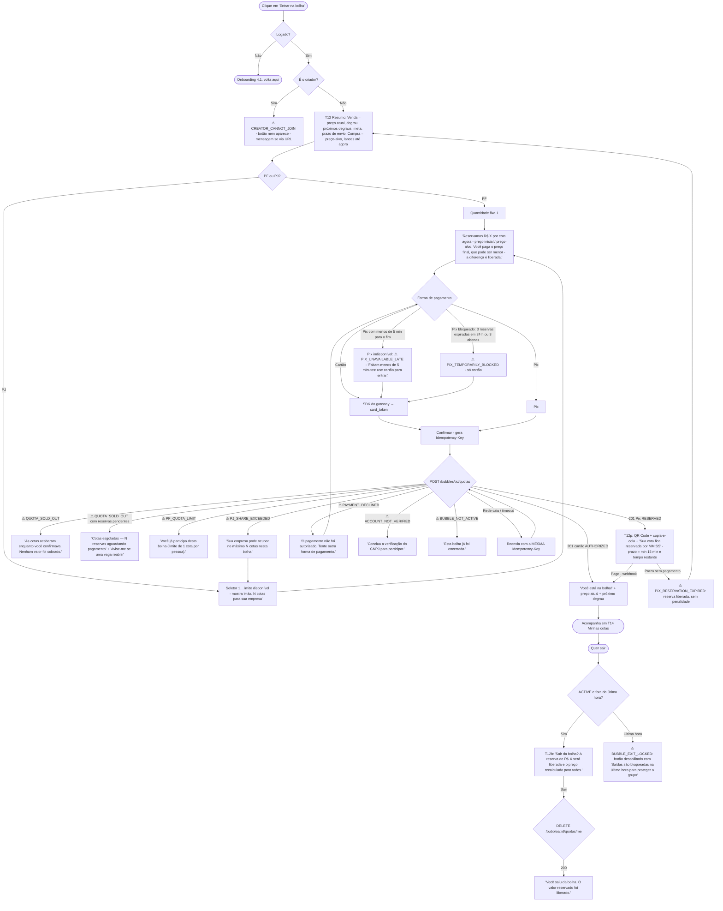

### 4.5 Criar bolha de venda (com degraus)

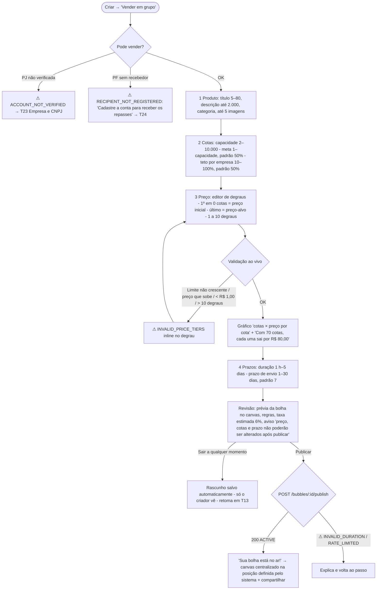

### 4.6 Criar bolha de compra

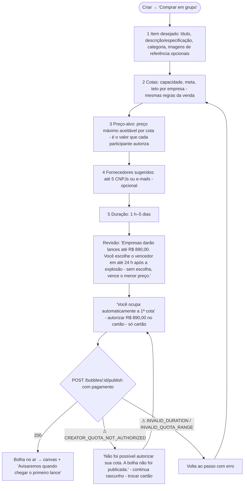

### 4.7 Enviar/substituir lance (PJ) e selecionar lance (criador)

```mermaid
flowchart TD
    subgraph PJ["Empresa - enviar lance"]
      B0([T03 de bolha de compra ACTIVE]) --> B1{PJ verificada e não é a criadora?}
      B1 -->|Não verificada| B1x["⚠ ACCOUNT_NOT_VERIFIED"]
      B1 -->|Sim| B2["T16a: preço por cota - mostra preço-alvo e melhor lance atual - prazo de entrega em dias - condições até 1.000 caracteres - validade = fim da bolha"]
      B2 --> B3{"unit_price ≤ preço-alvo?"}
      B3 -->|Não| B3x["⚠ BID_ABOVE_TARGET: 'O lance precisa ser igual ou menor que o preço-alvo de R$ X'"] --> B2
      B3 -->|Sim| B4{Já tenho lance ativo?}
      B4 -->|Não| B5{POST /bubbles/:id/bids}
      B4 -->|Sim| B6["Aviso: 'Este lance substitui o seu lance anterior de R$ Y'"] --> B5
      B5 -->|201| B8["'Lance enviado' - aparece como 'Seu lance' - anterior fica WITHDRAWN"]
      B8 --> B9([Após a explosão: notificação 'Seu lance foi selecionado' ou 'não foi selecionado'])
    end

    subgraph CR["Criador - selecionar lance"]
      C0(["Explosão com sucesso - 'Escolha o lance em até 24 h'"]) --> C1["T16: lances por preço - prazo, condições, score - contador de 24 h - aviso em T−2 h"]
      C1 --> C2{Há lances válidos?}
      C2 -->|Não| C3["'Nenhuma empresa enviou lance - valores devolvidos' → CANCELLED"]
      C2 -->|Sim| C4["Confirmar: 'Escolher Fornecedor#A31F por R$ 799,00 por cota? Todos pagarão este valor e a diferença para R$ 890,00 será liberada.'"]
      C4 --> C5{POST …/bids/:bidId/select}
      C5 -->|200| C6["IN_TRIAGE - nome da empresa vencedora revelado aos participantes"]
      C5 -->|⚠ BID_SELECTION_WINDOW_CLOSED| C7["'O prazo terminou e o menor lance foi selecionado automaticamente.'"]
      C1 -->|24 h sem escolha| C8[Menor preço - empate = mais antigo] --> C6
    end
```

### 4.8 Painel de triagem — vendedor

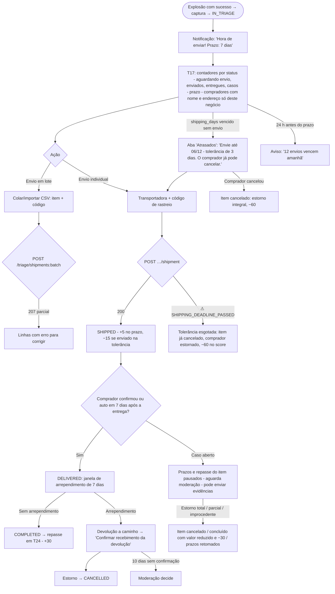

### 4.9 Painel de triagem — comprador

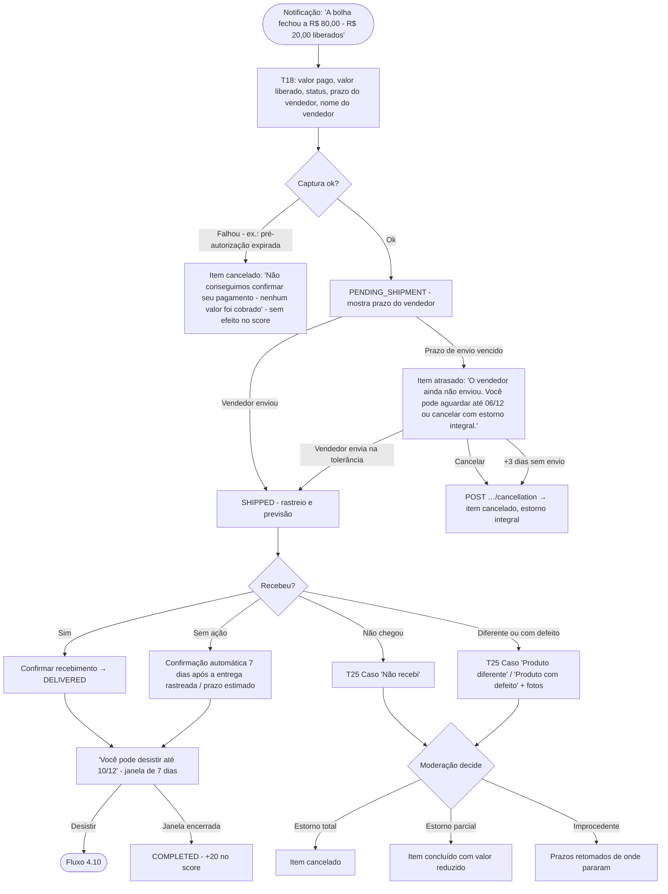

### 4.10 Arrependimento (CDC art. 49)

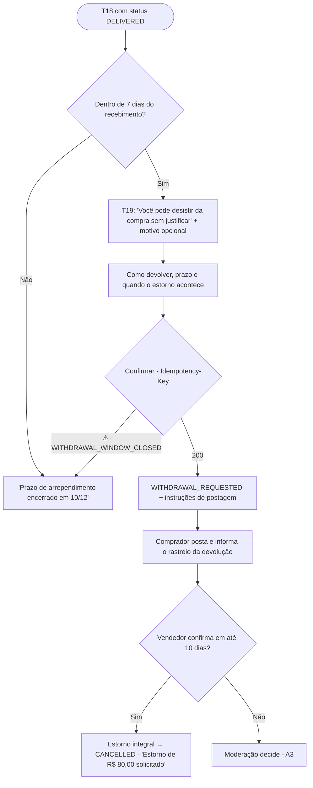

### 4.11 Score e contestação

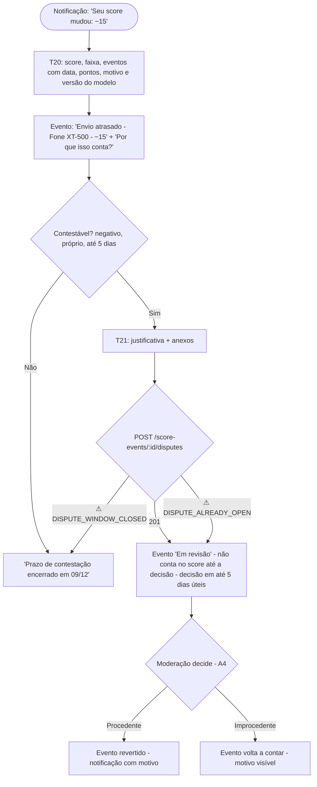

### 4.12 Denúncia e moderação

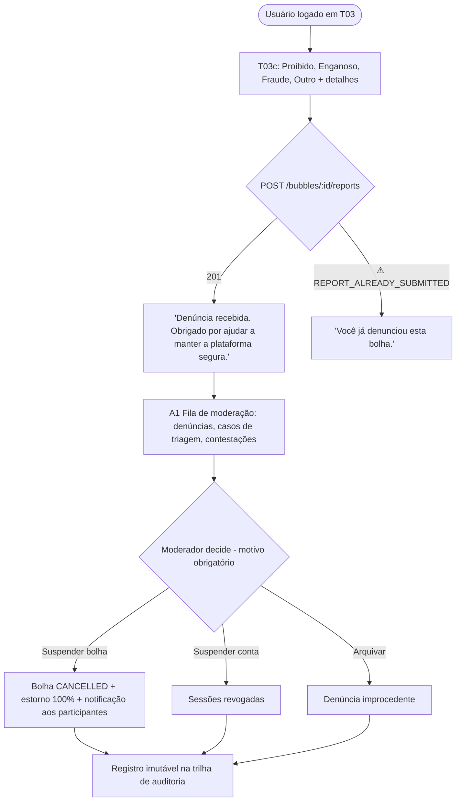

---

## 5. Lacunas a fechar no Gate A

| Tema | Pergunta aberta | Proposta usada aqui |
| :--- | :--- | :--- |
| Criador PJ de bolha de compra | Ocupa só 1 cota ou pode N? | 1 cota (Spec F4) |
| Categorias proibidas | Lista fechada (Spec Q3) | Lista nos Termos, refletida em `GET /categories` |
| UC10 "Gerenciar estoque de lotes" e "avaliação recíproca" (`mvp.md`) | Entram no R1? | Fora do R1: score por eventos (ADR-0007), sem avaliação manual |

---

## Fontes consultadas (AlterEgo)

- **ux-ui-design** — *Introdução e boas práticas em UX Design* (Casa do Código), cap. 3 "Wireframes, protótipos e rabiscoframes", p. 58–62: definir conteúdo, método de navegação (menus fixos × fluxo linear) e interações antes do layout → princípios §1 e mapa §2.
- **ux-ui-design** — *Desenvolvimento Web com HTML, CSS e JavaScript* (Caelum, WD-43), cap. 3: o trabalho de UX/IxD produz a navegação (mapa do site) e o esboço de cada visão, inclusive diálogos de alerta e confirmação → o inventário §3 trata modais/sheets como telas.
- **asias-design-interacao** — *Skill* (tabela das 10 Heurísticas) e *10 Usability Heuristics for User Interface Design* (Jakob Nielsen, NN/g, rev. 2024): visibilidade do status (banner de reconexão, contadores, reserva Pix), controle e liberdade (sair da bolha, substituir lance, rascunho automático), prevenção de erro (validação ao vivo de degraus e lance, aviso de oferta vinculante), reconhecer/diagnosticar/recuperar de erros (cada `⚠` oferece a correção).
