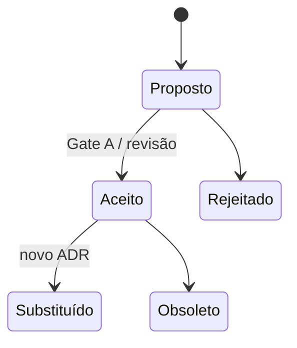

# Registro de Decisões de Arquitetura (ADR)

**Versão:** 1.0 · **Data:** 06/10/2026 · **Status:** Rascunho para revisão
**Base:** [PRD v2.1](../../../PRD.MD) · [Spec do Produto](../../../SPEC.md) · [Plano v2 §6](../../planing-project.md)

Cada decisão D1–D8 do plano (e quatro decisões estruturais complementares) vira um ADR. Todas estão com status **Proposto** e são aprovadas no **Gate A** (PO + Tech Lead + Jurídico). Depois da aprovação, o status muda para **Aceito** e o ADR fica imutável: uma mudança posterior gera um novo ADR que **substitui** o anterior.

> O plano v2 (§6 e §10) indica `002 Docs/adr/` como pasta dos ADRs. Os fatos canônicos da documentação v2 definem `002 Docs/05-arquitetura/adr/`, que é a pasta usada aqui.

## Índice

| ADR | Título | Decisão do plano | Status | Resumo |
| :--- | :--- | :---: | :--- | :--- |
| [0001](0001-monolito-modular.md) | Monólito modular em NestJS | — | Proposto | Um deploy `api` + `worker` com o mesmo código; módulos por bounded context; sem microsserviços no R1 |
| [0002](0002-concorrencia-cota.md) | Concorrência na aquisição de cotas | D1 | Proposto | `UPDATE` condicional em Read Committed + índice único parcial PF; sem Redlock nem `SERIALIZABLE` |
| [0003](0003-gateway-pagamento.md) | Gateway de pagamento atrás de `PaymentPort` | D2 | Proposto | Pagar.me v5; cartão com pré-autorização/captura; Pix com estorno; webhooks idempotentes; split/recebedor |
| [0004](0004-curva-preco-degraus.md) | Curva de preço em degraus com preço final único | D3 | Proposto | Degraus definidos pelo criador; preço final = degrau atingido na explosão, igual para todos |
| [0005](0005-selecao-lance-c2b.md) | Seleção do lance em bolhas de compra | D4 | Proposto | Janela de 24 h; fallback menor preço (empate: mais antigo); lances ≤ preço-alvo; pseudônimos |
| [0006](0006-teto-cotas-pj.md) | Teto de cotas por PJ | D5 | Proposto | `max_pj_share` 10–100% (padrão 50%); teto = `max(1, ⌊share × max_quotas⌋)`; *advisory lock* por (bolha, PJ) |
| [0007](0007-score-reputacao.md) | Modelo de score de reputação | D6 | Proposto | 0–1000, início 500, eventos ponderados, meia-vida de 180 dias, versionado, contestável |
| [0008](0008-verificacao-cnpj.md) | Verificação de CNPJ | D7 | Proposto | BrasilAPI + ReceitaWS (fallback), situação ATIVA, cache, revalidação a cada 30 dias |
| [0009](0009-maquina-estados-revisada.md) | Máquina de estados revisada da bolha | D8 | Proposto | `EXPIRED_SUCCESS`/`EXPIRED_FAILED`; `NEAR_FULL`/`EXPIRING` viram flags |
| [0010](0010-tempo-real-socketio-outbox.md) | Tempo real com Socket.io e outbox | — | Proposto | Redis adapter; rooms por tile e por bolha; publicação a partir do outbox transacional |
| [0011](0011-timers-bullmq-reconciliador.md) | Timers com BullMQ + reconciliador | — | Proposto | Delayed jobs idempotentes; reconciliador a cada 1 min com o Postgres como verdade |
| [0012](0012-criptografia-pii.md) | Criptografia de PII em coluna | — | Proposto | AES-256-GCM com chave no KMS + hash HMAC-SHA256 para busca; logs sem PII |

## Ciclo de vida



## Template

```markdown
# ADR-NNNN — <Título que diz o que foi decidido>

**Versão:** 1.0 · **Data:** DD/MM/AAAA · **Status:** Proposto | Aceito | Rejeitado | Substituído por ADR-XXXX | Obsoleto
**Base:** [PRD](../../../PRD.MD) · decisão do plano: Dn · ADRs relacionados: ADR-XXXX
**Decisores:** PO, Tech Lead, (Jurídico) · **Revisar em:** <data ou gatilho>

## Contexto
Forças em jogo, descritas de forma neutra: requisito, restrição, risco (R1–R10), números.

## Decisão
O que será feito, no imperativo, com detalhes suficientes para implementar (SQL, configuração, contrato).

## Alternativas consideradas
| Critério (peso) | Opção A (escolhida) | Opção B | Opção C |
| :--- | :---: | :---: | :---: |
| Custo (implementação + operação) | | | |
| Reversibilidade | | | |
| Complexidade | | | |
| Risco | | | |
Escala: ●●● favorável · ●● neutro · ● desfavorável. Uma linha de justificativa por opção descartada.

## Consequências
**Positivas (+)** …
**Negativas (−)** … e como serão mitigadas.

## Verificação
Testes/medidas que provam que a decisão funciona (ligados a CT-xxx / QA-xx).

## Fontes
Documentos do projeto e trechos do AlterEgo (especialista + obra) realmente usados.
```

Convenção da matriz em todos os ADRs: **●●●** favorável · **●●** neutro · **●** desfavorável. "Risco" avalia a chance e o impacto de dar errado (●●● = risco baixo).

## Fontes consultadas (AlterEgo)

- **asias-arquitetura-documentacao** — *MS Engineering Playbook*, "Design Decision Log" e ADR-0001 "Record architecture decisions" (formato de Michael Nygard: número, título, data, status Proposed/Accepted/Deprecated/Superseded, contexto como descrição neutra das forças, decisão, consequências; *trade studies* para comparar alternativas).
