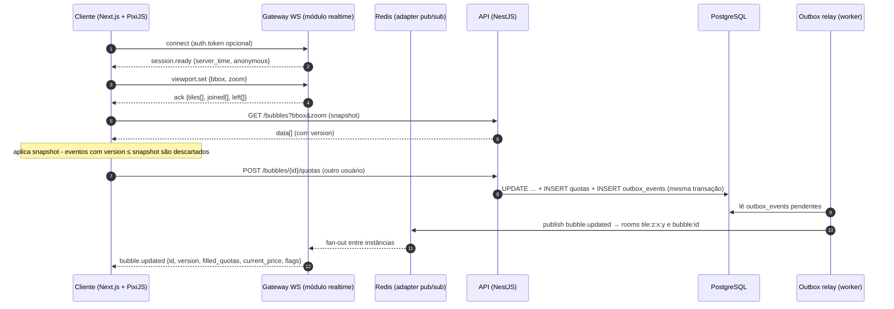
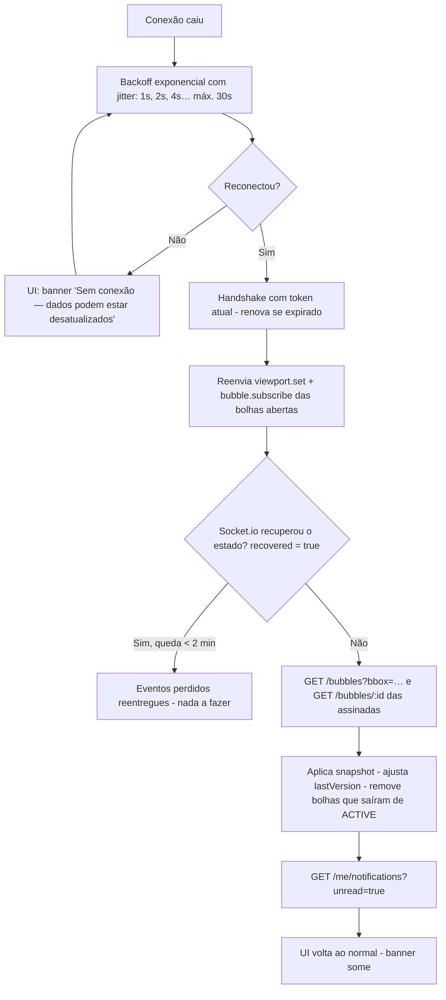

# Contrato de Tempo Real (WebSocket) — Bolha Venda

**Versão:** 1.0 · **Data:** 06/10/2026 · **Status:** Rascunho para revisão
**Base:** [PRD v2.1](../../PRD.MD) · [Spec do Produto](../../SPEC.md) · [Plano de Projeto v2](../planing-project.md) · [API REST](api-rest.md)

> Implementa RF02.1 (canvas atualizado via WebSocket) e RNF01 (atualização < 200 ms em p99).
> Decisão assumida: **ADR-0010 (proposto)** — Socket.io + `@socket.io/redis-adapter`, rooms por tile (`tile:{z}:{x}:{y}`) e por bolha (`bubble:{id}`), eventos publicados a partir do outbox transacional. O WebSocket é **somente leitura de estado**: toda escrita (cota, lance, triagem) passa pela API REST. O Postgres é a fonte da verdade; o WS é um acelerador de atualização.

---

## 1. Visão geral



- **Endpoint:** `wss://rt.bolhavenda.com.br` · namespace `/rt` · path `/socket.io` · transporte `websocket` (fallback `polling` só se o upgrade falhar).
- **Envelope** de todo evento servidor → cliente:

```json
{
  "event": "bubble.updated",
  "v": 1,
  "id": "0192fa10-3c2e-7d11-8f0a-6b2c9e0d7a55",
  "ts": "2026-11-24T14:03:12.184Z",
  "data": { "…": "…" }
}
```

  - `v`: versão do schema do evento (mudanças aditivas mantêm `v`; o cliente ignora campos desconhecidos).
  - `id`: id do `outbox_event` (deduplicação no cliente — janela de 500 ids).
  - `ts`: instante do commit no banco (base para medir a latência de RNF01).

---

## 2. Handshake e autenticação

| Item | Regra |
| :--- | :--- |
| Anônimo | Permitido. Pode assinar viewport e rooms de bolha (dados públicos). Não recebe `notification.created` |
| Autenticado | `io("/rt", { auth: { token: "<access JWT>" } })`. O gateway valida assinatura, `exp` e `sv` (session version) e entra a conexão na room privada `user:{account_id}` |
| Token no meio da sessão | O access token expira em 15 min. ~60 s antes, o servidor emite `session.expiring`; o cliente renova via `POST /auth/refresh` e envia `auth.refresh {token}`. Sem renovação até o `exp`, a conexão é **rebaixada para anônima** (sai de `user:*`), não derrubada |
| Revogação | Logout, troca de senha ou suspensão → `session.revoked` e desconexão das rooms privadas |
| Origem | `Origin` validada contra allowlist (web e staging); sem cookies no handshake (evita CSRF em WS) |
| Limite | Máx. **3 conexões simultâneas por conta** e **20 por IP** anônimo; excedente → `connect_error` com `data.code = "CONNECTION_LIMIT"` |

Resposta ao conectar:
```json
{ "event": "session.ready", "v": 1, "data": { "connection_id": "rt_9f3…", "anonymous": false, "server_time": "2026-11-24T14:03:11.002Z", "heartbeat_ms": 25000, "limits": { "max_tiles": 64, "max_bubble_rooms": 20 } } }
```

`server_time` serve para o cliente calcular o *offset* de relógio e exibir contadores regressivos corretos.

---

## 3. Rooms

| Room | Quem entra | O que recebe |
| :--- | :--- | :--- |
| `tile:{z}:{x}:{y}` | Clientes cuja viewport cobre o tile (calculado pelo servidor) | `bubble.updated`, `bubble.state_changed`, `bubble.exploded` das bolhas cujo centro (`canvas_x`, `canvas_y`) está no tile |
| `bubble:{id}` | Cliente com o detalhe da bolha aberto, participantes e criador (auto-join) | Tudo de tile + `bid.submitted`, `bid.withdrawn` e dados ampliados (`next_tier`, `bids_count`) |
| `user:{account_id}` | Conexão autenticada (automático) | `notification.created`, `session.*` |

### 3.1 Tiling do canvas

- Espaço virtual em unidades inteiras (origem 0,0; eixo Y para baixo). O zoom do cliente é contínuo em **[0,1×; 4×]** (Spec F2); a assinatura usa níveis discretos `z = clamp(floor(log2(zoom / 0,1)), 0, 5)` → z0 (0,1–0,2×), z1 (0,2–0,4×), z2 (0,4–0,8×), z3 (0,8–1,6×), z4 (1,6–3,2×), z5 (3,2–4×).
- Tamanho do tile no nível `z`: `T(z) = 32768 / 2^z` unidades (z0 = 32768, z5 = 1024).
- Índices: `x = floor(canvas_x / T(z))`, `y = floor(canvas_y / T(z))`.
- **Cada evento de bolha é publicado nos 6 níveis** (um tile por nível) — custo constante (6 publishes) e cada cliente assina apenas o nível do seu zoom.
- Projeção por nível de detalhe (LOD, Spec F2), igual à da REST: `LOW` (zoom < 0,4× → z0–z1: `id`, `filled_quotas`, `reserved_quotas`, `max_quotas`, flags, `status`, `version`), `MEDIUM` (0,4×–1×: + `current_price`) e `HIGH` (> 1×: + `next_tier`). Como z3 cobre 0,8–1,6×, o gateway publica `MEDIUM` e `HIGH` em z3 e o cliente aplica o recorte conforme o zoom real — mitigação de R1/R7.

---

## 4. Assinatura de viewport

O cliente **não** escolhe tiles: envia a viewport e o servidor calcula o conjunto (evita assinaturas abusivas e mantém a função de tiling num só lugar).

**Cliente → servidor:** `viewport.set` (com *ack*)
```json
{ "bbox": [10000, -4200, 14200, -1800], "zoom": 2.6, "margin": 0.25 }
```
- `bbox = [minX, minY, maxX, maxY]` em unidades do canvas; `zoom` contínuo em [0,1; 4] (o servidor converte para `z` conforme §3.1).
- `margin` (0–0,5) amplia a bbox para pré-carregar a vizinhança e evitar "piscar" durante o pan.
- Enviado com *debounce* de 250 ms ao fim do pan/zoom e no máximo **4 vezes/s** (acima disso, o servidor aplica só o último em cada janela de 250 ms).

**Ack do servidor:**
```json
{
  "ok": true,
  "z": 4,
  "lod": "HIGH",
  "tiles": ["tile:4:4:-2", "tile:4:5:-2", "tile:4:4:-1", "tile:4:5:-1"],
  "joined": ["tile:4:5:-1"],
  "left": ["tile:4:3:-2"],
  "snapshot_bbox": [8192, -8192, 16384, 0]
}
```
- O cliente faz `GET /bubbles?bbox=<snapshot_bbox>&zoom=<z>` **somente para os tiles em `joined`** (ou para a bbox inteira se mudou de `z`).
- Limite de **64 tiles** por conexão. Se a viewport exigir mais (tela muito grande em zoom alto), o servidor sobe um nível de zoom para a assinatura e retorna `"degraded": true`.

**Erros (ack com `ok: false`):** `{ "ok": false, "code": "BBOX_TOO_LARGE" | "INVALID_ZOOM" | "RATE_LIMITED" }`.

**Assinatura de bolha:** `bubble.subscribe { "bubble_id": "…" }` / `bubble.unsubscribe { "bubble_id": "…" }` (ack `{ ok, version }`), máx. 20 por conexão. Usado ao abrir o drawer de detalhe; o cliente cancela ao fechar.

---

## 5. Eventos servidor → cliente

Todos os eventos de bolha carregam `bubble_id` e `version`.

### 5.1 `bubble.updated`
Disparado por `QuotaAcquired`, `QuotaReleased`, criação/expiração de reserva Pix e mudança de flags (job `bubble-expiring`, cruzamento de 80%). Carrega **valores absolutos** (não deltas), para que a perda de um evento intermediário não corrompa o estado.

```json
{
  "bubble_id": "0192f1c2-7b1e-7c3a-9a51-3f0a8d2c1e44",
  "version": 142,
  "filled_quotas": 66,
  "reserved_quotas": 2,
  "available_quotas": 32,
  "max_quotas": 100,
  "current_price": 9000,
  "next_tier": { "min_filled_quotas": 70, "unit_price": 8000, "quotas_to_go": 4 },
  "flags": { "is_near_full": false, "is_expiring": false },
  "cause": "QUOTA_ACQUIRED",
  "delta_quotas": 1
}
```
- `filled_quotas` (cotas pagas — definem preço e meta) e `reserved_quotas` (reservas Pix pendentes — só ocupam capacidade) vêm **sempre juntos**, em todos os níveis de LOD, para o anel mostrar o trecho reservado e a UI explicar "Cotas esgotadas — N reservas aguardando pagamento" (Spec F5). `available_quotas = max_quotas − filled_quotas − reserved_quotas`.
- `cause`: `QUOTA_ACQUIRED` | `QUOTA_RELEASED` | `QUOTA_RESERVED` | `RESERVATION_EXPIRED` | `FLAG_CHANGED` | `COALESCED` (vários eventos fundidos — §7). `delta_quotas` é a soma de `filled_quotas` no intervalo e serve só para a animação de pulso (reservas não pulsam: não mudam preço nem meta).
- `next_tier` é omitido nos LOD `LOW`/`MEDIUM` e em bolhas `PURCHASE` (onde `current_price` = melhor lance).

### 5.2 `bubble.state_changed`
Toda transição da máquina de estados (ADR-0009). Nunca é coalescido.

```json
{
  "bubble_id": "0192f1c2-…",
  "version": 143,
  "from": "DRAFT",
  "to": "ACTIVE",
  "reason": "PUBLISHED",
  "bubble": { "…BubbleSummary (somente quando to = ACTIVE)…": true }
}
```
- `reason`: `PUBLISHED`, `CANCELLED_BY_CREATOR`, `CANCELLED_BY_MODERATION`, `BID_SELECTED`, `BID_AUTO_SELECTED`, `NO_VALID_BID`, `TRIAGE_COMPLETED`, `TRIAGE_ALL_CANCELLED`, `FAILED_REFUNDED`.
- `DRAFT → ACTIVE` traz o `BubbleSummary` completo: é assim que **uma bolha nova aparece no canvas** de quem está olhando aquele tile.
- `EXPIRED_SUCCESS → IN_TRIAGE` em bolha de compra traz `selected_bid_id` e `final_price`.

### 5.3 `bubble.exploded`
Emitido para `BubbleExploded`. Para o cliente, é o gatilho da animação de explosão (com `prefers-reduced-motion`, substituída por um fade — Spec F7; ver [acessibilidade.md](../04-design/acessibilidade.md)). Reservas Pix pendentes na explosão por tempo são descartadas e não contam para a meta.

```json
{
  "bubble_id": "0192f1c2-…",
  "version": 190,
  "outcome": "SUCCESS",
  "reason": "FULL",
  "status": "EXPIRED_SUCCESS",
  "filled_quotas": 200,
  "final_price": 19900,
  "exploded_at": "2026-11-25T09:41:07.551Z",
  "bid_selection_deadline": null
}
```
- `outcome = FAILED` → `status = EXPIRED_FAILED` e, em seguida, um `bubble.state_changed` para `CANCELLED` (`reason: FAILED_REFUNDED`).
- Em bolha de compra com sucesso, `final_price = null` e `bid_selection_deadline = exploded_at + 24 h`.
- Ordem garantida para a mesma bolha: o `bubble.updated` da última cota (se houver) **antes** do `bubble.exploded` (mesma transação, versões consecutivas).

### 5.4 `bid.submitted` (room `bubble:{id}`)
```json
{
  "bubble_id": "0192f6…",
  "version": 77,
  "bid": { "id": "0192f8…", "bidder": { "pseudonym": "Fornecedor#A31F", "score_band": "EXCELENTE" }, "unit_price": 79900, "delivery_days": 12, "submitted_at": "2026-11-24T10:00:00Z" },
  "summary": { "bids_count": 5, "best_price": 79900 }
}
```
Nos tiles, a mudança de "melhor lance" chega como `bubble.updated` (`current_price`).

### 5.5 `bid.withdrawn` (room `bubble:{id}`) — *extensão proposta*
`{ "bubble_id", "version", "bid_id", "replaced_by_bid_id": "0192f9…" | null, "summary": { "bids_count", "best_price" } }`. Emitido na retirada e na **substituição** de lance (Spec F8: o anterior vira `WITHDRAWN`; nesse caso vem seguido do `bid.submitted` do novo lance, com `version` consecutiva). Não consta da lista canônica de eventos WS (ver §9).

### 5.6 `notification.created` (room `user:{id}`)
```json
{
  "notification": { "id": "0192fb…", "type": "BUBBLE_EXPLODED", "title": "Sua bolha explodiu com sucesso!", "body": "Fone Bluetooth XT-500 fechou a R$ 199,00 por cota.", "link": "/b/0192f1c2-…", "created_at": "2026-11-25T09:41:08Z" },
  "unread_count": 3
}
```

### 5.7 Eventos de controle

| Evento | Payload | Uso |
| :--- | :--- | :--- |
| `session.ready` | ver §2 | Pós-handshake |
| `session.expiring` | `{ "expires_at" }` | Renovar token |
| `session.revoked` | `{ "reason": "LOGOUT|PASSWORD_CHANGED|SUSPENDED" }` | Limpar estado privado |
| `resync.required` | `{ "scope": "VIEWPORT|BUBBLE|ALL", "bubble_ids": [], "reason": "BACKPRESSURE|GAP|SERVER_RESTART" }` | Forçar novo snapshot REST (§6) |
| `server.draining` | `{ "reconnect_after_ms": 2000 }` | Deploy/scale-in: cliente reconecta com jitter |

### 5.8 Cliente → servidor

| Evento | Payload | Ack |
| :--- | :--- | :--- |
| `viewport.set` | `{ bbox, zoom, margin }` | `{ ok, z, tiles, joined, left, snapshot_bbox }` |
| `bubble.subscribe` / `bubble.unsubscribe` | `{ bubble_id }` | `{ ok, version }` |
| `auth.refresh` | `{ token }` | `{ ok, anonymous }` |
| `latency.ack` | `{ event_id, received_at }` (amostragem de 1%) | — |

---

## 6. Ordenação, versão e consistência

1. **`version` monotônico por bolha:** `bubbles.version` é incrementado em toda escrita que muda estado visível (mesma transação que gera o `outbox_event`). O evento carrega a versão pós-commit.
2. **Regra do cliente:** manter `lastVersion[bubble_id]`.
   - `event.version ≤ lastVersion` → **descartar** (atrasado ou duplicado).
   - `event.version > lastVersion` → aplicar e atualizar `lastVersion`.
   - Como `bubble.updated` traz valores absolutos, um salto (`version > lastVersion + 1`) é aceito sem refetch.
   - **Exceção:** se o salto envolve `bubble.state_changed`/`bubble.exploded` ausente (cliente recebe `bubble.updated` com `status` implícito diferente do conhecido, ou detecta `version` ≥ `lastVersion + 50`), o cliente faz `GET /bubbles/{id}`.
3. **Snapshot × eventos:** ao aplicar um snapshot REST, o cliente sobrescreve `lastVersion` com a `version` do snapshot; eventos em *buffer* recebidos durante o GET são reaplicados pela regra acima (os antigos caem fora sozinhos).
4. **Entre bolhas** não há ordem global garantida (e não é necessária).
5. **Entrega:** *at-least-once* do outbox para o Redis; *at-most-once* do gateway para o socket (eventos `volatile` para `bubble.updated` em tiles). A consistência final vem da regra de versão + ressincronização.

---

## 7. Coalescência e backpressure

| Mecanismo | Regra |
| :--- | :--- |
| **Coalescência por bolha** | O gateway mantém um buffer por `(room, bubble_id)`: no máximo **1 `bubble.updated` por bolha a cada 100 ms** por room. Dentro da janela, só o último estado é enviado (`cause: "COALESCED"`, `delta_quotas` somado). Em rajada na última cota (100 req/s), cada cliente vê ≤ 10 updates/s daquela bolha |
| **Eventos não coalescíveis** | `bubble.state_changed`, `bubble.exploded`, `bid.*`, `notification.created`. Antes de emiti-los, o gateway **descarrega** (flush) o `bubble.updated` pendente da mesma bolha, preservando a ordem de `version` |
| **Orçamento por socket** | Máx. 200 eventos/s e 256 KB/s por conexão. Acima disso, `bubble.updated` de tiles passa a ser descartado para aquela conexão e, ao normalizar, o servidor envia `resync.required {scope: "VIEWPORT", reason: "BACKPRESSURE"}` |
| **Buffer de saída** | Se o buffer de escrita do socket passar de 1 MB (cliente lento/rede ruim), o gateway descarta eventos `volatile` e, persistindo por > 10 s, desconecta com `reason: "SLOW_CONSUMER"` (o cliente reconecta e ressincroniza) |
| **Cliente** | Aplica eventos no próximo `requestAnimationFrame` (batch por frame) para não bloquear o render de 60 FPS; animações de pulso são agrupadas (≤ 1 pulso/bolha/300 ms) |

---

## 8. Reconexão e ressincronização



- Socket.io *connection state recovery* habilitado com janela de **2 min** (`maxDisconnectionDuration`). Fora dela, ou após `resync.required`, vale o snapshot REST.
- Enquanto desconectado, as ações de escrita continuam via REST (a resposta já traz o estado atualizado da bolha). O botão de entrar em cota **não** é bloqueado por falta de WS; é bloqueado apenas se a REST estiver offline.
- O contador regressivo continua localmente (baseado em `expires_at` + offset de relógio) e, ao chegar a zero sem `bubble.exploded`, a UI mostra "Encerrando…" e consulta `GET /bubbles/{id}` após 3 s (o timer de explosão do servidor tem SLA de ≤ 2 s — Plano §9).

---

## 9. Limites e SLOs

| Limite | Valor |
| :--- | :--- |
| Conexões por conta / por IP anônimo | 3 / 20 |
| Tiles por conexão | 64 |
| Rooms de bolha por conexão | 20 |
| `viewport.set` | 4/s (excedente: aplica o último) |
| Tamanho máximo de mensagem cliente → servidor | 4 KB |
| Heartbeat | `pingInterval` 25 s, `pingTimeout` 20 s |
| Payload típico `bubble.updated` | < 400 bytes (sem imagem/título) |
| **SLO de latência** | commit → entrega no cliente **< 200 ms em p99** (RNF01), medido com `ts` do envelope e `latency.ack` amostrado, exportado via OpenTelemetry |
| Capacidade alvo (R7, teste em S7) | 10 mil conexões simultâneas, 500 bolhas ativas, rajada de 100 cotas/s numa bolha |

**Pendências**
1. `bid.withdrawn` (§5.5) é extensão à lista canônica de eventos WS (`bubble.updated`, `bubble.state_changed`, `bubble.exploded`, `bid.submitted`, `notification.created`) — aprovar no ADR-0010.
2. O plano (E5) nomeia eventos em maiúsculas (`BUBBLE_UPDATED`); este contrato adota a forma canônica com ponto (`bubble.updated`).
3. O tamanho do espaço virtual (`T(z0) = 32768`) é provisório: depende do algoritmo de posicionamento automático por cluster de categoria (Spec F2) e deve ser recalibrado com dados do beta.

---

## Fontes consultadas (AlterEgo)

- **senior-backend-nodejs** — *Data Table — Software Engineering and Design Pattern Key Concepts (NotebookLM)*: "Writable Stream" (limitar buffer para que o destino não seja sobrecarregado — *backpressure*/`highWaterMark` → orçamento por socket e buffer de saída §7); "Statelessness" (estado externo em Redis → instâncias do gateway sem estado, adapter Redis); "Observer Pattern" (publisher/subscriber → rooms); "Tolerant Reader" (campo `v` e ignorar campos desconhecidos).
- **frontend-dev** — *Client-side data fetching: SWR | Next.js*: revalidação em *focus/reconnect* e dados otimistas com rollback em caso de falha → ressincronização por snapshot REST após reconectar (§8).
