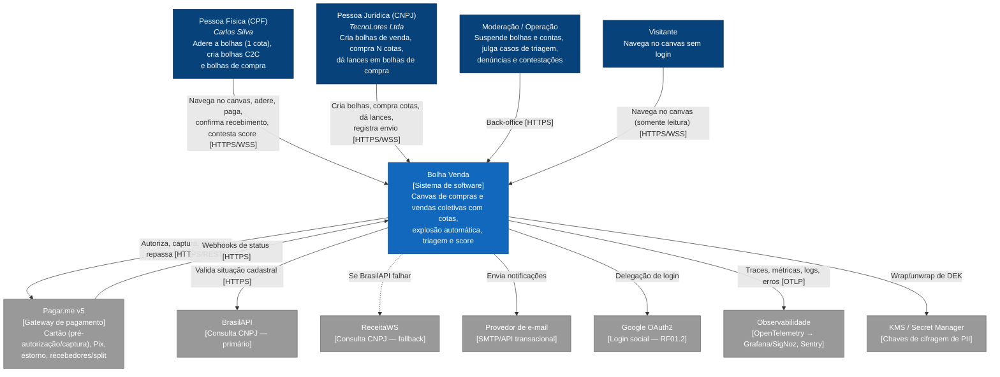
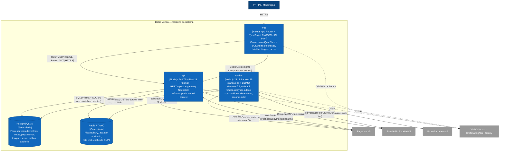
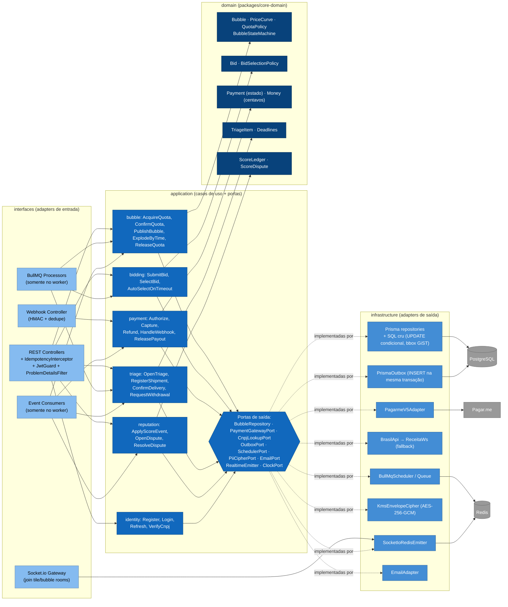
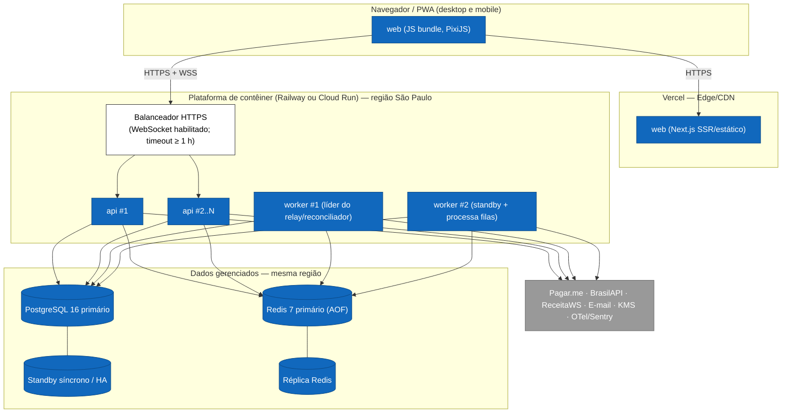

# Arquitetura C4 — Bolha Venda

**Versão:** 1.0 · **Data:** 06/10/2026 · **Status:** Rascunho para revisão
**Base:** [PRD v2.1](../../PRD.MD) · [Spec do Produto](../../SPEC.md) · [Plano v2](../planing-project.md) · ADRs em [adr/](adr/README.md)

> Este documento detalha a arquitetura lógica do PRD v2.1 §5.1 e substitui [arquitetura.md](../arquitetura.md). Os blocos do PRD (Identity, Bubble Core Engine, Payment, Triage & Reputation) são **módulos de um monólito modular** (ADR-0001, proposto). Em conflito de comportamento, vale a [Spec](../../SPEC.md). Todas as decisões D1–D8 estão com status **Proposto** e aguardam o Gate A.

## Sumário

1. [Convenções](#1-convenções)
2. [Nível 1 — Contexto do sistema](#2-nível-1--contexto-do-sistema)
3. [Nível 2 — Contêineres](#3-nível-2--contêineres)
4. [Nível 3 — Componentes do `api`](#4-nível-3--componentes-do-api)
5. [Visões dinâmicas resumidas](#5-visões-dinâmicas-resumidas)
6. [Visão de implantação (dev, staging, prod)](#6-visão-de-implantação)
7. [Atributos de qualidade e táticas](#7-atributos-de-qualidade-e-táticas)
8. [Preocupações transversais](#8-preocupações-transversais)
9. [Riscos arquiteturais e questões em aberto](#9-riscos-arquiteturais-e-questões-em-aberto)
10. [Fontes consultadas (AlterEgo)](#fontes-consultadas-alterego)

---

## 1. Convenções

- Notação C4 (Simon Brown): **Contexto → Contêineres → Componentes**. O nível 4 (código) não é desenhado: ele sai do código. Diagramas em Mermaid `flowchart`, porque o suporte a `C4Context` no Mermaid ainda é experimental e renderiza mal no Obsidian.
- Legenda de cores: azul-escuro = pessoa; azul = contêiner do sistema; cinza = sistema externo; tracejado = fronteira do sistema.
- Nomes de tabelas, eventos, filas e endpoints seguem os fatos canônicos e o [modelo de dados](modelo-dados.md).
- A implantação é descrita **por ambiente** (seção 6), não no diagrama de contêineres. É a recomendação do próprio C4: o diagrama de contêineres diz pouco sobre cluster, balanceador e réplicas, e esses detalhes mudam entre ambientes.

---

## 2. Nível 1 — Contexto do sistema



| Elemento | Responsabilidade em relação ao sistema | Decisão relacionada |
| :--- | :--- | :--- |
| PF | No máximo 1 cota por bolha; vê só pseudônimos no canvas | ADR-0002, ADR-0012 |
| PJ | N cotas até `max_pj_share` (padrão 50%); exige CNPJ com situação ATIVA | ADR-0006, ADR-0008 |
| Pagar.me v5 | Única fonte de movimentação financeira; fica atrás de `PaymentPort` | ADR-0003 |
| BrasilAPI / ReceitaWS | Situação cadastral do CNPJ, com cache e revalidação a cada 30 dias | ADR-0008 |
| KMS | Guarda a KEK; o sistema só manipula DEKs cifradas | ADR-0012 |

---

## 3. Nível 2 — Contêineres



### 3.1 Responsabilidades dos contêineres

| Contêiner | Tecnologia | Responsabilidades | Não faz |
| :--- | :--- | :--- | :--- |
| **web** | Next.js (App Router), TS, PixiJS, Tailwind, PWA | Renderiza o canvas (WebGL), culling por QuadTree, LOD por zoom, assinatura de rooms `tile:{z}:{x}:{y}` conforme o viewport, deriva `is_near_full`/`is_expiring` localmente, lista alternativa acessível | Regra de negócio autoritativa: o preço "se fechar agora" usa `core-domain` só para exibição |
| **api** | NestJS, Prisma, Socket.io + `@socket.io/redis-adapter` | Casos de uso síncronos (cadastro, criar/publicar bolha, aderir/sair, lance, seleção, triagem, contestação), autenticação, idempotência, recepção de webhooks, gateway WS (autenticação do socket, join/leave de rooms) | Timers, captura em lote, envio de e-mail, relay do outbox |
| **worker** | Mesmo código-fonte, `NestFactory.createApplicationContext` sem HTTP, BullMQ | Relay do outbox → consumidores e WS; filas `bubble-expire`, `bubble-expiring`, `bid-selection-timeout`, `triage-deadline` (canônicas) e `quota-reservation-expire`, `triage-shipping-grace`, `cnpj-verification-retry`, `domain-events`, `email`, `maintenance` (propostas); reconciliador a cada 1 min; capturas, estornos e repasses; e-mails; recálculo diário do score (decaimento) | Atender HTTP de usuário |
| **PostgreSQL 16** | Gerenciado, PITR | Fonte da verdade de estado e de tempo (`now()` do banco); outbox transacional; auditoria | Não guarda nada "só no Redis" |
| **Redis 7** | Gerenciado, AOF `everysec`, `maxmemory-policy noeviction` (exigência do BullMQ) | Filas, pub/sub do adapter, rate limit, cache de CNPJ | Não é fonte da verdade: se perdido, o reconciliador reconstrói os timers a partir do Postgres |

### 3.2 Por que `worker` é um contêiner separado com o mesmo código

- Isolamento de falhas e de carga: um pico de capturas ou de e-mails não afeta a latência do `POST /quotas`.
- Escala independente: o `api` escala por conexões WS e RPS; o `worker` escala por profundidade de fila.
- Mesmo artefato Docker, com entrypoints diferentes (`node dist/main.api.js` e `node dist/main.worker.js`). Não há contrato remoto entre os dois: eles compartilham módulos e se comunicam **só** via Postgres (outbox) e Redis (filas). Detalhes no ADR-0001.

---

## 4. Nível 3 — Componentes do `api`

### 4.1 Módulos (bounded contexts) e camadas hexagonais

Cada módulo segue Ports & Adapters: as dependências de código-fonte só apontam para dentro (`interfaces → application → domain`; `infrastructure` implementa portas declaradas em `application`). O domínio puro mora em `packages/core-domain` (sem NestJS, Prisma ou SDK), e por isso o `web` pode reutilizar o cálculo de preço para exibição.

```text
003-project/
├── apps/
│   ├── api/src/
│   │   ├── main.api.ts                 # HTTP + Socket.io
│   │   └── modules/<modulo>/
│   │       ├── interfaces/             # controllers REST, gateways WS, handlers de webhook, DTOs (zod de packages/contracts)
│   │       ├── application/            # casos de uso (commands/queries), portas de saída, consumidores de eventos
│   │       └── infrastructure/         # adapters: Prisma/SQL, Pagar.me, BrasilAPI, BullMQ, KMS, e-mail
│   └── worker/src/main.worker.ts       # importa os mesmos módulos; registra processadores BullMQ e o relay
└── packages/
    ├── core-domain/src/<modulo>/       # agregados, value objects, políticas, eventos de domínio (TS puro)
    ├── contracts/                      # schemas zod/OpenAPI de REST, WS e eventos (versionados)
    ├── database/                       # schema Prisma, migrations SQL, seeds
    └── ui-components/
```

| Módulo | Agregados (domain) | Casos de uso (application) | Portas de saída | Adapters (infrastructure) | Interfaces |
| :--- | :--- | :--- | :--- | :--- | :--- |
| **identity** | `Account`, `CompanyProfile`, `Consent`, `RefreshToken` | Register, Login, Refresh (rotação), VerifyCnpj, GrantConsent, ExportMyData | `AccountRepository`, `CnpjLookupPort`, `PiiCipherPort`, `PasswordHasher`, `OAuthPort` | `PrismaAccountRepository`, `BrasilApiCnpjAdapter` → `ReceitaWsCnpjAdapter` (fallback com circuit breaker), `KmsEnvelopeCipher`, `Argon2Hasher`, `GoogleOAuthAdapter` | `POST /auth/*`, `GET /me` |
| **bubble** | `Bubble` (com `PriceTiers` e `Quota`s), políticas `QuotaPolicy` (PF=1, teto PJ), `PriceCurve`, `BubbleStateMachine` | CreateBubble, PublishBubble, AcquireQuota, ConfirmQuota, ReleaseQuota, ExplodeByTime, CancelBubble, QueryBubblesByBbox | `BubbleRepository` (com `tryAcquire` atômico), `PaymentPort` (via fachada de payment), `OutboxPort`, `ClockPort` | `PrismaBubbleRepository` (SQL cru no `UPDATE` condicional), `PrismaOutbox` | `POST /bubbles`, `POST /bubbles/{id}/publish`, `GET /bubbles?bbox`, `POST/DELETE /bubbles/{id}/quotas` |
| **bidding** | `Bid`, `BidSelectionPolicy` (menor preço, empate pelo mais antigo) | SubmitBid, WithdrawBid, SelectBid, AutoSelectOnTimeout | `BidRepository`, `OutboxPort`, `ClockPort` | `PrismaBidRepository` | `POST /bubbles/{id}/bids`, `POST /bubbles/{id}/bids/{bidId}/select` |
| **payment** | `Payment`, `Refund`, `Payout`, `WebhookEvent` | Authorize, Capture, Void, Refund, ReleasePayout, HandleWebhook, Reconcile | `PaymentGatewayPort` (authorize/capture/void/refund/payout/getCharge), `WebhookVerifier` | `PagarmeV5Adapter` (Stripe possível no futuro), `HmacWebhookVerifier`, `PrismaPaymentRepository` | `POST /webhooks/payments/pagarme` |
| **triage** | `TriageItem`, `Shipment`, `TriageDeadlines` | OpenTriage, RegisterShipment, ConfirmDelivery, RequestWithdrawal, CompleteItem, CancelItem, CloseTriage | `TriageRepository`, `SchedulerPort`, `OutboxPort` | `PrismaTriageRepository`, `BullMqScheduler` | `GET /triage/items`, `POST /triage/items/{id}/shipment`, `/delivery-confirmation`, `/withdrawal` |
| **reputation** | `ScoreLedger` (eventos ponderados, meia-vida de 180 dias), `ScoreDispute` | ApplyScoreEvent, RecomputeScore, OpenDispute, ResolveDispute | `ScoreRepository`, `OutboxPort` | `PrismaScoreRepository` | `GET /accounts/{id}/score`, `POST /score-events/{id}/disputes` |
| **notification** | `Notification` (dedupe por chave) | Notify (in-app/e-mail), MarkRead | `EmailPort`, `NotificationRepository` | `SmtpEmailAdapter` (provedor a definir), `PrismaNotificationRepository` | Evento WS `notification.created` |
| **moderation** *(módulo próprio, Spec v1.1; não está na lista canônica de contextos)* | `TriageCase`, `Report`, `AccountSuspension` | ReportBubble, OpenTriageCase, DecideTriageCase (FULL_REFUND/PARTIAL_REFUND/REJECTED), DecideReport, SuspendAccount, JudgeScoreDispute (julgador ≠ moderador do caso de origem) | `ModerationRepository`, `ReputationFacade`, `OutboxPort`, `AuditPort` | `PrismaModerationRepository`, `PrismaAuditLog` (append-only) | `POST /bubbles/{id}/reports`, `POST /triage/items/{id}/cases`, back-office `/moderation/*` |
| **realtime** | — (sem domínio) | AuthenticateSocket, JoinTiles, JoinBubble, Broadcast | `RealtimeEmitter` | `SocketIoGateway` (api), `SocketIoRedisEmitter` (worker) | Eventos WS `bubble.updated`, `bubble.state_changed`, `bubble.exploded`, `bid.submitted`, `notification.created` |
| **platform** | `OutboxEvent`, `AuditEntry`, `IdempotencyRecord` | RelayOutbox, Reconcile, RecordAudit, IdempotencyGuard (interceptor) | `QueuePort`, `LeaderElectionPort` | `BullMqQueue`, `PgAdvisoryLockLeader`, `PrismaAuditLog` | `/health/live`, `/health/ready`, métricas |

Escolha local de arquitetura: **bubble, bidding, payment, triage e reputation** usam domínio rico com hexagonal completo. **notification** e **realtime** são finos (quase CRUD/encaminhamento) e não ganham agregados artificiais. É a mesma postura do projeto de referência *DDD by Examples — Library*: arquitetura local proporcional à complexidade do contexto.

### 4.2 Diagrama de componentes do `api` (com o `worker` reaproveitando os mesmos componentes)



### 4.3 Regras de dependência entre módulos (verificadas em CI)

1. `domain` não importa nada de fora de `packages/core-domain`. Lint: `eslint-plugin-boundaries` ou `dependency-cruiser` com regra `no-outward-deps`.
2. Um módulo **não acessa tabelas de outro módulo**. Leitura síncrona entre módulos passa pela **fachada pública** do módulo dono (ex.: `PaymentFacade.authorize()` chamada por `AcquireQuota`). Efeitos colaterais entre módulos usam **eventos de domínio via outbox** ([eventos-dominio.md](eventos-dominio.md)).
3. Exceção explícita: a transação de cota escreve `quotas`, `bubbles` e `outbox_events` (todas do módulo bubble, mais a tabela de plataforma). Segunda exceção: a **seleção de lance** grava `bubbles.selected_bid_id` e `bids.status` na mesma transação (bubble + bidding), porque a corrida criador × timeout é resolvida pelo `UPDATE` condicional em `bubbles`. Fora isso, nenhuma transação de escrita cruza dois módulos de negócio.
4. Propriedade de tabelas: identity → `accounts`, `company_profiles`, `consents`, `refresh_tokens`; bubble → `bubbles`, `price_tiers`, `quotas`; bidding → `bids`; payment → `payments`, `refunds`, `payouts`, `webhook_events`; triage → `triage_items`, `shipments`; reputation → `score_events`, `score_disputes`; moderation → `triage_cases`, `reports`, `account_suspensions`; bubble → também `supplier_invites`; notification → `notifications`; platform → `outbox_events`, `audit_log`, `idempotency_keys`, `processed_events`.

Essa disciplina mantém aberta a extração futura de um módulo para serviço próprio (ADR-0001), sem pagar agora o custo de rede e de consistência eventual entre serviços.

---

## 5. Visões dinâmicas resumidas

Os diagramas de sequência detalhados estão em [eventos-dominio.md §6](eventos-dominio.md#6-diagramas-de-sequência). Resumo dos fluxos críticos:

| Fluxo | Caminho | Garantia |
| :--- | :--- | :--- |
| Aderir à bolha (cartão) | web → api: `PaymentPort.authorize` → `BEGIN; INSERT quotas; UPDATE bubbles … condicional; INSERT outbox; COMMIT` → 201 | Sem overbooking (ADR-0002); autorização anulada se a transação falhar |
| Aderir à bolha (Pix) | api reserva a vaga (`RESERVED`, 15 min, conta em `reserved_quotas`) → cria a cobrança → 202 com QR → webhook `paid` → `ConfirmQuota` (`RESERVED → ACTIVE`, atômico) | A vaga fica garantida por 15 min; não paga → volta a ficar livre; reserva não conta para a meta (Spec F5) |
| Explosão por lotação | Na mesma transação da última cota: `status = EXPIRED_SUCCESS`, `explode_reason = FULL` | Atômica com a cota (D8) |
| Explosão por tempo | Job `bubble-expire` → `UPDATE … WHERE status='ACTIVE' AND expires_at <= now()` | Idempotente; reconciliador a cada 1 min |
| Broadcast | commit → `pg_notify` → relay (worker) → emitter Redis → nós Socket.io → rooms `tile:*` e `bubble:*` | p99 < 200 ms (RNF01) |

---

## 6. Visão de implantação

### 6.1 Ambientes

| Aspecto | **dev** (local) | **staging** | **prod** |
| :--- | :--- | :--- | :--- |
| web | `next dev` | Vercel (branch `develop`) + previews por PR | Vercel (branch `main`), domínio próprio, CDN |
| api | `docker compose` (1 réplica, hot reload) | Contêiner (Railway **ou** Cloud Run — decisão na S1), 1–2 réplicas | ≥ 2 réplicas, autoscaling por CPU e conexões WS, mín. 2 sempre ativas |
| worker | `docker compose` (1 réplica) | 1 réplica | ≥ 2 réplicas (sem *scale-to-zero*): timers não podem depender de cold start |
| PostgreSQL 16 | Contêiner `postgres:16` | Gerenciado, instância pequena, backup diário | Gerenciado com alta disponibilidade (standby), PITR 7 dias, backups diários com retenção de 30 dias, restore testado por trimestre |
| Redis 7 | Contêiner `redis:7` com `--appendonly yes` | Gerenciado, AOF | Gerenciado com réplica, AOF `everysec`, `noeviction`; alerta de memória em 70% |
| Pagamento | `FakePaymentGatewayAdapter` + sandbox Pagar.me opcional | Sandbox Pagar.me (webhooks reais via URL pública de staging) | Pagar.me produção |
| CNPJ | Stub com fixtures | BrasilAPI real (cache curto) | BrasilAPI + ReceitaWS (fallback) |
| E-mail | Mailpit (contêiner) | Provedor em modo sandbox / allowlist de destinatários | Provedor transacional com SPF/DKIM/DMARC |
| Chaves de PII | Chave local de dev (nunca usada fora do dev) | KMS do provedor (chave de staging) | KMS do provedor (chave de prod, rotação anual, acesso restrito ao *service account*) |
| Observabilidade | OTel Collector + Jaeger/SigNoz local | OTel → Grafana/SigNoz, Sentry (ambiente `staging`) | Idem, com alertas em plantão e SLOs |
| Dados | Seeds sintéticos | Dados sintéticos (proibido copiar prod) | Reais |

### 6.2 Diagrama de implantação (prod)



### 6.3 Notas de implantação

- **WebSocket sem sticky session:** o cliente Socket.io usa `transports: ['websocket']` (sem long-polling), então não precisa de afinidade de sessão no balanceador. Se o long-polling for necessário (redes corporativas), habilitar afinidade de sessão (Cloud Run *session affinity*) e reavaliar.
- **Graceful shutdown:** no `SIGTERM`, o `api` para de aceitar conexões, emite `disconnect` com motivo `server_restart` (o cliente reconecta com *backoff* e jitter) e drena as requisições em até 25 s. O `worker` chama `worker.close()` do BullMQ, que espera o job em curso terminar.
- **Migrations** rodam como passo de *release* (`prisma migrate deploy`) antes do rollout, nunca no boot das réplicas ([modelo-dados.md §6](modelo-dados.md#6-estratégia-de-migrations)).
- **Região:** dados e computação na mesma região (São Paulo), para latência e para facilitar a conformidade com a LGPD. Transferência internacional (Vercel/Sentry) só com dados sem PII.
- **CI/CD (GitHub Actions):** lint, typecheck, Vitest, testes de integração com Testcontainers (Postgres e Redis reais), build da imagem única, deploy em staging, smoke test, aprovação manual e deploy em prod.

---

## 7. Atributos de qualidade e táticas

Cada cenário segue o formato **fonte → estímulo → artefato → ambiente → resposta → medida**. As medidas viram *thresholds* automatizados (k6, Playwright, Vitest/Testcontainers), de modo que um teste falha quando o SLO não é cumprido.

### 7.1 Cenários

| # | Atributo | Fonte / Estímulo | Artefato / Ambiente | Resposta | Medida (critério de aceite) |
| :--- | :--- | :--- | :--- | :--- | :--- |
| QA-01 | **Desempenho do canvas** | Usuário faz pan e zoom contínuos por 30 s | web, 500 bolhas no viewport, device de referência (Android intermediário, definido no S0), atualizações WS a 20 eventos/s | O canvas renderiza só o visível e aplica deltas sem recriar sprites | p95 do *frame time* ≤ 16,7 ms (≥ 60 FPS); nenhum *long task* > 50 ms; memória JS estável (< 10% de crescimento em 5 min). Benchmark Playwright em CI desde a S2 |
| QA-02 | **Latência WS** | Uma cota é confirmada (commit) | api + worker + Redis, carga nominal (5.000 sockets, 50 cotas/s) | O evento `bubble.updated` chega a todos os sockets das rooms `bubble:{id}` e `tile:*` relevantes | p99 de (recebimento no cliente − `committed_at` do servidor) < 200 ms; p50 < 60 ms. Medido por *span* OTel e por amostragem de ack do cliente |
| QA-03 | **Atomicidade da cota** | 100 requisições simultâneas pela última cota; um PF dispara 10 requisições paralelas na mesma bolha | api, Postgres real (Testcontainers) | Exatamente uma transação incrementa; as demais recebem 409 problem+json; autorizações de pagamento das perdedoras são anuladas | 1 × 201 e 99 × 409; `filled_quotas = max_quotas`; `count(quotas ACTIVE) = max_quotas`; PF: 1 × 201 e 9 × 409; 0 autorizações órfãs após 5 min |
| QA-04 | **Pontualidade do timer** | Chega o `expires_at` de 1.000 bolhas no mesmo minuto | worker (2 réplicas), Redis, Postgres | A bolha muda para `EXPIRED_SUCCESS`/`EXPIRED_FAILED`, e `bubble.exploded` é emitido | Operação normal: p99 de (`exploded_at` − `expires_at`) ≤ 2 s. Réplica derrubada antes de pegar o job: ≤ 2 s (a outra réplica processa). Réplica derrubada **durante** o job: ≤ 2 s (fila `bubble-expire` com `lockDuration` 1 s e `stalledInterval` 500 ms, Spec F7). Redis perdido: ≤ 60 s (reconciliador) **com alerta** de violação. **Em todos os casos, nenhuma cota é aceita após `expires_at`** (guarda no SQL) |
| QA-05 | **Disponibilidade** | Falha de uma réplica do api, *failover* do Postgres ou indisponibilidade do Redis | Produção | Réplica: o balanceador retira e os clientes reconectam. Postgres: as escritas falham rápido com 503 e `Retry-After`. Redis: REST continua, WS degrada para *refetch* periódico, timers ficam a cargo do reconciliador (que só depende do Postgres) | SLO mensal de API e WebSocket: 99,5% (PRD RNF04); RPO ≤ 15 min e RTO ≤ 4 h (PRD RNF04; com PITR, o RPO efetivo esperado é ~5 min); perda de Redis não perde nenhuma explosão |
| QA-06 | **Segurança — PII** | Vazamento de um *dump* do banco | Postgres em repouso | CPF, CNPJ e e-mail estão cifrados (AES-256-GCM) com DEK protegida por KEK no KMS | 0 campos de PII em texto claro no dump; 0 ocorrências de PII nos logs (teste automatizado de redação nos logs de CI) |
| QA-07 | **Segurança — webhook forjado** | Atacante envia um `charge.paid` falso | `POST /webhooks/payments/pagarme` | Rejeita sem assinatura válida; mesmo com assinatura válida, confirma o status consultando a API do gateway (*fetch-back*) antes de mudar estado | 100% dos webhooks sem assinatura válida → 401; 0 transições de pagamento sem confirmação da API |
| QA-08 | **Segurança — abuso** | Bot dispara 50 `POST /quotas`/s com tokens válidos | api | Rate limit por conta e por IP (Redis, *sliding window*), CAPTCHA adaptativo após o limiar | > 5 req/s por conta → 429 com `Retry-After`; nenhum impacto no p99 dos demais usuários |
| QA-09 | **Idempotência** | Cliente repete o `POST /bubbles/{id}/quotas` com a mesma `Idempotency-Key` após um *timeout* | api | Devolve a mesma resposta armazenada, sem nova autorização | 0 cobranças duplicadas em 1.000 repetições; corpo diferente com a mesma chave → 422 |
| QA-10 | **Manutenibilidade** | Troca do gateway para Stripe | módulo payment | Novo adapter de `PaymentGatewayPort`; domínio e casos de uso intactos | Mudança restrita a `payment/infrastructure` + configuração; suíte de contrato do port passa nos dois adapters |

### 7.2 Táticas por atributo

| Atributo | Táticas | Onde está decidido |
| :--- | :--- | :--- |
| Desempenho do canvas | WebGL (PixiJS) com *sprite batching*; QuadTree para culling; LOD (bolha simplificada em zoom baixo, sem texto); texturas em atlas; atualizações WS aplicadas no próximo `requestAnimationFrame` (coalescência no cliente); consulta por bbox com índice GiST e limite de 500 itens; payload por tile | ADR-0010, [modelo-dados.md](modelo-dados.md) |
| Latência WS | Publicação a partir do outbox com `LISTEN/NOTIFY` (sem esperar o *poll*); `@socket.io/redis-adapter`; rooms por tile `tile:{z}:{x}:{y}` e por bolha; payload delta (≤ 300 bytes); um único emitter no worker | ADR-0010 |
| Atomicidade | `UPDATE` condicional em Read Committed; índice único parcial para PF; *advisory lock* transacional por (bolha, PJ) para o teto da PJ; explosão por lotação na mesma transação | ADR-0002, ADR-0006 |
| Pontualidade | BullMQ *delayed jobs* com `jobId` determinístico; mínimo de 2 réplicas de worker; `bubble-expire` com `lockDuration` 1 s / `stalledInterval` 500 ms (demais filas 10 s / 5 s); guarda `expires_at > now()` no SQL de cota (corretude não depende do timer); reconciliador a cada 1 min sob *advisory lock* no Postgres | ADR-0011 |
| Disponibilidade | Réplicas sem estado; health checks `live`/`ready` (o `ready` checa Postgres e Redis); circuit breaker nos externos (gateway, CNPJ); *timeouts* explícitos (gateway 8 s, CNPJ 3 s); fila para tudo que é externo e não precisa de resposta síncrona | ADR-0001, ADR-0003, ADR-0008 |
| Segurança | Cifragem em coluna + hash HMAC para busca; JWT de 15 min + refresh rotativo com detecção de reuso; cookies `httpOnly`/`Secure`/`SameSite=Lax`; menor privilégio no Postgres (papel da app sem `DELETE` em `audit_log`); webhooks com HMAC + dedupe + *fetch-back*; logs sem PII | ADR-0012, ADR-0003 |
| Observabilidade | OpenTelemetry ponta a ponta; `traceparent` gravado no outbox e propagado aos jobs, de modo que um trace liga o clique, o commit, o relay e o socket; métricas de negócio (cotas/s, explosões, atraso do timer, idade da fila, idade do outbox) | ADR-0010, ADR-0011 |

---

## 8. Preocupações transversais

| Tema | Decisão |
| :--- | :--- |
| Autenticação | JWT de acesso (15 min, `RS256`, `kid` para rotação) no header `Authorization: Bearer`; refresh rotativo (30 dias) em cookie `httpOnly`, com família de tokens e revogação da família em caso de reuso. Socket.io autentica no *handshake* (`auth.token`) e revalida na renovação |
| Autorização | Políticas por caso de uso (ex.: só o criador seleciona o lance; só a PJ lança; só participantes veem o detalhe da triagem). Papéis: `USER`, `MODERATOR`, `ADMIN` |
| Erros | RFC 9457 `application/problem+json` com `type` estável (ex.: `https://bolhavenda.com.br/problems/bubble-sold-out`), `title`, `status`, `detail`, `instance`, `trace_id` |
| Idempotência | `Idempotency-Key` obrigatório em `POST` de cota, lance e pagamento; registro em `idempotency_keys` (24 h) com hash da requisição |
| Tempo | `now()` do Postgres é o relógio de referência para expiração e prazos; `ClockPort` no domínio para testes; o cliente calcula o *offset* com o horário do servidor recebido no handshake |
| Dinheiro | `bigint` em centavos, moeda `BRL`; arredondamento só na apresentação |
| IDs | UUID v7 gerado na aplicação (ordenável no tempo, bom para índices B-tree e para a ordem do outbox) |
| Paginação | Cursor opaco (base64 de `(created_at, id)`) |
| Versionamento | REST `/api/v1`; eventos com `event_version`; contratos em `packages/contracts` |

---

## 9. Riscos arquiteturais e questões em aberto

| # | Questão | Impacto | Encaminhamento |
| :--- | :--- | :--- | :--- |
| Q1 | Validade real da pré-autorização de cartão no Pagar.me v5 (R5) | Define o teto de 5 dias da bolha | Spike no S0 com o sandbox; o ADR-0003 fica condicionado a isso |
| Q2 | Mecanismo de autenticação de webhook do Pagar.me v5 (HMAC × *basic auth*) | ADR-0003 assume HMAC | Validar no S0. Sem HMAC nativo: *basic auth* + *fetch-back* obrigatório + allowlist de IPs |
| Q3 | Retenção de fundos até o fim do arrependimento com recebedor/split | Repasse depois de 7 dias do recebimento | Validar o modelo de liquidação do Pagar.me com o comercial e o Jurídico |
| Q4 | Railway × Cloud Run | Suporte a WebSocket, *min instances*, região | Decidir na S1 (critérios: WS de longa duração, região SP, custo) |
| Q5 | Reserva Pix de 15 min (Spec F5) prende capacidade: muitos QRs não pagos podem "travar" uma bolha quase cheia | Bolha fica `ACTIVE` com vagas reservadas e não explode por lotação até pagar ou expirar | Limitar a 1 reserva Pix simultânea por conta; medir a taxa de reservas não pagas; o reconciliador também expira reservas vencidas |
| Q7 | Spec F10 penaliza "Pix não pago após a reserva" (−40), e a Spec §6 diz "sem penalidade de score" | Contradição interna da Spec | Este desenho segue §6 (sem penalidade); o −40 fica para chargeback. Decisão do PO |
| Q6 | PRD RNF02 e Gate C exigem explosão ≤ 2 s "mesmo com reinício de worker"; a Spec §6 aceita o reconciliador (≤ 1 min) como alerta de SLO | A Spec v1.1 F7 exige ≤ 2 s também com queda de réplica no meio do job | Viável só com lock curto na fila `bubble-expire` (1 s + stalled 500 ms): mais tráfego de renovação no Redis e falsos *stalled* se o *event loop* travar > 1 s (inofensivos, o job é idempotente). Validar no teste de carga da S7; perda do Redis segue ≤ 60 s com alerta |

---

## Fontes consultadas (AlterEgo)

- **asias-arquitetura-documentacao** — *Modeling UML/C4 Web Docs* (c4model.com, Simon Brown): níveis Contexto/Contêineres/Componentes; "context e container bastam para a maioria dos times"; o diagrama de contêineres não deve carregar detalhes de implantação, que vão em diagramas de implantação por ambiente. *Cloud architecture diagrams — C4 model* (Simon Brown, vídeo): preferir diagrama de implantação (contêineres mapeados em nós) a diagrama de infraestrutura.
- **architect** — *MS Engineering Playbook*, "Non-functional requirements capture guide": catálogo de atributos de qualidade (observabilidade, privacidade, segurança, manutenibilidade) com métricas associadas, base da seção 7.
- **arquitetura-ddd** — *DDD by Examples: Library* (README): monólito modular com um pacote por bounded context, arquitetura local proporcional à complexidade (hexagonal onde há regra de negócio real, CRUD onde não há), começar com consistência imediata e manter a troca para eventual barata.
- **asias-arquitetura-hexagonal** — *Skill* (Cockburn, *Ports and Adapters*; R. C. Martin, *Clean Architecture*): regra de dependência ("dependências de código só apontam para dentro"), portas nomeadas pela necessidade do negócio, adapters substituíveis. Palestra *What is the difference between Ports and Adapters and Clean Architecture?* (Rodrigo Branas): separar quem conduz a aplicação (drivers) dos recursos que ela consome.
- **asias-postgresql** — *PostgreSQL 17 Docs* §11.2 (Index Types: GiST/SP-GiST para pontos, quadtree): base do índice espacial do canvas.
- **performance-engineer** — *k6 Docs* (Grafana), "Thresholds": codificar SLOs como critérios de aprovação ou falha do teste de carga (QA-02, QA-03).
- **nodejs** e **senior-backend-nodejs** — consultados sobre Socket.io/Redis adapter e BullMQ; não trouxeram trecho específico além do padrão *Polling publisher*/outbox, citado em [eventos-dominio.md](eventos-dominio.md). As configurações de BullMQ e Socket.io vêm da documentação oficial dessas bibliotecas (conhecimento do autor, a verificar na S1).
