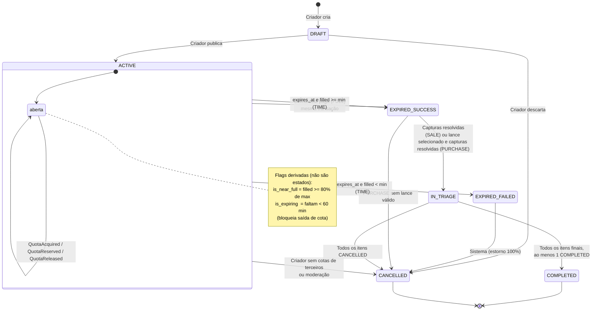
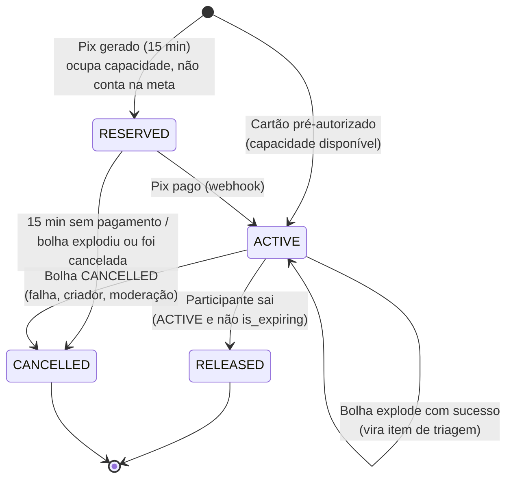
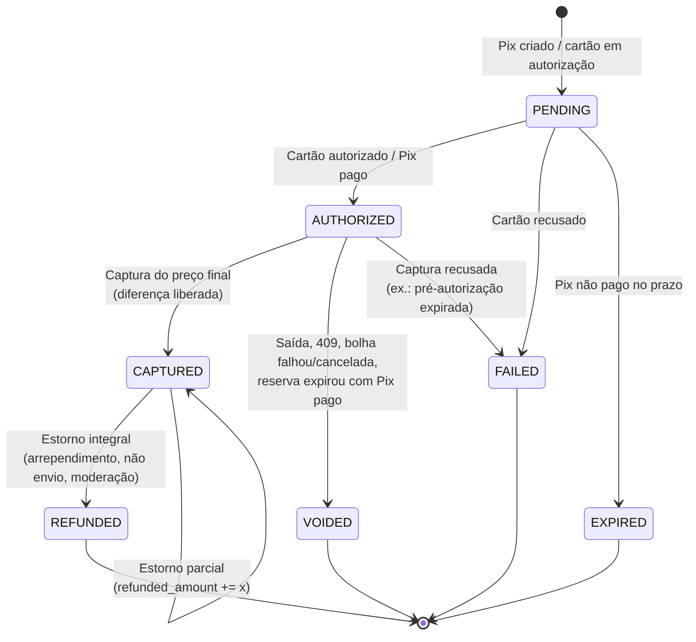
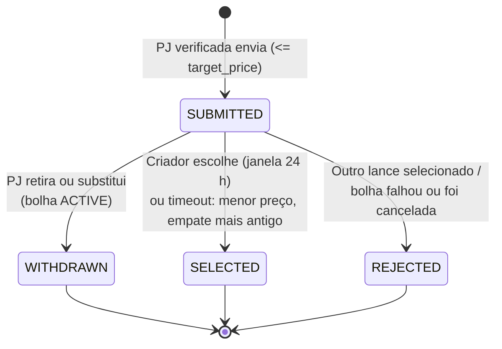
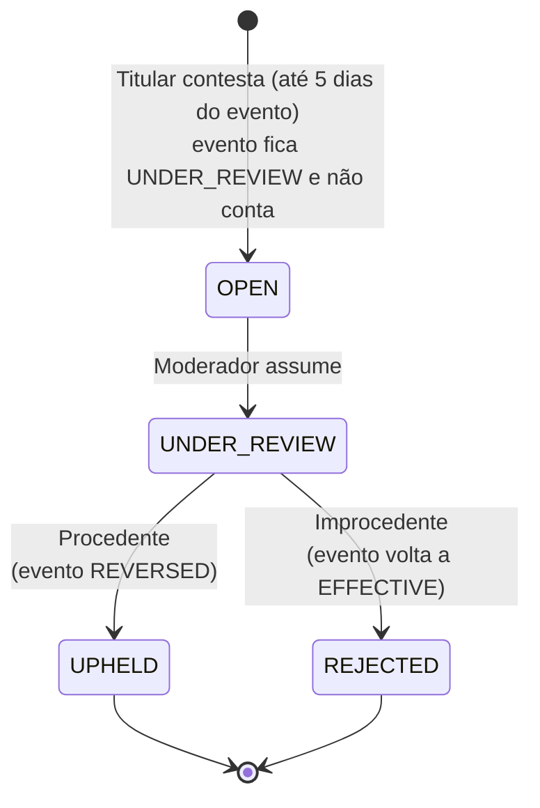
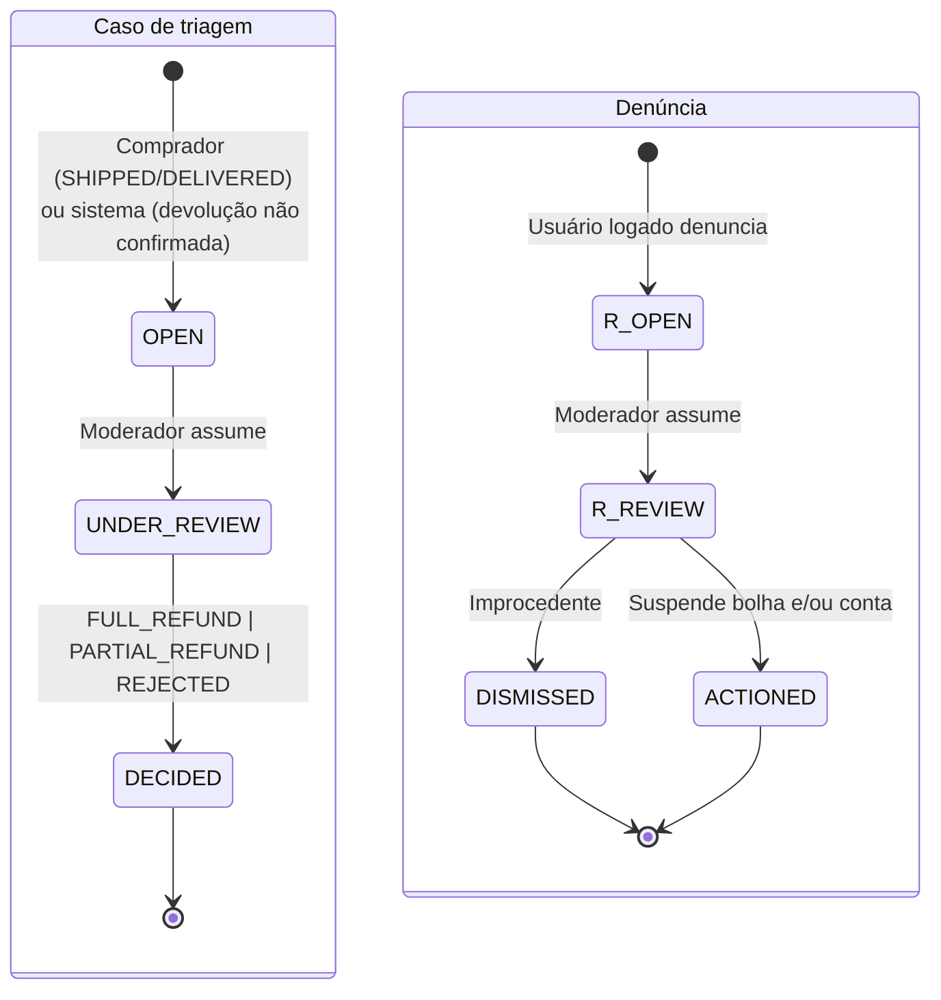

# Máquinas de Estado — Bolha Venda

**Versão:** 1.0 · **Data:** 06/10/2026 · **Status:** Rascunho para revisão
**Base:** [PRD v2.1](../../PRD.MD) · [Spec do Produto](../../SPEC.md) · [ADR-0009](adr/0009-maquina-estados-revisada.md) (proposto)

> Este documento é a referência de implementação das máquinas de estado (`packages/core-domain/*/state-machine.ts`). Ele detalha o PRD v2.1 §8.1 e a Spec F5–F12 e substitui o diagrama de estados do PRD v2.0 e do [003 diagrams/class.md](../../003%20diagrams/class.md) (que tinham `NEAR_FULL`, `EXPIRING` e `EXPIRED` como estados). Em conflito, vale a Spec.

## Sumário

1. [Princípios de implementação](#1-princípios-de-implementação)
2. [Bolha](#2-bolha)
3. [Cota (inclui reserva Pix)](#3-cota)
4. [Pagamento](#4-pagamento)
5. [Lance](#5-lance)
6. [Item de triagem](#6-item-de-triagem)
7. [Contestação de score](#7-contestação-de-score)
8. [Moderação](#8-moderação-caso-de-triagem-denúncia-e-suspensão)
9. [Fontes consultadas (AlterEgo)](#fontes-consultadas-alterego)

---

## 1. Princípios de implementação

1. **Transição = `UPDATE` condicional pelo estado de origem.** Toda transição é `UPDATE <tabela> SET status = :to, ... WHERE id = :id AND status = :from [AND <guarda>]`. Com `rows_affected = 0`, a transição não aconteceu: outro ator chegou antes ou a guarda falhou. Isso torna cada transição **idempotente** e livre de corrida, sem lock explícito (ADR-0002, ADR-0011).
2. **Evento na mesma transação.** Toda transição grava o evento de domínio correspondente em `outbox_events` antes do `COMMIT` ([eventos-dominio.md](eventos-dominio.md)).
3. **Tabela de transições é código.** O domínio expõe `canTransition(from, to, ctx)`. Um teste de propriedade (Vitest + fast-check) percorre todos os pares (from, to) e afirma que só os pares desta página são aceitos.
4. **Flags não são estados.** `is_near_full` (`filled_quotas >= 0,8 × max_quotas`) e `is_expiring` (`expires_at − now() < 1 h`) são calculadas na leitura (API) e no cliente. Nunca são persistidas como `status`.
5. **Tempo de referência:** `now()` do Postgres. Jobs que chegam adiantados (diferença de relógio Redis × Postgres) encontram a guarda `expires_at <= now()` falsa e se reagendam.

Legenda de atores: **Criador**, **Participante** (PF/PJ com cota), **PJ licitante**, **Vendedor** (criador em SALE; PJ vencedora em PURCHASE), **Comprador** (participante na triagem), **Sistema** (worker: job, consumidor ou reconciliador), **Gateway** (webhook do Pagar.me), **Moderador**.

---

## 2. Bolha

### 2.1 Diagrama (D8 / ADR-0009)

### 2.2 Tabela de transições

| # | De | Para | Gatilho | Guarda | Efeitos / eventos | Quem dispara |
| :--- | :--- | :--- | :--- | :--- | :--- | :--- |
| B1 | — | `DRAFT` | `POST /bubbles` | Conta `ACTIVE`; PJ com `cnpj_status = 'ATIVA'`; campos válidos (título 5–80, `max_quotas` 2–10.000, 1 ≤ `min_quotas` ≤ `max_quotas`, duração 1 h–5 dias, `shipping_days` 1–30, degraus 1–10 não crescentes ≥ R$ 1,00) | Persiste rascunho e degraus. Sem evento público | Criador |
| B2 | `DRAFT` | `ACTIVE` | `POST /bubbles/{id}/publish` | Guardas de B1 revalidadas. **SALE:** vendedor com recebedor `APPROVED` no gateway (PF C2C — Spec §2; senão 422 `RECIPIENT_REQUIRED`; recomenda-se exigir também de PJ). Duração: SALE ≤ 5 dias, **PURCHASE ≤ 4 dias** (duração + 24 h de seleção ≤ 5 dias). **PURCHASE:** pagamento do criador para 1 cota autorizado (cartão) ou reservado (Pix) | `starts_at = now()`, `expires_at = now() + duration`, posição `canvas_x/y` atribuída pelo sistema (cluster da categoria), `on_canvas = true`. PURCHASE: cota do criador (`is_creator_quota`). **BubblePublished** (+ `QuotaAcquired`/`QuotaReserved` do criador). Consumidor agenda `bubble-expire` e `bubble-expiring`; convites de fornecedores | Criador |
| B3 | `DRAFT` | `CANCELLED` | `DELETE /bubbles/{id}` (rascunho) | `status = 'DRAFT'` | `cancel_reason = 'CREATOR_DISCARDED'`. **BubbleCancelled** (sem consumidores financeiros) | Criador |
| B4 | `ACTIVE` | `EXPIRED_SUCCESS` (FULL) | Confirmação da cota que completa a capacidade (cartão no request; Pix no webhook) | `filled_quotas + n = max_quotas` (só cotas pagas; reservas não contam) | Na **mesma transação** da cota: `exploded_at`, `explode_reason = 'FULL'`, `final_unit_price` = degrau atingido (SALE). **QuotaAcquired** + **BubbleExploded{SUCCESS, FULL}**. PURCHASE: `bid_selection_deadline = now() + 24 h` | Participante / Gateway |
| B5 | `ACTIVE` | `EXPIRED_SUCCESS` (TIME) | Job `bubble-expire` ou reconciliador | `expires_at <= now()` e `filled_quotas >= min_quotas` | Cotas `RESERVED` → `CANCELLED` (`BUBBLE_EXPLODED_UNPAID`), `reserved_quotas = 0`, `final_unit_price` (SALE), `bid_selection_deadline` (PURCHASE). **BubbleExploded{SUCCESS, TIME}** (+ `QuotaReleased` por reserva cancelada) | Sistema |
| B6 | `ACTIVE` | `EXPIRED_FAILED` | Job `bubble-expire` ou reconciliador | `expires_at <= now()` e `filled_quotas < min_quotas` | Igual a B5 sem preço final. **BubbleExploded{FAILED, TIME}** | Sistema |
| B7 | `ACTIVE` | `CANCELLED` | `POST /bubbles/{id}/cancel` | **Criador:** SALE com `filled_quotas = 0 AND reserved_quotas = 0`; PURCHASE só com a cota do criador (`filled_quotas + reserved_quotas = 1` e a cota é `is_creator_quota`). **Moderação:** sempre, com motivo (inclui a cascata da suspensão da conta do criador, Spec §6) | `cancel_reason = 'CREATOR_CANCELLED' \| 'MODERATION'`, `closed_at`. **BubbleCancelled** → anula/estorna 100% das cotas, rejeita lances, remove jobs | Criador / Moderador |
| B8 | `EXPIRED_FAILED` | `CANCELLED` | Consumidor de `BubbleExploded{FAILED}` | `status = 'EXPIRED_FAILED'` | `cancel_reason = 'GOAL_NOT_MET'`. **BubbleCancelled** → estorno 100% automático | Sistema |
| B9 | `EXPIRED_SUCCESS` | `IN_TRIAGE` | Consumidor de `TriageOpened` (emitido pela triagem quando todas as capturas da bolha foram resolvidas) | Todas as cotas `ACTIVE` têm item de triagem. PURCHASE: `selected_bid_id IS NOT NULL` | Evento WS `bubble.state_changed` | Sistema |
| B10 | `EXPIRED_SUCCESS` | `CANCELLED` | Job `bid-selection-timeout` ou reconciliador | PURCHASE, `now() >= bid_selection_deadline`, nenhum lance `SUBMITTED` válido | `cancel_reason = 'NO_VALID_BID'`. **BubbleCancelled** → estorno 100% | Sistema |
| B11 | `IN_TRIAGE` | `COMPLETED` | Consumidor de `TriageClosed{COMPLETED}` | Todos os itens em `COMPLETED`/`CANCELLED` e ≥ 1 `COMPLETED` | `closed_at`. Evento WS `bubble.state_changed` | Sistema |
| B12 | `IN_TRIAGE` | `CANCELLED` | Consumidor de `TriageClosed{CANCELLED}` | Todos os itens `CANCELLED` | `cancel_reason = 'TRIAGE_ALL_CANCELLED'`. **BubbleCancelled** (sem estornos adicionais: cada item já estornou o seu) | Sistema |

Notas:

- **Moderação após a explosão:** a suspensão por moderação (Spec F12) em bolha `EXPIRED_*`/`IN_TRIAGE` não é uma transição da bolha. O moderador cancela os **itens** (estorno 100% em cada um) e a bolha chega a `CANCELLED` por B12. Isso preserva a máquina canônica.
- **Remoção do canvas:** 24 h após `exploded_at` (ou `closed_at`, se cancelada antes de explodir), um job de manutenção faz `on_canvas = false`. Não é transição de estado.
- **PURCHASE com tudo cheio:** B4 vale também para PURCHASE (a lotação encerra a adesão). O preço final só é definido em `BidSelected`.

---

## 3. Cota

A Spec F5 introduz a reserva Pix de 15 min. A cota é um sub-estado do agregado Bolha (mesmo módulo, mesma transação).

| # | De | Para | Gatilho | Guarda | Efeitos / eventos | Quem |
| :--- | :--- | :--- | :--- | :--- | :--- | :--- |
| Q1 | — | `ACTIVE` | `POST /bubbles/{id}/quotas` (cartão) após `PaymentAuthorized` | Bolha `ACTIVE`, `expires_at > now()`, `filled + reserved + n <= max`; não é o criador (SALE); PF: sem cota `RESERVED`/`ACTIVE` (índice único); PJ: teto `max_pj_share`; PJ verificada | `filled_quotas += n`. **QuotaAcquired** (pode disparar B4) | Participante |
| Q2 | — | `RESERVED` | `POST /bubbles/{id}/quotas` (Pix) | Mesmas de Q1, mais: `expires_at − now() > 5 min`; conta com < 3 reservas abertas e sem `pix_blocked_until` vigente | `reserved_quotas += n`, `reserved_until = least(now()+15 min, expires_at)`. **QuotaReserved** (evento proposto) → job `quota-reservation-expire` | Participante |
| Q3 | `RESERVED` | `ACTIVE` | Webhook `charge.paid` → `ConfirmQuota` | `status = 'RESERVED'` e bolha `ACTIVE` | `reserved_quotas -= n`, `filled_quotas += n`. **QuotaAcquired** (pode disparar B4) | Gateway |
| Q4 | `RESERVED` | `CANCELLED` | Job `quota-reservation-expire` / reconciliador / B5–B7 / suspensão da conta | `reserved_until <= now()` ou bolha saiu de `ACTIVE` | `reserved_quotas -= n`; cobrança Pix cancelada; Pix pago depois → estorno integral. 3ª expiração em 24 h → `pix_blocked_until = now() + 24 h`. **QuotaReleased{reason}**. Sem penalidade de score (Spec F10) | Sistema |
| Q5 | `ACTIVE` | `RELEASED` | `DELETE /bubbles/{id}/quotas/me` | Bolha `ACTIVE`, `expires_at − now() >= 60 min`; não é cota do criador (PURCHASE) | `filled_quotas -= n` (pode baixar o degrau). **QuotaReleased{USER_LEFT}** → anula a pré-autorização / estorna o Pix integralmente | Participante |
| Q6 | `ACTIVE` | `CANCELLED` | Consumidor de `BubbleCancelled` | Bolha `CANCELLED` | Pagamento anulado/estornado (ver §4) | Sistema |
| Q7 | `ACTIVE` | `RELEASED` | Suspensão da conta (§8) | Bolha `ACTIVE` (ignora o bloqueio da última hora) | Como Q5, com `QuotaReleased{ACCOUNT_SUSPENDED}` | Moderador |

---

## 4. Pagamento

`PaymentGatewayPort` unifica cartão e Pix (ADR-0003): **authorize** (cartão: pré-autorização; Pix: cobrança paga), **capture(amount)** (cartão: captura parcial; Pix: estorno parcial da diferença), **void** (cartão: cancelamento da pré-autorização; Pix: estorno integral) e **refund(amount)** (após a captura).

| # | De | Para | Gatilho | Guarda | Efeitos / eventos | Quem |
| :--- | :--- | :--- | :--- | :--- | :--- | :--- |
| P1 | — | `PENDING` | Caso de uso de adesão | `Idempotency-Key` nova | Chamada ao gateway com `idempotency_key` próprio | Participante |
| P2 | `PENDING` | `AUTHORIZED` | Resposta síncrona (cartão) ou webhook `charge.paid` (Pix) + *fetch-back* | Valor = `unit_amount × quantity` | **PaymentAuthorized** | Gateway |
| P3 | `PENDING` | `FAILED` | Recusa do cartão | — | **PaymentFailed{cause: PAYER, stage: AUTHORIZE}** → 402/409 `PAYMENT_DECLINED` | Gateway |
| P4 | `PENDING` | `EXPIRED` | Pix não pago (reserva expirou) | `authorization_expires_at <= now()` | Sem evento de score (Spec §6) | Sistema |
| P5 | `AUTHORIZED` | `CAPTURED` | Consumidor de `BubbleExploded{SUCCESS}` (SALE) ou `BidSelected` (PURCHASE) | Cota `ACTIVE` | `captured_amount = final_unit_price × quantity`; diferença liberada (cartão) ou estornada (Pix, `refunds.reason = 'PRICE_DIFFERENCE'`). **PaymentCaptured** | Sistema |
| P6 | `AUTHORIZED` | `VOIDED` | `QuotaReleased`, `BubbleCancelled`, 409 na transação da cota | — | **PaymentRefunded{kind: VOID}** | Sistema |
| P7 | `AUTHORIZED` | `FAILED` | Captura recusada | — | **PaymentFailed{stage: CAPTURE, cause}** → item `CANCELLED` (`CAPTURE_FAILED`); score do comprador intacto se `cause = AUTH_EXPIRED` (Spec §6) | Gateway |
| P8 | `CAPTURED` | `REFUNDED` / `CAPTURED` | Item cancelado (não envio, devolução, moderação) | `refunded_amount + x <= captured_amount` | **PaymentRefunded{amount, reason}** | Sistema / Moderador |

Chargeback (contestação no emissor) chega por webhook e vai para a moderação. Aberto após `COMPLETED` e julgado improcedente → `CHARGEBACK_REJECTED` (−40) ao comprador (Spec F10).

---

## 5. Lance

| # | De | Para | Gatilho | Guarda | Efeitos / eventos | Quem |
| :--- | :--- | :--- | :--- | :--- | :--- | :--- |
| L1 | — | `SUBMITTED` | `POST /bubbles/{id}/bids` | Bolha PURCHASE `ACTIVE`; licitante PJ `ACTIVE` com CNPJ `ATIVA`; licitante ≠ criador; `unit_price <= target_price` (senão 422 `BID_ABOVE_TARGET`); `Idempotency-Key` | Se a PJ já tem lance `SUBMITTED`: na mesma transação, o anterior vira `WITHDRAWN` (`replaces_bid_id`). **BidSubmitted** (+ **BidWithdrawn** do substituído) → WS `bid.submitted` com pseudônimo | PJ licitante |
| L2 | `SUBMITTED` | `WITHDRAWN` | `DELETE /bubbles/{id}/bids/{bidId}` ou substituição | Bolha `ACTIVE` (após a explosão, o lance é vinculante até a seleção) | **BidWithdrawn** | PJ licitante |
| L3 | `SUBMITTED` | `SELECTED` | `POST /bubbles/{id}/bids/{bidId}/select` | Bolha `EXPIRED_SUCCESS`, `selected_bid_id IS NULL`, `now() < bid_selection_deadline`, ator = criador | `UPDATE bubbles SET selected_bid_id, final_unit_price WHERE status='EXPIRED_SUCCESS' AND selected_bid_id IS NULL` (vence quem chegar primeiro entre criador e timeout). **BidSelected{mode: CREATOR}** | Criador |
| L4 | `SUBMITTED` | `SELECTED` | Job `bid-selection-timeout` / reconciliador | Igual a L3 com `now() >= bid_selection_deadline`; escolhe `ORDER BY unit_price, submitted_at LIMIT 1` entre licitantes ainda com CNPJ `ATIVA` | **BidSelected{mode: AUTO_TIMEOUT}** | Sistema |
| L5 | `SUBMITTED` | `REJECTED` | Consumidor de `BidSelected` ou `BubbleCancelled` | — | Notificação "lance não selecionado" | Sistema |

---

## 6. Item de triagem

Um item por cota `ACTIVE` de bolha que explodiu com sucesso (Spec v1.1 F9). O item nasce **depois** do resultado da captura. "Atrasado" é um **subestado** de `PENDING_SHIPMENT` (flag `is_late`), não um estado novo.

```mermaid
stateDiagram-v2
    [*] --> PENDING_SHIPMENT: PaymentCaptured
    [*] --> CANCELLED: PaymentFailed na captura<br/>(sem penalidade se pré-autorização expirou)

    state PENDING_SHIPMENT {
        [*] --> no_prazo
        no_prazo --> atrasado: shipping_days esgotado<br/>(job triage-deadline)
    }

    PENDING_SHIPMENT --> SHIPPED: Vendedor registra rastreio<br/>no prazo +5 / atrasado −15
    PENDING_SHIPMENT --> CANCELLED: Fim da tolerância (+3 dias)<br/>ou comprador cancela no atraso<br/>(estorno 100%, vendedor −60)
    SHIPPED --> DELIVERED: Comprador confirma<br/>ou auto 7 dias após entrega/prazo estimado
    DELIVERED --> WITHDRAWAL_REQUESTED: Arrependimento<br/>(até 7 dias — CDC art. 49)
    DELIVERED --> COMPLETED: Janela encerrada sem caso aberto<br/>(repasse − 6%; +20 / +30)
    WITHDRAWAL_REQUESTED --> CANCELLED: Vendedor confirma devolução<br/>(estorno, sem penalidade)
    SHIPPED --> CANCELLED: Caso: FULL_REFUND
    DELIVERED --> CANCELLED: Caso: FULL_REFUND
    SHIPPED --> COMPLETED: Caso: PARTIAL_REFUND
    DELIVERED --> COMPLETED: Caso: PARTIAL_REFUND
    WITHDRAWAL_REQUESTED --> CANCELLED: Caso RETURN_NOT_CONFIRMED<br/>decidido FULL_REFUND
    COMPLETED --> [*]
    CANCELLED --> [*]

    note right of SHIPPED
        Caso de triagem aberto (SHIPPED ou DELIVERED,
        até o fim da janela de arrependimento):
        pausa prazos automáticos e repasse.
        REJECTED → retoma os prazos de onde pararam.
    end note
```

| # | De | Para | Gatilho | Guarda | Efeitos / eventos | Quem |
| :--- | :--- | :--- | :--- | :--- | :--- | :--- |
| T1 | — | `PENDING_SHIPMENT` | Consumidor de `PaymentCaptured` | Cota `ACTIVE`, item inexistente (`UNIQUE(quota_id)`) | `captured_at`, `shipping_deadline = captured_at + shipping_days`, `shipping_grace_deadline = shipping_deadline + 3 dias`; nome e endereço liberados às partes. Jobs `triage-deadline` (`shipping`, aviso T−24 h). Sem evento próprio (notificações saem de `PaymentCaptured`); quando o último item da bolha é criado, **TriageOpened** (B9) | Sistema |
| T2 | — | `CANCELLED` | Consumidor de `PaymentFailed{stage: CAPTURE}` | — | `cancel_reason = 'CAPTURE_FAILED'`, `cancel_fault = 'NONE'` (sem penalidade, Spec F10). **TriageItemCancelled** | Sistema |
| T3 | `PENDING_SHIPMENT` (no prazo) | `PENDING_SHIPMENT` (atrasado) | Job `triage-deadline:shipping` / reconciliador | `now() > shipping_deadline`, sem envio | `is_late = true`, `late_since`; aviso ao comprador ("pode cancelar com estorno 100%"); job `triage-shipping-grace` em `shipping_grace_deadline` | Sistema |
| T4 | `PENDING_SHIPMENT` | `SHIPPED` | `POST /triage/items/{id}/shipment` | Ator = vendedor; `now() <= shipping_grace_deadline` | `shipments` criado; `auto_confirm_at` = entrega rastreada/estimada + 7 dias. **ShipmentRegistered{on_time}** → score `SHIPPED_ON_TIME` (+5) se não atrasado, senão `SHIPPING_LATE` (−15) e `shipped_late = true` | Vendedor |
| T5 | `PENDING_SHIPMENT` (atrasado) | `CANCELLED` | Job `triage-shipping-grace` / reconciliador | `now() > shipping_grace_deadline`, sem envio | `cancel_reason = 'SHIPPING_TIMEOUT'`, `cancel_fault = 'SELLER'`. **TriageItemCancelled** → estorno 100% + `CANCELLED_BY_FAULT` (−60) | Sistema |
| T6 | `PENDING_SHIPMENT` (atrasado) | `CANCELLED` | `POST /triage/items/{id}/cancel` | Ator = comprador; `is_late = true` | `cancel_reason = 'BUYER_CANCELLED_LATE'`, `cancel_fault = 'SELLER'`. Mesmos efeitos de T5 | Comprador |
| T7 | `SHIPPED` | `DELIVERED` | `POST /triage/items/{id}/delivery-confirmation` ou job `triage-deadline:auto-confirm` | Comprador; ou `now() >= auto_confirm_at` e sem caso aberto | `delivered_at`, `delivery_confirmation`, `withdrawal_deadline = delivered_at + 7 dias`. **DeliveryConfirmed** | Comprador / Sistema |
| T8 | `DELIVERED` | `WITHDRAWAL_REQUESTED` | `POST /triage/items/{id}/withdrawal` | Comprador; `now() <= withdrawal_deadline` | `return_deadline = now() + 10 dias`. **WithdrawalRequested** (sem penalidade) | Comprador |
| T9 | `DELIVERED` | `COMPLETED` | Job `triage-deadline:withdrawal-end` / reconciliador | `now() > withdrawal_deadline` e `payout_on_hold = false` | `final_amount = amount`. **TriageItemCompleted** → repasse com taxa de 6% retida (**PayoutReleased**), +20 comprador / +30 vendedor | Sistema |
| T10 | `WITHDRAWAL_REQUESTED` | `CANCELLED` | Vendedor confirma a devolução | Ator = vendedor | `return_confirmed_at`, `cancel_reason = 'WITHDRAWAL'`, `cancel_fault = 'NONE'`. **TriageItemCancelled** → estorno integral | Vendedor |
| T11 | `WITHDRAWAL_REQUESTED` | (caso aberto) | Job `triage-deadline:return` | `now() > return_deadline` | Abre `triage_cases(reason_code = 'RETURN_NOT_CONFIRMED')` → moderação decide (Spec F9) | Sistema |
| T12 | `SHIPPED` / `DELIVERED` | (caso aberto) | `POST /triage/items/{id}/cases` | Comprador; `now() <= withdrawal_deadline` (ou sem `withdrawal_deadline` ainda, em `SHIPPED`); sem caso aberto | `payout_on_hold = true`, `deadlines_paused_at = now()`, `paused_remaining` = tempo até o próximo prazo; jobs de prazo removidos. **TriageCaseOpened** | Comprador |
| T13 | `SHIPPED` / `DELIVERED` / `WITHDRAWAL_REQUESTED` | `CANCELLED` | Decisão `FULL_REFUND` | Caso `DECIDED` | `cancel_reason = 'CASE_FULL_REFUND'`. **TriageItemCancelled** → estorno integral; `TRIAGE_CASE_UPHELD` (−30) se procedente contra o vendedor | Moderador |
| T14 | `SHIPPED` / `DELIVERED` | `COMPLETED` | Decisão `PARTIAL_REFUND` | Caso `DECIDED`, `refund_amount < amount` | Estorno parcial; `final_amount = amount − refund_amount` (base da taxa de 6% e do repasse). **TriageItemCompleted**, `TRIAGE_CASE_UPHELD` (−30) ao vendedor | Moderador |
| T15 | (caso aberto) | mesmo estado | Decisão `REJECTED` | Caso `DECIDED` | `payout_on_hold = false`; prazos retomados com `paused_remaining` (novos jobs) | Moderador |

**Fechamento da triagem:** após cada `TriageItemCompleted`/`TriageItemCancelled`, o consumidor `triage.close-check` avalia se todos os itens da bolha estão finais e emite **TriageClosed{outcome}** (B11/B12).

**Suspensão do vendedor** (Spec §6): itens em andamento seguem o fluxo, mas com `payout_on_hold = true` até a revisão da moderação. T9 só ocorre após a liberação.

---

## 7. Contestação de score

| # | De | Para | Gatilho | Guarda | Efeitos / eventos | Quem |
| :--- | :--- | :--- | :--- | :--- | :--- | :--- |
| D1 | — | `OPEN` | `POST /score-events/{id}/disputes` | Ator = titular do evento; `now() <= dispute_deadline` (evento + 5 dias); sem contestação aberta (índice único); evento `EFFECTIVE` | `score_events.status = 'UNDER_REVIEW'` e recálculo do score sem o evento. **ScoreDisputeOpened**, **ScoreChanged** | Titular |
| D2 | `OPEN` | `UNDER_REVIEW` | Moderador abre o caso | Papel `MODERATOR` | Auditoria | Moderador |
| D3 | `UNDER_REVIEW` | `UPHELD` | Decisão | `decision_notes` obrigatório | `score_events.status = 'REVERSED'` (o evento deixa de contar de vez). **ScoreDisputeResolved{UPHELD}**, **ScoreChanged** | Moderador |
| D4 | `UNDER_REVIEW` | `REJECTED` | Decisão | `decision_notes` obrigatório | `score_events.status = 'EFFECTIVE'` e recálculo. **ScoreDisputeResolved{REJECTED}**, **ScoreChanged** | Moderador |

SLA de decisão: 5 dias úteis (Spec F10). Um job diário alerta a moderação sobre contestações próximas do SLA. O SLA não gera transição automática.

---

## 8. Moderação: caso de triagem, denúncia e suspensão

O módulo **moderation** concentra as decisões humanas: casos de triagem (`triage_cases`), denúncias (`reports`), suspensões (`account_suspensions`) e o julgamento das contestações de score (que grava em `score_disputes` pela fachada de reputation). Toda decisão exige motivo e gera registro em `audit_log` (append-only, sem `UPDATE`/`DELETE` para o papel da aplicação).

| Objeto | De | Para | Guarda | Efeitos / eventos | Quem |
| :--- | :--- | :--- | :--- | :--- | :--- |
| Caso de triagem | — | `OPEN` | T11/T12 | `payout_on_hold`, prazos pausados. **TriageCaseOpened** *(proposto)* | Comprador / Sistema |
| Caso de triagem | `OPEN` | `UNDER_REVIEW` | Papel `MODERATOR` | Auditoria | Moderador |
| Caso de triagem | `UNDER_REVIEW` | `DECIDED` | `decision_notes` obrigatório; `PARTIAL_REFUND` exige `refund_amount` | T13/T14/T15. **TriageCaseDecided** *(proposto)* | Moderador |
| Denúncia | `OPEN` | `UNDER_REVIEW` → `DISMISSED` \| `ACTIONED` | Motivo obrigatório | `ACTIONED` + `SUSPEND_BUBBLE` → B7 (moderação, estorno 100%) se `ACTIVE`; após a explosão, cancela os itens (T13). `SUSPEND_ACCOUNT` → suspensão abaixo | Moderador |
| Conta | `ACTIVE` | `SUSPENDED` | Motivo obrigatório | `account_suspensions`; bolhas `ACTIVE` criadas pela conta → `CANCELLED` (B7, estorno 100%); cotas `RESERVED`/`ACTIVE` da conta em bolhas `ACTIVE` → liberadas (`QuotaReleased{ACCOUNT_SUSPENDED}`); itens em que é vendedora → `payout_on_hold`. **AccountSuspended** *(proposto)* | Moderador |
| Contestação de score | ver §7 | | Julgador ≠ moderador que decidiu o caso de origem (Spec F10) | §7 | Moderador |

---

## Fontes consultadas (AlterEgo)

- **asias-postgresql** — *PostgreSQL 17 Docs* §13.2 "Transaction Isolation": em Read Committed, um `UPDATE` que encontra a linha alterada por transação concorrente espera o commit e **reavalia o `WHERE`** sobre a versão nova. Por isso as transições "`UPDATE … WHERE status = :from`" são seguras sem lock explícito (princípio 1).
- **arquitetura-ddd** — *DDD by Examples: Library*: agregados se comunicam por eventos; consistência imediata dentro do agregado (bolha + cotas) e eventual entre agregados (pagamento, triagem, reputação).
- **asias-arquitetura-hexagonal** — *Skill* (Cockburn / R. C. Martin): máquina de estados no domínio puro (`packages/core-domain`), testável sem infraestrutura.
