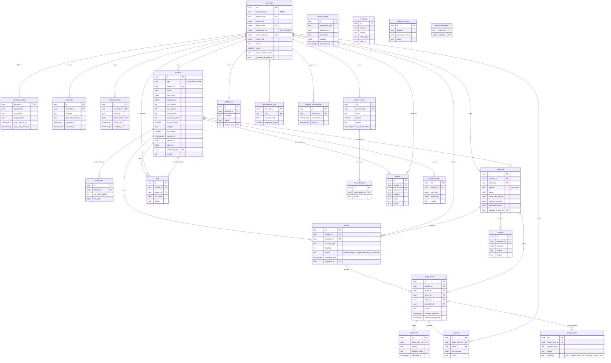

# Modelo de Dados — Bolha Venda

**Versão:** 1.0 · **Data:** 06/10/2026 · **Status:** Rascunho para revisão
**Base:** [PRD v2.1](../../PRD.MD) · [Spec do Produto](../../SPEC.md) · [C4](c4.md) · [Máquinas de estado](maquina-estados.md) · [Eventos](eventos-dominio.md)

> Este modelo substitui o diagrama de classes de [003 diagrams/class.md](../../003%20diagrams/class.md) e a lista de tabelas de [tecnologias.md](../tecnologias.md) (`users`, `companies`, `triages`, `scores`). Diferenças relevantes: dinheiro em `bigint` centavos (não `Float`), `filled_quotas`/`max_quotas` (não `current_quotas`/`totalQuotas`), `account_type` PF/PJ em `accounts` + `company_profiles` (não herança `Company extends User`), triagem **por participante** (`triage_items`), e não um registro por bolha.

## Sumário

1. [Convenções](#1-convenções)
2. [ERD](#2-erd)
3. [DDL PostgreSQL 16](#3-ddl-postgresql-16)
4. [Consultas críticas e índices](#4-consultas-críticas-e-índices)
5. [Política de retenção](#5-política-de-retenção)
6. [Estratégia de migrations](#6-estratégia-de-migrations)
7. [Fontes consultadas (AlterEgo)](#fontes-consultadas-alterego)

---

## 1. Convenções

| Tema | Regra |
| :--- | :--- |
| Chave primária | `uuid`, **UUID v7** gerado na aplicação (ordenável no tempo; o PG 16 não tem `uuidv7()` nativo) |
| Dinheiro | `bigint` em centavos; moeda `char(3)` com padrão `'BRL'` |
| Tempo | `timestamptz` em UTC; `now()` do banco é o relógio de referência para prazos |
| Enumerações | `text` + `CHECK (... IN (...))` em vez de `CREATE TYPE ... AS ENUM`: adicionar um valor vira uma migration de `CHECK`, sem `ALTER TYPE` fora de transação |
| PII | Coluna `*_enc bytea` (AES-256-GCM: `nonce‖ciphertext‖tag`, com DEK por registro protegida por KEK no KMS) + `*_hash bytea` (HMAC-SHA256 com *pepper* do secret manager) para busca e unicidade. Ver ADR-0012 |
| Concorrência otimista | `version int` nos agregados com edição concorrente (`bubbles`, `payments`, `triage_items`) |
| Nomes | `snake_case`, tabelas no plural, FKs `<entidade>_id` |
| Propriedade | Cada tabela pertence a um módulo ([c4.md §4.3](c4.md#43-regras-de-dependência-entre-módulos-verificadas-em-ci)) |

Tabelas **além da lista canônica**, propostas aqui:

| Tabela / coluna | Por quê |
| :--- | :--- |
| `idempotency_keys` | Persistência do `Idempotency-Key` (24 h) |
| `processed_events` | Idempotência dos consumidores do outbox |
| `reports`, `triage_cases`, `account_suspensions` | Módulo **moderation**: denúncias de bolha, casos de triagem (Spec F9) e suspensões de conta (Spec F12, §6) |
| `accounts.pix_blocked_until` | Anti-abuso de Pix (Spec F5): 3 reservas expiradas em 24 h bloqueiam Pix por 24 h |
| `supplier_invites` | Fornecedores sugeridos na bolha de compra (Spec F4, até 5) |
| `bubbles.reserved_quotas` | Reservas Pix de 15 min (Spec F5): ocupam capacidade, mas **não** contam para a meta nem para a lotação |
| `bubbles.category`, `image_urls`, `on_canvas` | Filtros e posição por categoria (F2), até 5 imagens (F3), visibilidade no canvas por 24 h após encerrar (F2) |

`sessions/refresh_tokens` foi materializada como uma única tabela, `refresh_tokens`.

### 1.1 Decisão: reserva Pix (`RESERVED`) × `filled_quotas`

Implementação da Spec v1.1 (F5, §5, §6): a cota Pix fica **reservada** por `min(15 min, tempo restante)` (sem Pix nos últimos 5 min), ocupa capacidade, não conta para meta nem preço, e volta a ficar livre se o Pix não for pago. Anti-abuso: até 3 reservas abertas por conta; 3 expiradas em 24 h → Pix bloqueado por 24 h (`accounts.pix_blocked_until`).

| Contador | Inclui | Usado para |
| :--- | :--- | :--- |
| `filled_quotas` | Só cotas `ACTIVE` (cartão autorizado ou Pix pago) | Meta mínima, degrau de preço, lotação (`filled_quotas = max_quotas` → explosão `FULL`), `NEAR_FULL` |
| `reserved_quotas` | Cotas `RESERVED` (Pix aguardando pagamento, `reserved_until = least(now() + 15 min, expires_at)`) | **Só** para capacidade: `filled_quotas + reserved_quotas + n <= max_quotas` |

Consequências:

- Não há overbooking: quem gera um QR Pix tem a vaga garantida durante o prazo. Com as últimas vagas só reservadas, novas entradas recebem `QUOTA_SOLD_OUT` ("N reservas aguardando pagamento").
- A explosão por lotação só acontece quando **todas** as vagas estão pagas. Uma bolha com `filled + reserved = max` continua `ACTIVE` até o Pix ser pago (então explode `FULL`) ou a reserva expirar (a vaga volta).
- Na explosão por tempo, reservas pendentes são canceladas (`quotas.status = 'CANCELLED'`, `reserved_quotas` zerado) e a cobrança Pix é cancelada. Se o Pix for pago depois disso, há estorno integral automático (`refunds.reason = 'LATE_PAYMENT'`).
- Isso **altera o SQL canônico do ADR-0002** (o canônico usa `filled_quotas + :n <= max_quotas`) e o predicado do índice único PF (que passa a cobrir `RESERVED` e `ACTIVE`). Ver ADR-0002.

---

## 2. ERD



---

## 3. DDL PostgreSQL 16

> Arquivo-fonte previsto: `003-project/packages/database/migrations/0001_init/migration.sql`. O schema Prisma espelha este DDL. Índices parciais, GiST e `CHECK`s são mantidos em SQL cru nas migrations (o Prisma não os modela por completo).

### 3.1 Identidade

```sql
-- ============================================================
-- identity
-- ============================================================
CREATE TABLE accounts (
    id                   uuid        PRIMARY KEY,
    account_type         text        NOT NULL CHECK (account_type IN ('PF','PJ')),
    pseudonym            text        NOT NULL,                       -- ex.: 'Bolhista#4F2A'
    email_enc            bytea       NOT NULL,
    email_hash           bytea       NOT NULL,                       -- HMAC-SHA256(lower(trim(email)))
    document_enc         bytea       NOT NULL,                       -- CPF (PF) ou CNPJ (PJ), só dígitos
    document_hash        bytea       NOT NULL,                       -- HMAC-SHA256(dígitos)
    name_enc             bytea       NOT NULL,                       -- nome civil / razão social do responsável
    phone_enc            bytea,
    password_hash        text,                                       -- argon2id; NULL se só OAuth
    oauth_provider       text        CHECK (oauth_provider IN ('GOOGLE')),
    oauth_subject_hash   bytea,
    pii_data_key         bytea       NOT NULL,                       -- DEK da conta cifrada pela KEK (0x01‖len‖kekId‖DEK cifrada) — BV-107/BV-109
    pii_key_version      smallint    NOT NULL DEFAULT 1,             -- versão do pepper do HMAC de busca (*_hash)
    pix_blocked_until    timestamptz,                                -- anti-abuso de Pix (Spec F5)
    status               text        NOT NULL DEFAULT 'PENDING_VERIFICATION'
                         CHECK (status IN ('PENDING_VERIFICATION','ACTIVE','SUSPENDED','DELETED')),
    role                 text        NOT NULL DEFAULT 'USER'
                         CHECK (role IN ('USER','MODERATOR','ADMIN')),
    score                smallint    NOT NULL DEFAULT 500 CHECK (score BETWEEN 0 AND 1000),
    score_model_version  text        NOT NULL DEFAULT 'v1',
    score_updated_at     timestamptz,
    gateway_recipient_id text,                                       -- recebedor Pagar.me (quem vende)
    gateway_recipient_status text CHECK (gateway_recipient_status IN ('PENDING','APPROVED','REJECTED')),
                                                                     -- PF C2C só publica bolha de venda com APPROVED (Spec §2)
    created_at           timestamptz NOT NULL DEFAULT now(),
    updated_at           timestamptz NOT NULL DEFAULT now(),
    deleted_at           timestamptz,
    CONSTRAINT accounts_pseudonym_uk     UNIQUE (pseudonym),
    CONSTRAINT accounts_email_hash_uk    UNIQUE (email_hash),
    CONSTRAINT accounts_document_hash_uk UNIQUE (document_hash),
    CONSTRAINT accounts_auth_ck CHECK (password_hash IS NOT NULL OR oauth_subject_hash IS NOT NULL)
);
CREATE UNIQUE INDEX accounts_oauth_uk ON accounts (oauth_provider, oauth_subject_hash)
    WHERE oauth_subject_hash IS NOT NULL;

CREATE TABLE company_profiles (
    account_id          uuid        PRIMARY KEY REFERENCES accounts(id) ON DELETE RESTRICT,
    legal_name          text,                                        -- razão social (dado público de PJ); NULL até verificar
    trade_name          text,
    cnae_principal      text,
    cnpj_status         text        NOT NULL DEFAULT 'DESCONHECIDA'
                        CHECK (cnpj_status IN ('ATIVA','SUSPENSA','INAPTA','BAIXADA','NULA','DESCONHECIDA')),
    cnpj_provider       text        CHECK (cnpj_provider IN ('BRASILAPI','RECEITAWS')),
    cnpj_checked_at     timestamptz,
    cnpj_next_check_at  timestamptz,                                 -- checked_at + 30 dias (ADR-0008)
    -- Provedor indisponível no cadastro → accounts.status = 'PENDING_VERIFICATION';
    -- nova tentativa a cada 15 min por 24 h (Spec F1)
    verification_attempts smallint  NOT NULL DEFAULT 0,
    verification_retry_until timestamptz,                            -- created_at + 24 h
    next_retry_at       timestamptz,
    updated_at          timestamptz NOT NULL DEFAULT now(),
    CONSTRAINT company_profiles_verified_ck CHECK (cnpj_status = 'DESCONHECIDA'
        OR (cnpj_provider IS NOT NULL AND cnpj_checked_at IS NOT NULL AND cnpj_next_check_at IS NOT NULL))
);
CREATE INDEX company_profiles_next_check_ix ON company_profiles (cnpj_next_check_at);
CREATE INDEX company_profiles_retry_ix ON company_profiles (next_retry_at) WHERE cnpj_status = 'DESCONHECIDA';
-- Regra de uso (caso de uso, não CHECK): PJ só cria bolha, adere ou dá lance com
-- accounts.status = 'ACTIVE' AND company_profiles.cnpj_status = 'ATIVA'.

CREATE TABLE consents (
    id                uuid        PRIMARY KEY,
    account_id        uuid        NOT NULL REFERENCES accounts(id),
    purpose           text        NOT NULL CHECK (purpose IN ('TERMS_OF_USE','PRIVACY_POLICY','MARKETING_EMAIL')),
    document_version  text        NOT NULL,                          -- ex.: 'termos-2026-10'
    granted_at        timestamptz NOT NULL DEFAULT now(),
    revoked_at        timestamptz,
    ip_hash           bytea,
    user_agent        text
);
CREATE UNIQUE INDEX consents_active_uk ON consents (account_id, purpose) WHERE revoked_at IS NULL;

CREATE TABLE refresh_tokens (
    id            uuid        PRIMARY KEY,
    account_id    uuid        NOT NULL REFERENCES accounts(id),
    family_id     uuid        NOT NULL,                              -- revogação em cascata ao detectar reuso
    token_hash    bytea       NOT NULL UNIQUE,                       -- SHA-256 do token opaco
    issued_at     timestamptz NOT NULL DEFAULT now(),
    expires_at    timestamptz NOT NULL,                              -- issued_at + 30 dias
    rotated_at    timestamptz,
    replaced_by   uuid        REFERENCES refresh_tokens(id),
    revoked_at    timestamptz,
    ip_hash       bytea,
    user_agent    text,
    CHECK (expires_at > issued_at)
);
CREATE INDEX refresh_tokens_family_ix ON refresh_tokens (family_id);
CREATE INDEX refresh_tokens_expires_ix ON refresh_tokens (expires_at);
```

### 3.2 Bolhas, degraus e cotas

```sql
-- ============================================================
-- bubble
-- ============================================================
CREATE TABLE bubbles (
    id                      uuid        PRIMARY KEY,
    type                    text        NOT NULL CHECK (type IN ('SALE','PURCHASE')),
    creator_id              uuid        NOT NULL REFERENCES accounts(id),
    title                   text        NOT NULL CHECK (char_length(title) BETWEEN 5 AND 80),
    description             text        NOT NULL CHECK (char_length(description) <= 2000),
    category                text        NOT NULL,                                 -- taxonomia fechada (Termos de Uso)
    image_url               text,                                                 -- capa (= image_urls[1])
    image_urls              text[]      NOT NULL DEFAULT '{}' CHECK (cardinality(image_urls) <= 5),
    status                  text        NOT NULL DEFAULT 'DRAFT'
                            CHECK (status IN ('DRAFT','ACTIVE','EXPIRED_SUCCESS','EXPIRED_FAILED',
                                              'IN_TRIAGE','COMPLETED','CANCELLED')),
    currency                char(3)     NOT NULL DEFAULT 'BRL',
    initial_price           bigint      NOT NULL CHECK (initial_price >= 100),    -- centavos; = degrau 0; mín. R$ 1,00
    target_price            bigint      NOT NULL CHECK (target_price >= 100),     -- venda: último degrau; compra: preço máximo
    final_unit_price        bigint      CHECK (final_unit_price >= 100),          -- preço único na explosão (SALE) ou do lance (PURCHASE)
    min_quotas              int         NOT NULL CHECK (min_quotas >= 1),
    max_quotas              int         NOT NULL CHECK (max_quotas BETWEEN 2 AND 10000),
    filled_quotas           int         NOT NULL DEFAULT 0,                       -- só cotas ACTIVE (pagas/autorizadas)
    reserved_quotas         int         NOT NULL DEFAULT 0,                       -- reservas Pix de 15 min (RESERVED)
    max_pj_share            smallint    NOT NULL DEFAULT 50 CHECK (max_pj_share BETWEEN 10 AND 100), -- % de max_quotas
    shipping_days           smallint    NOT NULL DEFAULT 7 CHECK (shipping_days BETWEEN 1 AND 30),
    duration                interval    NOT NULL,                                 -- escolhido no DRAFT (implementado como duration_minutes integer 60..7200 — BV-107, Prisma não suporta interval)
    starts_at               timestamptz,                                          -- definido na publicação
    expires_at              timestamptz,
    exploded_at             timestamptz,
    explode_reason          text        CHECK (explode_reason IN ('TIME','FULL')),
    bid_selection_deadline  timestamptz,                                          -- exploded_at + 24 h (PURCHASE)
    selected_bid_id         uuid,                                                 -- FK adicionada após criar bids
    cancel_reason           text        CHECK (cancel_reason IN ('CREATOR_DISCARDED','CREATOR_CANCELLED',
                                              'MODERATION','GOAL_NOT_MET','NO_VALID_BID','TRIAGE_ALL_CANCELLED')),
    closed_at               timestamptz,                                          -- entrada em COMPLETED/CANCELLED
    canvas_x                double precision,                                     -- definido pelo sistema na publicação (Spec F2)
    canvas_y                double precision,
    on_canvas               boolean     NOT NULL DEFAULT false,                   -- true ao publicar; false 24 h após explodir/cancelar
    version                 int         NOT NULL DEFAULT 0,
    created_at              timestamptz NOT NULL DEFAULT now(),
    updated_at              timestamptz NOT NULL DEFAULT now(),

    -- Invariantes de contagem (o CHECK é a última linha de defesa contra overbooking)
    CONSTRAINT bubbles_quotas_ck         CHECK (min_quotas <= max_quotas),
    CONSTRAINT bubbles_filled_ck         CHECK (filled_quotas BETWEEN 0 AND max_quotas),
    CONSTRAINT bubbles_reserved_ck       CHECK (reserved_quotas >= 0 AND filled_quotas + reserved_quotas <= max_quotas),
    CONSTRAINT bubbles_reserved_state_ck CHECK (reserved_quotas = 0 OR status = 'ACTIVE'),
    CONSTRAINT bubbles_price_order_ck    CHECK (target_price <= initial_price),
    -- PURCHASE: o participante autoriza até target_price; não há curva de degraus
    CONSTRAINT bubbles_purchase_price_ck CHECK (type = 'SALE' OR initial_price = target_price),
    CONSTRAINT bubbles_duration_ck       CHECK (duration BETWEEN interval '1 hour' AND interval '5 days'),
    -- Compra: máx. 4 dias, para que duração + 24 h de seleção de lance <= 5 dias de validade da pré-autorização
    CONSTRAINT bubbles_purchase_duration_ck CHECK (type = 'SALE' OR duration <= interval '4 days'),
    CONSTRAINT bubbles_window_ck         CHECK (
        (starts_at IS NULL AND expires_at IS NULL AND status IN ('DRAFT','CANCELLED'))   -- rascunho ou rascunho descartado
        OR (starts_at IS NOT NULL AND expires_at = starts_at + duration)),
    CONSTRAINT bubbles_canvas_ck         CHECK (starts_at IS NULL OR (canvas_x IS NOT NULL AND canvas_y IS NOT NULL)),
    CONSTRAINT bubbles_exploded_ck       CHECK (
        (status IN ('EXPIRED_SUCCESS','EXPIRED_FAILED','IN_TRIAGE','COMPLETED') AND exploded_at IS NOT NULL
             AND explode_reason IS NOT NULL)
        OR status IN ('DRAFT','ACTIVE','CANCELLED')),
    CONSTRAINT bubbles_full_ck           CHECK (explode_reason IS DISTINCT FROM 'FULL' OR filled_quotas = max_quotas),
    CONSTRAINT bubbles_selected_bid_ck   CHECK (selected_bid_id IS NULL OR type = 'PURCHASE')
);

-- Canvas: consulta por bbox (ver §4.2). Só bolhas visíveis (ACTIVE + encerradas há < 24 h) entram no índice.
CREATE INDEX bubbles_canvas_gist_ix ON bubbles
    USING gist (point(canvas_x, canvas_y))
    WHERE on_canvas;
-- Alternativa B-tree (linha de base do benchmark): faixa em x + filtro em y
CREATE INDEX bubbles_canvas_btree_ix ON bubbles (canvas_x, canvas_y) WHERE on_canvas;
-- Reconciliador: ativas vencidas
CREATE INDEX bubbles_active_expires_ix ON bubbles (expires_at) WHERE status = 'ACTIVE';
-- Seleção de lance pendente
CREATE INDEX bubbles_bid_window_ix ON bubbles (bid_selection_deadline)
    WHERE status = 'EXPIRED_SUCCESS' AND type = 'PURCHASE' AND selected_bid_id IS NULL;
-- Job que tira do canvas as encerradas há mais de 24 h
CREATE INDEX bubbles_canvas_cleanup_ix ON bubbles ((coalesce(exploded_at, closed_at)))
    WHERE on_canvas AND status <> 'ACTIVE';
CREATE INDEX bubbles_creator_ix ON bubbles (creator_id, created_at DESC);

CREATE TABLE price_tiers (
    id                 uuid    PRIMARY KEY,
    bubble_id          uuid    NOT NULL REFERENCES bubbles(id) ON DELETE CASCADE,
    min_filled_quotas  int     NOT NULL CHECK (min_filled_quotas >= 0),
    unit_price         bigint  NOT NULL CHECK (unit_price >= 100),
    CONSTRAINT price_tiers_uk UNIQUE (bubble_id, min_filled_quotas)
);
-- Validado no DOMÍNIO (PriceCurve), não em CHECK (envolve várias linhas):
--   • só bolhas SALE têm degraus; PURCHASE não tem linhas aqui
--   • existe degrau com min_filled_quotas = 0 e unit_price = bubbles.initial_price
--   • o último degrau tem unit_price = bubbles.target_price e min_filled_quotas <= max_quotas
--   • limites de cotas estritamente crescentes e unit_price não crescente
--   • 1 a 10 degraus; degraus imutáveis após DRAFT → ACTIVE (oferta vinculante, CDC art. 30)

CREATE TABLE quotas (
    id               uuid        PRIMARY KEY,
    bubble_id        uuid        NOT NULL REFERENCES bubbles(id),
    account_id       uuid        NOT NULL REFERENCES accounts(id),
    account_type     text        NOT NULL CHECK (account_type IN ('PF','PJ')),  -- desnormalizado p/ índice parcial
    quantity         int         NOT NULL CHECK (quantity > 0),
    status           text        NOT NULL
                     CHECK (status IN ('RESERVED','ACTIVE','RELEASED','CANCELLED')),
    is_creator_quota boolean     NOT NULL DEFAULT false,                          -- cota automática do criador (PURCHASE)
    payment_id       uuid        NOT NULL,                                       -- FK após criar payments
    reserved_until   timestamptz,                                                -- Pix: criação + 15 min
    acquired_at      timestamptz,                                                -- entrada em ACTIVE
    released_at      timestamptz,
    cancel_reason    text        CHECK (cancel_reason IN ('RESERVATION_EXPIRED','BUBBLE_EXPLODED_UNPAID',
                                                         'BUBBLE_CANCELLED','GOAL_NOT_MET','ACCOUNT_SUSPENDED')),
    cancelled_at     timestamptz,
    created_at       timestamptz NOT NULL DEFAULT now(),
    CONSTRAINT quotas_pf_single_ck CHECK (account_type = 'PJ' OR quantity = 1),
    CONSTRAINT quotas_reserved_ck  CHECK (status <> 'RESERVED' OR (reserved_until IS NOT NULL AND acquired_at IS NULL)),
    CONSTRAINT quotas_active_ck    CHECK (status <> 'ACTIVE' OR acquired_at IS NOT NULL),
    CONSTRAINT quotas_released_ck  CHECK ((status = 'RELEASED') = (released_at IS NOT NULL))
);
-- ADR-0002: PF no máximo 1 cota (reservada ou ativa) por bolha, garantido pelo banco, inclusive sob concorrência.
-- Diferença em relação ao fato canônico (status = 'ACTIVE'): RESERVED entra no predicado por causa da reserva Pix.
CREATE UNIQUE INDEX quotas_pf_one_per_bubble_uk ON quotas (bubble_id, account_id)
    WHERE account_type = 'PF' AND status IN ('RESERVED','ACTIVE');
CREATE UNIQUE INDEX quotas_payment_uk ON quotas (payment_id);
CREATE INDEX quotas_bubble_live_ix ON quotas (bubble_id) INCLUDE (account_id, quantity)
    WHERE status IN ('RESERVED','ACTIVE');
CREATE INDEX quotas_reserved_expiry_ix ON quotas (reserved_until) WHERE status = 'RESERVED';
-- Anti-abuso de Pix: reservas abertas (máx. 3) e expiradas nas últimas 24 h (3 → accounts.pix_blocked_until = now() + 24 h)
CREATE INDEX quotas_account_reserved_ix ON quotas (account_id) WHERE status = 'RESERVED';
CREATE INDEX quotas_account_expired_ix ON quotas (account_id, cancelled_at) WHERE cancel_reason = 'RESERVATION_EXPIRED';
CREATE INDEX quotas_account_ix ON quotas (account_id, created_at DESC);
-- Regras de caso de uso (não expressáveis em CHECK simples):
--   • SALE: account_id <> bubbles.creator_id (CREATOR_CANNOT_JOIN)
--   • PURCHASE: o criador recebe 1 cota automática (is_creator_quota) na publicação
--   • PJ: soma de quantity (RESERVED + ACTIVE) da conta <= max(1, floor(max_quotas * max_pj_share / 100)),
--     checada sob pg_advisory_xact_lock(bolha, conta) — ver ADR-0006
--   • Pix: conta com < 3 reservas RESERVED, pix_blocked_until IS NULL OR < now(), e > 5 min para expires_at
--     (checado sob pg_advisory_xact_lock(conta) para não passar de 3 com reservas concorrentes em bolhas diferentes)
```

### 3.3 Lances

```sql
-- ============================================================
-- bidding
-- ============================================================
CREATE TABLE bids (
    id              uuid        PRIMARY KEY,
    bubble_id       uuid        NOT NULL REFERENCES bubbles(id),
    bidder_id       uuid        NOT NULL REFERENCES accounts(id),        -- sempre PJ (validado no caso de uso)
    unit_price      bigint      NOT NULL CHECK (unit_price > 0),         -- <= bubbles.target_price (SQL do insert)
    delivery_days   smallint    NOT NULL CHECK (delivery_days BETWEEN 1 AND 60),
    terms           text        CHECK (char_length(terms) <= 1000),
    status          text        NOT NULL DEFAULT 'SUBMITTED'
                    CHECK (status IN ('SUBMITTED','WITHDRAWN','SELECTED','REJECTED')),
    selection_mode  text        CHECK (selection_mode IN ('CREATOR','AUTO_TIMEOUT')),
    replaces_bid_id uuid        REFERENCES bids(id),                     -- lance substituído
    submitted_at    timestamptz NOT NULL DEFAULT now(),
    decided_at      timestamptz,
    CONSTRAINT bids_selection_ck CHECK ((status = 'SELECTED') = (selection_mode IS NOT NULL))
);
-- Uma proposta vigente por PJ por bolha. Substituir = na mesma transação, a anterior vira WITHDRAWN e a nova é inserida (Spec F8)
CREATE UNIQUE INDEX bids_one_active_uk ON bids (bubble_id, bidder_id) WHERE status = 'SUBMITTED';
-- Fallback D4: menor preço, empate → mais antigo
CREATE INDEX bids_fallback_ix ON bids (bubble_id, unit_price, submitted_at) WHERE status = 'SUBMITTED';
-- No máximo um vencedor por bolha
CREATE UNIQUE INDEX bids_one_selected_uk ON bids (bubble_id) WHERE status = 'SELECTED';

ALTER TABLE bubbles ADD CONSTRAINT bubbles_selected_bid_fk
    FOREIGN KEY (selected_bid_id) REFERENCES bids(id);
```

### 3.4 Pagamentos

```sql
-- ============================================================
-- payment
-- ============================================================
CREATE TABLE payments (
    id                  uuid        PRIMARY KEY,
    account_id          uuid        NOT NULL REFERENCES accounts(id),
    bubble_id           uuid        NOT NULL REFERENCES bubbles(id),
    method              text        NOT NULL CHECK (method IN ('CARD','PIX')),
    status              text        NOT NULL DEFAULT 'PENDING'
                        CHECK (status IN ('PENDING','AUTHORIZED','CAPTURED','VOIDED','REFUNDED','FAILED','EXPIRED')),
    quantity            int         NOT NULL CHECK (quantity > 0),
    unit_amount         bigint      NOT NULL CHECK (unit_amount > 0),     -- initial_price (SALE) ou target_price (PURCHASE)
    authorized_amount   bigint      NOT NULL CHECK (authorized_amount > 0),
    captured_amount     bigint      NOT NULL DEFAULT 0 CHECK (captured_amount >= 0),
    refunded_amount     bigint      NOT NULL DEFAULT 0 CHECK (refunded_amount >= 0),
    currency            char(3)     NOT NULL DEFAULT 'BRL',
    gateway             text        NOT NULL DEFAULT 'PAGARME' CHECK (gateway IN ('PAGARME','STRIPE','FAKE')),
    gateway_order_id    text,
    gateway_charge_id   text,
    idempotency_key     text        NOT NULL,                             -- enviado ao gateway
    failure_code        text,
    failure_cause       text        CHECK (failure_cause IN ('PAYER','GATEWAY','AUTH_EXPIRED','PIX_NOT_PAID')),
    authorization_expires_at timestamptz,                                 -- validade da pré-autorização / do QR Pix
    authorized_at       timestamptz,
    captured_at         timestamptz,
    version             int         NOT NULL DEFAULT 0,
    created_at          timestamptz NOT NULL DEFAULT now(),
    updated_at          timestamptz NOT NULL DEFAULT now(),
    CONSTRAINT payments_amount_ck   CHECK (authorized_amount = unit_amount * quantity),
    CONSTRAINT payments_capture_ck  CHECK (captured_amount <= authorized_amount),
    -- Pix: o valor pago é retido; a "captura" é um estorno parcial da diferença (ADR-0003)
    CONSTRAINT payments_refund_ck   CHECK (refunded_amount <= authorized_amount),
    CONSTRAINT payments_idem_uk     UNIQUE (idempotency_key),
    CONSTRAINT payments_charge_uk   UNIQUE (gateway, gateway_charge_id)
);
CREATE INDEX payments_bubble_status_ix ON payments (bubble_id, status);
CREATE INDEX payments_stale_ix ON payments (updated_at) WHERE status IN ('PENDING','AUTHORIZED');
CREATE INDEX payments_account_ix ON payments (account_id, created_at DESC);

ALTER TABLE quotas ADD CONSTRAINT quotas_payment_fk FOREIGN KEY (payment_id) REFERENCES payments(id);

CREATE TABLE refunds (
    id                 uuid        PRIMARY KEY,
    payment_id         uuid        NOT NULL REFERENCES payments(id),
    amount             bigint      NOT NULL CHECK (amount > 0),
    reason             text        NOT NULL CHECK (reason IN (
                           'PRICE_DIFFERENCE','GOAL_NOT_MET','BUBBLE_CANCELLED','QUOTA_RELEASED','SOLD_OUT',
                           'WITHDRAWAL','SHIPPING_TIMEOUT','NO_VALID_BID','MODERATION','MODERATION_PARTIAL',
                           'LATE_PAYMENT','RESERVATION_EXPIRED','CAPTURE_FAILED')),
    status             text        NOT NULL DEFAULT 'REQUESTED' CHECK (status IN ('REQUESTED','SUCCEEDED','FAILED')),
    idempotency_key    text        NOT NULL UNIQUE,                       -- ex.: 'refund:{payment_id}:{reason}'
    gateway_refund_id  text        UNIQUE,
    requested_at       timestamptz NOT NULL DEFAULT now(),
    completed_at       timestamptz
);
CREATE INDEX refunds_payment_ix ON refunds (payment_id);
CREATE INDEX refunds_pending_ix ON refunds (requested_at) WHERE status = 'REQUESTED';

CREATE TABLE payouts (
    id                   uuid        PRIMARY KEY,
    triage_item_id       uuid        NOT NULL,                            -- FK após triage_items
    seller_id            uuid        NOT NULL REFERENCES accounts(id),
    gross_amount         bigint      NOT NULL CHECK (gross_amount > 0),
    platform_fee         bigint      NOT NULL CHECK (platform_fee >= 0),  -- 6% de triage_items.final_amount (item COMPLETED), retida no repasse
    gateway_fee          bigint      NOT NULL DEFAULT 0 CHECK (gateway_fee >= 0),
    net_amount           bigint      NOT NULL CHECK (net_amount >= 0),
    status               text        NOT NULL DEFAULT 'SCHEDULED' CHECK (status IN ('SCHEDULED','RELEASED','FAILED')),
    gateway_transfer_id  text        UNIQUE,
    scheduled_for        timestamptz NOT NULL,                            -- fim da janela de arrependimento
    released_at          timestamptz,
    CONSTRAINT payouts_net_ck  CHECK (net_amount = gross_amount - platform_fee - gateway_fee),
    CONSTRAINT payouts_item_uk UNIQUE (triage_item_id)
);
CREATE INDEX payouts_due_ix ON payouts (scheduled_for) WHERE status = 'SCHEDULED';

CREATE TABLE webhook_events (
    id                 uuid        PRIMARY KEY,
    provider           text        NOT NULL CHECK (provider IN ('PAGARME','STRIPE')),
    provider_event_id  text        NOT NULL,
    event_type         text        NOT NULL,                              -- ex.: 'charge.paid'
    signature_valid    boolean     NOT NULL,
    payload            jsonb       NOT NULL,                              -- redigido: sem dados de cartão/documento
    status             text        NOT NULL DEFAULT 'RECEIVED'
                       CHECK (status IN ('RECEIVED','PROCESSED','IGNORED','FAILED')),
    attempts           smallint    NOT NULL DEFAULT 0,
    last_error         text,
    received_at        timestamptz NOT NULL DEFAULT now(),
    processed_at       timestamptz,
    CONSTRAINT webhook_events_dedupe_uk UNIQUE (provider, provider_event_id)
);
CREATE INDEX webhook_events_pending_ix ON webhook_events (received_at) WHERE status IN ('RECEIVED','FAILED');
```

### 3.5 Triagem

```sql
-- ============================================================
-- triage
-- ============================================================
CREATE TABLE triage_items (
    id                       uuid        PRIMARY KEY,
    bubble_id                uuid        NOT NULL REFERENCES bubbles(id),
    quota_id                 uuid        NOT NULL REFERENCES quotas(id),
    buyer_id                 uuid        NOT NULL REFERENCES accounts(id),
    seller_id                uuid        NOT NULL REFERENCES accounts(id),   -- criador (SALE) ou PJ vencedora (PURCHASE)
    payment_id               uuid        NOT NULL REFERENCES payments(id),
    quantity                 int         NOT NULL CHECK (quantity > 0),
    unit_price               bigint      NOT NULL CHECK (unit_price > 0),    -- preço final único
    amount                   bigint      NOT NULL CHECK (amount > 0),
    -- Spec F9: PENDING_SHIPMENT → SHIPPED → DELIVERED → (WITHDRAWAL_REQUESTED) → COMPLETED | CANCELLED.
    -- O item nasce depois do resultado da captura: PENDING_SHIPMENT (capturado) ou CANCELLED (captura falhou).
    status                   text        NOT NULL
                             CHECK (status IN ('PENDING_SHIPMENT','SHIPPED','DELIVERED',
                                               'WITHDRAWAL_REQUESTED','COMPLETED','CANCELLED')),
    captured_at              timestamptz,
    shipping_deadline        timestamptz,                                    -- captured_at + shipping_days
    shipping_grace_deadline  timestamptz,                                    -- shipping_deadline + 3 dias (tolerância, Spec F9)
    is_late                  boolean     NOT NULL DEFAULT false,             -- subestado "atrasado" de PENDING_SHIPMENT
    late_since               timestamptz,
    shipped_at               timestamptz,
    shipped_late             boolean     NOT NULL DEFAULT false,             -- envio dentro da tolerância (−15)
    auto_confirm_at          timestamptz,                                    -- entrega rastreada (ou prazo estimado) + 7 dias
    delivered_at             timestamptz,                                    -- confirmação (comprador ou automática)
    delivery_confirmation    text        CHECK (delivery_confirmation IN ('BUYER','AUTO')),
    withdrawal_deadline      timestamptz,                                    -- delivered_at + 7 dias (CDC art. 49)
    withdrawal_requested_at  timestamptz,
    return_deadline          timestamptz,                                    -- withdrawal_requested_at + 10 dias
    return_confirmed_at      timestamptz,
    payout_on_hold           boolean     NOT NULL DEFAULT false,             -- caso de triagem aberto ou vendedor suspenso
    deadlines_paused_at      timestamptz,                                    -- caso aberto pausa os prazos automáticos (Spec F9)
    paused_remaining         interval,                                       -- tempo restante do prazo pausado (retomado se improcedente)
    completed_at             timestamptz,
    cancelled_at             timestamptz,
    cancel_reason            text        CHECK (cancel_reason IN ('CAPTURE_FAILED','SHIPPING_TIMEOUT','BUYER_CANCELLED_LATE',
                                                                  'WITHDRAWAL','CASE_FULL_REFUND','MODERATION')),
    final_amount             bigint,                                         -- valor após estorno parcial; base da taxa de 6%
    cancel_fault             text        CHECK (cancel_fault IN ('SELLER','BUYER','NONE')),
    shipping_address_enc     bytea,                                          -- snapshot cifrado; visível ao vendedor só após a captura
    version                  int         NOT NULL DEFAULT 0,
    created_at               timestamptz NOT NULL DEFAULT now(),
    updated_at               timestamptz NOT NULL DEFAULT now(),
    CONSTRAINT triage_items_quota_uk     UNIQUE (quota_id),
    CONSTRAINT triage_items_amount_ck    CHECK (amount = unit_price * quantity),
    CONSTRAINT triage_items_parties_ck   CHECK (buyer_id <> seller_id),
    CONSTRAINT triage_items_cancel_ck    CHECK ((status = 'CANCELLED') = (cancelled_at IS NOT NULL)),
    CONSTRAINT triage_items_completed_ck CHECK (status <> 'COMPLETED' OR (completed_at IS NOT NULL AND NOT payout_on_hold)),
    CONSTRAINT triage_items_captured_ck  CHECK (status IN ('CANCELLED') OR captured_at IS NOT NULL),
    CONSTRAINT triage_items_final_ck     CHECK (final_amount IS NULL OR final_amount BETWEEN 0 AND amount)
);
CREATE INDEX triage_items_bubble_ix ON triage_items (bubble_id, status);
CREATE INDEX triage_items_buyer_ix ON triage_items (buyer_id, created_at DESC);
CREATE INDEX triage_items_seller_ix ON triage_items (seller_id, created_at DESC);
CREATE INDEX triage_items_ship_deadline_ix ON triage_items (shipping_deadline) WHERE status = 'PENDING_SHIPMENT' AND NOT is_late;
CREATE INDEX triage_items_grace_ix ON triage_items (shipping_grace_deadline) WHERE status = 'PENDING_SHIPMENT' AND is_late;
CREATE INDEX triage_items_autoconfirm_ix ON triage_items (auto_confirm_at) WHERE status = 'SHIPPED';
CREATE INDEX triage_items_withdrawal_ix ON triage_items (withdrawal_deadline) WHERE status = 'DELIVERED';
CREATE INDEX triage_items_return_ix ON triage_items (return_deadline) WHERE status = 'WITHDRAWAL_REQUESTED';

ALTER TABLE payouts ADD CONSTRAINT payouts_item_fk FOREIGN KEY (triage_item_id) REFERENCES triage_items(id);

CREATE TABLE shipments (
    id                     uuid        PRIMARY KEY,
    triage_item_id         uuid        NOT NULL REFERENCES triage_items(id),
    carrier                text        NOT NULL,
    tracking_code          text        NOT NULL,
    shipped_at             timestamptz NOT NULL DEFAULT now(),
    estimated_delivery_at  timestamptz,
    tracked_delivered_at   timestamptz,                                      -- entrega rastreada (base da auto-confirmação)
    proof_url              text,
    created_by             uuid        NOT NULL REFERENCES accounts(id),
    CONSTRAINT shipments_item_uk UNIQUE (triage_item_id)                     -- R1: um envio por item
);

-- ============================================================
-- moderation (módulo próprio): reports, triage_cases, suspensões. A decisão de
-- contestação de score grava em score_disputes (reputation) via fachada desse módulo.
-- ============================================================
CREATE TABLE triage_cases (
    id                  uuid        PRIMARY KEY,
    triage_item_id      uuid        NOT NULL REFERENCES triage_items(id),
    opened_by           uuid        REFERENCES accounts(id),                -- comprador; NULL = sistema
    reason_code         text        NOT NULL CHECK (reason_code IN ('NOT_RECEIVED','ITEM_DIFFERENT','DEFECTIVE',
                                                                    'RETURN_NOT_CONFIRMED')),
    description         text        CHECK (char_length(description) <= 2000),
    evidence_urls       text[]      NOT NULL DEFAULT '{}',
    item_status_at_open text        NOT NULL CHECK (item_status_at_open IN ('SHIPPED','DELIVERED','WITHDRAWAL_REQUESTED')),
    status              text        NOT NULL DEFAULT 'OPEN' CHECK (status IN ('OPEN','UNDER_REVIEW','DECIDED')),
    decision            text        CHECK (decision IN ('FULL_REFUND','PARTIAL_REFUND','REJECTED')),
    refund_amount       bigint      CHECK (refund_amount > 0),
    decided_by          uuid        REFERENCES accounts(id),
    decision_notes      text,                                               -- motivo obrigatório (Spec F12)
    opened_at           timestamptz NOT NULL DEFAULT now(),
    decided_at          timestamptz,
    CONSTRAINT triage_cases_decision_ck CHECK (
        (status = 'DECIDED') = (decision IS NOT NULL AND decided_at IS NOT NULL AND decision_notes IS NOT NULL)),
    CONSTRAINT triage_cases_partial_ck CHECK ((decision = 'PARTIAL_REFUND') = (refund_amount IS NOT NULL))
);
-- Um caso aberto por item; enquanto aberto: triage_items.payout_on_hold = true e prazos pausados
CREATE UNIQUE INDEX triage_cases_open_uk ON triage_cases (triage_item_id) WHERE status IN ('OPEN','UNDER_REVIEW');
CREATE INDEX triage_cases_queue_ix ON triage_cases (opened_at) WHERE status IN ('OPEN','UNDER_REVIEW');
-- Regra de caso de uso: o comprador abre com o item em SHIPPED/DELIVERED, até withdrawal_deadline.
-- RETURN_NOT_CONFIRMED é aberto pelo sistema em WITHDRAWAL_REQUESTED após 10 dias sem confirmação da devolução.

CREATE TABLE reports (
    id              uuid        PRIMARY KEY,
    bubble_id       uuid        NOT NULL REFERENCES bubbles(id),
    reporter_id     uuid        NOT NULL REFERENCES accounts(id),
    category        text        NOT NULL CHECK (category IN ('PROHIBITED','MISLEADING','FRAUD','OTHER')),
    description     text        CHECK (char_length(description) <= 1000),
    status          text        NOT NULL DEFAULT 'OPEN' CHECK (status IN ('OPEN','UNDER_REVIEW','DISMISSED','ACTIONED')),
    action          text        CHECK (action IN ('SUSPEND_BUBBLE','SUSPEND_ACCOUNT','NONE')),
    decided_by      uuid        REFERENCES accounts(id),
    decision_notes  text,
    created_at      timestamptz NOT NULL DEFAULT now(),
    decided_at      timestamptz,
    CONSTRAINT reports_one_per_reporter_uk UNIQUE (bubble_id, reporter_id),
    CONSTRAINT reports_decision_ck CHECK (
        (status IN ('DISMISSED','ACTIONED')) = (decided_at IS NOT NULL AND decision_notes IS NOT NULL))
);
CREATE INDEX reports_queue_ix ON reports (bubble_id, created_at) WHERE status IN ('OPEN','UNDER_REVIEW');

CREATE TABLE account_suspensions (
    id            uuid        PRIMARY KEY,
    account_id    uuid        NOT NULL REFERENCES accounts(id),
    reason        text        NOT NULL,
    source_type   text        NOT NULL CHECK (source_type IN ('REPORT','TRIAGE_CASE','MANUAL')),
    source_id     uuid,
    suspended_by  uuid        NOT NULL REFERENCES accounts(id),
    suspended_at  timestamptz NOT NULL DEFAULT now(),
    lifted_at     timestamptz,
    lifted_by     uuid        REFERENCES accounts(id)
);
CREATE UNIQUE INDEX account_suspensions_active_uk ON account_suspensions (account_id) WHERE lifted_at IS NULL;
-- Efeito (Spec §6): accounts.status = 'SUSPENDED'; bolhas ACTIVE criadas pela conta → CANCELLED (MODERATION, estorno 100%);
-- cotas RESERVED/ACTIVE da conta em bolhas ACTIVE → liberadas (QuotaReleased{ACCOUNT_SUSPENDED});
-- triage_items em que ela é vendedora → payout_on_hold = true até a revisão.

CREATE TABLE supplier_invites (
    id           uuid        PRIMARY KEY,
    bubble_id    uuid        NOT NULL REFERENCES bubbles(id) ON DELETE CASCADE,
    cnpj_hash    bytea,                                                      -- HMAC do CNPJ sugerido
    email_enc    bytea,                                                      -- e-mail do fornecedor (cifrado)
    email_hash   bytea,
    account_id   uuid        REFERENCES accounts(id),                        -- se o fornecedor já tem conta
    status       text        NOT NULL DEFAULT 'PENDING' CHECK (status IN ('PENDING','SENT','BOUNCED','BID_SUBMITTED')),
    sent_at      timestamptz,
    CONSTRAINT supplier_invites_target_ck CHECK (cnpj_hash IS NOT NULL OR email_hash IS NOT NULL)
);
-- Máx. 5 por bolha: validado no caso de uso PublishBubble.
CREATE UNIQUE INDEX supplier_invites_uk ON supplier_invites (bubble_id, coalesce(cnpj_hash, email_hash));
```

### 3.6 Reputação

```sql
-- ============================================================
-- reputation
-- ============================================================
CREATE TABLE score_events (
    id                 uuid        PRIMARY KEY,
    account_id         uuid        NOT NULL REFERENCES accounts(id),
    kind               text        NOT NULL CHECK (kind IN (
                           'TX_COMPLETED_BUYER',   -- +20
                           'TX_COMPLETED_SELLER',  -- +30
                           'SHIPPED_ON_TIME',      -- +5
                           'SHIPPING_LATE',        -- −15
                           'CANCELLED_BY_FAULT',   -- −60 (fim da tolerância ou cancelamento pelo comprador no atraso)
                           'TRIAGE_CASE_UPHELD',   -- −30 (caso de triagem procedente contra o vendedor)
                           'CHARGEBACK_REJECTED',  -- −40 (chargeback após COMPLETED julgado improcedente)
                           'DISPUTE_REVERSAL')),   -- anula um evento contestado com sucesso
    points             smallint    NOT NULL CHECK (points BETWEEN -1000 AND 1000),
    model_version      text        NOT NULL,                                 -- score_model_version vigente
    source_type        text        NOT NULL CHECK (source_type IN ('TRIAGE_ITEM','PAYMENT','TRIAGE_CASE','DISPUTE')),
    source_id          uuid        NOT NULL,
    status             text        NOT NULL DEFAULT 'EFFECTIVE'
                       CHECK (status IN ('EFFECTIVE','UNDER_REVIEW','REVERSED')),
    reverses_event_id  uuid        REFERENCES score_events(id),
    occurred_at        timestamptz NOT NULL DEFAULT now(),
    dispute_deadline   timestamptz NOT NULL,                                 -- occurred_at + 5 dias
    CONSTRAINT score_events_dedupe_uk UNIQUE (account_id, kind, source_id),  -- idempotência do consumidor
    CONSTRAINT score_events_reversal_ck CHECK ((kind = 'DISPUTE_REVERSAL') = (reverses_event_id IS NOT NULL))
);
CREATE INDEX score_events_account_ix ON score_events (account_id, occurred_at DESC);

CREATE TABLE score_disputes (
    id               uuid        PRIMARY KEY,
    score_event_id   uuid        NOT NULL REFERENCES score_events(id),
    account_id       uuid        NOT NULL REFERENCES accounts(id),           -- quem contesta (titular do evento)
    reason           text        NOT NULL CHECK (char_length(reason) BETWEEN 10 AND 2000),
    evidence_urls    text[]      NOT NULL DEFAULT '{}',
    status           text        NOT NULL DEFAULT 'OPEN'
                     CHECK (status IN ('OPEN','UNDER_REVIEW','UPHELD','REJECTED')),
    opened_at        timestamptz NOT NULL DEFAULT now(),
    decided_at       timestamptz,
    decided_by       uuid        REFERENCES accounts(id),                    -- moderador ≠ quem decidiu o caso de origem (Spec F10)
    decision_notes   text,
    CONSTRAINT score_disputes_decision_ck CHECK ((status IN ('UPHELD','REJECTED')) = (decided_at IS NOT NULL))
);
CREATE UNIQUE INDEX score_disputes_one_open_uk ON score_disputes (score_event_id)
    WHERE status IN ('OPEN','UNDER_REVIEW');
CREATE INDEX score_disputes_queue_ix ON score_disputes (opened_at) WHERE status IN ('OPEN','UNDER_REVIEW');
```

### 3.7 Notificações e plataforma

```sql
-- ============================================================
-- notification
-- ============================================================
CREATE TABLE notifications (
    id           uuid        PRIMARY KEY,
    account_id   uuid        NOT NULL REFERENCES accounts(id),
    channel      text        NOT NULL CHECK (channel IN ('IN_APP','EMAIL')),
    template     text        NOT NULL,                                   -- ex.: 'bubble_exploded_success'
    payload      jsonb       NOT NULL,                                   -- sem PII: ids, títulos, valores
    status       text        NOT NULL DEFAULT 'PENDING' CHECK (status IN ('PENDING','SENT','READ','FAILED')),
    dedupe_key   text        NOT NULL,                                   -- '{event_id}:{account_id}:{channel}'
    created_at   timestamptz NOT NULL DEFAULT now(),
    sent_at      timestamptz,
    read_at      timestamptz,
    CONSTRAINT notifications_dedupe_uk UNIQUE (dedupe_key)
);
CREATE INDEX notifications_inbox_ix ON notifications (account_id, created_at DESC) WHERE channel = 'IN_APP';

-- ============================================================
-- platform
-- ============================================================
CREATE TABLE outbox_events (
    id              uuid        PRIMARY KEY,                     -- UUID v7 = ordem de publicação
    aggregate_type  text        NOT NULL,                        -- 'bubble','payment','triage_item',...
    aggregate_id    uuid        NOT NULL,
    event_type      text        NOT NULL,                        -- 'QuotaAcquired', 'BubbleExploded', ...
    event_version   smallint    NOT NULL DEFAULT 1,
    payload         jsonb       NOT NULL,
    trace_parent    text,                                        -- W3C traceparent do request de origem
    occurred_at     timestamptz NOT NULL DEFAULT now(),
    published_at    timestamptz,
    attempts        smallint    NOT NULL DEFAULT 0,
    last_error      text
);
CREATE INDEX outbox_unpublished_ix ON outbox_events (id) WHERE published_at IS NULL;
CREATE INDEX outbox_aggregate_ix ON outbox_events (aggregate_type, aggregate_id, id);

-- Acorda o relay sem esperar o polling (ADR-0010)
CREATE FUNCTION outbox_notify() RETURNS trigger LANGUAGE plpgsql AS $$
BEGIN
    PERFORM pg_notify('outbox_new', NEW.id::text);
    RETURN NULL;
END $$;
CREATE TRIGGER outbox_notify_trg AFTER INSERT ON outbox_events
    FOR EACH ROW EXECUTE FUNCTION outbox_notify();
-- NOTIFY só é entregue no COMMIT: o relay nunca vê evento de transação abortada.

CREATE TABLE processed_events (
    consumer      text        NOT NULL,                          -- ex.: 'payment.on-bubble-exploded'
    event_id      uuid        NOT NULL,
    processed_at  timestamptz NOT NULL DEFAULT now(),
    PRIMARY KEY (consumer, event_id)
);

CREATE TABLE idempotency_keys (
    account_id       uuid        NOT NULL REFERENCES accounts(id),
    key              text        NOT NULL CHECK (char_length(key) BETWEEN 8 AND 128),
    route            text        NOT NULL,                       -- 'POST /bubbles/{id}/quotas'
    request_hash     bytea       NOT NULL,                       -- SHA-256 do corpo canônico + params
    status           text        NOT NULL DEFAULT 'IN_PROGRESS' CHECK (status IN ('IN_PROGRESS','COMPLETED')),
    response_status  smallint,
    response_body    jsonb,
    created_at       timestamptz NOT NULL DEFAULT now(),
    expires_at       timestamptz NOT NULL DEFAULT now() + interval '24 hours',
    PRIMARY KEY (account_id, key)
);
CREATE INDEX idempotency_keys_expires_ix ON idempotency_keys (expires_at);

CREATE TABLE audit_log (
    id           uuid        NOT NULL,
    occurred_at  timestamptz NOT NULL DEFAULT now(),
    actor_type   text        NOT NULL CHECK (actor_type IN ('USER','SYSTEM','MODERATOR','ADMIN','GATEWAY')),
    actor_id     uuid,
    action       text        NOT NULL,                           -- 'bubble.cancel', 'dispute.resolve', 'case.decide', 'account.suspend', 'pii.read'
    entity_type  text        NOT NULL,
    entity_id    uuid        NOT NULL,
    before       jsonb,                                          -- sem PII
    after        jsonb,
    ip_hash      bytea,
    trace_id     text,
    PRIMARY KEY (id, occurred_at)
) PARTITION BY RANGE (occurred_at);
CREATE TABLE audit_log_2026_10 PARTITION OF audit_log
    FOR VALUES FROM ('2026-10-01') TO ('2026-11-01');
-- partições mensais criadas por job (pg_partman ou script no worker), com 2 meses de antecedência
CREATE INDEX audit_log_entity_ix ON audit_log (entity_type, entity_id, occurred_at DESC);

-- Menor privilégio: a aplicação só insere na auditoria
-- REVOKE UPDATE, DELETE, TRUNCATE ON audit_log FROM app_rw;
```

### 3.8 Colunas cifradas e hash: como funcionam

| Tabela.coluna | Conteúdo | Cifra | Hash para busca | Uso do hash |
| :--- | :--- | :--- | :--- | :--- |
| `accounts.email_enc` / `email_hash` | e-mail normalizado (`lower(trim())`) | AES-256-GCM | HMAC-SHA256 | Login, unicidade |
| `accounts.document_enc` / `document_hash` | CPF ou CNPJ (só dígitos) | AES-256-GCM | HMAC-SHA256 | Unicidade (1 conta por documento), busca do suporte |
| `accounts.name_enc`, `phone_enc` | Nome civil, telefone | AES-256-GCM | — | Exibição ao titular e à contraparte na triagem |
| `accounts.oauth_subject_hash` | `sub` do Google | — | HMAC-SHA256 | Vínculo OAuth |
| `triage_items.shipping_address_enc` | Endereço de entrega (snapshot) | AES-256-GCM | — | Mostrado só ao vendedor do item |
| `consents.ip_hash`, `refresh_tokens.ip_hash`, `audit_log.ip_hash` | IP | — | HMAC-SHA256 com *pepper* rotativo | Antifraude sem guardar o IP em claro |

- **Envelope encryption:** uma DEK por conta, cifrada pela KEK do KMS e guardada junto (coluna `accounts.pii_data_key`, cujo blob carrega o id da KEK; `pii_key_version` é a versão do pepper do HMAC). A decifragem acontece só no adapter `KmsEnvelopeCipher`; o domínio recebe value objects (`Cpf`, `Email`) já decifrados e com `toJSON()` mascarado.
- **AAD do GCM** = `table:column:row_id`. Isso impede mover um ciphertext para outra linha.
- **Direito de exclusão (LGPD):** exclusão = descartar a DEK da conta (*crypto-shredding*) + `status = 'DELETED'` + pseudônimo preservado nos registros financeiros que precisam ser retidos.

---

## 4. Consultas críticas e índices

### 4.1 Aquisição de cota (caminho quente — ADR-0002)

Três variantes, todas em **Read Committed** e com a mesma estrutura: guarda de capacidade num único `UPDATE` condicional + índice único parcial + outbox na mesma transação. A ordem `UPDATE bubbles` → `INSERT quotas` segue o PRD v2.1 §8.2.

**(a) Cartão — pré-autorização já obtida (cota nasce `ACTIVE`):**

```sql
BEGIN;  -- READ COMMITTED (padrão)
-- (PJ apenas) serializa compras concorrentes da MESMA PJ na MESMA bolha para checar o teto max_pj_share
SELECT pg_advisory_xact_lock(hashtextextended(:bubble_id::text || ':' || :account_id::text, 0));
SELECT coalesce(sum(quantity), 0) AS held FROM quotas
 WHERE bubble_id = :bubble_id AND account_id = :account_id AND status IN ('RESERVED','ACTIVE');
-- held + :n > max(1, floor(max_quotas * max_pj_share / 100)) → ROLLBACK → 409 PJ_SHARE_EXCEEDED

UPDATE bubbles
   SET filled_quotas  = filled_quotas + :n,
       status         = CASE WHEN filled_quotas + :n = max_quotas THEN 'EXPIRED_SUCCESS' ELSE status END,
       exploded_at    = CASE WHEN filled_quotas + :n = max_quotas THEN now() ELSE exploded_at END,
       explode_reason = CASE WHEN filled_quotas + :n = max_quotas THEN 'FULL' ELSE explode_reason END,
       version        = version + 1,
       updated_at     = now()
 WHERE id = :bubble_id
   AND status = 'ACTIVE'
   AND creator_id <> :account_id                                   -- SALE: criador não participa (Spec §2)
   AND filled_quotas + reserved_quotas + :n <= max_quotas          -- reservas Pix ocupam capacidade
   AND expires_at > now()                                          -- guarda adicional (ADR-0011)
RETURNING filled_quotas, max_quotas, status, version;
-- 0 linhas → ROLLBACK → 409 (QUOTA_SOLD_OUT / BUBBLE_NOT_ACTIVE / CREATOR_CANNOT_JOIN; ver ADR-0002)

INSERT INTO quotas (id, bubble_id, account_id, account_type, quantity, status, payment_id, acquired_at)
VALUES (:quota_id, :bubble_id, :account_id, :account_type, :n, 'ACTIVE', :payment_id, now());
-- 23505 em quotas_pf_one_per_bubble_uk → ROLLBACK → 409 PF_QUOTA_LIMIT

-- se status = 'EXPIRED_SUCCESS' (SALE): UPDATE bubbles SET final_unit_price = <degrau atingido> WHERE id = :bubble_id;
INSERT INTO outbox_events (...) VALUES (... 'QuotaAcquired' ...) [, (... 'BubbleExploded' ...)];
COMMIT;
```

> A cláusula `creator_id <> :account_id` só vale para SALE. Em PURCHASE, a cota do criador é criada pelo `PublishBubble` (`is_creator_quota = true`), e o caso de uso `AcquireQuota` rejeita o criador antes do SQL, porque ele já tem a cota.

**(b) Pix — reserva de `min(15 min, tempo restante)` (cota nasce `RESERVED`, não conta para meta nem lotação):**

```sql
BEGIN;
-- anti-abuso (Spec F5): serializa reservas da MESMA conta em bolhas diferentes
SELECT pg_advisory_xact_lock(hashtextextended('pix:' || :account_id::text, 0));
SELECT count(*) FROM quotas WHERE account_id = :account_id AND status = 'RESERVED';          -- >= 3 → 429 PIX_TEMPORARILY_BLOCKED
SELECT pix_blocked_until FROM accounts WHERE id = :account_id;                               -- > now() → 429 PIX_TEMPORARILY_BLOCKED
-- (PJ) mesmo advisory lock (bolha, conta) + checagem de teto de (a)
UPDATE bubbles
   SET reserved_quotas = reserved_quotas + :n, version = version + 1, updated_at = now()
 WHERE id = :bubble_id AND status = 'ACTIVE' AND creator_id <> :account_id
   AND filled_quotas + reserved_quotas + :n <= max_quotas
   AND expires_at > now() + interval '5 minutes'      -- sem Pix nos últimos 5 min (Spec F5)
-- reserved_until = least(now() + 15 min, expires_at): prazo = min(15 min, tempo restante)
RETURNING filled_quotas, reserved_quotas, version;
INSERT INTO quotas (id, bubble_id, account_id, account_type, quantity, status, payment_id, reserved_until)
VALUES (:quota_id, :bubble_id, :account_id, :account_type, :n, 'RESERVED', :payment_id,
        least(now() + interval '15 minutes', (SELECT expires_at FROM bubbles WHERE id = :bubble_id)));
INSERT INTO outbox_events (...) VALUES (... 'QuotaReserved' ...);   -- agenda o job quota-reservation-expire
COMMIT;
-- Depois do commit: PaymentGatewayPort.createPixCharge(expiresIn = 15 min). Se falhar → libera a reserva (compensação).
```

> **Nota (Spec §6, "bolha explode com Pix pendente"):** a reserva pode ser feita até o fim da bolha. Na explosão por tempo, o mesmo `UPDATE` da explosão zera `reserved_quotas`, as cotas `RESERVED` viram `CANCELLED` (`cancel_reason = 'BUBBLE_EXPLODED_UNPAID'`) e a cobrança Pix é cancelada no gateway. Como `filled_quotas` não inclui reservas, a meta é avaliada sem elas, como pede a Spec. Pix pago depois disso → estorno integral (`refunds.reason = 'LATE_PAYMENT'`). Nos últimos 5 min o Pix não é oferecido (Spec F5).

**(c) Pix pago (webhook `charge.paid` → `ConfirmQuota`):**

```sql
BEGIN;
UPDATE quotas SET status = 'ACTIVE', acquired_at = now(), reserved_until = NULL
 WHERE id = :quota_id AND status = 'RESERVED'
RETURNING quantity;                                   -- 0 linhas: reserva já expirou → caminho (a) sem pré-autorização; se esgotou, estorno LATE_PAYMENT
UPDATE bubbles
   SET reserved_quotas = reserved_quotas - :n,
       filled_quotas   = filled_quotas + :n,
       status          = CASE WHEN filled_quotas + :n = max_quotas THEN 'EXPIRED_SUCCESS' ELSE status END,
       exploded_at     = CASE WHEN filled_quotas + :n = max_quotas THEN now() ELSE exploded_at END,
       explode_reason  = CASE WHEN filled_quotas + :n = max_quotas THEN 'FULL' ELSE explode_reason END,
       version = version + 1, updated_at = now()
 WHERE id = :bubble_id AND status = 'ACTIVE'
RETURNING filled_quotas, max_quotas, status, version;
INSERT INTO outbox_events (...) VALUES (... 'QuotaAcquired' ...) [, (... 'BubbleExploded' ...)];
COMMIT;
```

A expiração da reserva (job `quota-reservation-expire` ou reconciliador) é o inverso: `UPDATE quotas SET status='CANCELLED', cancel_reason='RESERVATION_EXPIRED', cancelled_at=now() WHERE id=:id AND status='RESERVED' AND reserved_until <= now()` + `reserved_quotas = reserved_quotas - :n` + evento `QuotaReleased{reason: RESERVATION_EXPIRED}`. Na mesma transação: se a conta somar 3 reservas expiradas nas últimas 24 h (`quotas_account_expired_ix`), `accounts.pix_blocked_until = now() + interval '24 hours'`. Sem evento de score (Spec F10).

### 4.2 Canvas por bbox

```sql
-- GET /api/v1/bubbles?bbox=x1,y1,x2,y2&zoom=z
SELECT id, type, status, title, category, canvas_x, canvas_y, filled_quotas, reserved_quotas, min_quotas, max_quotas,
       initial_price, target_price, expires_at, version
  FROM bubbles
 WHERE on_canvas                                   -- ACTIVE + encerradas há < 24 h (Spec F2)
   AND point(canvas_x, canvas_y) <@ box(point(:x1, :y1), point(:x2, :y2))
 ORDER BY (status = 'ACTIVE') DESC, filled_quotas::float / max_quotas DESC
 LIMIT 500;
```

- A expressão e o predicado da consulta são **idênticos** aos do índice parcial `bubbles_canvas_gist_ix`; sem isso, o planejador não usa o índice.
- Em zoom baixo (LOD), a API devolve a projeção mínima (`id, type, status, canvas_x, canvas_y, filled_quotas, max_quotas`) e o preço "se fechar agora" sai de um cache por bolha (`price_tiers` são imutáveis após publicar).
- Alternativa avaliada: SP-GiST (`quad_point_ops`, um quadtree no banco) para pontos. Benchmark na S2 com 50 mil bolhas: escolher entre GiST e SP-GiST pelo p95 da consulta de bbox. O B-tree `(canvas_x, canvas_y)` fica como linha de base.
- `EXPLAIN (ANALYZE, BUFFERS)` dessa consulta entra no teste de regressão de desempenho (alvo: p95 < 20 ms com 50 mil bolhas ativas).

### 4.3 Outras consultas indexadas

| Consulta | Índice |
| :--- | :--- |
| Reconciliador: `status='ACTIVE' AND expires_at <= now() - interval '2 seconds'` | `bubbles_active_expires_ix` |
| Lance vencedor por fallback | `bids_fallback_ix` (`ORDER BY unit_price, submitted_at LIMIT 1`) |
| Prazos de envio vencidos | `triage_items_ship_deadline_ix` |
| Confirmação automática de entrega | `triage_items_autoconfirm_ix` |
| Devolução não confirmada em 10 dias | `triage_items_return_ix` |
| Reservas Pix vencidas (reconciliador) | `quotas_reserved_expiry_ix` |
| Retirar do canvas encerradas há > 24 h | `bubbles_canvas_cleanup_ix` |
| Fila de moderação | `triage_cases_queue_ix`, `reports_queue_ix`, `score_disputes_queue_ix` |
| Fim da tolerância de envio (+3 dias) | `triage_items_grace_ix` |
| Retentativa de verificação de CNPJ (15 min, por 24 h) | `company_profiles_retry_ix` |
| Repasses devidos | `payouts_due_ix` |
| Relay do outbox | `outbox_unpublished_ix` |
| Revalidação de CNPJ | `company_profiles_next_check_ix` |

---

## 5. Política de retenção

> Prazos propostos, a validar com o Jurídico (RIPD, E0). "Anonimizar" = apagar `*_enc` e a DEK, mantendo ids, pseudônimo e valores.

| Tabela | Retenção ativa | Depois | Base / motivo |
| :--- | :--- | :--- | :--- |
| `accounts` | Enquanto a conta existir | Exclusão a pedido → anonimização imediata; registros com obrigação legal mantêm só o pseudônimo | LGPD art. 16 (eliminação, ressalvadas as obrigações legais) |
| `company_profiles` | Enquanto a conta existir | Anonimizar junto com a conta | — |
| `consents` | Vida da conta + 5 anos | Apagar | Prova de consentimento/aceite de termos |
| `refresh_tokens` | Até `expires_at` + 30 dias | `DELETE` diário | Minimização |
| `bubbles`, `price_tiers`, `quotas`, `bids` | 5 anos após a conclusão ou cancelamento | Arquivar (*cold storage*) e apagar | Prova da oferta e da adesão (CDC/Código Civil); prazo prescricional |
| `payments`, `refunds`, `payouts` | 5 anos após o fim do exercício | Arquivar | Obrigação fiscal/contábil |
| `triage_cases`, `reports`, `account_suspensions` | 5 anos | Arquivar | Prova de decisões de moderação |
| `supplier_invites` | 90 dias após a explosão | `DELETE` (e-mail de terceiro) | Minimização |
| `triage_items`, `shipments` | 5 anos | Arquivar; `shipping_address_enc` apagado 90 dias após `COMPLETED`/`CANCELLED` | Prova de entrega; minimização do endereço |
| `score_events`, `score_disputes` | Vida da conta (o peso decai com meia-vida de 180 dias) | Anonimizar com a conta | Explicabilidade do score |
| `notifications` | 90 dias | `DELETE` | Minimização |
| `outbox_events` | 7 dias após `published_at` | `DELETE` em lotes (job diário) | Operacional; reprocessamento recente |
| `processed_events` | 30 dias | `DELETE` | Janela máxima de reentrega muito maior que o retry |
| `idempotency_keys` | 24 h | `DELETE` horário | Contrato do `Idempotency-Key` |
| `webhook_events` | 180 dias (payload completo por 30 dias, depois só metadados) | `DELETE` | Conciliação e investigação |
| `audit_log` | 5 anos (acessos a aplicação: mínimo de 6 meses, Marco Civil art. 15) | `DETACH`/`DROP` da partição mensal | Trilha de auditoria (contestação, moderação, acesso a PII) |

Jobs de retenção rodam no `worker` (fila de manutenção, 03:00 BRT), em lotes de 5.000 linhas com `LIMIT` e pausa curta entre lotes, para não competir com o caminho quente.

---

## 6. Estratégia de migrations

1. **Ferramenta:** Prisma Migrate (`packages/database`). Toda migration é revisada como SQL (`prisma migrate dev --create-only` e edição manual para partes que o Prisma não expressa: índices parciais, GiST, `CHECK`, trigger do outbox, partições).
2. **Aplicação:** `prisma migrate deploy` num **job de release** do pipeline, antes do rollout das réplicas. Nunca no *boot* da aplicação (evita corrida entre réplicas).
3. **Compatibilidade (expand → migrate → contract):** toda migration precisa funcionar com a versão N−1 do código.
   - *Expand:* adicionar coluna nullable ou com `DEFAULT` constante (sem reescrita da tabela no PG 16), criar tabela ou índice.
   - *Migrate:* *backfill* em lotes por job, fora da migration.
   - *Contract:* remover coluna ou `NOT NULL` só no release seguinte.
4. **Locks:** toda migration começa com `SET lock_timeout = '3s'; SET statement_timeout = '60s';`. Índices em tabelas grandes usam `CREATE INDEX CONCURRENTLY` numa migration **isolada** (não roda dentro de transação; validar na S1 como o Prisma Migrate trata isso, e usar migration SQL fora do Prisma se necessário). `CHECK` novos em tabelas grandes: `ADD CONSTRAINT ... NOT VALID` e depois `VALIDATE CONSTRAINT`.
5. **Testes:** a CI sobe Postgres 16 com Testcontainers, aplica todas as migrations do zero e roda a suíte de integração. Um teste de *drift* compara o schema Prisma com o banco migrado.
6. **Rollback:** migrations não têm *down* automático. O rollback é sempre *forward-fix*; para erro grave de dados, PITR (RPO 5 min).
7. **Seeds:** `seed.dev.ts` (sintético, com pseudônimos) e `seed.e2e.ts` (cenários determinísticos para Playwright). Proibido copiar dados de produção para dev ou staging.

---

## Fontes consultadas (AlterEgo)

- **asias-postgresql** — *PostgreSQL 17 Docs*, "CREATE INDEX": índice parcial com `WHERE`, uso de `UNIQUE` parcial para impor unicidade num subconjunto, exigência de funções `IMMUTABLE` em expressões e predicados de índice, `CONCURRENTLY`. §11.2 "Index Types": GiST e SP-GiST para pontos (SP-GiST com quadtree), base do índice do canvas. §13.2 "Transaction Isolation": comportamento do `UPDATE` em Read Committed (reavalia o `WHERE` na versão atualizada da linha), base do §4.1. §13.3 "Explicit Locking": *advisory locks* em nível de transação e risco de transações longas segurando locks.
- **arquitetura-ddd** — *DDD by Examples: Library*: propriedade de dados por bounded context num monólito modular.
- **asias-dist-data-systems** — *Apache Kafka Docs*, "Message Delivery Semantics" (*at-least-once* × *exactly-once* e as "letras miúdas"): justificativa de `processed_events` e da dedupe por chave nos consumidores.
