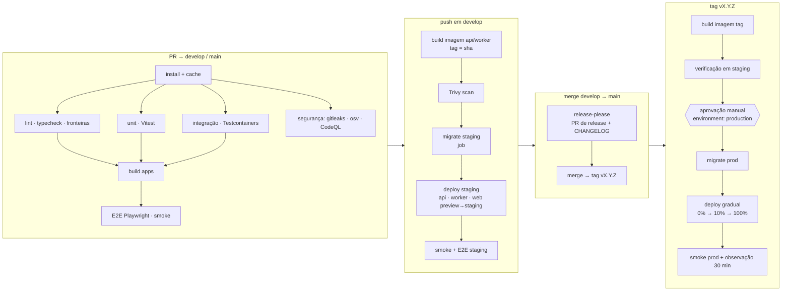

# Pipeline de CI/CD — Bolha Venda

**Versão:** 1.0 · **Data:** 06/10/2026 · **Status:** Rascunho para revisão
**Base:** [PRD v2.1](../../PRD.MD) (RNF01–RNF06) · [Spec do Produto](../../SPEC.md) (§6, §8) · [Plano de Projeto v2](../planing-project.md) (E1, E9, Gates B e E) · [Governança](../governance.md)

> Define os workflows do GitHub Actions, os gates de qualidade e segurança, a promoção entre ambientes e a estratégia de migrations. A plataforma de contêiner (Railway ou Cloud Run) é decidida na S1; os exemplos usam **Cloud Run** e indicam o equivalente no Railway. Decisões arquiteturais citadas (ADR-0001, ADR-0011, ADR-0012) estão com status **Proposto**.

---

## 1. Visão geral



| Workflow | Arquivo | Gatilho | Resultado |
| :--- | :--- | :--- | :--- |
| CI | `.github/workflows/ci.yml` | `pull_request` para `develop`/`main`; `push` em `develop`/`main` | Status checks obrigatórios do PR |
| Segurança agendada | `.github/workflows/security-nightly.yml` | `schedule` diário 03:00 BRT + `workflow_dispatch` | Scan completo de dependências e imagem publicada |
| Deploy staging | `.github/workflows/deploy-staging.yml` | `push` em `develop` (após CI verde) | Staging atualizado automaticamente |
| Release | `.github/workflows/release.yml` | `push` em `main` | PR de release (versão + CHANGELOG); ao mergear, cria tag `vX.Y.Z` |
| Deploy produção | `.github/workflows/deploy-production.yml` | `push` de tag `v*.*.*` | Produção, com aprovação manual |
| Hotfix | mesmo `deploy-production.yml` | tag `vX.Y.(Z+1)` gerada a partir de `fix/*` mergeado em `main` | Produção, com aprovação manual |
| Benchmark | `.github/workflows/perf.yml` | `schedule` noturno + label `perf` em PR | Canvas 500 bolhas com frame time p95 ≤ 16,7 ms nos 2 dispositivos de referência (RNF01, R1), k6 em staging |

---

## 2. Gates obrigatórios (branch protection)

Configurados em `develop` e `main`: PR obrigatório, 1 aprovação (2 em PRs que tocam `payment`, `identity`, migrations *contract* ou workflows), histórico linear desativado (merge commit, conforme Gitflow), status checks obrigatórios abaixo, CODEOWNERS por módulo.

| Gate | Ferramenta | Critério de bloqueio |
| :--- | :--- | :--- |
| Commits e título do PR | commitlint (Conventional Commits) | Qualquer commit fora do padrão de [governance.md](../governance.md) |
| Lint e formatação | ESLint + Prettier | Qualquer erro |
| Fronteiras de arquitetura | `eslint-plugin-boundaries` / dependency-cruiser | `core-domain` importando infra; app importando outro app |
| Tipos | `tsc --noEmit` | Qualquer erro |
| Testes unitários | Vitest | Falha; cobertura do `core-domain` < 90% linhas / 85% branches |
| Integração | Vitest + Supertest + Testcontainers (Postgres 16, Redis 7) | Falha; inclui o teste de concorrência da última cota (RNF02, R2) e os casos de borda da Spec §6 (critério de aceite 2 da Spec §8) |
| Build | Turborepo | Falha |
| E2E | Playwright (+ axe-core) | Falha nos fluxos críticos; violação a11y "serious"/"critical" |
| Segredos | gitleaks | Qualquer achado não suprimido com justificativa |
| Dependências | `npm audit --omit=dev` + OSV-Scanner | Vulnerabilidade **crítica ou alta** com correção disponível |
| SAST | CodeQL (`javascript-typescript`, suíte `security-extended`) | Alerta de severidade alta/crítica |
| Imagem | Trivy | CVE crítica/alta corrigível na imagem final |
| Licenças | `license-checker` | Licença fora da allowlist (GPL/AGPL em dependência de runtime) |
| Migrations | `prisma migrate diff` + lint de SQL (squawk) | Operação destrutiva sem rótulo `migration:contract` |

Achados de segurança aceitos temporariamente ficam em `.security/exceptions.yaml` com dono e data de expiração; exceção vencida volta a bloquear.

---

## 3. Cache e desempenho do pipeline

- `actions/setup-node` com `cache: npm` (chave pelo `package-lock.json`).
- Cache do Turborepo (`.turbo`) via `actions/cache`, chave por `github.sha` com `restore-keys` do branch; em PR, `turbo run … --filter=...[origin/develop]` executa só o afetado.
- Cache dos binários do Prisma e dos navegadores do Playwright (`~/.cache/ms-playwright`, chave pela versão do Playwright).
- Build de imagem com `docker/build-push-action` e `cache-from/cache-to: type=gha`.
- `concurrency` por ref com `cancel-in-progress: true` em PR (nunca nos deploys).
- Meta: CI de PR < 12 min p50.

---

## 4. Ambientes e promoção

| Ambiente | Origem | Deploy | Dados | Integrações externas | Acesso |
| :--- | :--- | :--- | :--- | :--- | :--- |
| **local** | branch do dev | manual (`npm run dev`) | seed | `PAYMENT_PROVIDER=fake`, `CNPJ_PROVIDER=fake` | dev |
| **ci** | PR | efêmero (Testcontainers / compose) | fixtures | fakes | GitHub Actions |
| **preview (web)** | PR | Vercel preview automático | aponta para API de staging | sandbox | time |
| **staging** | `develop` | **automático** a cada push | sintéticos (seed + gerador); nunca cópia de produção | Pagar.me **sandbox**, BrasilAPI real | time + PO |
| **produção** | tag `vX.Y.Z` de `main` | **aprovação manual** (environment `production`, revisores: Tech Lead ou PO + DevOps) | reais | Pagar.me produção | restrito |

Regras de promoção:
- **Build uma vez por versão.** O workflow de produção constrói a imagem a partir da tag, implanta essa mesma imagem (por *digest*) primeiro em staging para verificação automática e só então pede aprovação; a produção recebe exatamente o *digest* verificado.
- Imagens taggeadas por `sha` e por versão (`api:1.4.0`, `api:sha-abc1234`), publicadas no GHCR ou Artifact Registry; nunca `latest` em produção.
- Autenticação do GitHub na nuvem via **OIDC** (Workload Identity Federation no GCP / token de projeto no Railway), sem chave de longa duração em segredo do repositório. A conta de deploy tem permissão mínima: publicar imagem, criar revisão, executar job de migration.
- Segredos de aplicação ficam no secret manager da plataforma, não no GitHub (o GitHub guarda apenas o necessário para o deploy).
- Janela de deploy em produção: segunda a quinta, 10h–16h BRT; nunca sexta, véspera de feriado ou durante incidente aberto; freeze automático quando o error budget estiver esgotado ([slo-observabilidade.md §3](../09-operacao/slo-observabilidade.md#3-error-budget-e-política)). O workflow checa a janela e exige `override_window: true` + justificativa para hotfix S1/S2.

---

## 5. Migrations em deploy (expand/contract)

API e worker rodam mais de uma instância e o deploy é gradual: durante minutos, **a versão N e a N+1 do código convivem com o mesmo banco**. Toda migration precisa ser compatível com as duas.

### 5.1 Sequência no deploy
1. Job de migration (`prisma migrate deploy`, imagem da versão N+1, `DATABASE_DIRECT_URL`) roda **antes** de qualquer instância nova receber tráfego. `lock_timeout = '5s'` e `statement_timeout = '60s'` na sessão da migration; se estourar, o deploy falha sem impacto (nada foi trocado).
2. Deploy gradual de api e worker (seção 6).
3. Migrations *contract* só entram em um release **posterior**, depois que nenhuma versão em produção usa mais o elemento removido.

### 5.2 Padrão em 3 releases

| Fase | Release | Banco | Código |
| :--- | :--- | :--- | :--- |
| **Expand** | N | adiciona coluna/tabela/índice novo (nullable, com default barato ou `CONCURRENTLY`) | continua lendo o antigo; passa a escrever nos dois (dual-write) |
| **Migrate** | N (job) ou N+1 | backfill em lotes de 1–5 mil linhas por job BullMQ, idempotente, com pausa entre lotes | lê do novo com fallback para o antigo |
| **Contract** | N+2 | remove coluna antiga / adiciona `NOT NULL` (via `CHECK … NOT VALID` + `VALIDATE`) | só usa o novo |

Exemplo: trocar `bubbles.image_url` por uma tabela de imagens — N cria `bubble_images` e grava nas duas; job copia o histórico; N+1 lê de `bubble_images`; N+2 remove `image_url`.

### 5.3 Proibido em uma única release
`DROP COLUMN`/`DROP TABLE` usados pela versão anterior; `RENAME` de coluna/tabela; mudança de tipo que reescreve a tabela; `CREATE INDEX` sem `CONCURRENTLY` em tabela grande (`quotas`, `outbox_events`, `audit_log`, `score_events`); `ALTER TABLE … ADD … NOT NULL` sem default em tabela populada. O lint de SQL (squawk) bloqueia essas operações sem o rótulo `migration:contract` e aprovação dupla.

### 5.4 Rollback de banco
Não há *down migration* automática em produção. Rollback de aplicação é sempre possível porque o schema é compatível com N e N+1 (expand). Se uma migration *expand* causar problema, corrige-se com nova migration (*roll-forward*). Restauração de backup (PITR) é último recurso, decidido pelo IC ([runbooks RB-09](../09-operacao/runbooks.md#rb-09--deploy-com-falha--rollback)).

### 5.5 Eventos e contratos
A mesma regra vale para payloads do outbox, eventos WS e API REST: adicionar campo é *expand*; remover exige versão (`schemaVersion` ou `/api/v2`) e período de convivência.

---

## 6. Estratégia de deploy

| Componente | Estratégia | Detalhe |
| :--- | :--- | :--- |
| **api** (REST + WS) | Gradual por revisão: nova revisão com 0% → smoke na URL da revisão → 10% por 10 min → 50% → 100% | Cloud Run: `--no-traffic --tag candidate` e `update-traffic`. Railway: rolling com health check e *overlap*. WS: conexões existentes ficam na revisão antiga até reconectar; clientes reconectam com backoff + jitter; `SIGTERM` fecha sockets aos poucos em 30 s. |
| **worker** | Rolling | `SIGTERM` → `worker.close()` do BullMQ espera os jobs ativos (até 60 s). Jobs são idempotentes (ADR-0011), então reprocessamento após corte é seguro. O relay do outbox usa `SKIP LOCKED`, sem disputa entre versões. |
| **web** | Vercel: deploy atômico + `vercel promote` / `vercel rollback` | Build com `NEXT_PUBLIC_*` de produção; assets imutáveis. |
| **migrations** | Job único antes da troca de tráfego | Ver seção 5. |

Critérios automáticos de abortar a progressão (avaliados pelo workflow a cada etapa): taxa de 5xx da revisão nova > 1% por 5 min; p99 de `POST /bubbles/{id}/quotas` > 2× a linha de base; falha no smoke; alerta S1/S2 aberto. Ao abortar, o tráfego volta 100% para a revisão anterior.

---

## 7. Versionamento semântico e changelog

- **Uma versão para o produto** (monorepo): `vMAJOR.MINOR.PATCH`, aplicada a api, worker e web.
- Derivada dos Conventional Commits por **release-please**: `feat` → MINOR; `fix` → PATCH; `!`/`BREAKING CHANGE:` → MAJOR. Antes do go-live a linha é `0.x`; o go-live público de 01/03/2027 publica `1.0.0`.
- `CHANGELOG.md` gerado automaticamente, agrupado por tipo e escopo (`bubble`, `payment`, `canvas`…). O PO revisa a seção "Destaques" do PR de release antes do merge.
- Fluxo Gitflow: PR `develop → main` (release) → release-please abre o PR de versão em `main` → merge cria a tag e a GitHub Release → dispara o deploy de produção. Depois, `main` é mergeada de volta em `develop` (job automático abre o PR).
- **Hotfix**: `fix/<nome>` criado a partir de `main`, PR para `main` (gera PATCH) e back-merge para `develop`. `governance.md` não define branches `release/*` ou `hotfix/*`; este documento usa `fix/*` a partir de `main` para hotfix (ver inconsistências no relatório da versão).
- A versão é injetada como `APP_VERSION` e `service.version` (OpenTelemetry), para correlacionar incidentes a releases.

---

## 8. YAML de exemplo

### 8.1 `ci.yml` (pipeline principal)

```yaml
name: CI
on:
  pull_request:
    branches: [develop, main]
  push:
    branches: [develop, main]

concurrency:
  group: ci-${{ github.ref }}
  cancel-in-progress: ${{ github.event_name == 'pull_request' }}

permissions:
  contents: read
  security-events: write   # CodeQL
  pull-requests: read

env:
  NODE_VERSION: '24'
  TURBO_TELEMETRY_DISABLED: '1'

jobs:
  setup:
    runs-on: ubuntu-latest
    steps:
      - uses: actions/checkout@v4
        with: { fetch-depth: 0 }
      - uses: actions/setup-node@v4
        with: { node-version: '${{ env.NODE_VERSION }}', cache: npm }
      - run: npm ci
      - uses: actions/cache/save@v4
        with:
          path: node_modules
          key: nm-${{ runner.os }}-${{ hashFiles('package-lock.json') }}

  quality:
    needs: setup
    runs-on: ubuntu-latest
    steps:
      - uses: actions/checkout@v4
        with: { fetch-depth: 0 }
      - uses: actions/setup-node@v4
        with: { node-version: '${{ env.NODE_VERSION }}' }
      - uses: actions/cache/restore@v4
        with: { path: node_modules, key: "nm-${{ runner.os }}-${{ hashFiles('package-lock.json') }}" }
      - uses: actions/cache@v4
        with: { path: .turbo, key: 'turbo-quality-${{ github.sha }}', restore-keys: turbo-quality- }
      - name: Commitlint
        if: github.event_name == 'pull_request'
        run: npx commitlint --from ${{ github.event.pull_request.base.sha }} --to ${{ github.event.pull_request.head.sha }}
      - run: npx turbo run lint typecheck --filter=...[origin/develop]
      - run: npm run lint:boundaries
      - run: npx prisma validate --schema packages/database/prisma/schema.prisma
      - name: Lint de migrations
        run: npx squawk $(git diff --name-only origin/develop -- 'packages/database/prisma/migrations/**/*.sql') || true
        # o script tools/ci/check-migrations.ts decide o bloqueio conforme o rótulo migration:contract

  unit:
    needs: setup
    runs-on: ubuntu-latest
    steps:
      - uses: actions/checkout@v4
      - uses: actions/setup-node@v4
        with: { node-version: '${{ env.NODE_VERSION }}' }
      - uses: actions/cache/restore@v4
        with: { path: node_modules, key: "nm-${{ runner.os }}-${{ hashFiles('package-lock.json') }}" }
      - run: npx turbo run test -- --coverage
      - uses: actions/upload-artifact@v4
        with: { name: coverage, path: '**/coverage/lcov.info' }

  integration:
    needs: setup
    runs-on: ubuntu-latest   # Docker disponível para Testcontainers
    steps:
      - uses: actions/checkout@v4
      - uses: actions/setup-node@v4
        with: { node-version: '${{ env.NODE_VERSION }}' }
      - uses: actions/cache/restore@v4
        with: { path: node_modules, key: "nm-${{ runner.os }}-${{ hashFiles('package-lock.json') }}" }
      - run: npm run test:int
      - run: npm run test:concurrency   # 100 req paralelas → 1×201, 99×409 (Plano §9)

  security:
    runs-on: ubuntu-latest
    steps:
      - uses: actions/checkout@v4
        with: { fetch-depth: 0 }
      - uses: gitleaks/gitleaks-action@v2
        env: { GITHUB_TOKEN: '${{ secrets.GITHUB_TOKEN }}' }
      - uses: actions/setup-node@v4
        with: { node-version: '${{ env.NODE_VERSION }}', cache: npm }
      - run: npm ci --ignore-scripts
      - run: npm audit --omit=dev --audit-level=high
      - uses: google/osv-scanner-action/osv-scanner-action@v2
        with: { scan-args: '--lockfile=package-lock.json' }
      - uses: github/codeql-action/init@v3
        with: { languages: javascript-typescript, queries: security-extended }
      - uses: github/codeql-action/analyze@v3

  build:
    needs: [quality, unit, integration]
    runs-on: ubuntu-latest
    steps:
      - uses: actions/checkout@v4
      - uses: actions/setup-node@v4
        with: { node-version: '${{ env.NODE_VERSION }}' }
      - uses: actions/cache/restore@v4
        with: { path: node_modules, key: "nm-${{ runner.os }}-${{ hashFiles('package-lock.json') }}" }
      - run: npx turbo run build
      - uses: docker/setup-buildx-action@v3
      - name: Build de imagens (sem push em PR)
        uses: docker/build-push-action@v6
        with:
          context: .
          file: apps/api/Dockerfile
          push: false
          load: true
          tags: bolha-api:ci
          cache-from: type=gha
          cache-to: type=gha,mode=max
      - uses: aquasecurity/trivy-action@0.28.0
        with: { image-ref: 'bolha-api:ci', severity: 'CRITICAL,HIGH', ignore-unfixed: true, exit-code: '1' }

  e2e:
    needs: build
    runs-on: ubuntu-latest
    steps:
      - uses: actions/checkout@v4
      - uses: actions/setup-node@v4
        with: { node-version: '${{ env.NODE_VERSION }}' }
      - uses: actions/cache/restore@v4
        with: { path: node_modules, key: "nm-${{ runner.os }}-${{ hashFiles('package-lock.json') }}" }
      - uses: actions/cache@v4
        with: { path: ~/.cache/ms-playwright, key: "pw-${{ hashFiles('package-lock.json') }}" }
      - run: npx playwright install --with-deps chromium
      - run: docker compose up -d --wait postgres redis
      - run: cp .env.example .env && npm run db:deploy && npm run db:seed -- --small
      - run: npm run test:e2e
      - if: failure()
        uses: actions/upload-artifact@v4
        with: { name: playwright-report, path: apps/web/playwright-report }
```

### 8.2 `deploy-production.yml` (trecho)

```yaml
name: Deploy produção
on:
  push:
    tags: ['v*.*.*']
permissions: { contents: read, id-token: write, packages: write }
concurrency: { group: deploy-production, cancel-in-progress: false }

jobs:
  build:
    runs-on: ubuntu-latest
    outputs: { digest: '${{ steps.push.outputs.digest }}' }
    steps:
      - uses: actions/checkout@v4
      - uses: google-github-actions/auth@v2
        with:
          workload_identity_provider: ${{ vars.GCP_WIF_PROVIDER }}
          service_account: ${{ vars.GCP_DEPLOY_SA }}
      - uses: docker/build-push-action@v6
        id: push
        with:
          push: true
          file: apps/api/Dockerfile
          build-args: APP_VERSION=${{ github.ref_name }}
          tags: ${{ vars.REGISTRY }}/bolha-api:${{ github.ref_name }}

  verify-staging:
    needs: build
    environment: staging
    runs-on: ubuntu-latest
    steps:
      - run: ./tools/deploy/run-migrations.sh staging ${{ needs.build.outputs.digest }}
      - run: ./tools/deploy/deploy.sh staging ${{ needs.build.outputs.digest }}
      - run: npm run test:smoke -- --base-url=${{ vars.STAGING_URL }}

  production:
    needs: [build, verify-staging]
    environment: production          # revisores obrigatórios configurados no GitHub
    runs-on: ubuntu-latest
    steps:
      - run: ./tools/deploy/check-window.sh   # seg–qui, 10h–16h BRT, sem incidente aberto, budget > 0
      - run: ./tools/deploy/run-migrations.sh production ${{ needs.build.outputs.digest }}
      - run: ./tools/deploy/progressive.sh production ${{ needs.build.outputs.digest }} 0 10 50 100
      - run: npm run test:smoke -- --base-url=${{ vars.PRODUCTION_URL }}
      - run: ./tools/deploy/watch.sh --minutes 30 --abort-on "error_rate>0.01,quota_p99>2x"
```

---

## 9. Responsabilidades

| Item | Dono |
| :--- | :--- |
| Workflows, runners, OIDC, ambientes | DevOps/SRE (25%) com Tech Lead |
| Branch protection e CODEOWNERS | Tech Lead |
| Aprovação de deploy em produção | Tech Lead ou PO + DevOps |
| Exceções de segurança | Tech Lead (registro em `.security/exceptions.yaml`) |
| PR de release / changelog | PO revisa destaques; Tech Lead faz o merge |

---

## Fontes consultadas (AlterEgo)

- **release-manager** — *Manual de Processo de Desenvolvimento de Software*, Fase 10 (DevOps) §12.4: blue-green, canary, rolling e feature flags para desacoplar deploy de release (seção 6).
- **migration-specialist** — Pramod Sadalage & Martin Fowler, *Evolutionary Database Design*: banco precisa suportar múltiplas versões da aplicação em rolling/canary; migrations versionadas aplicadas por ferramenta em todos os ambientes (seção 5).
- **migration-specialist** — *Flyway Docs*, FAQ: nenhuma mudança de banco fora da ferramenta; reparo após migration falha (seção 5.4).
- **asias-refatoracao** — Martin Fowler, *Refatoração*: interfaces publicadas exigem convivência da versão antiga e depreciação (seção 5.5).
- **devops** — Michael Cade, *90 Days of DevOps* (Day 33, GitHub Actions + Argo CD): imagem identificada pelo SHA do commit e versionamento do deploy no Git (seção 4).
- **devops** — Julien Vehent, *Securing DevOps*, cap. 6 ("Securing the delivery pipeline"): permissões mínimas para o deployer e evitar credenciais de longa duração (OIDC, seção 4).
