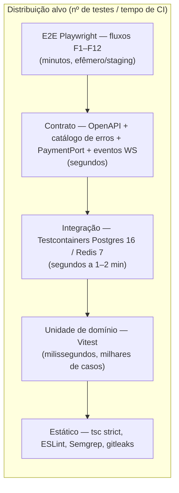

# Estratégia de Testes — Bolha Venda

**Versão:** 1.0 · **Data:** 06/10/2026 · **Status:** Rascunho para revisão
**Base:** [PRD v2.1](../../PRD.MD) · [Spec do Produto v1.1](../../SPEC.md) · [Plano de Projeto v2](../planing-project.md) · [API REST](../05-arquitetura/api-rest.md) · [API WebSocket](../05-arquitetura/api-websocket.md)

> Escopo: Release 1.0 (go-live 01/03/2027). Os requisitos são referenciados pelos códigos do PRD v2.1 (RF01–RF09, RNF01–RNF06), pelas funcionalidades da Spec (F1–F12) e pelas ADRs (todas **propostas**, aguardando o Gate A). Os IDs `CT-xxx` deste documento são os casos de teste canônicos. A ligação com os requisitos detalhados `RF-xxx` da ERS será feita quando ela for publicada.
>
> **Precedência:** em conflito, vale a **Spec**. As divergências encontradas entre Spec e contrato de API estão na §11.

---

## 1. Princípios

1. **O domínio carrega o risco.** Preço em degraus, teto de cotas PJ, máquina de estados da bolha e do item de triagem, seleção de lance e score são regras puras em `packages/core-domain`. Testá-las sem I/O é rápido e exaustivo. É ali que fica a maior parte dos testes.
2. **A concorrência só se prova no banco real.** A garantia contra overbooking (ADR-0002, proposto) depende do `UPDATE` condicional e do índice único parcial do PostgreSQL 16. Mocks e bancos em memória não reproduzem isso. Os testes rodam em Postgres e Redis reais via Testcontainers. O corpus consultado prefere bancos reais em testes de integração SQL (Aniche, *Effective Software Testing*).
3. **Cada nível de teste pega um tipo de defeito.** Unidade pega lógica, integração pega colaboração com a infraestrutura, contrato pega quebra de interface e E2E pega fluxo de usuário. Pressman (*Engenharia de Software*, cap. 17) descreve a estratégia como uma progressão do componente para a integração e daí para a validação contra os requisitos.
4. **O tempo é uma dependência injetável.** Todo código que depende de "agora" recebe uma porta `Clock`. Nenhuma regra de prazo é testada com `sleep` real. Os prazos em questão: 15 min do Pix, 1 h do `EXPIRING`, 24 h de seleção, 7 dias de envio, recebimento e arrependimento, 10 dias de devolução, 5 dias de contestação, 30 dias de CNPJ.
5. **Um teste vermelho é um sinal, não um obstáculo.** A política de flaky (§8) nunca desliga um teste para destravar a fila.
6. **Os casos de borda da Spec §6 são critério de release** (Spec §8, item 2). Cada uma das 17 linhas tem pelo menos um CT automatizado, marcado ★ (§10, coluna "Spec").

---

## 2. Forma da suíte: troféu no back-end, pirâmide no domínio

| Camada | Forma | Justificativa |
| :--- | :--- | :--- |
| `core-domain` | **Pirâmide** (≈ 80% unidade) | Regras puras e determinísticas. A cobertura combinatória sai barata. |
| `apps/api` + `apps/worker` | **Troféu** (integração é o maior bloco) | O valor está na colaboração com Postgres, Redis, BullMQ, outbox e gateway. Testes unitários de controller com mocks verificam pouco. |
| `apps/web` | **Troféu** (componente + E2E) | Lógica de viewport, LOD, QuadTree e reducer de versão em unidade; componentes React com Testing Library; fluxos em Playwright; canvas por benchmark. |

---

## 3. O que testar em cada nível, por módulo

### 3.1 Unidade de domínio (Vitest, `packages/core-domain`)

| Módulo | Regras cobertas (Spec / PRD) | Técnica |
| :--- | :--- | :--- |
| **bubble — degraus** (F3, F6, RF06.1, ADR-0004) | O 1º degrau começa em 0 cotas (`initial_price`) e o último é `target_price`. Entre 1 e 10 degraus. Limiares estritamente crescentes e preços não crescentes. Preço mínimo de R$ 1,00. Valores em centavos (`bigint`). `preço_atual` = degrau de maior `min_filled_quotas ≤ filled_quotas`. Preço final único na explosão. | Exemplos da Spec F6 (35/72/100 cotas) como teste dourado. **Property-based** (fast-check): o preço é não crescente em `filled` e o preço final pertence ao conjunto de degraus. |
| **bubble — parâmetros** (F3, F4) | Título com 5–80 caracteres; descrição até 2.000; até 5 imagens; `max_quotas` de 2 a 10.000; `min_quotas` de 1 a `max_quotas` (padrão 50%); `max_pj_share` de 10% a 100%; `shipping_days` de 1 a 30 (padrão 7); duração de 1 h a 5 dias. | Valores-limite (mín − 1, mín, máx, máx + 1). |
| **bubble — cotas** (F5, RF03, ADR-0002/0006) | PF tem 1 cota. PJ vai até **`max(1, floor(max_pj_share × max_quotas))`**. O criador não participa da própria bolha de venda nem dá lance na própria bolha de compra. O criador da bolha de compra ocupa automaticamente 1 cota. | Limites do teto (teto − 1, teto, teto + 1), arredondamento (`max_quotas = 7`, 50% → 3; `max_quotas = 2`, 10% → 1). |
| **bubble — máquina de estados** (PRD §8.1, ADR-0009) | Todas as transições do diagrama revisado, inclusive `EXPIRED_SUCCESS → CANCELLED` (compra sem lance). Todas as inválidas são rejeitadas. Edição após publicar só em descrição e imagens. Cancelamento pelo criador só com `filled_quotas = 0`. | Matriz estado × comando gerada (produto cartesiano), com teste de que não existe transição fora da tabela. |
| **bubble — flags e exibição** (F2) | `is_near_full` liga em ≥ 80%. `is_expiring` liga quando falta menos de 1 h. Nenhuma das duas altera `status`. Bolha encerrada fica visível por 24 h. | Limites. |
| **bubble — reserva Pix** (F5, §6) | Prazo de pagamento = `min(15 min, expires_at − agora)`. Pix não é oferecido nos últimos 5 min. A reserva **ocupa capacidade** (`filled_quotas + reserved_quotas ≤ max_quotas`), mas **não conta** para meta nem para degrau. Pix pago faz `reserved → filled` na mesma transação. Reserva expirada libera a vaga, sem penalidade. Explosão por lotação só com `filled_quotas = max_quotas`. No fim do prazo, as reservas são canceladas e o Pix pago depois é estornado. Anti-abuso: no máximo 3 reservas abertas por conta; 3 expiradas em 24 h bloqueiam o Pix por 24 h. | `Clock` fake e property-based (`filled + reserved ≤ max` sempre). |
| **bidding** (F8, RF04, ADR-0005) | Lance válido com valor ≤ `target_price`. Um lance ativo por empresa, e substituir marca o anterior como `WITHDRAWN`. Janela de seleção de 24 h. Fallback pelo menor preço, com empate pelo mais antigo. Sem lance válido, `CANCELLED`. | Exemplos e property-based para a ordenação. |
| **triage — item** (F9, RF05.2) | Estados `PENDING_SHIPMENT → SHIPPED → DELIVERED → COMPLETED` e `WITHDRAWAL_REQUESTED → CANCELLED`. `PENDING_SHIPMENT [atrasado]` tem **tolerância de +3 dias**: envio nesse período vale −15; fim da tolerância ou cancelamento pelo comprador no atraso leva a `CANCELLED` com −60. Prazos: confirmação automática em 7 d, arrependimento em 7 d, devolução em 10 d (sem confirmação → moderação). O caso de triagem (em `SHIPPED`/`DELIVERED`, até o fim da janela) pausa prazos e repasse. Decisões: estorno total (`CANCELLED`), parcial (`COMPLETED` com valor reduzido) ou improcedente (retoma os prazos de onde parou). Regras de fechamento da bolha. | Matriz de estados do item e `Clock` fake (limites D+7 23:59:59 / D+8). |
| **reputation** (F10, RF05.3, ADR-0007) | `score = clamp(0, 1000, 500 + Σ pontos × 0,5^(idade/180))`. Pesos (Spec v1.1): +20/+30 (concluída), +5 (envio no prazo), −15 (envio na tolerância), −60 (cancelado por não envio), −40 (chargeback após `COMPLETED` julgado improcedente), −30 (caso de triagem procedente contra o vendedor). **Sem penalidade:** reserva Pix expirada, saída de cota, arrependimento, falha de captura por pré-autorização expirada. Faixas. Contestação julgada por moderador diferente do caso original. Evento contestado não conta até a decisão. Procedente reverte. `score_model_version` é gravado. | Valores dourados calculados à mão e property-based (score sempre em [0, 1000]). |
| **payment (cálculo)** (F5, F6, RF07) | `valor_reserva` = `initial_price` (venda) ou `target_price` (compra), vezes a quantidade. Captura do preço final e liberação da diferença. Na falha, estorno de 100%. Taxa de 6% sobre o **GMV concluído** (itens `COMPLETED`, descontados estornos parciais e arrependimentos), retida no repasse. | Invariante: `capturado + liberado/estornado = reservado`. |
| **moderation** (F12, RF09) | Toda ação exige motivo. Suspender bolha estorna 100%. Decisão de caso de triagem: estorno total, parcial ou repasse. | Exemplos. |

O ciclo vermelho-verde-refatorar e o padrão Arrange-Act-Assert seguem Beck (*TDD — Desenvolvimento Guiado por Testes*, cap. 19). Testes de domínio rodam com `npx vitest run`, nunca em modo watch no CI (skill `asias-tdd`).

### 3.2 Integração (Supertest + Testcontainers: Postgres 16, Redis 7)

| Tema | O que se prova | Observação |
| :--- | :--- | :--- |
| **Concorrência da cota** | 100 (e 1000) aquisições paralelas sobre 1 cota restante dão exatamente 1 `201` e o resto `409 QUOTA_SOLD_OUT`, sem cobrança. O invariante `filled_quotas ≤ max_quotas` vale sempre. O índice único parcial produz `PF_QUOTA_LIMIT`, nunca 500. | Pool de conexões real e repetição de **20×** por execução. Isolamento Read Committed (ADR-0002). |
| **Compensação de pagamento** | Toda recusa após a autorização cancela a pré-autorização ou estorna o Pix (Spec F5). | O stub do `PaymentPort` registra autorizações órfãs, que devem ser zero. |
| **Reserva Pix** | A reserva ocupa vaga no `UPDATE` condicional (`filled_quotas + reserved_quotas + :n ≤ max_quotas`). O pagamento converte `reserved → filled` atomicamente e explode a bolha se ela encher. A expiração reabre a vaga. Webhook de Pix pago após o fim gera estorno automático. Limites anti-abuso por conta. | Worker, webhook simulado e `Clock` controlado. |
| **Explosão por lotação** | Última cota, `EXPIRED_SUCCESS` e outbox (`QuotaAcquired` + `BubbleExploded{SUCCESS, FULL}`) acontecem numa **única transação**. | Falha injetada após o `UPDATE` faz rollback total. |
| **Outbox e versão** | Não existe evento sem commit, nem commit sem evento. `bubbles.version` é monotônico e o evento leva a versão pós-commit. Dedupe por `id` do outbox. | Matar o relay entre o "lido" e o "marcado". |
| **Jobs BullMQ** (ADR-0011; workers com **≥ 2 réplicas**) | `bubble-expire`, `bubble-expiring`, `bid-selection-timeout`, `triage-deadline` e expiração do Pix são idempotentes. O reconciliador encontra bolhas vencidas sem job. | Redis com AOF; `FLUSHALL` simula perda. |
| **Corrida tempo × lotação** | Uma transição e um `BubbleExploded`. | Controle por `status`/`version` no `WHERE`. |
| **Idempotency-Key** | Mesma chave e mesmo corpo devolvem a mesma resposta. Original ainda em processamento: `409 IDEMPOTENCY_IN_PROGRESS`. Corpo diferente: `422 IDEMPOTENCY_KEY_REUSED`. | Escopo (conta, rota) e hash do corpo. |
| **Webhooks** | Assinatura validada sobre o corpo bruto. `webhook_events` único por id do provedor. Ordem trocada é tolerada. | Fixtures do sandbox. |
| **Criptografia de PII** (ADR-0012) | CPF/CNPJ/e-mail cifrados em repouso. Busca por hash HMAC. Rotação de chave. | SQL direto: o valor na coluna não contém o CPF em claro. |
| **Autorização** | Matriz recurso × papel × dono para triagem, lances, score, contestação, exportação, moderação e denúncia (IDOR/BFLA). | Todo endpoint novo entra na matriz (OWASP Authorization Cheat Sheet). |
| **Direitos do titular** (RF01.4) | A exportação gera JSON. A exclusão é bloqueada com obrigações pendentes e, depois, anonimiza mantendo os registros fiscais e transacionais. | Ver [LGPD/RIPD](../08-seguranca-compliance/lgpd-ripd.md). |
| **Integrações externas** | BrasilAPI → fallback ReceitaWS e `PENDING_VERIFICATION` com novas tentativas a cada 15 min por 24 h (ADR-0008). Pagar.me (ADR-0003). | Stubs HTTP no CI; sandbox real só em staging. |

### 3.3 Contrato

- **API REST:** `packages/contracts` (OpenAPI 3.1 + Zod) é a fonte da verdade. O teste verifica que toda resposta valida contra o schema e que erros seguem `application/problem+json` (RFC 9457) com o campo `code` do catálogo. Uma mudança que quebre o schema falha o CI (`oasdiff`).
- **Catálogo de códigos de erro:** um teste parametrizado provoca cada código usado pela Spec F5 e F8 e verifica o status HTTP e o `code`: `QUOTA_SOLD_OUT`, `PF_QUOTA_LIMIT`, `PJ_SHARE_EXCEEDED`, `BUBBLE_NOT_ACTIVE`, `CREATOR_CANNOT_JOIN`, `PAYMENT_DECLINED`, `ACCOUNT_NOT_VERIFIED` e `BID_ABOVE_TARGET`. O front tem teste de unidade que mapeia cada `code` para a **mensagem exata** da Spec.
- **`PaymentPort`:** a mesma suíte de contrato roda contra o *fake* (CI) e o adaptador Pagar.me no sandbox (staging, noturno). Isso preserva a troca de provedor (ADR-0003).
- **Eventos WebSocket:** schemas de `bubble.updated`, `bubble.state_changed`, `bubble.exploded`, `bid.submitted` e `notification.created`, com o envelope `{event, v, id, ts, data}` e `version`, validados no emissor e no reducer do cliente.

### 3.4 E2E (Playwright)

Fluxos por funcionalidade da Spec, em ambiente efêmero (CI) e à noite em staging com o gateway em sandbox (Spec §8, item 1):

| Fluxo | Funcionalidade |
| :--- | :--- |
| Cadastro PF, pseudônimo e troca de apelido; login, refresh e logout | F1 |
| Cadastro PJ: ATIVA, irregular e `PENDING_VERIFICATION` | F1 |
| Exportar dados e pedir exclusão (bloqueada e liberada) | F1 |
| Canvas: navegar, LOD, filtros, "só as que participo", bolha encerrada esmaecida | F2 |
| Criar bolha de venda em 4 passos (rascunho automático, pré-visualização) e publicar | F3 |
| Criar bolha de compra (criador ocupa 1 cota; convidar fornecedores) | F4 |
| Entrar com cartão e com Pix, sair, ver o botão de saída desabilitado na última hora | F5 |
| Mudança de degrau visível para dois navegadores | F6 |
| Explosão por lotação e por tempo (sucesso e falha com estorno), com `prefers-reduced-motion` | F7 |
| Lances: enviar, substituir, selecionar; fallback; revelação do vencedor | F8 |
| Triagem completa; arrependimento e devolução; caso "Não recebi" | F9 |
| Meu score e contestação | F10 |
| Central de notificações; preferências de e-mail (os transacionais não desligam) | F11 |
| Denúncia; fila de moderação; suspensão com estorno; trilha de auditoria | F12 |

Seletores por papel/rótulo acessível, sem `sleep` fixo, com trace `on-first-retry` publicado como artefato (skill `sabrina-qa-senior`).

### 3.5 Acessibilidade (RNF05, WCAG 2.1 AA)

- `@axe-core/playwright` em todas as páginas dos fluxos E2E. **Gate:** zero violações `serious` ou `critical` (Spec §8, item 4).
- **Lista acessível** (RF02.3): navegação só por teclado; ordenação por tempo, preço e progresso; anúncio por `aria-live` com throttling.
- As flags têm ícone e texto, nunca só cor. Animações respeitam `prefers-reduced-motion` (a explosão vira fade).
- **Teste manual com leitor de tela** (NVDA no Windows e VoiceOver no iOS) a cada release, com roteiro fixo. Exigido pela Spec §8, item 4.

### 3.6 Visual e benchmark do canvas (RNF01)

- **Regressão visual:** `toHaveScreenshot` de cenas determinísticas (seed fixo, animações desligadas) nos três níveis de LOD (< 0,4×, 0,4×–1×, > 1×). `maxDiffPixelRatio` de 0,01.
- **Benchmark:** página `/bench` com 500 bolhas e roteiro de pan e zoom de 20 s. Medição por `requestAnimationFrame`. **Gate do RNF01:** frame time **p95 ≤ 16,7 ms** nos **dois dispositivos de referência** (notebook com GPU integrada e Android de gama média, definidos no S0). No CI, um runner com GPU acompanha a regressão: piora maior que 10% sobre a linha de base bloqueia o merge em `develop`.
- **Throttle visual:** no máximo 1 atualização por bolha a cada 100 ms, mesmo com 20 eventos/s (teste de unidade do agendador e verificação no benchmark).
- Mesmo cenário sob carga WS: ver [plano de carga](plano-teste-carga.md), C1.

### 3.7 Compatibilidade (RNF06)

Projetos Playwright em Chromium, Firefox e WebKit (os fluxos de §3.4). Smoke manual nas 2 últimas versões de Chrome, Edge, Firefox e Safari (desktop e mobile) antes de cada release. Instalação da PWA verificada (manifest e service worker) por Lighthouse no CI.

### 3.8 Disponibilidade e recuperação (RNF04)

Teste de restore de backup em S8. Objetivo: comprovar **RPO ≤ 15 min** e **RTO ≤ 4 h** num restore completo em ambiente isolado, com o tempo medido e registrado. Depois do restore, o reconciliador precisa explodir as bolhas vencidas durante a janela. O roteiro detalhado fica nos runbooks (09-operacao).

### 3.9 Segurança no pipeline

SAST (Semgrep/CodeQL), varredura de dependências, segredos (gitleaks), DAST baseline (OWASP ZAP) à noite em staging e testes de autorização (§3.2). Detalhes em [threat-model.md](../08-seguranca-compliance/threat-model.md).

---

## 4. Ambientes

| Ambiente | Uso | Dados | Integrações |
| :--- | :--- | :--- | :--- |
| **Local** | Dev e unidade/integração | Factories e seed sintético | Docker compose (Postgres, Redis) e stubs |
| **CI (efêmero)** | PR: unidade, integração, contrato, E2E smoke | Factories | Testcontainers e stubs HTTP |
| **Staging** | E2E F1–F12 noturno, sandbox do gateway, DAST, validação do PO | Seed sintético persistente (reset semanal) | Pagar.me **sandbox**, BrasilAPI real (CNPJs públicos), e-mail em caixa de captura |
| **Perf** | k6, benchmark com carga, teste de restore | Seed sintético em volume (10k bolhas, 50k contas) | Gateway **stub** |
| **Produção** | Smoke pós-deploy e monitoramento sintético | Contas sintéticas `is_synthetic` | Reais |

---

## 5. Dados de teste

- **Factories** (`packages/database/test/factories`, `@faker-js/faker` em `pt_BR`): `accountPF()`, `accountPJ({ cnpjStatus: 'ATIVA' | 'BAIXADA' | 'PENDING_VERIFICATION' })`, `bubble({ type, tiers, min, max, expiresIn, maxPjShare })`, `quota({ paymentMethod: 'CARD' | 'PIX', pixPending })`, `bid()`, `triageItem({ status })`, `scoreEvent({ ageDays })`, `report()`. Os dados são **válidos por construção** (CPF/CNPJ sintéticos com dígito verificador correto) e aceitam *overrides*.
- **Builders de cenário**: `bubbleWithOneQuotaLeft()`, `bubbleExpiringIn(ms)`, `bubbleWithPendingPix()`, `purchaseBubbleWithBids(n)`, `triageItemDeliveredDaysAgo(d)`.
- **Isolamento**: cada teste de integração roda em schema próprio ou em transação com rollback. Os de concorrência usam banco dedicado e `TRUNCATE` entre execuções.
- **Proibido copiar dados de produção** para qualquer ambiente de teste.
- **Anonimização × pseudonimização**: mascarar o CPF ou trocar o nome por pseudônimo **não** anonimiza. O dado continua pessoal enquanto houver chave ou tabela de mapeamento (`juridico-contratos`, Q03). Regra: dados sintéticos, sempre. Ver [LGPD/RIPD](../08-seguranca-compliance/lgpd-ripd.md), §5.
- **Cartões e Pix**: só os de teste documentados pelo gateway em sandbox.

---

## 6. Metas de cobertura por módulo

A cobertura é um piso, não o objetivo. Nos módulos de dinheiro e concorrência ela vem acompanhada de **teste de mutação** (Stryker).

| Módulo | Linhas | Ramos | Mutação | Observação |
| :--- | :--- | :--- | :--- | :--- |
| `core-domain/bubble` (degraus, cotas, estados, Pix) | ≥ 95% | ≥ 90% | ≥ 80% | RNF02 |
| `core-domain/bidding`, `triage`, `reputation` | ≥ 90% | ≥ 85% | ≥ 70% | |
| `api/payment` | ≥ 85% | ≥ 80% | ≥ 70% | Integração conta para a cobertura |
| `api/bubble`, `api/identity`, `api/triage`, moderação | ≥ 80% | ≥ 75% | — | |
| `api/realtime`, `api/notification`, `api/platform` | ≥ 75% | ≥ 70% | — | Mais o teste de carga |
| `worker` (jobs, reconciliador, outbox, Pix) | ≥ 85% | ≥ 80% | — | |
| `web` (lógica: viewport, LOD, QuadTree, reducer de versão, mapa de erros) | ≥ 80% | ≥ 75% | — | Componentes visuais via E2E e visual |
| `contracts` | 100% dos schemas e códigos de erro exercitados | — | — | |

**Regra de catraca:** a cobertura de um módulo não cai num PR (tolerância de 0,5 p.p.).

---

## 7. Gates de CI (GitHub Actions)

| Gatilho | Jobs (bloqueantes) | Tempo-alvo |
| :--- | :--- | :--- |
| **PR** | lint, typecheck, unidade, integração, contrato (`oasdiff` e catálogo de erros), build, cobertura com catraca, Semgrep, gitleaks, auditoria de dependências (alta/crítica bloqueia), E2E smoke (F1, F5, F7) com axe | ≤ 12 min (em *shards*) |
| **Merge em `develop`** | Tudo do PR, mais E2E F1–F12 (3 navegadores), regressão visual, benchmark do canvas (runner com GPU), mutação nos módulos críticos | ≤ 25 min |
| **Noturno (staging)** | E2E contra sandbox Pagar.me, contrato do `PaymentPort` real, ZAP baseline, k6 smoke (C2 com 100 VUs) | — |
| **Release (Gate D/E)** | k6 completo ([plano de carga](plano-teste-carga.md)), benchmark nos 2 dispositivos de referência, leitor de tela manual, teste de restore, pentest sem achado crítico ou alto aberto, checklist LGPD, **todos os CTs da Spec §6 verdes** | — |

---

## 8. Política de testes instáveis (flaky)

1. **Retries só no E2E** (`retries: 2` no CI, `0` local). Unidade e integração **não** têm retry: instabilidade ali é defeito de teste ou de concorrência real.
2. Um teste reportado como `flaky` pelo Playwright (falhou e passou no retry) gera um ticket automático com trace anexado, com dono no máximo em 1 dia útil.
3. **Quarentena** (`@quarantine`) só para `flaky`, nunca para `failed`, com prazo máximo de 5 dias úteis. O teste continua rodando num job não bloqueante.
4. **Os CTs marcados ★ não entram em quarentena.** Ou se conserta o teste, ou se reverte o commit. "Nunca desligue o teste para desbloquear a fila. Reverta o commit que quebrou" (skill `sabrina-qa-senior`).
5. Para diagnosticar, reproduza **no SHA exato** do run com `--trace on`. Se o teste passa local e falha no CI, trate como corrida (skill `sabrina-qa-senior`).
6. **Métrica:** taxa de flaky abaixo de 2% das execuções E2E por semana. Acima disso, a próxima sprint reserva capacidade para estabilização.
7. Causas proibidas: `waitForTimeout`, dependência de ordem entre testes, relógio real em regra de prazo, dados compartilhados mutáveis.

---

## 9. Definição de Pronto de qualidade (complementa a DoD do plano §8)

- [ ] Critérios de aceite em Given/When/Then automatizados no nível mais baixo possível.
- [ ] Regra de domínio nova com teste de unidade, incluindo valores-limite e caso negativo.
- [ ] Endpoint novo com teste de contrato, de autorização (dono e não-dono) e de erro `problem+json` com `code` do catálogo.
- [ ] Mensagem de erro exibida igual à da Spec (teste do mapa de `code` → mensagem).
- [ ] Mudança em cota, pagamento, explosão, triagem ou outbox com teste de integração em banco real.
- [ ] Fluxo alterado: E2E atualizado e verde; axe sem `serious/critical`; ícone e texto além da cor.
- [ ] Nenhum PII em logs, traces ou snapshots de teste (CT-049 verde).
- [ ] Cobertura e mutação dentro das metas, sem queda.
- [ ] Nenhum teste novo em quarentena; nenhum `test.skip` sem ticket.
- [ ] Métricas e traces do fluxo instrumentados (E9).

---

## 10. Catálogo de casos de teste

Legenda: **N** = nível (U unidade, I integração, C contrato, E E2E, P performance/carga, S segurança, A acessibilidade, M manual). ★ = não pode entrar em quarentena. **Spec** = linha da tabela de casos de borda da Spec v1.1 §6 (B1–B17, na ordem da tabela). Toda linha B1–B17 tem ao menos um CT ★ (Spec §8, item 2).

### 10.1 Cotas, pagamento na adesão e concorrência (F5, RF03, RF07, RNF02)

| ID | Spec | Título | N | Rastreio | Pré-condição | Passos | Resultado esperado |
| :--- | :--- | :--- | :--- | :--- | :--- | :--- | :--- |
| **CT-001** ★ | B1 | Corrida pela última cota | I, P | RF03.5, RNF02, ADR-0002 | Bolha `ACTIVE`, `max_quotas = 10`, `filled_quotas = 9`; 100 contas PF distintas (cartão) | 1) 100 `POST /bubbles/{id}/quotas` simultâneos, cada um com `Idempotency-Key` própria. 2) Ler bolha, cotas e stub do gateway. 3) Repetir 20× (integração) e com 1000 VUs (carga). | 1 resposta `201` e 99 `409 QUOTA_SOLD_OUT` com a mensagem "As cotas acabaram enquanto você confirmava. Nenhum valor foi cobrado.". `filled_quotas = 10`. 99 pré-autorizações canceladas (zero órfãs). Nenhum 5xx. |
| **CT-002** ★ | B2 | PF em duas abas (chaves diferentes) | I, E | RF03.1 | PF sem cota; bolha com folga | 1) Duas abas confirmam quase juntas, com chaves distintas. 2) Repetir com 20 requisições paralelas. | 1 cota. As demais recebem `409 PF_QUOTA_LIMIT` ("Você já participa desta bolha…"), nunca 500. Autorizações excedentes canceladas. |
| **CT-003** ★ | B2 | PF em duas abas (mesma chave) | I | F5 idempotência | Como CT-002 | 1) Duas requisições com a **mesma** `Idempotency-Key` e o mesmo corpo. | Ambas recebem a mesma resposta (`201`) ou a segunda recebe `409 IDEMPOTENCY_IN_PROGRESS` com `Retry-After` e depois a mesma resposta. 1 cota e 1 cobrança. |
| **CT-004** ★ | B3 | PJ compra 100% de uma vez | I | RF05.1(b), ADR-0009 | `max_pj_share = 100%`, `filled = 0`, PJ verificada | 1) PJ adquire `max_quotas` cotas. | `ACTIVE → EXPIRED_SUCCESS` direto, na mesma transação. Outbox com `QuotaAcquired` e `BubbleExploded{SUCCESS, FULL}`. |
| **CT-005** | — | Teto de cotas PJ | U, I | RF03.2, ADR-0006 | `max_quotas = 100`, `max_pj_share = 50%`; outra bolha com `max_quotas = 7` (50% → 3) e outra com `max_quotas = 2`, `max_pj_share = 10%` (→ 1) | 1) PJ adquire 50 e tenta +1. 2) Na bolha de 7, adquire 3 e tenta +1. 3) Na de 2, adquire 1. | 1) e 2) `PJ_SHARE_EXCEEDED` ("Sua empresa pode ocupar no máximo N cotas nesta bolha") com `max_allowed` e `already_held`. 3) Aceito: teto = `max(1, floor(…))`. |
| **CT-006** ★ | B4 | Saída concorrente com compra | I | RF03.3, RF03.4 | Bolha cheia menos 1; PJ A com 3 cotas | 1) A sai de 1 cota enquanto 5 compradores disputam. 2) Repetir 20×. | Estado final consistente: `filled_quotas` = soma das cotas `ACTIVE`. Preço e degrau calculados sobre o estado final. Exatamente 2 compras com sucesso (1 vaga mais a liberada). Nenhum overbooking. |
| **CT-007** ★ | — | Replay de Idempotency-Key | I | F5 | Cota adquirida com a chave K | 1) Reenviar a mesma requisição com K. 2) Reenviar K com corpo diferente. | 1) Mesma resposta, sem cota, cobrança ou evento duplicado. 2) `422 IDEMPOTENCY_KEY_REUSED`. |
| **CT-008** | — | Criador não participa da própria bolha | I, C | Spec §2, F5 | Criador de bolha de venda | 1) Criador tenta entrar em cota. 2) Criador de bolha de compra (PJ) tenta dar lance na própria bolha. | `CREATOR_CANNOT_JOIN` ("Você não pode participar da própria bolha."). Sem autorização no gateway. |
| **CT-009** | — | Criador da bolha de compra ocupa 1 cota | I, E | F4 | PF cria bolha de compra, cartão válido | 1) Publicar. 2) Tentar publicar pagando com Pix. | 1) `ACTIVE` com `filled_quotas = 1` (cota do criador pré-autorizada no `target_price`). 2) Rejeitado: só cartão. |
| **CT-010** | — | Pagamento recusado | I, E | F5 | Cartão de teste "recusado" | 1) Entrar em cota. | `PAYMENT_DECLINED` ("O pagamento não foi autorizado…"). `filled_quotas` inalterado. |
| **CT-011** | — | PJ não verificada | I | F1, F5 | PJ `PENDING_VERIFICATION` | 1) Entrar em cota, criar bolha e dar lance. | `ACCOUNT_NOT_VERIFIED` ("Conclua a verificação do CNPJ…"). Navegação permitida. |
| **CT-012** | — | Bolha encerrada | I | F5 | Bolha `EXPIRED_SUCCESS` | 1) Entrar em cota. | `409 BUBBLE_NOT_ACTIVE` ("Esta bolha já foi encerrada."). |
| **CT-013** ★ | B5 | Pix não pago em 15 min | I, E | F5, F10 | PF entra com Pix, bolha com mais de 1 h restante | 1) Não pagar. 2) Avançar o relógio 15 min. | `reserved_quotas` decrementado e vaga livre. Pagamento expirado. **Sem** evento de score. Notificação ao usuário. |
| **CT-014** ★ | B6 | Explosão com Pix pendente | I | F5, F7 | `min_quotas = 10`, 9 cotas pagas, 1 reserva Pix pendente | 1) Chega `expires_at`. 2) Variante: 10 pagas e 1 pendente. | 1) A reserva é cancelada e não conta: `EXPIRED_FAILED → CANCELLED` com estorno de 100%. 2) `EXPIRED_SUCCESS` com a reserva cancelada. O degrau usa só `filled_quotas`. |
| **CT-065** ★ | B7 | Reserva Pix ocupa a última vaga | I, E | F5 | `max = 10`, `filled = 9`, `reserved = 0` | 1) PF A entra com Pix (reserva). 2) PF B tenta entrar com cartão. 3) A paga o Pix. | 2) `409 QUOTA_SOLD_OUT` com "Cotas esgotadas — 1 reserva aguardando pagamento", sem cobrança. 3) `reserved → filled` na mesma transação: `filled = 10`, `EXPIRED_SUCCESS` (FULL) e `BubbleExploded`. Nunca `filled + reserved > max`. |
| **CT-066** ★ | B7 | Reserva expira e reabre a vaga | I | F5 | Como CT-065, mas A não paga | 1) Avançar 15 min. 2) B tenta de novo. 3) 50 compradores disputam a vaga reaberta. | 1) Vaga reaberta, sem explosão e sem penalidade. 2) `201`. 3) Exatamente 1 sucesso; o resto `QUOTA_SOLD_OUT`. |
| **CT-067** ★ | B6 | Pix pago após o fim da bolha | I | F5 | Reserva pendente quando chega `expires_at` | 1) Explosão. 2) Webhook de Pix pago chega 2 min depois. | A reserva foi cancelada na explosão. O pagamento tardio gera **estorno automático de 100%**. Nenhuma cota criada, `filled_quotas` inalterado, comprador notificado. |
| **CT-068** | — | Prazo do Pix encurtado e Pix indisponível no fim | U, I, E | F5 | Bolha com 10 min e com 4 min restantes | 1) Entrar com Pix faltando 10 min. 2) Tentar Pix faltando 4 min. | 1) Prazo do QR = 10 min (`min(15, restante)`). 2) Pix não é oferecido na UI e a API rejeita (`PAYMENT_METHOD_UNSUPPORTED`). Cartão continua disponível. |
| **CT-069** ★ | — | Anti-abuso de reservas Pix | I, S | F5, TM-19 | PF com 3 reservas Pix abertas (bolhas distintas) | 1) Abrir a 4ª reserva. 2) Deixar 3 reservas expirarem em 24 h. 3) Tentar Pix de novo. 4) Avançar 24 h. | 1) Recusada (máx. 3 abertas). 3) Pix bloqueado por 24 h; cartão continua disponível; sem evento de score. 4) Pix liberado. |
| **CT-015** | — | Saída de cota | I, E | RF03.4 | PF com cota | 1) Sair com mais de 1 h restante. 2) Tentar sair com `is_expiring = true`. | 1) `200`, pré-autorização liberada (ou Pix estornado 100%), preço recalculado para todos. 2) `409 BUBBLE_EXPIRING_LOCKED` e botão desabilitado com o texto "Saídas são bloqueadas na última hora para proteger o grupo". |
| **CT-016** | — | Chave ausente | C | API §1.3 | — | 1) `POST /quotas`, `/bids` ou de pagamento sem `Idempotency-Key`. | `400` problem+json. |

### 10.2 Criação, preço e explosão (F3, F4, F6, F7, RF05.1, RF06)

| ID | Spec | Título | N | Rastreio | Pré-condição | Passos | Resultado esperado |
| :--- | :--- | :--- | :--- | :--- | :--- | :--- | :--- |
| **CT-017** | — | Validação dos degraus e parâmetros | U, C | F3, RF06.1 | — | 1) 1º degrau ≠ 0; preço crescente; 11 degraus; preço < R$ 1,00; `max_quotas = 1`; `shipping_days = 31`; `max_pj_share = 9%`. | `422` com o campo indicado (`INVALID_PRICE_TIERS`, `INVALID_QUOTA_RANGE`, `INVALID_PJ_SHARE`…). |
| **CT-018** | — | Duração | U, C | RF06.3 | — | 1) Criar com 59 min, 1 h, 5 d e 5 d + 1 s. | Os extremos inválidos dão `INVALID_DURATION`; os limites passam. |
| **CT-019** | — | Imutabilidade após publicar | I | F3 (CDC art. 30) | Bolha `ACTIVE` | 1) Editar preço, cotas e prazo. 2) Editar descrição e imagens. | 1) Rejeitado. 2) Aceito. |
| **CT-020** | — | Cancelamento pelo criador | I | RF06.4 | `ACTIVE` com 0 cotas e com 1 cota | 1) Cancelar. | 0 cotas: `CANCELLED`. 1 cota: `409 BUBBLE_HAS_QUOTAS`. |
| **CT-021** ★ | — | Preço final único (exemplo da Spec F6) | U, I | RF07.2, ADR-0004 | Degraus 0→100, 40→90, 70→80, 100→75; meta 40 | 1) Explodir com 35, 72 e 100 cotas. | 35: `EXPIRED_FAILED` e R$ 0. 72: todos pagam R$ 80 (R$ 20 liberados). 100: R$ 75. Vale para cartão (captura parcial) e Pix (estorno da diferença). |
| **CT-022** ★ | — | Explosão por tempo com sucesso | I, E | RF05.1(a), ADR-0011 | `filled ≥ min`; `expires_at = agora + 5 s` | 1) Aguardar. | `EXPIRED_SUCCESS` (TIME) com `exploded_at − expires_at ≤ 2 s`. Captura imediata (venda) e triagem aberta. |
| **CT-023** ★ | — | Explosão por tempo com falha e estorno | I, E | RF07.3 | `filled < min`, cartão e Pix | 1) Aguardar. 2) Processar webhooks. | `EXPIRED_FAILED → CANCELLED`. Estorno de 100% de todas as reservas. Σ estornado = Σ reservado. Notificações. |
| **CT-024** ★ | B8 | Worker cai no momento da explosão | I, P | RNF02, ADR-0011 | Workers com **2 réplicas** (mínimo de produção) | (a) Matar a réplica dona do job em T − 1 s. (b) Perda de jobs no Redis (`FLUSHALL` antes de T). | (a) Explosão em **≤ 2 s** pela réplica sobrevivente. (b) Só nesse caso o reconciliador explode em **≤ 1 min**, com **alerta de SLO** disparado. Nunca há explosão duplicada. |
| **CT-025** ★ | — | Corrida tempo × lotação | I | ADR-0009/0011 | 1 cota restante; `expires_at = T` | 1) Última cota e job de expiração simultâneos (50 repetições). | Uma transição e um `BubbleExploded`. Nenhum 5xx. |
| **CT-026** ★ | B10 | Pré-autorização expirou antes da captura | I | F7 | Explosão com sucesso; 1 participante com autorização expirada no stub | 1) Captura. | O item desse comprador é cancelado, **sem** evento de score para ele. Os demais seguem para a triagem. |
| **CT-027** | — | Flags derivadas | U | F2, ADR-0009 | — | 1) Avaliar 79%/80% e 61 min/59 min. | Flags corretas; `status = ACTIVE`; aviso `EXPIRING` disparado uma única vez. |
| **CT-028** ★ | — | Outbox sem perda nem duplicidade visível | I | ADR-0010 | Relay ativo | 1) Adquirir cota. 2) Matar o relay após ler e antes de marcar. 3) Reiniciar. | Evento publicado pelo menos uma vez e aplicado uma única vez no cliente (dedupe por `id` e `version`). Rollback não gera evento. |
| **CT-029** ★ | — | Tempo real < 200 ms (p99) | P | RNF01, PRD §10 | N clientes WS | Ver [plano de carga](plano-teste-carga.md), C1 e C2. | p99 entre o commit e a recepção/renderização < 200 ms. |

### 10.3 Lances (F8, RF04)

| ID | Spec | Título | N | Rastreio | Pré-condição | Passos | Resultado esperado |
| :--- | :--- | :--- | :--- | :--- | :--- | :--- | :--- |
| **CT-030** | — | Lance acima do alvo | U, I | RF04.1 | Bolha de compra `ACTIVE`, alvo R$ 100 | 1) Lance de R$ 100,01. | `BID_ABOVE_TARGET` ("O lance precisa ser igual ou menor que o preço-alvo de R$ 100,00"). |
| **CT-031** | — | Substituição de lance | I | F8 | PJ com lance ativo | 1) Enviar novo lance. | O anterior fica `WITHDRAWN` e só existe 1 lance ativo por empresa. `bid.submitted` emitido. |
| **CT-032** | — | Seleção pelo criador | I, E | RF04.2, RF04.3 | `EXPIRED_SUCCESS` com 3 lances | 1) Selecionar dentro de 24 h. | `BidSelected`. Nome da vencedora revelado. Captura ao preço do lance (diferença liberada). Triagem aberta. |
| **CT-033** ★ | B11 | Criador não escolhe o lance | U, I | RF04.2 | Lances de R$ 80 (t1) e R$ 80 (t0) | 1) Avançar 24 h. | Vence o de R$ 80 mais antigo (t0). Aviso ao criador em T − 2 h. |
| **CT-034** | — | Sem lance válido | I | RF04.2 | Sem lances | 1) Avançar 24 h. | `EXPIRED_SUCCESS → CANCELLED` com estorno de 100%. |

### 10.4 Triagem (F9, RF05.2, RF07.4)

| ID | Spec | Título | N | Rastreio | Pré-condição | Passos | Resultado esperado |
| :--- | :--- | :--- | :--- | :--- | :--- | :--- | :--- |
| **CT-035** ★ | B12 | Vendedor não envia (fim da tolerância) | U, I | F9, F10 | Captura em D0, `shipping_days = 7` | 1) Avançar até D+7 + 1 s. 2) Avançar até D+10 + 1 s sem envio. 3) Tentar registrar envio. | 1) Item **atrasado** e comprador avisado, com a opção de cancelar. 2) `CANCELLED`, estorno de 100%, vendedor −60. 3) `SHIPPING_DEADLINE_PASSED`. |
| **CT-070** ★ | B12 | Envio dentro da tolerância de 3 dias | U, I | F9, F10 | Item atrasado em D+8 | 1) Registrar rastreio em D+9. | `SHIPPED` e vendedor **−15** (em vez de +5). O fluxo segue normalmente. |
| **CT-071** ★ | B12 | Comprador cancela durante o atraso | I, E | F9, F10 | Item atrasado em D+8 | 1) Comprador cancela. 2) Vendedor tenta registrar envio. | 1) `CANCELLED`, estorno de 100%, vendedor −60 (mesmo efeito do fim da tolerância). 2) `TRIAGE_INVALID_TRANSITION`. |
| **CT-036** | — | Envio no prazo | I | F9, F10 | Item `PENDING_SHIPMENT` | 1) Registrar rastreio em D+3. | `SHIPPED` e vendedor +5. |
| **CT-037** | — | Confirmação automática | U, I | F9 | Entrega rastreada em D0 | 1) Avançar 7 d. | `DELIVERED` automático e início da janela de arrependimento. |
| **CT-038** ★ | B14 | Arrependimento após receber | U, I, E | F9 (CDC art. 49) | `DELIVERED` em D0 | 1) Desistir em D+7. 2) Devolução confirmada. 3) Outro item: desistir em D+8. | 1) `WITHDRAWAL_REQUESTED`. 2) Estorno e `CANCELLED`, **sem** penalidade ao comprador. 3) `WITHDRAWAL_WINDOW_CLOSED`. |
| **CT-039** | — | Devolução sem confirmação em 10 dias | U, I | F9 | `WITHDRAWAL_REQUESTED`, devolução entregue | 1) Avançar 10 d. | O item vai para a fila de moderação, que decide. |
| **CT-040** | — | Repasse | I | RF07.4 | `DELIVERED` em D0 | 1) Avançar até D+7 sem arrependimento. | `COMPLETED`, +20/+30 e `PayoutReleased` = valor final − 6% (taxa sobre o GMV concluído). Nenhum repasse antes. |
| **CT-041** | — | Caso "Não recebi" pausa o repasse | I, E | F9, F12 | Item `SHIPPED` | 1) Comprador abre caso. 2) Avançar os prazos. 3) Moderador julga improcedente. 4) Outro item: abrir caso após o fim da janela de arrependimento. | 2) Prazos e repasse pausados. 3) O item retoma os prazos **de onde parou**. 4) Rejeitado. |
| **CT-072** ★ | — | Caso de triagem com estorno parcial | I, E | F9, F10, F12 | Item `DELIVERED`, R$ 100 capturados, caso "Produto com defeito" | 1) Moderador decide estorno parcial de R$ 30, com motivo. | Item `COMPLETED` com valor final de R$ 70. Estorno parcial de R$ 30. Taxa sobre R$ 70 (R$ 4,20). Eventos +20/+30 e vendedor −30 (caso procedente). Decisão no `audit_log`. |
| **CT-042** | — | Fechamento da bolha | U | F9 | Itens mistos | 1) Todos finalizados com ≥ 1 concluído. 2) Todos cancelados. | 1) Bolha `COMPLETED`. 2) `CANCELLED`. |
| **CT-043** ★ | — | Conciliação de estornos | I, E | RF07.3 | Falha com 20 participantes (12 cartão, 8 Pix) | 1) Explodir. 2) Conciliar. | Σ estornos = Σ reservas e nenhuma divergência. |

### 10.5 Score, contestação, moderação (F10, F12, RF05.3, RF09)

| ID | Spec | Título | N | Rastreio | Pré-condição | Passos | Resultado esperado |
| :--- | :--- | :--- | :--- | :--- | :--- | :--- | :--- |
| **CT-044** | — | Cálculo do score | U | F10, ADR-0007 | Conta nova | 1) Eventos +30 (hoje) e −60 (há 180 d). 2) Reserva Pix expirada, saída de cota, arrependimento e falha de captura. | 1) 500 + 30 − 30 = 500, faixa Regular, versão do modelo gravada. 2) Nenhum evento de score. |
| **CT-045** ★ | — | Contestação | I, E | RF05.3, F10 | Evento negativo em D0, ligado a caso decidido pelo moderador M1 | 1) Contestar em D+5. 2) Outro evento: contestar em D+6. 3) M1 tenta julgar. 4) M2 decide procedente. | 1) "Em revisão": o evento não conta no score. 2) `DISPUTE_WINDOW_CLOSED`. 3) Bloqueado: precisa ser outro moderador. 4) Evento revertido; decisão e motivo registrados; usuário notificado; sem segunda instância no R1. Alerta de SLA se passar de 5 dias úteis. |
| **CT-046** ★ | — | Ação de moderação exige motivo e audita | I, S | RF09.1, F12 | Moderador com MFA | 1) Suspender bolha sem motivo. 2) Com motivo. 3) Tentar alterar ou apagar o registro de auditoria. | 1) `422`. 2) `CANCELLED`, estorno de 100% e registro imutável (quem, quando, motivo, antes/depois). 3) Negado no banco (sem `UPDATE`/`DELETE` para o papel da aplicação). |
| **CT-073** ★ | B13 | Suspensão de conta com bolhas ativas | I, E | F12, RF09 | Conta X: criadora de 2 bolhas `ACTIVE`, com cotas em 3 bolhas de terceiros e vendedora em 1 triagem aberta | 1) Moderador suspende X com motivo. | Bolhas de X `→ CANCELLED` com estorno de 100%. Cotas de X liberadas (pré-autorização liberada ou Pix estornado) e preço recalculado. A triagem segue sob acompanhamento, com **repasse retido** até a revisão. Escritas de X dão `403 ACCOUNT_SUSPENDED`. Tudo no `audit_log`. |
| **CT-074** | — | Criador da bolha de compra com cartão recusado | I, E | F4 | Rascunho de bolha de compra; cartão "recusado" | 1) Publicar. | A publicação falha, a bolha continua `DRAFT` e aparece "Não foi possível autorizar sua cota. A bolha não foi publicada". Nenhum timer agendado e nenhum evento publicado. |
| **CT-047** | — | Denúncia | I, E, S | F12 | Usuário logado | 1) Denunciar. 2) Repetir 20× a mesma bolha. 3) Visitante tenta denunciar. | 1) Entra na fila. 2) Dedupe por (conta, bolha) e rate limit. 3) `401`. |

### 10.6 Identidade, privacidade e segurança (F1, RF01, RNF03)

| ID | Spec | Título | N | Rastreio | Pré-condição | Passos | Resultado esperado |
| :--- | :--- | :--- | :--- | :--- | :--- | :--- | :--- |
| **CT-048** ★ | — | Canvas, lances e WS sem PII | I, E, S | RF01.3, RNF03 | Bolhas com participantes e lances | 1) `GET /bubbles`, `GET /bubbles/{id}/bids` e captura de mensagens WS. | Só pseudônimos: nenhum CPF, CNPJ, e-mail, nome ou `account_id` de participante. A vencedora só é nomeada após a seleção. |
| **CT-049** ★ | — | Logs e traces sem PII | I, E | RNF03, ADR-0012 | Coletor OTel de teste | 1) Rodar os E2E F1–F12. 2) Varrer com regex de CPF, CNPJ e e-mail. | Zero ocorrências. |
| **CT-050** ★ | — | IDOR na triagem e na exportação | I, S | RNF03 | Itens e exportações das contas A e B | 1) B acessa itens e exportação de A. | `404`. Nenhuma mudança. Evento de segurança registrado. |
| **CT-051** ★ | B15 | Exclusão com triagem aberta | I, E | RF01.4, F1 | Conta com item `SHIPPED` | 1) Pedir exclusão. 2) Encerrar a triagem. 3) Pedir de novo. | 1) `409 DELETION_BLOCKED_OBLIGATIONS` com explicação. 3) Aceito: dados pessoais anonimizados, registros fiscais e transacionais retidos, pseudônimo desvinculado. |
| **CT-052** | — | Exportar meus dados | I, E | RF01.4 | Conta com histórico | 1) Pedir exportação. | JSON com todas as categorias do inventário, gerado em até 15 dias (SLO interno: 24 h), com link assinado e expiração. |
| **CT-053** ★ | B16 | CNPJ fica irregular com bolha ativa | I | F1, ADR-0008 | PJ com bolha `ACTIVE` | 1) Revalidação retorna BAIXADA. 2) PJ tenta criar bolha e dar lance. | A bolha segue até o fim. Novas ações são negadas (`ACCOUNT_NOT_VERIFIED`). |
| **CT-054** | — | CNPJ: cadastro e indisponibilidade | I | F1 | Stubs | 1) INATIVA. 2) BrasilAPI e ReceitaWS fora do ar. 3) O provedor volta após 1 h. | 1) "CNPJ com situação cadastral irregular". 2) `PENDING_VERIFICATION` e novas tentativas a cada 15 min. 3) Ativada. Depois de 24 h sem sucesso, a conta permanece pendente. |
| **CT-055** | — | Refresh rotativo e reuso | I, S | RF01.2 | Sessão ativa | 1) Usar R1 (recebe R2). 2) Reusar R1. 3) Logout. | 2) A família é revogada. 3) O refresh é revogado. |
| **CT-056** | — | Rate limit e anti-bot | I, S | R8 | Limites configurados | 1) Rajada de uma conta/IP acima do limite. | `429` com `Retry-After`. `CAPTCHA_REQUIRED` após o limiar. |

### 10.7 Canvas, tempo real e acessibilidade (F2, RF02, RNF01, RNF05)

| ID | Spec | Título | N | Rastreio | Pré-condição | Passos | Resultado esperado |
| :--- | :--- | :--- | :--- | :--- | :--- | :--- | :--- |
| **CT-057** ★ | B17 | Reconexão após queda de rede | U, E | F2 | Cliente com `lastVersion = 141` | 1) Derrubar a rede. 2) Gerar versões 142–150. 3) Reconectar e receber atrasado o evento 140. | Snapshot recarregado (`version 150`). O evento 140 é descartado e o estado final está correto. |
| **CT-058** | — | Throttle visual | U | F2 | 20 eventos/s numa bolha | 1) Medir as atualizações visuais. | No máximo 1 a cada 100 ms, e o último estado é sempre exibido. |
| **CT-059** | — | Canvas: 500 bolhas | P | RNF01 | `/bench` | 1) Roteiro de pan e zoom nos 2 dispositivos de referência. | Frame time p95 ≤ 16,7 ms. |
| **CT-060** | — | LOD e bolhas encerradas | E | F2 | Seed | 1) Zoom 0,3×, 0,7× e 2×. 2) Bolha explodida há 23 h e há 25 h. | Conteúdo por faixa conforme a Spec. 23 h: esmaecida. 25 h: fora do canvas. |
| **CT-061** | — | Lista acessível | A, E, M | RF02.3, RNF05 | — | 1) Navegar só por teclado. 2) axe. 3) Leitor de tela (roteiro manual). | Todas as ações alcançáveis. Zero violações `serious/critical`. Mudanças anunciadas com throttling. Flags com ícone e texto. |
| **CT-062** | — | Movimento reduzido | E | RNF05, F7 | `prefers-reduced-motion: reduce` | 1) Explodir uma bolha visível. | A animação vira fade e não há pulso no `EXPIRING`. |
| **CT-063** | — | Notificações transacionais | I, E | RF08, F11 | Usuário com e-mails não transacionais desligados | 1) Gerar explosão, estorno e prazo de triagem. 2) Gerar mudança de degrau. | 1) E-mails transacionais enviados. 2) Só in-app. |
| **CT-064** ★ | B9 | Webhook forjado ou duplicado | I, S | ADR-0003, TM-05 | — | 1) Assinatura inválida. 2) Válido 3×. 3) Fora de ordem. | 1) `401 WEBHOOK_SIGNATURE_INVALID`, sem efeito. 2) Processado uma vez. 3) Estado final correto. |

> **B9** (webhook de captura duas vezes) é coberto por **CT-064** ★.

---

## 11. Observações e divergências remanescentes

Com a Spec v1.1 e as correções no contrato de API, ficam resolvidos: a meta de ≤ 2 s com queda de worker (≥ 2 réplicas; reconciliador só para perda de jobs no Redis), os códigos de erro, a substituição de lance, os estados do item de triagem, a devolução sem confirmação (vai para a moderação), o modelo da cota reservada (`RESERVED`), a penalidade do Pix (não existe), a tolerância de envio de +3 dias e o arredondamento do teto PJ (`max(1, floor(share × max_quotas))`). Restam:

- **D1 — Base da taxa:** a Spec F6 define 6% sobre o **GMV concluído**, mas a tabela de parâmetros (Spec §5) ainda diz "6% do capturado". Os testes (CT-040, CT-072) seguem F6.
- **D2 — Formatação da tabela de score (Spec F10):** a linha "Contestação julgada procedente → reverte o evento" ficou fora da tabela, depois do parágrafo "Não geram penalidade". Só ajuste editorial.
- **D3 — Documentos antigos** (`arquitetura.md`, `tecnologias.md`, `requirements.md`, plano E4/§9) ainda citam Redlock, `SELECT FOR UPDATE`, `SERIALIZABLE`, `current_quotas`, "200" em vez de 201 e numeração RF/RNF diferente. Os testes seguem a ADR-0002, `filled_quotas`/`reserved_quotas` e o PRD v2.1.

---

## Fontes consultadas (AlterEgo)

- **qualidade-qa** — Roger S. Pressman, *Engenharia de Software* (7ª ed.), cap. 17 "Estratégias de teste de software" (pp. 400–415): etapas unidade → integração → validação → sistema e estratégia para WebApps.
- **qualidade-qa / tester** — Kent Beck, *TDD — Desenvolvimento Guiado por Testes*: suítes longas e testes frágeis como problema de projeto (p. 192); padrão Arranje-Aja-Asserções (cap. 19).
- **tester** — Maurício Aniche, *Effective Software Testing*: dublês de teste (cap. 6, pp. 170–171); banco real em testes de integração SQL e evolução de schema (cap. 9, pp. 266–267).
- **sabrina-qa-senior** — SKILL "Loop operacional — o CI ficou vermelho" (reproduzir no SHA, nunca desligar teste) e *Playwright — Retries* (passed/flaky/failed).
- **asias-tdd** — SKILL TDD, "Runners e convenções por linguagem" (Vitest: `npx vitest run`).
- **seguranca-aplicada / asias-appsec** — OWASP *Authorization Cheat Sheet* (testes de autorização; IDOR/CWE-639).
- **juridico-contratos** — Q03 "Anonimização × pseudonimização" (dado pseudonimizado continua pessoal).
