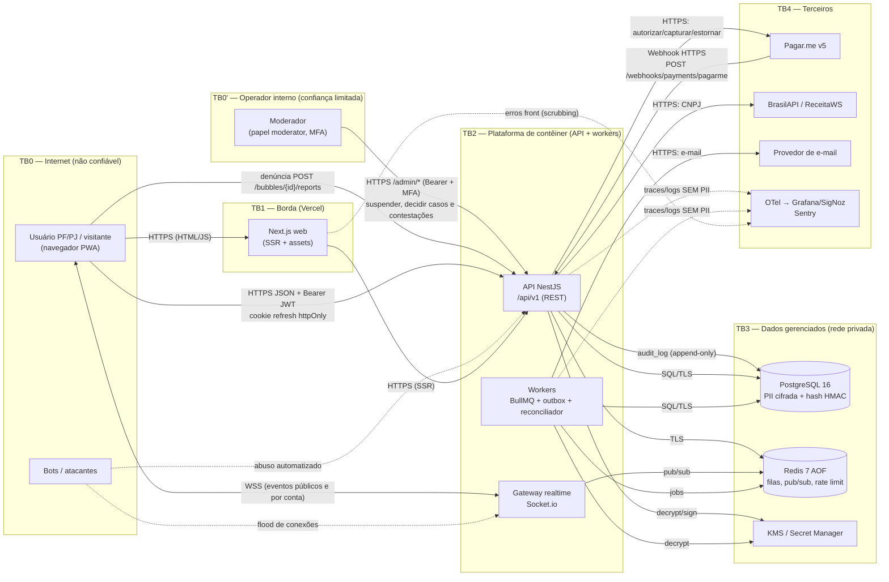

# Threat Model — Bolha Venda

**Versão:** 1.0 · **Data:** 06/10/2026 · **Status:** Rascunho para revisão
**Base:** [PRD v2.1](../../PRD.MD) · [Spec do Produto v1.1](../../SPEC.md) · [Plano de Projeto v2](../planing-project.md) · [API REST](../05-arquitetura/api-rest.md) · [API WebSocket](../05-arquitetura/api-websocket.md)

> Método: decomposição da aplicação, ativos, ameaças e mitigações, conforme a abordagem NIST 800-30 recomendada pelo OWASP WSTG. Categorização STRIDE por elemento do DFD. Arquitetura conforme ADR-0001 a ADR-0012 (todas **propostas**). Revisar a cada gate e sempre que surgir um novo fluxo de dados (ex.: OAuth Google, novo gateway).

---

## 1. Escopo e ativos

| Ativo | Por que importa | Classificação |
| :--- | :--- | :--- |
| Dinheiro em trânsito (pré-autorizações, capturas, estornos, repasses) | Perda financeira direta, CDC e estorno 100% (PRD §4.1) | Crítico |
| Integridade da cota e do estado da bolha | Overbooking e explosão errada (RNF02) | Crítico |
| PII: CPF, CNPJ, e-mail, endereço, dados bancários de recebedor | LGPD (RNF03), R6 | Crítico |
| Credenciais e sessões (senha, JWT, refresh) | Tomada de conta | Alto |
| Score e eventos de reputação | Decisões de confiança, art. 20 da LGPD (revisão de decisão automatizada) | Alto |
| Poder de moderação (F12, RF09) e trilha de auditoria | Suspende bolhas e contas, decide estornos e repasses e julga contestações. É o caminho mais curto para fraude interna | Crítico |
| Disponibilidade das cotas (inclusive reservas Pix de 15 min) | *Denial of inventory* afeta o negócio central (F5) | Alto |
| Disponibilidade do canvas e do tempo real | Experiência central (RF02) | Médio |
| Segredos (chaves KMS, segredo HMAC do webhook, chave do gateway, chave de assinatura JWT) | Comprometem todos os anteriores | Crítico |

---

## 2. Diagrama de fluxo de dados (DFD) e fronteiras de confiança

**Fronteiras críticas:** TB0→TB2 (toda entrada de usuário e de bots), TB0'→TB2 (operador interno com poderes financeiros: tratado como **não plenamente confiável**), TB4→TB2 (webhook do gateway, que é entrada não autenticada por sessão) e TB2→TB4 (saída de dados pessoais para terceiros, inclusive transferência internacional: ver [LGPD/RIPD](lgpd-ripd.md)).

---

## 3. STRIDE por elemento

Legenda: S Spoofing, T Tampering, R Repudiation, I Information disclosure, D Denial of service, E Elevation of privilege. Os IDs **TM-xx** apontam para a §4.

| Elemento | S | T | R | I | D | E |
| :--- | :--- | :--- | :--- | :--- | :--- | :--- |
| **Navegador / PWA** | Roubo de sessão por XSS (TM-11) | Manipulação de preço ou quantidade no cliente: o servidor recalcula tudo | — | Token em `localStorage`: o access token fica só em memória | — | — |
| **API REST** | Credential stuffing (TM-10); JWT forjado (alg `none`, chave fraca) | Mass assignment (ex.: `status`, `filled_quotas` no corpo); replay de Idempotency-Key (TM-08) | Usuário nega ter aderido ou dado lance: `audit_log` e registro de consentimento | IDOR em triagem e lances (TM-07); enumeração de CPF/e-mail (TM-06); erros verbosos | Bots esgotando cotas (TM-01); rajadas caras (`bbox` enorme) | Comprador acessa ação de vendedor (BFLA); PJ burla `max_pj_share` |
| **Gateway WS** | Conexão sem token assumindo room privada | Cliente emitindo eventos de domínio | — | Room por bolha vazando dados de participante (TM-12) | Flood de conexões e assinaturas (TM-09) | Inscrição em room `account:{id}` alheia |
| **Console / API de moderação** (`/admin/*`) | Credencial de moderador roubada (phishing) | Decisão alterada após o fato; ação em caso próprio ou de conta ligada | Moderador nega ter suspendido ou liberado repasse: `audit_log` imutável (TM-17) | Moderador vê PII além do necessário ao caso | Denúncias em massa inundando a fila (TM-16) | Usuário comum acessando `/admin/*` (BFLA); moderador concedendo papel a si mesmo |
| **Denúncia** (`POST /bubbles/{id}/reports`) | Contas falsas denunciando | — | — | — | Brigada de denúncias contra concorrente (TM-16) | — |
| **Workers / jobs** | — | Job injetado no Redis | Explosão sem trilha: o outbox mais a auditoria cobrem | — | Fila parada com timers atrasados (R3) | Worker com credencial de BD ampla demais |
| **PostgreSQL** | — | Alteração direta de saldo ou estado por credencial vazada | — | Vazamento de dump (R6): PII cifrada em coluna (ADR-0012) | Esgotamento do pool na rajada | Usuário da app com DDL |
| **Redis** | — | Manipulação de jobs e de contadores de rate limit | — | Payloads de job com PII | Perda de dados no restart (AOF + reconciliador) | Redis exposto sem auth/TLS |
| **Webhook Pagar.me (entrada)** | Webhook forjado (TM-05) | Corpo alterado | Gateway diz ter enviado e a app diz não ter recebido: `webhook_events` | — | Rajada de webhooks | — |
| **BrasilAPI / ReceitaWS** | Resposta falsificada (DNS/MITM) | — | — | Envio desnecessário de dados (só o CNPJ sai) | Indisponibilidade bloqueia cadastro PJ: fallback e fila | — |
| **E-mail** | Phishing imitando a marca | — | — | E-mail com dados excessivos | — | — |
| **Observabilidade** | — | — | Lacunas de log | PII em logs, spans ou breadcrumbs do Sentry (TM-13) | — | Acesso amplo ao Grafana |
| **KMS / segredos** | — | — | Uso de chave sem trilha | Segredo em repositório ou CI (TM-14) | — | Papel de CI com acesso a segredos de produção |

---

## 4. Ameaças específicas do domínio

| ID | Ameaça | Cenário | Controles | Risco residual |
| :--- | :--- | :--- | :--- | :--- |
| **TM-01** | **Bots esgotando cotas** (*denial of inventory*) | Contas automatizadas ocupam cotas para impedir a adesão real ou forçar a explosão por lotação, e depois desistem (saída de cota) | (1) Cada cota exige **pré-autorização real** no cartão ou Pix pago (ADR-0003). É o principal custo de ataque. (2) Rate limit por conta, IP e dispositivo em `POST /quotas` (contrato da API: 10/min e 3/min por bolha; saída: 10/h), com token bucket no Redis. (2b) Para reservas Pix, ver TM-19. (3) CAPTCHA **adaptativo** (só após sinais de risco: conta nova, velocidade alta, ASN de datacenter). (4) Contas PF verificadas (e-mail e, para criar ou participar acima de um valor, telefone). (5) Saída bloqueada quando `is_expiring`. (6) Teto PJ (ADR-0006). (7) Alerta de adesão e saída repetidas | **Médio.** CAPTCHA é defesa em profundidade, não prevenção (OWASP Authentication Cheat Sheet). Fazendas de cartões continuam possíveis |
| **TM-02** | **Sniping** em lances e na janela final | (a) PJ espera o fim para cobrir o menor lance por R$ 0,01, vendo os lances (ADR-0005 os expõe com pseudônimo). (b) Entrada ou saída coordenada no fim para manipular o degrau | (a) **Decisão de produto pendente**: lance selado até a explosão ou extensão anti-sniping (ex.: +10 min se houver lance nos últimos 10 min). Registrar na ADR-0005. Decremento mínimo de lance (ex.: 1%). (b) Saída proibida quando `is_expiring`; preço final único (ADR-0004) | **Médio** até a decisão (a); **baixo** para (b) |
| **TM-03** | **Manipulação de score e conluio** | Contas ligadas fazem transações fictícias entre si para acumular +20/+30. Grupo coordenado aplica eventos negativos a um concorrente | (1) O evento positivo só vem de transação **capturada e concluída** acima de um valor mínimo. (2) Teto de eventos positivos por par de contas por período. (3) Peso por **contrapartes distintas**. (4) O criador já é proibido de participar da própria bolha (Spec §2, `CREATOR_CANNOT_JOIN`). Estender por detecção de vínculo (mesmo CNPJ raiz, instrumento de pagamento, dispositivo, endereço) a **contas ligadas** ao criador. (5) Contestação em 5 dias com revisão humana (art. 20 da LGPD). (6) `score_model_version` auditável. (7) A take rate de 6% torna o conluio caro | **Médio.** Exige monitoramento contínuo; sugerir à ERS as regras (1)–(4) |
| **TM-04** | **Lances falsos** | PJ dá lance baixo sem intenção de entregar, para vencer e depois cancelar (dano ao concorrente e aos compradores), ou usa empresa de fachada | CNPJ **ATIVO** com revalidação de 30 dias (ADR-0008). Cancelamento por culpa vale −60 (ADR-0007). 1 lance ativo por empresa por bolha (Spec F8). Limite global de lances ativos por PJ. Score mínimo para dar lance (proposta). Denúncia na triagem. Moderação pode suspender a PJ e cancelar (estorno total) | **Médio** |
| **TM-05** | **Webhook forjado ou repetido** | Atacante envia `paid`/`refunded` falso para liberar envio ou repasse | (1) Verificação de assinatura sobre o **corpo bruto**, com comparação em tempo constante. O contrato da API adota `X-Hub-Signature` (HMAC) e allowlist de IP. **Confirmar na documentação do Pagar.me v5 que esse cabeçalho existe** (HMAC × Basic Auth configurável). Se não houver HMAC, usar Basic Auth com segredo forte e rotacionável. (2) **Reconsulta à API do gateway** (`GET` da cobrança) antes de qualquer transição financeira: o webhook é só um gatilho. (3) `webhook_events` único por id do evento do provedor. (4) Máquina de estados de pagamento monotônica (tolera ordem trocada). (5) Endpoint sem CORS, com limite de tamanho e allowlist de IP se o provedor publicar uma | **Baixo** com (2) |
| **TM-06** | **Enumeração de CPF / e-mail / CNPJ** | `POST /auth/register` responde "CPF já cadastrado", o que permite descobrir quem usa a plataforma; força bruta offline sobre hashes vazados | (1) Resposta genérica no cadastro e no "esqueci a senha" ("se os dados forem válidos, você receberá um e-mail"), com o mesmo status e tempo de resposta. A versão anterior do contrato da [API REST](../05-arquitetura/api-rest.md) expunha `409 EMAIL_ALREADY_REGISTERED`/`DOCUMENT_ALREADY_REGISTERED`. A correção para resposta genérica já foi pedida. Verificar no pentest. (2) Rate limit e CAPTCHA adaptativo no cadastro. (3) Hash de busca com **HMAC-SHA256 e chave secreta no KMS** (ADR-0012), não SHA-256 puro: o espaço de CPFs (~10⁹) é enumerável offline. (4) Pseudônimo público sem derivar do CPF | **Baixo** |
| **TM-07** | **IDOR / BOLA em triagem** | Usuário troca o `{id}` em `/triage/items/{id}/shipment`, `delivery-confirmation` ou `withdrawal` e age em item alheio. UUID v7 é ordenado por tempo e **não** é segredo | Checagem de autorização **em toda requisição, por objeto** (vendedor do item para `shipment`; comprador do item para `delivery-confirmation` e `withdrawal`). Consultas sempre com escopo (`WHERE id = :id AND buyer_id = :me`). Resposta 404 para não-dono. Matriz de autorização automatizada (CT-050), estendida a `/me/data-exports/{id}` e a `/admin/*` (só papel `moderator`). Mesma regra para `bids/{bidId}/select` (só o criador) e `score-events/{id}/disputes` (só o afetado) | **Baixo** |
| **TM-08** | **Replay / abuso de Idempotency-Key** | (a) Reenvio de uma requisição capturada. (b) Mesma chave com outro corpo para obter resposta em cache. (c) Chave de outro usuário | Chave com escopo (conta, rota) e hash do corpo. Corpo diferente dá 422. TTL de 24 h. Resposta armazenada só após commit. O access token de 15 min limita a janela de replay; TLS em tudo | **Baixo** |
| **TM-09** | **Abuso de WebSocket** | Flood de conexões, inscrição em milhares de tiles, mensagens grandes, conexão anônima consumindo fan-out | Limite de conexões por IP e por conta. Máximo de tiles por socket, proporcional ao viewport. Rate limit de mensagens do cliente. `maxHttpBufferSize` baixo. Checagem de `Origin`. Clientes **não emitem** eventos de domínio: só inscrição e cancelamento. Conexão anônima só em rooms públicas de tile. Room privada `user:{id}` exige JWT válido no handshake. Na expiração sem renovação, a conexão é rebaixada para anônima. Limites do contrato WS: 3 conexões por conta, 20 por IP anônimo, 64 tiles, 20 rooms de bolha, 4 KB por mensagem e `viewport.set` 4/s (o servidor calcula os tiles) | **Médio** (DDoS volumétrico depende do provedor/CDN) |
| **TM-10** | Tomada de conta | Credential stuffing; roubo de refresh token | Hash de senha Argon2id. Senha mínima de 15 caracteres sem MFA ou 8 com MFA (NIST SP 800-63B via OWASP). Throttling e bloqueio por conta. MFA opcional (obrigatório para PJ com repasse, proposta). Refresh rotativo com **detecção de reuso**: reuso revoga a família. Cookie `httpOnly; Secure; SameSite=Strict` | **Médio** |
| **TM-11** | XSS / conteúdo malicioso na bolha | `title`/`description` com script; `image_url` apontando para rastreador ou SSRF | Renderização escapada (React). CSP estrita. Upload de imagem para storage próprio com reprocessamento, em vez de URL arbitrária (ou, se houver busca server-side, allowlist e bloqueio de IP interno contra SSRF). Moderação de conteúdo | **Baixo** |
| **TM-12** | Vazamento de PII no canvas e no tempo real | Payload de `bubble.updated` ou `GET /bubbles` incluindo `account_id` ou nome | DTOs públicos com allowlist de campos e **só o pseudônimo** (lances: pseudônimo e score; a empresa vencedora é revelada só após a seleção, Spec F8). Nome e endereço de entrega só para as partes do mesmo item e só a partir da captura (Spec F1). Teste CT-048. Revisão de contrato | **Baixo** |
| **TM-13** | PII em logs e telemetria | CPF no log de erro de validação; e-mail em atributo de span; corpo de requisição no Sentry | Logger com *redaction* por schema. Atributos OTel em allowlist. `sendDefaultPii=false` e `beforeSend` no Sentry. CT-049 no CI | **Baixo** |
| **TM-14** | Vazamento de segredos | Chave do gateway em `.env` commitado; segredo exposto em log do CI | Ver §7 | **Baixo** |
| **TM-15** | Fraude de pagamento e chargeback | Cartão roubado para aderir; contestação após o recebimento | Antifraude do gateway. 3DS quando disponível. O repasse só sai após a janela de arrependimento. Política de chargeback nos Termos do Vendedor | **Médio** |
| **TM-16** | **Abuso de denúncia** (F12) | Concorrente ou grupo coordenado denuncia em massa uma bolha legítima para forçar a suspensão (que estorna 100% e mata a bolha), ou inunda a fila para esconder um caso real | (1) Só usuário logado denuncia (Spec F12), com dedupe por (conta, bolha) e rate limit. (2) **A denúncia nunca suspende automaticamente**: só aumenta a prioridade na fila, e a suspensão é sempre ato humano com motivo. (3) Peso da denúncia por idade da conta e histórico de denúncias procedentes. Denunciante com taxa alta de improcedência perde peso. (4) Detecção de brigada (muitas denúncias de contas novas ou ligadas em pouco tempo). (5) Categoria "fraude" com campo de evidência | **Baixo** |
| **TM-17** | **Moderador malicioso ou comprometido** (F12, RF09) | Moderador suspende concorrente, decide caso de triagem a favor de conta ligada (libera repasse indevido), julga contestação para inflar score, ou apaga rastros | (1) Papel `moderator` com **MFA obrigatório** e sessão curta; acesso a `/admin/*` só por rede ou dispositivo gerenciado (proposta). (2) **Trilha de auditoria imutável** (Spec F12): `audit_log` *append-only*. O papel de banco da aplicação não tem `UPDATE`/`DELETE`, há encadeamento de hash por registro e exportação periódica para armazenamento WORM separado. Cada registro guarda quem, quando, IP, motivo obrigatório, estado antes e depois. (3) **Segregação**: o moderador não atua em casos que envolvam a própria conta ou contas vinculadas (checagem automática), nem concede papéis (apenas `admin`). (4) **Dupla aprovação** (*four-eyes*) para ações de alto impacto: liberar repasse acima de um limiar, suspender conta PJ, reverter mais de N eventos de score por dia. (4b) A contestação de score é julgada por **moderador diferente** do caso original (Spec F10). **Suspensão de conta** (Spec §6, B13): cancela as bolhas ativas da conta com estorno de 100%, libera as cotas dela e retém o repasse das triagens em andamento. Por ter efeito financeiro amplo, entra na dupla aprovação. (5) Revisão amostral semanal das decisões por um segundo moderador e alertas de anomalia (volume, padrão de decisões a favor de uma conta). (6) Moderador vê PII **só do caso** (minimização) | **Médio**: depende de processo humano |
| **TM-18** | Abuso do caso de triagem | Comprador abre "Não recebi" falso para pausar o repasse ou forçar estorno após receber | Rastreio obrigatório no envio. Evidências anexadas. Só é possível abrir caso em `SHIPPED`/`DELIVERED` e até o fim da janela de arrependimento (Spec F9). Caso improcedente retoma os prazos de onde parou. Chargeback improcedente após `COMPLETED` vale −40 (Spec F10). Limite de casos abertos por conta. Histórico visível ao moderador | **Médio** |
| **TM-19** | **Abuso de reservas Pix para bloquear as últimas vagas** (F5, Spec v1.1) | Na Spec v1.1, a reserva Pix **ocupa capacidade** (`filled_quotas + reserved_quotas ≤ max_quotas`) e a reserva expirada **não penaliza o score**. Um bot pode reservar as últimas vagas com Pix e não pagar, repetindo a cada expiração. Isso impede a lotação (a explosão por lotação exige `filled = max`) e trava concorrentes a custo zero | (1) **No máximo 3 reservas Pix abertas por conta** (decisão do coordenador; o PF já é limitado a 1 por bolha). (2) **3 reservas expiradas em 24 h bloqueiam o Pix da conta por 24 h** (o cartão continua disponível). (3) **Prazo curto:** `min(15 min, tempo restante)` e Pix desligado nos últimos 5 min (Spec F5). (4) **Rate limit** de criação de cobrança Pix por conta, IP e dispositivo, mais CAPTCHA adaptativo (TM-01). (5) Mensagem transparente "N reservas aguardando pagamento" e a vaga reabre na expiração (CT-066). (6) Detecção de contas ligadas alternando reservas e alerta de taxa de expiração por bolha. Testes: CT-065 a CT-069 | **Médio** com (1)–(4). Contas múltiplas ainda conseguem manter algumas vagas presas por até 15 min por ciclo |

---

## 5. Backlog de segurança priorizado

Prioridade: **P0** bloqueia o Gate E; **P1** entra antes do beta público; **P2** vai para o pós-go-live. Os IDs SEC-xx são locais a este documento.

| ID | Item | Ameaças | Sprint alvo | Prioridade |
| :--- | :--- | :--- | :--- | :--- |
| SEC-01 | Verificação do webhook + reconsulta ao gateway + `webhook_events` único | TM-05 | S5 | P0 |
| SEC-02 | Middleware de autorização por objeto + matriz automatizada (triagem, lances, contestação) | TM-07 | S6 | P0 |
| SEC-03 | Idempotency-Key com escopo e hash do corpo | TM-08 | S3 | P0 |
| SEC-04 | Criptografia de coluna (AES-256-GCM) + HMAC de busca com chave no KMS + rotação | TM-06, R6 | S1 | P0 |
| SEC-05 | Redaction de logs/OTel/Sentry + CT-049 no CI | TM-13 | S1 | P0 |
| SEC-06 | Auth: Argon2id, throttling, refresh rotativo com detecção de reuso, cookie seguro | TM-10 | S1 | P0 |
| SEC-07 | Rate limit (API e WS) + limites de conexão e inscrição WS | TM-01, TM-09 | S4 | P0 |
| SEC-08 | Respostas anti-enumeração em cadastro e recuperação de senha | TM-06 | S1 | P0 |
| SEC-09 | Headers (CSP, HSTS, `X-Content-Type-Options`, `frame-ancestors`) + upload de imagem seguro | TM-11 | S2 | P0 |
| SEC-10 | Gestão de segredos (§7) + gitleaks + OIDC no CI | TM-14 | S0–S1 | P0 |
| SEC-11 | CAPTCHA adaptativo e sinais de risco na aquisição de cota | TM-01 | S7 | P1 |
| SEC-12 | Decisão anti-sniping de lances (ADR-0005) | TM-02 | S5 | P1 |
| SEC-13 | Regras anticonluio do score (contrapartes distintas, teto por par, vínculo) | TM-03 | S7 | P1 |
| SEC-14 | Limite de lances ativos e score mínimo para dar lance | TM-04 | S6 | P1 |
| SEC-15 | Painel de detecção de abuso (adesão e saída repetidas, velocidade, vínculos) | TM-01, 03 | S8 | P2 |
| SEC-16 | MFA obrigatório para PJ com repasse | TM-10 | S8 | P1 |
| SEC-17 | `audit_log` append-only (sem UPDATE/DELETE, hash encadeado, exportação WORM) + motivo obrigatório em toda ação de moderação | TM-17 | S6 | P0 |
| SEC-18 | MFA para moderador, segregação (sem casos próprios ou ligados), dupla aprovação para ações de alto impacto | TM-17 | S7 | P0 |
| SEC-19 | Anti-abuso Pix: máx. 3 reservas abertas por conta; 3 expiradas em 24 h → Pix bloqueado 24 h; rate limit de cobranças; Pix desligado nos últimos 5 min | TM-19 | S5 | P0 |
| SEC-20 | Denúncia: dedupe, rate limit, sem suspensão automática, peso por reputação do denunciante | TM-16 | S7 | P1 |
| SEC-21 | Casos de triagem: limite por conta, evidência obrigatória, evento de score por abuso | TM-18 | S6 | P1 |
| SEC-22 | Verificar no pentest e no CI que o cadastro e a recuperação de senha respondem de forma genérica (correção já pedida no contrato da API) | TM-06 | S1 | P0 |

---

## 6. OWASP ASVS nível 2 — checklist resumido

Referência: ASVS 4.0.3, citada no corpus consultado (V1.4.1, V4.1.1). Avaliar o mapeamento para a versão mais recente antes do pentest.

| Capítulo | Requisitos-chave aplicados ao Bolha Venda | Status alvo (Gate E) |
| :--- | :--- | :--- |
| V1 Arquitetura e modelagem de ameaças | Threat model mantido (este doc). Controles de acesso no servidor (V1.4.1). Segregação TB0–TB4 | ☐ |
| V2 Autenticação | Argon2id, política NIST 800-63B, anti-automação, MFA para PJ com repasse, recuperação segura | ☐ |
| V3 Sessão | Access JWT de 15 min em memória. Refresh rotativo `httpOnly/Secure/SameSite`. Revogação no logout e no reuso | ☐ |
| V4 Controle de acesso | Negar por padrão. Checagem por objeto em toda requisição (V4.1.1). Sem BOLA/BFLA. Ações administrativas com auditoria | ☐ |
| V5 Validação, sanitização, encoding | Zod em toda entrada (`contracts`). Allowlist de campos (sem mass assignment). Saída escapada | ☐ |
| V6 Criptografia armazenada | AES-256-GCM com chave no KMS. HMAC-SHA256 para busca. Rotação de chave documentada | ☐ |
| V7 Erros e logs | problem+json sem stack. Logs sem PII. Eventos de segurança (login, reuso de refresh, 401 de webhook, IDOR) auditados | ☐ |
| V8 Proteção de dados | Minimização. Retenção conforme RIPD. Sem PII no canvas. Cache-Control em respostas sensíveis | ☐ |
| V9 Comunicação | TLS 1.2+ em todos os saltos, inclusive Postgres e Redis. HSTS | ☐ |
| V10 Código malicioso | Lockfile, Dependabot, revisão de dependências novas, SBOM | ☐ |
| V11 Lógica de negócio | Limites de taxa por fluxo (cota, lance, cadastro). Ordem de passos garantida pela máquina de estados. Anti-sniping e anticonluio | ☐ |
| V12 Arquivos e recursos | Upload de imagem: tipo e tamanho validados, reprocessamento, storage sem execução, sem SSRF | ☐ |
| V13 API e web services | Idempotency-Key. Paginação por cursor com limite. Webhook autenticado | ☐ |
| V14 Configuração | Headers de segurança. Sem debug em produção. Segredos fora do código. Build reprodutível | ☐ |

---

## 7. Gestão de segredos

| Segredo | Onde vive | Rotação | Quem acessa |
| :--- | :--- | :--- | :--- |
| Chave mestra de criptografia de PII (KEK) | KMS do provedor de nuvem (não exportável) | Anual, com rotação de DEK por *envelope encryption* | Só as identidades de serviço da API e do worker |
| Chave de HMAC de busca (CPF/CNPJ/e-mail) | Secret Manager | Excepcional. Rotação exige recalcular os hashes (job dedicado) | API |
| Chave de assinatura JWT | Secret Manager, com `kid` no header | 90 dias, com 2 chaves ativas na transição | API |
| API key do Pagar.me, segredo do webhook | Secret Manager | 90 dias ou imediata em incidente | API e worker |
| Credenciais de Postgres e Redis | Secret Manager, usuário por serviço | 90 dias (ou credenciais dinâmicas) | Serviço correspondente |
| Tokens de deploy | **OIDC** GitHub Actions → nuvem, sem segredo de longa duração | Por job | Pipeline |

Regras:
- Nenhum segredo em repositório, imagem Docker ou variável de build da Vercel exposta ao cliente (`NEXT_PUBLIC_*` nunca contém segredo).
- Segredos diferentes por ambiente. Staging nunca acessa chaves de produção.
- gitleaks no PR e no histórico, com alerta para a ação de leitura de segredo no CI.
- Logs do CI pesquisáveis por ≥ 90 dias.
- Inventário de segredos (este quadro) mantido versionado.

Base: OWASP Secrets Management Cheat Sheet (seções 3.2, 3.5 e 4).

Política operacional (inventário por ambiente, rotação/incidente, gitleaks, OIDC e loader de
segredos): [gestao-segredos.md](gestao-segredos.md) (BV-110).

---

## 8. Plano de pentest

| Item | Definição |
| :--- | :--- |
| **Quando** | S8 (15–26/02/2027), sobre o *release candidate* em staging-prod-like. Reteste dos achados até 26/02 |
| **Quem** | Terceiro independente (ou pentester interno sem participação no desenvolvimento) |
| **Tipo** | **Caixa cinza**: contas PF, PJ e de criador, documentação da API (OpenAPI) e este threat model |
| **Escopo** | Web (Next.js), API `/api/v1`, Socket.io, endpoint de webhook, fluxos de pagamento em **sandbox** |
| **Fora de escopo** | Infraestrutura do provedor de nuvem, Pagar.me, BrasilAPI, engenharia social, DoS volumétrico |
| **Metodologia** | OWASP WSTG, com ênfase em: autorização (WSTG-ATHZ: IDOR, escalação horizontal e vertical), lógica de negócio (WSTG-BUSL: defesas contra uso indevido, limites de fluxo), sessão, entrada e webhook |
| **Casos obrigatórios** | TM-01 a TM-19. Corrida na última cota com ferramenta própria. Burla do teto PJ. Lance > `target_price`. Criador participando da própria bolha. Arrependimento fora do prazo. Replay de Idempotency-Key. Inscrição em room alheia. Acesso a `/admin/*` sem papel. Moderador agindo em caso próprio. Tentativa de alterar ou apagar `audit_log`. Bloqueio das últimas vagas por reservas Pix (3 reservas abertas, cooldown de 24 h) |
| **Critério de saída (Gate E)** | **Nenhum achado crítico ou alto aberto** (plano §3). Médios com plano e prazo aceitos pelo PO e pelo Tech Lead |
| **Entregáveis** | Relatório com CVSS e evidências. Tickets por achado. Atualização deste threat model (riscos residuais) |

---

## 9. Riscos residuais aceitos (para aprovação no Gate E)

1. CAPTCHA e rate limit não impedem atacante com muitos cartões válidos (TM-01): aceito, com monitoramento (SEC-15).
2. Lances visíveis permitem sniping até a decisão SEC-12 (TM-02).
3. DoS volumétrico depende da proteção do provedor (TM-09).
4. Conluio sofisticado no score (TM-03) exige revisão periódica do modelo (nova `score_model_version`).
5. A moderação depende de processo humano (TM-17). A auditoria imutável dá detecção e responsabilização, não prevenção total.
6. Em R1 o score é só informativo (Spec F10/Q4), o que reduz o ganho do conluio. O risco cresce no R2, quando o score passar a restringir participação.

---

## Fontes consultadas (AlterEgo)

- **threat-modeler** — OWASP, *Web Security Testing Guide*: "Threat Modeling" (abordagem NIST 800-30: decompor, classificar ativos, ameaças, mitigações; pytm e Threat Dragon), "The OWASP Testing Framework" fases 2.4 e 4.1 (threat model no design, pentest no deploy), WSTG-ATHZ-03 (escalação de privilégio horizontal e vertical), WSTG-BUSL-07 (defesas contra uso indevido de aplicação).
- **threat-modeler** — Izar Tarandach, *pytm — A Pythonic framework for threat modeling* (README): geração de DFD e ameaças a partir do modelo.
- **asias-threat-modeling** — OWASP WSTG, introdução: taxonomia de ameaças STRIDE e causa raiz (design, código, configuração).
- **seguranca-aplicada / asias-appsec** — OWASP *Authorization Cheat Sheet* (IDOR/CWE-639; checagem por objeto em toda requisição; ASVS 4.0.3 V1.4.1 e V4.1.1; testes de autorização); OWASP *Authentication Cheat Sheet* (NIST 800-63B, proteção contra ataques automatizados, CAPTCHA como defesa em profundidade, mensagens genéricas); OWASP *GraphQL Cheat Sheet* (BOLA/BFLA); OWASP *Session Management Cheat Sheet* (cookies `Secure`, TLS).
- **seguranca-aplicada** — OWASP *Secrets Management Cheat Sheet* (segredos no CI/CD, rotação, logs ≥ 90 dias, uso de secret manager do provedor, envelope encryption).
- **asias-iam** — OpenID Foundation, *OpenID Connect Core 1.0* §16.8–16.9 (restrição de audiência e reuso de token).
- **security** — Trimstray, *The Book of Secret Knowledge* (referências OWASP ASVS 4.0, WSTG, API Security).
