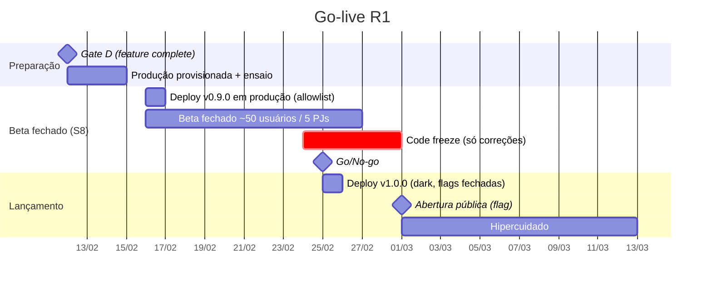

# Plano de Release e Go-live — Bolha Venda R1

**Versão:** 1.0 · **Data:** 06/10/2026 · **Status:** Rascunho para revisão
**Base:** [PRD v2.1](../../PRD.MD) (RNF01–RNF06, §10) · [Spec do Produto](../../SPEC.md) (§8 critérios de aceite da R1) · [Plano de Projeto v2](../planing-project.md) (§3 Gate E, §5 cronograma, §7 riscos)

> Estratégia para passar do Gate D (feature complete, 12/02/2027) ao beta fechado (S8, 15–26/02/2027) e ao **beta público em 01/03/2027 (segunda-feira)**, seguido de 2 semanas de hipercuidado. Decisões técnicas assumidas: ADR-0001, ADR-0003, ADR-0010, ADR-0011 (status **Proposto**).

---

## 1. Estratégia em fases

| Fase | Quem acessa | Como é controlado | Saída |
| :--- | :--- | :--- | :--- |
| **0 — Ensaio** (12–15/02) | Time | Produção sem usuários externos; ensaio de deploy, rollback e restore | Ensaio de rollback < 10 min; restore dentro do RTO ≤ 4 h e RPO ≤ 15 min (RNF04) |
| **1 — Beta fechado** (16–26/02) | ≈ 50 PF + 5 PJs parceiras (R9) | Flag `beta_allowlist` (cadastro só por convite); pagamentos reais com limite de valor por bolha (`max_bubble_value_cents`) | Sem bug S1 aberto; SLOs no alvo por 7 dias; feedback triado |
| **2 — Beta público** (01/03) | Qualquer pessoa | `beta_allowlist` desligada; `public_signup_enabled` ligada às 10h | Ver critérios de sucesso (seção 9) |
| **3 — Hipercuidado** (01–12/03) | Público | Freeze de features; só correções | Encerramento formal com revisão de SLO |

A versão `1.0.0` vai para produção na **quinta-feira 25/02** com as flags públicas fechadas ("dark launch"); a abertura de 01/03 é só uma troca de flag, reversível em segundos. Assim, o dia do lançamento não tem deploy.

---

## 2. Checklist pré-go-live (Gate E)

Responsável pela consolidação: Release Manager (papel exercido pelo Tech Lead com DevOps/SRE). Itens sem evidência = **No-go**.

**Produto e qualidade**
- [ ] Critérios de aceite da Spec §8 cumpridos: F1–F12 de ponta a ponta em staging com gateway sandbox; casos de borda da Spec §6 com testes automatizados verdes.
- [ ] Teste de carga (k6) comprovando RNF01/RNF02: 500 bolhas com frame time p95 ≤ 16,7 ms nos 2 dispositivos de referência; tempo real p99 < 200 ms (commit → renderização); explosão p99 ≤ 2 s; 100 requisições na última cota → 1 sucesso.
- [ ] Auditoria WCAG 2.1 AA (RNF05): axe-core sem violações sérias + teste manual com leitor de tela.
- [ ] Beta fechado sem bug S1 aberto e sem S2 sem plano.
- [ ] Compatibilidade RNF06 verificada (2 últimas versões de Chrome, Edge, Firefox, Safari; PWA instalável).

**Segurança e LGPD**
- [ ] Pentest sem achado crítico/alto aberto; threat model STRIDE revisado.
- [ ] Checklist LGPD (RNF03): inventário de dados, RIPD, exportação e exclusão (RF01.4), plano de incidente; teste de "zero PII em logs" verde.
- [ ] Chaves de PII em KMS/secret manager; rotação documentada (ADR-0012).
- [ ] Termos de uso e política de privacidade publicados e versionados; validação jurídica.

**Pagamentos**
- [ ] Gateway em produção homologado (Pagar.me): pré-autorização, captura parcial, Pix com estorno, split/recebedor (ADR-0003).
- [ ] Validade da pré-autorização confirmada e compatível com a duração máxima de 5 dias (Spec Q1, R5); se menor, `BUBBLE_MAX_DURATION_HOURS` reduzido antes da abertura.
- [ ] Webhooks de produção configurados com segredo HMAC; teste de duplicidade feito.
- [ ] Conciliação diária rodou em staging por 7 dias seguidos sem divergência.
- [ ] Transação real de ponta a ponta com valor baixo (cartão e Pix), incluindo estorno.

**Operação**
- [ ] SLOs e alertas ativos ([slo-observabilidade.md](slo-observabilidade.md)); dashboards D1–D10 publicados.
- [ ] Runbooks RB-01…RB-12 revisados e **ensaiados** (pelo menos RB-02, RB-03, RB-09 e RB-11 em game day).
- [ ] Escala de on-call publicada para 01–12/03 (primário e secundário, com telefone), pager testado.
- [ ] Backup automático + PITR ativos; restore testado (RTO/RPO do RNF04).
- [ ] Rollback ensaiado (api, worker e web) em < 10 min.
- [ ] Kill switches testados em produção (seção 3).
- [ ] Página de status e templates de comunicação prontos ([resposta-incidentes.md §6](resposta-incidentes.md#6-comunicação)).
- [ ] Suporte: canal de atendimento, FAQ e macros de resposta (estorno, Pix, prazos de triagem).
- [ ] Limites de plataforma revisados: instâncias mínimas da API/worker, pool do Postgres, memória do Redis, cotas do gateway e do provedor de e-mail.

**Go/No-go (25/02, 14h):** PO + Tech Lead + Jurídico (aprovadores do Gate E), com QA e DevOps. Decisão registrada no log de `002-llm/001 log/`.

---

## 3. Feature flags e kill switches

Kill switches são flags de operação permanentes, alteráveis por on-call sem deploy, com efeito em ≤ 10 s e registro em `audit_log`. Cada uma tem comportamento definido para o usuário — nunca uma tela quebrada.

| Flag | Padrão | Efeito quando **desligada** | Quando usar | Quem pode acionar |
| :--- | :--- | :--- | :--- | :--- |
| `bubble_creation_enabled` | on | Botão "Criar bolha" desabilitado com aviso; `POST /bubbles` e `/publish` → 503 problem+json | Abuso, bug na criação, conteúdo proibido em massa | On-call |
| `quota_acquisition_enabled` | on | "Entrar na bolha" desabilitado; bolhas ativas continuam e explodem normalmente | Suspeita de overbooking (SLO-03), bug de preço | On-call (S1: imediato) |
| `payments_enabled` | on | Novas adesões e lances bloqueados; capturas e estornos **continuam** (para não deixar dinheiro preso) | Gateway instável, divergência financeira grave | On-call + responsável por pagamentos |
| `pix_enabled` | on | Só cartão disponível na adesão | Webhook Pix falhando (RB-05, RB-11) | On-call |
| `card_enabled` | on | Só Pix disponível | Falha de pré-autorização/captura (RB-12) | On-call |
| `captures_paused` | off | **Quando ligada**, capturas pós-explosão ficam em fila sem executar (respeitando a validade da pré-autorização) | Divergência de conciliação até entender a causa (RB-06) | Tech Lead |
| `purchase_bubbles_enabled` | on | Bolhas de compra e lances novos bloqueados | Bug em lances (ADR-0005) | On-call |
| `public_signup_enabled` / `beta_allowlist` | ver fases | Fecha cadastro novo / restringe a convidados | Pico incontrolável, ataque de cadastro | On-call |
| `realtime_degraded_mode` | off | **Quando ligada**, aumenta o intervalo de agregação de atualizações por bolha (100 ms → 1 s) e reduz rooms de tile por cliente | Pico de conexões WS (RB-08) | On-call |
| `notifications_email_enabled` | on | Só notificações in-app | Provedor de e-mail com problema, envio em massa indevido | On-call |
| `maintenance_mode` | off | **Quando ligada**, só leitura do canvas + banner; todas as escritas → 503 | Incidente S1 com risco a dados/dinheiro | IC |

Regras: kill switch não altera regra de negócio já contratada (bolhas ativas seguem até explodir; estornos devidos são feitos); explosões e reconciliador **nunca** são desligados por flag.

---

## 4. Estratégia de deploy

- **API (REST + WS):** deploy gradual por revisão (0% → smoke → 10% → 50% → 100%), equivalente a blue-green com transição de tráfego; a revisão anterior fica disponível por 24 h para rollback instantâneo. Detalhes em [pipeline-ci-cd.md §6](../06-engenharia/pipeline-ci-cd.md#6-estratégia-de-deploy).
- **Worker:** rolling com encerramento gracioso (jobs idempotentes, ADR-0011).
- **Web:** Vercel com promoção atômica; rollback com `vercel rollback`.
- **Banco:** somente migrations *expand* no release 1.0.0; nada *contract* na janela do lançamento nem no hipercuidado.
- **Janela:** segunda a quinta, 10h–16h BRT. **Nunca sexta-feira, véspera de feriado, feriado** (atenção: Carnaval 08–10/02/2027 já fica fora da janela) ou com incidente aberto. O lançamento público (01/03) não tem deploy, só troca de flag.

---

## 5. Smoke tests

Automatizados (`npm run test:smoke`), executados na revisão candidata antes de receber tráfego e de novo após 100%:

1. `GET /api/v1/health/ready` → db, redis e fila ok; versão correta em `service.version`.
2. Login com conta sintética de produção (`smoke-pf@…`, `smoke-pj@…`, marcadas como sintéticas e excluídas das métricas de negócio).
3. `GET /bubbles?bbox=…` retorna e o canvas renderiza (Playwright headless).
4. Conexão WS, entrada na room de uma bolha sintética e recebimento de `bubble.updated` após uma ação.
5. Criação e publicação de bolha sintética privada (visível só para contas de smoke) com 1 h de duração.
6. Aquisição de cota com cartão de teste do gateway em **modo de produção com valor mínimo** + saída da cota (libera a pré-autorização).
7. Webhook de teste assinado → `webhook_events` registrado e idempotente na repetição.
8. Job `bubble-expiring` agendado para a bolha sintética (verificação na fila).
9. Cancelamento da bolha sintética → estorno 100% confirmado.

Smoke manual pós-abertura (PO, 01/03 10h15): fluxo de Carlos (PF) e da TecnoLotes (PJ) em celular Android de referência e notebook.

---

## 6. Critérios de rollback

Rollback de aplicação (voltar 100% do tráfego à revisão anterior) é **obrigatório** — sem debate — se, após um deploy:

| Sinal | Limite | Janela |
| :--- | :--- | :--- |
| Taxa de 5xx da API | > 1% | 5 min |
| p99 de `POST /bubbles/{id}/quotas` | > 2× a linha de base da versão anterior | 10 min |
| Qualquer violação de integridade de cotas (SLO-03) | > 0 | imediato (+ `quota_acquisition_enabled` off) |
| Explosões atrasadas > 70 s | > 0 | imediato |
| Falha de smoke test | qualquer | imediato |
| Commit → renderização p99 | > 400 ms | 10 min |
| Erros JS no web (Sentry) | > 3× a linha de base | 15 min |

Rollback **não** desfaz migrations (são *expand*); se o problema for de dados, o IC decide entre *roll-forward* e restore (RB-09). Para a abertura pública, o "rollback" é religar `beta_allowlist` e desligar `public_signup_enabled`.

---

## 7. War room

| Item | Definição |
| :--- | :--- |
| Quando | Deploy de 25/02 (10h–13h) e abertura de 01/03 (9h30–18h); depois, check-ins diários às 10h durante o hipercuidado |
| Onde | Canal `#war-room-golive` + chamada de vídeo fixa; documento vivo do lançamento |
| Papéis | **Release Manager / IC**: Tech Lead · **Ops**: DevOps/SRE + Backend sênior · **Front**: Front sênior · **Pagamentos**: Backend pleno · **Comunicação**: PO · **QA**: smoke e verificação · **Jurídico**: disponível por telefone |
| Regras | Só o Ops altera produção; toda ação anotada com horário no documento vivo; decisões de rollback seguem a seção 6 sem votação |
| Painéis em tela | D1 (SLO), D3 (cotas), D4 (timers), D5 (tempo real), D7 (pagamentos), D10 (release) |

---

## 8. Comunicação

| Quando | Público | Canal | Mensagem | Dono |
| :--- | :--- | :--- | :--- | :--- |
| T−7 d | Beta fechado e PJs parceiras | E-mail | Data da abertura, o que muda, agradecimento | PO |
| T−1 d | Time e stakeholders | `#geral` | Plano do dia, escala, critérios de rollback | Tech Lead |
| T0 (10h) | Público | Site, redes, e-mail para lista de espera | Lançamento do beta público, como funciona (pré-autorização, Pix 15 min, estornos) | PO |
| T0 + 2 h, + 6 h | Stakeholders | `#geral` | Status (SLOs, cadastros, bolhas, incidentes) | PO |
| Diário (hipercuidado) | Stakeholders | Resumo às 18h | Métricas, incidentes, decisões | Release Manager |
| Em incidente | Usuários afetados | Página de status / banner / e-mail | Templates de [resposta-incidentes.md](resposta-incidentes.md#6-comunicação) | Comunicação (IC delega) |

---

## 9. Hipercuidado (01/03 – 12/03/2027)

- **Freeze de features**: só correções (`fix`) e itens de confiabilidade; deploys na janela padrão, com aprovação do Tech Lead.
- **On-call reforçado**: primário + secundário 24×7; tempo de reconhecimento P1 ≤ 5 min.
- **Ritual diário (10h, 30 min)**: revisão de D1/D6/D7, incidentes das últimas 24 h, fila de bugs (triagem por severidade S1–S4), feedback do suporte.
- **Monitoramento reforçado**: revisão manual da conciliação diária (RB-06) e das reservas Pix (RB-11) todos os dias; acompanhamento das primeiras explosões de cada tipo (venda/compra, tempo/lotação) e das primeiras capturas.
- **Critérios de saída (12/03)**: nenhum S1/S2 aberto; SLO-01/01b ≥ 99,5% no período; SLO-04 e SLO-05 dentro da meta; conciliação sem divergência por 7 dias; postmortems dos incidentes concluídos.
- **Encerramento**: retro de lançamento (blameless), revisão dos números do SLO (deixam de ser *ad hoc*), plano para os guardrails do PRD §10 com 60 dias de dados, e transição para a operação normal (on-call padrão, cadência mensal de revisão de SLO).

---

## Fontes consultadas (AlterEgo)

- **release-manager** — *Manual de Processo de Desenvolvimento de Software*, Fase 11 (Homologação e Go-live) §13.3 "Plano de Go-Live": janela com horários e responsáveis, checklist pré-go-live, sequência técnica com pontos de verificação, comunicação, smoke tests, rollback com critérios objetivos e war room nas primeiras horas (estrutura das seções 2, 5, 6, 7 e 8); §12.4: feature flags para desacoplar deploy de release, blue-green, canary e rolling (seções 1, 3 e 4).
- **sre** — Google, *The Site Reliability Workbook*, "Implementing SLOs": revisão frequente do SLO no início e decisões de lançamento guiadas pelo error budget (seção 9).
- **sre** — Google, *Site Reliability Engineering*, cap. "Managing Incidents": papéis separados, posto de comando reconhecido e documento vivo (seção 7).
