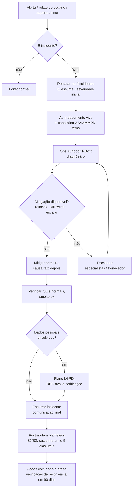

# Resposta a Incidentes — Bolha Venda

**Versão:** 1.0 · **Data:** 06/10/2026 · **Status:** Rascunho para revisão
**Base:** [PRD v2.1](../../PRD.MD) (RNF03, RNF04, RF07) · [Spec do Produto](../../SPEC.md) (§6, §8) · [Plano de Projeto v2](../planing-project.md) (Gate E, R6, E9)

> Como o time detecta, declara, coordena, comunica e aprende com incidentes. Complementa [slo-observabilidade.md](slo-observabilidade.md) (alertas), [runbooks.md](runbooks.md) (procedimentos) e o plano de resposta a incidentes de segurança/LGPD em `08-seguranca-compliance/`.

---

## 1. Definição

**Incidente** é qualquer evento não planejado que degrada ou ameaça a experiência do usuário, a integridade do dinheiro ou dos dados, ou a conformidade legal. Na dúvida, **declare** — rebaixar é barato; declarar tarde é caro.

Declarar imediatamente quando: um alerta P1 dispara; um segundo time precisa ser envolvido; o problema não é resolvido em 30 min por uma pessoa; há qualquer suspeita envolvendo dinheiro de usuário ou dados pessoais.

---

## 2. Severidades

| Sev. | Critério | Exemplos do domínio | Resposta |
| :--- | :--- | :--- | :--- |
| **S1 — Crítico** | Dinheiro ou dados de usuários em risco; produto indisponível; regra central violada | Overbooking ou PF com 2 cotas (SLO-03); cobrança indevida ou captura em duplicidade; bolha `EXPIRED_FAILED` sem estorno; cotas aceitas após `expires_at`; resultado de explosão calculado com reserva Pix não paga; vazamento suspeito de PII (RB-10); API ou WS indisponíveis para todos; explosões paradas de forma generalizada | 24×7; IC em ≤ 15 min; war room; atualização a cada 30 min; postmortem obrigatório |
| **S2 — Alto** | Funcionalidade importante degradada para muitos usuários, com contorno ou sem perda financeira | Explosões atrasadas > 70 s em algumas bolhas; webhooks parados com pagamentos pendentes; tempo real p99 > 200 ms prolongado; reservas Pix presas em bolhas ativas; capturas falhando em série por pré-autorização expirada; estornos travados > 72 h; SLO-01 queimando budget a 6× | 24×7 (P1/P2); IC em ≤ 30 min; atualização a cada 1 h; postmortem obrigatório |
| **S3 — Médio** | Problema limitado, com contorno, sem risco financeiro/legal | Notificações por e-mail atrasadas; lista acessível dessincronizada; falha em exportação de dados de um titular dentro do prazo; erro em um navegador específico | Horário comercial; dono nomeado; postmortem a critério do Tech Lead |
| **S4 — Baixo** | Cosmético ou sem impacto perceptível | Texto errado; animação de explosão sem fade em `prefers-reduced-motion` em um caso raro; painel interno quebrado | Backlog |

Severidade pode subir ou descer a qualquer momento; quem decide é o IC. Incidentes de segurança/dados entram como S1 até o DPO/Jurídico avaliar.

---

## 3. Papéis

Inspirado no Incident Command System; num time pequeno uma pessoa pode acumular papéis em S3/S4, mas em **S1 o IC não faz o trabalho de Ops**.

| Papel | Responsabilidades | Quem (padrão) |
| :--- | :--- | :--- |
| **Incident Commander (IC)** | Dono do incidente: declara e ajusta severidade, distribui papéis, mantém o documento vivo, decide (rollback, kill switch, escalonamento), encerra; acumula qualquer papel não delegado | On-call primário até passar o comando; Tech Lead em S1 |
| **Ops** | Diagnostica e altera o sistema seguindo runbooks; **único papel que altera produção** durante o incidente; reporta ao IC | On-call primário / Backend sênior |
| **Comunicação** | Atualizações periódicas para stakeholders e usuários (página de status, banner, e-mail, suporte); mantém o documento vivo atualizado | PO (horário comercial) ou on-call secundário |
| **Planejamento / Escriba** | Linha do tempo, tarefas de longo prazo (bugs, handoffs, revertendo desvios), coleta de dados para o postmortem | On-call secundário |
| **Especialistas** | Pagamentos, front/canvas, banco, segurança — entram quando chamados pelo IC | Conforme o tema |
| **DPO / Jurídico** | Incidentes com dados pessoais ou risco legal (CDC, LGPD): avaliação de risco, notificação à ANPD e aos titulares | Encarregado + Jurídico consultivo |

Escala de on-call: rotação semanal entre Tech Lead, Backend sênior, Backend pleno e Front sênior (primário + secundário); DevOps/SRE como apoio. Durante o hipercuidado, reforçada conforme o [plano de release §9](plano-release.md#9-hipercuidado-01-03--12-03-2027).

**Passagem de comando:** explícita ("Você agora é o IC, ok?") por chamada, com confirmação, anotada no documento e anunciada no canal.

---

## 4. Fluxo



Regras: **mitigar antes de entender** (rollback e kill switches são preferíveis a correções ao vivo); cada ação de Ops anotada com horário; nada de mudança paralela não coordenada; o IC pede atualização de status a cada intervalo da seção 2.

---

## 5. Escalonamento

| Gatilho | Para quem | Como |
| :--- | :--- | :--- |
| P1 sem reconhecimento em 5 min | On-call secundário | Pager automático |
| P1 sem reconhecimento em 15 min | Tech Lead | Pager + telefone |
| **S1 aberto há > 30 min sem mitigação** | **Tech Lead + PO** (e Jurídico se dinheiro/dados) | Telefone; IC passa a ser o Tech Lead se ainda não for |
| S1 aberto há > 2 h | Liderança/patrocinador do projeto | Resumo do IC |
| S2 sem mitigação em 2 h | Tech Lead | Canal + telefone |
| Fornecedor envolvido (gateway, nuvem, Redis/Postgres gerenciados, BrasilAPI/ReceitaWS) | Suporte do fornecedor | Ticket prioridade máxima; IC acompanha |
| Dinheiro de usuário afetado | Responsável por pagamentos + PO | Imediato |
| Dados pessoais possivelmente afetados | DPO + Jurídico | Imediato (inicia o relógio legal — seção 7) |

---

## 6. Comunicação

**Interna:** canal dedicado por incidente; resumo para stakeholders na cadência da severidade (S1 30 min, S2 1 h), no formato: *status · impacto · o que estamos fazendo · próxima atualização às HH:MM*.

**Usuários:** página de status (componentes: Canvas, Bolhas e cotas, Tempo real, Pagamentos, Notificações), banner no app e, quando houver impacto financeiro individual, e-mail direto aos afetados. Linguagem simples, sem jargão técnico, sem culpar fornecedores, sem prometer prazo que não controlamos.

| Momento | Template |
| :--- | :--- |
| Investigando | "Estamos investigando instabilidade em **[componente]**. Bolhas ativas continuam valendo e nenhum valor é capturado indevidamente. Próxima atualização às **HH:MM**." |
| Pagamentos pausados (kill switch) | "Entradas em bolhas estão temporariamente pausadas enquanto corrigimos um problema no processamento de pagamentos. Valores já reservados estão seguros; estornos devidos serão feitos integralmente." |
| Explosões atrasadas | "Algumas bolhas estão encerrando com atraso. O resultado considera o horário previsto de encerramento; ninguém será cobrado por entradas após o fim." |
| Resolvido | "O problema em **[componente]** foi resolvido às **HH:MM**. **[O que aconteceu em 1 frase]**. Se você foi afetado, **[o que faremos / o que fazer]**." |
| Impacto financeiro individual (e-mail) | "Identificamos que **[descrição]** afetou sua participação na bolha **[título]**. **[Ação: estorno de R$ X em até N dias / nenhuma ação necessária]**. Pedimos desculpas." |

Comunicações sobre incidentes de dados pessoais seguem exclusivamente o texto aprovado pelo DPO/Jurídico (seção 7).

---

## 7. Interface com o plano LGPD

Todo incidente que envolva **dados pessoais** (CPF, CNPJ de empresário individual, e-mail, nome, endereço, dados de pagamento, pseudônimos vinculáveis) aciona o plano de resposta a incidentes de segurança da pasta `08-seguranca-compliance/` em paralelo a este processo.

| Etapa | Responsável | Prazo |
| :--- | :--- | :--- |
| Registro do incidente de segurança com **momento da ciência** | IC | Imediato |
| Contenção e preservação de evidências ([RB-10](runbooks.md#rb-10--vazamento-suspeito-de-dados)) | Ops + Tech Lead | Primeiras horas |
| Avaliação de **risco ou dano relevante** aos titulares (natureza e volume dos dados, cifragem, possibilidade de reidentificação) | DPO + Jurídico | O mais cedo possível, para caber no prazo legal |
| **Comunicação à ANPD e aos titulares** afetados, quando houver risco ou dano relevante | DPO (controlador) | **Até 3 dias úteis** da ciência (Resolução CD/ANPD nº 15/2024). Meta interna do projeto: **72 h** (Plano R6/E9), o que é igual ou mais rigoroso na maioria dos casos |
| Complementação de informações à ANPD | DPO | Até 20 dias úteis da comunicação inicial, se necessário |
| Registro do incidente mantido (mesmo sem comunicação) | DPO | Guarda mínima de 5 anos |

> O prazo e o conteúdo da comunicação devem ser confirmados pelo Jurídico no plano LGPD; este documento só define quando e como acioná-lo.

Regras práticas: não apagar evidências; não discutir dados pessoais em canais abertos; nenhuma comunicação externa sem DPO; o postmortem é escrito sem PII.

---

## 8. Postmortem blameless

**Quando:** obrigatório para S1 e S2; para incidentes que consumiram > 20% do error budget de um SLO; para qualquer incidente com dinheiro ou dados de usuário; opcional para S3. Rascunho em até **5 dias úteis** após o encerramento; revisão em reunião de 45 min com os envolvidos; publicação em `002-llm/001 log/` (ou pasta de postmortems em `09-operacao/`) com link no log.

**Princípios:** foco no **o quê** e no **porquê** do sistema, nunca em **quem**; ações melhoram o sistema, não as pessoas; dados com link para a fonte; conciso, com transcrições longas em anexo.

### Template

```markdown
# Postmortem — [título curto] (INC-AAAA-NNN)

**Data do incidente:** DD/MM/AAAA · **Severidade:** S1|S2|S3 · **Status:** Rascunho | Revisado | Ações concluídas
**Autores:** · **IC:** · **Revisores:** · **Versão em produção:** vX.Y.Z

## Resumo
Duas ou três frases: o que aconteceu, impacto, como foi resolvido.

## Impacto
- Usuários afetados (quantidade, PF/PJ), bolhas afetadas, valores envolvidos (centavos/R$).
- SLOs afetados e **% do error budget consumido**.
- Impacto financeiro/legal (estornos, cobranças indevidas, dados pessoais — sim/não; se sim, referência ao registro LGPD).

## Tempos
| Início | Detecção | Mitigação | Resolução | TTD | TTM | TTR | Detectado por (alerta/usuário/time) |
| :--- | :--- | :--- | :--- | :--- | :--- | :--- | :--- |

## Linha do tempo (UTC−3)
| Hora | Quem/O quê | Ação / Observação |
| :--- | :--- | :--- |

## Gatilho e causa raiz
**Gatilho:** o que disparou.
**5 porquês:**
1. Por que [sintoma]? Porque …
2. Por que …? Porque …
3. Por que …? Porque …
4. Por que …? Porque …
5. Por que …? Porque … → **causa sistêmica**
**Fatores contribuintes:** processo, testes, observabilidade, documentação.

## Detecção e resposta
O alerta funcionou? O runbook existia e ajudou? O que atrasou a mitigação?

## Lições
**O que foi bem:** · **O que foi mal:** · **Onde tivemos sorte:**

## Ações
| # | Ação (verificável) | Tipo (Prevenir/Mitigar/Detectar/Processo) | Dono | Prioridade | Prazo | Ticket | Status |
| :--- | :--- | :--- | :--- | :--- | :--- | :--- | :--- |

## Verificação de recorrência (90 dias)
- Data agendada: DD/MM/AAAA (encerramento + 90 dias). Responsável:
- Critério: nenhum incidente com o mesmo gatilho/causa; ações P0/P1 concluídas; alerta/teste novo disparou corretamente em simulação.
- Resultado: [ ] Sem recorrência  [ ] Recorreu → reabrir e escalar ao Tech Lead.

## Informações de apoio
Links para dashboards, traces, logs (sem PII), PRs, conversas.
```

**Regras das ações:** toda ação tem **dono, prioridade, prazo e ticket**; tem estado final verificável (ex.: "alerta quando `pix_reservations_overdue > 0` por 5 min", não "melhorar monitoramento"); cada causa sistêmica tem ao menos uma ação de **Prevenir** ou **Mitigar**. Ações P0 entram na sprint corrente; P1 na próxima. O Tech Lead revisa ações vencidas na Review de cada sprint.

**Verificação em 90 dias:** um lembrete automático abre a checagem de recorrência; o resultado é anotado no próprio postmortem. Recorrência reabre o postmortem com severidade igual ou maior.

---

## 9. Métricas do processo

Acompanhadas mensalmente pelo Tech Lead: número de incidentes por severidade, TTD/TTM/TTR medianos, % de incidentes detectados por alerta (meta > 80%), % de ações de postmortem concluídas no prazo (meta > 90%), recorrências em 90 dias (meta 0), error budget consumido por incidente.

---

## Fontes consultadas (AlterEgo)

- **sre** — Google, *Site Reliability Engineering*, cap. "Managing Incidents": papéis (Incident Command, Ops como único grupo que altera o sistema, Comunicação, Planejamento), posto de comando reconhecido, documento vivo do incidente e passagem explícita de comando (seções 3 e 4).
- **sre** — Google, *The Site Reliability Workbook*, cap. "Postmortem Culture": ações com dono, prioridade e estado final mensurável; ações preventivas por tema; foco em "o quê" e não "quem"; postmortem publicado em menos de uma semana; conclusões baseadas em dados (seção 8).
- **sre** — Google, *The Site Reliability Workbook*, cap. "Implementing SLOs": escala do incidente pela fração do error budget consumida (seções 2 e 8).
- **postmortem-facilitator** — Pavlos Ratis, *Postmortem Templates*: template do livro de SRE (resumo, impacto, causas, gatilho, resolução, detecção, ações, lições "o que foi bem/mal/onde tivemos sorte", linha do tempo) e template de Michael Kehoe (TTD/TTM/TTR, tipos de ação Mitigar/Prevenir/Processo, dono, prioridade, prazo) (seção 8).
