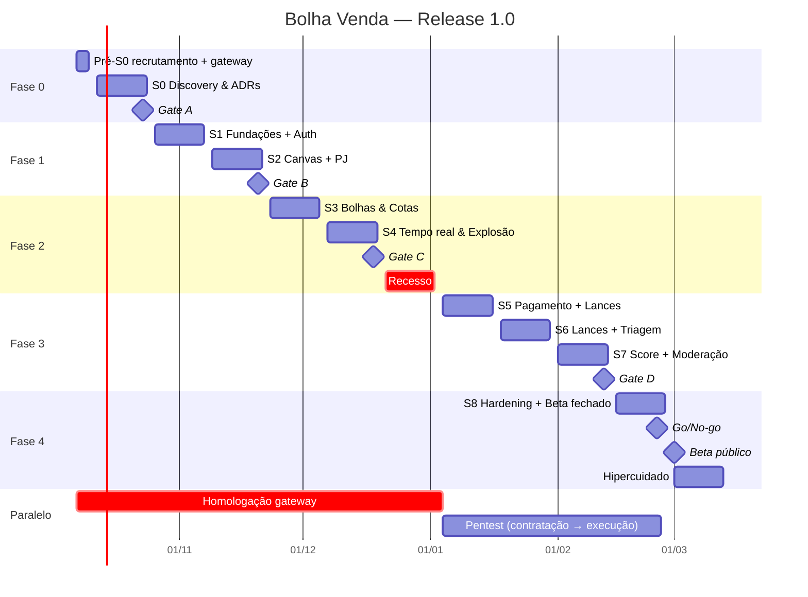
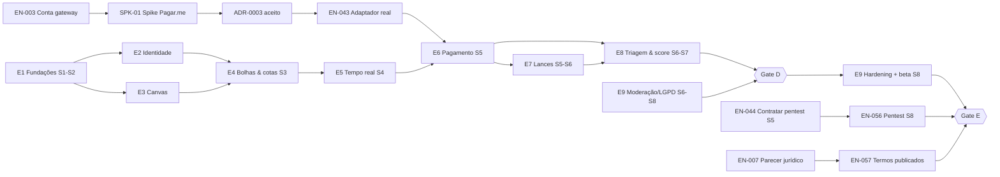

# Plano de Projeto — Bolha Venda (Sales Bubble) · Release 1.0

**Versão:** 3.0 (completo) · **Data:** 07/10/2026 · **Status:** Rascunho para aprovação no Gate A
**Base:** [PRD v2.1](../PRD.MD) · [Spec v1.1](../SPEC.md) · [ERS](03-requisitos/ers.md) · [Histórias](03-requisitos/historias-usuario.md) · [Matriz de rastreabilidade](03-requisitos/matriz-rastreabilidade.md) · [ADRs 0001–0012](05-arquitetura/adr/README.md) · [Plano de release](09-operacao/plano-release.md) · [REPO_MAP](../REPO_MAP.md)
**Substitui:** v2.0 (06/10/2026). A v3.0 consolida a documentação "modo full" gerada em 06/10. As decisões D1–D8 já têm ADR proposto. A estrutura analítica (EAP) agora inclui o trabalho técnico de E0, E1 e operação, que não tinha história de usuário. As sprints foram rebalanceadas e há uma seção para a próxima etapa: o levantamento de tarefas no Jira.

---

## Sumário

1. [Identificação e objetivo](#1-identificação-e-objetivo)
2. [Escopo da Release 1.0](#2-escopo-da-release-10)
3. [Premissas, restrições e dependências externas](#3-premissas-restrições-e-dependências-externas)
4. [Organização do time](#4-organização-do-time)
5. [Metodologia, cadência e ferramentas](#5-metodologia-cadência-e-ferramentas)
6. [Fases e gates](#6-fases-e-gates)
7. [Estrutura analítica do projeto (EAP)](#7-estrutura-analítica-do-projeto-eap)
8. [Cronograma por sprint](#8-cronograma-por-sprint)
9. [Caminho crítico e dependências](#9-caminho-crítico-e-dependências)
10. [Decisões e pendências](#10-decisões-e-pendências)
11. [Riscos](#11-riscos)
12. [Qualidade: DoR, DoD e gates de CI](#12-qualidade-dor-dod-e-gates-de-ci)
13. [Release, go-live e hipercuidado](#13-release-go-live-e-hipercuidado)
14. [Comunicação e governança do plano](#14-comunicação-e-governança-do-plano)
15. [Próxima etapa: levantamento de tarefas](#15-próxima-etapa-levantamento-de-tarefas)
16. [Histórico de revisões](#16-histórico-de-revisões)

---

## 1. Identificação e objetivo

| Item | Valor |
| :--- | :--- |
| Produto | Bolha Venda (Sales Bubble): compra e venda coletiva em canvas interativo (B2B, B2C, C2B, C2C) |
| Repositório | [`AlessonEvangelista/sales-bubble`](https://github.com/AlessonEvangelista/sales-bubble), branch `main` (ver [REPO_MAP](../REPO_MAP.md)) |
| Rastreamento | Jira `alessonevangelista.atlassian.net`, projeto **BV** |
| Período | 12/10/2026 (S0) → 01/03/2027 (beta público) → 12/03/2027 (fim do hipercuidado) |
| Patrocinador | **A definir** (lacuna G-01, bloqueia o Gate A) |

### 1.1 Meta da release

> **Até a Release 1.0 (beta público em 01/03/2027), consumidores (CPF) e empresas (CNPJ) poderão criar bolhas de venda e de compra e participar delas em um canvas em tempo real, com pagamento pré-autorizado, encerramento automático, triagem pós-explosão e score de reputação contestável.**

### 1.2 Métricas de sucesso (PRD §10) e guardrails

| Métrica | Meta | Medição |
| :--- | :--- | :--- |
| Taxa de sucesso das bolhas | > 65% | `EXPIRED_SUCCESS ÷ bolhas publicadas`, por coorte mensal |
| Conclusão da triagem | > 90% | `COMPLETED ÷ IN_TRIAGE`, por coorte mensal |
| Tempo até o sucesso | < 48 h (mediana) | `t(EXPIRED_SUCCESS) − t(ACTIVE)` |
| Latência de tempo real | p99 < 200 ms | Do commit no servidor à renderização no cliente (SLO-04) |
| Pontualidade da explosão | p99 ≤ 2 s; 100% ≤ 70 s | `exploded_at − expires_at` (SLO-05) |
| Desempenho do canvas | frame time p95 ≤ 16,7 ms com 500 bolhas | Benchmark em CI nos 2 dispositivos de referência + RUM (SLO-08) |
| *Guardrail* — estorno por cancelamento na triagem | < 5% | Dashboard de negócio D6 |
| *Guardrail* — contestações procedentes | < 2% | Dashboard de negócio D6 |
| *Guardrail* — integridade de cotas | 0 ocorrências | SLO-03 (qualquer ocorrência é S1) |

A instrumentação dessas métricas faz parte do escopo (EN-028, US-073). Sem ela, a meta da release não pode ser verificada. As metas de produto são recalibradas com 60 dias de dados reais.

---

## 2. Escopo da Release 1.0

### 2.1 Dentro do escopo

| Bloco | Conteúdo | Requisitos |
| :--- | :--- | :--- |
| Identidade e privacidade | Cadastro PF/PJ, CNPJ verificado (BrasilAPI + ReceitaWS), JWT com refresh rotativo, Google, pseudônimo público, termos versionados, direitos do titular (LGPD) | PRD RF01 · RF-001…011, RF-089…095 |
| Canvas | Pan/zoom, carga por viewport, culling por QuadTree, LOD, 500 bolhas a 60 FPS, lista acessível, visitante sem login | RF02 · RF-012…022 |
| Bolhas | Criação de bolhas de venda (degraus de preço) e de compra, publicação, cancelamento, imutabilidade das condições | RF06 · RF-023…031 |
| Cotas e preço | PF com 1 cota, PJ com várias até `max_pj_share`, aquisição atômica, idempotência, saída de cota, preço final único | RF03 · RF-032…039 |
| Tempo real e timers | Socket.io + Redis adapter, outbox transacional, BullMQ, reconciliador de 1 min, explosão por tempo e por lotação | RF02.1, RF05.1 · RF-057…064 |
| Pagamento | Pagar.me: pré-autorização no cartão, Pix com reserva de 15 min, captura do preço final, estorno integral, webhooks idempotentes, conciliação diária, repasse | RF07 · RF-047…056 |
| Lances C2B/B2B | Lance ≤ preço-alvo, pseudonimizado, escolha pelo criador em 24 h com fallback para o menor preço | RF04 · RF-040…046 |
| Triagem | Envio, atraso, recebimento, arrependimento de 7 dias, caso de problema, encerramento | RF05.2 · RF-065…072 |
| Reputação | Score de 0 a 1000 com meia-vida de 180 dias, versionado e explicável; contestação em até 5 dias | RF05.3 · RF-073…078 |
| Notificações | In-app, e-mails transacionais, avisos de prazo, preferências | RF08 · RF-079…082 |
| Moderação | Suspensão de bolha e de conta, denúncias, trilha de auditoria, painel operacional | RF09 · RF-083…088 |
| Não funcionais | Desempenho, concorrência, segurança/LGPD, disponibilidade (99,5%, RPO ≤ 15 min, RTO ≤ 4 h), WCAG 2.1 AA, PWA | RNF01–RNF06 · RNF-001…022 |

**Tamanho:** 95 RF (77 Must · 18 Should) · 34 RN · 22 RNF · **74 histórias · 322 pontos** (estimativa inicial), mais ≈ 70 itens técnicos e operacionais (seção 7).

### 2.2 Fora do escopo (PRD §9 / Spec §7)

Processamento financeiro próprio (fica com o gateway), app nativo (o R1 é PWA), logística e frete integrados, chat entre usuários, múltiplos idiomas e moedas, score restringindo participação (no R1 é só informativo, Spec Q4).

### 2.3 Candidatos a corte se a velocidade não comportar

Na ordem: RF-021 (posicionamento automático avançado) → RF-022 (filtros) → RF-031 (fornecedores sugeridos) → RF-042 (substituir lance) → RF-082 (preferências de notificação) → RF-087. Todos são **Should** e nenhum tem dependência legal. Itens de LGPD, pagamento e integridade de cotas **nunca** saem.

---

## 3. Premissas, restrições e dependências externas

**Premissas**
- O time da seção 4 está alocado a partir de 12/10/2026. Se não estiver, o cronograma é replanejado a partir da seção 8.
- Velocidade desconhecida. O cronograma é uma **previsão de baixa precisão**, recalibrada formalmente após a S2.
- Até a S5, as histórias de E4 e E5 usam `PaymentPort` e `CnpjPort` com adaptadores *fake*. Isso mantém o trabalho independente do gateway.
- A Spec prevalece sobre os outros documentos em caso de conflito, exceto quando um ADR mais recente decidir diferente.

**Restrições**
- Arquitetura: monólito modular NestJS, com `api` e `worker` no mesmo código (ADR-0001). Node.js 24 LTS, PostgreSQL 16, Redis 7, Next.js + PixiJS.
- Conformidade: LGPD (prazo de incidente: ANPD em 3 dias úteis, Res. CD/ANPD nº 15/2024), CDC art. 49 (arrependimento), Marco Civil.
- Janela de deploy em produção: segunda a quinta, 10h–16h BRT. Nunca sexta, véspera de feriado, durante incidente ou com error budget esgotado.

**Dependências externas**

| Dependência | Necessária em | Prazo para iniciar | Dono |
| :--- | :--- | :--- | :--- |
| Conta Pagar.me (sandbox → produção, homologação, split) | S5 (sandbox desde a S1) | **S0** | PO + Tech Lead |
| Parecer jurídico (itens ⚖️, termos, política de privacidade) | Gate A (parcial), Gate E (termos) | S0 | Jurídico |
| Provedores BrasilAPI / ReceitaWS | S2 | S1 | Backend |
| Provedor de e-mail transacional | S4 | S3 | Backend |
| Plataforma de contêiner (Railway × Cloud Run) + Vercel | S1 | S0/S1 | Tech Lead + DevOps |
| KMS / secret manager | S1 | S1 | DevOps |
| Empresa de pentest | S8 (execução) | **contratação até a S5** | Tech Lead |
| 2 dispositivos de referência (notebook com GPU integrada, Android de gama média) | S2 | S0 | Front sênior |
| 5 PJs parceiras para o beta | S8 | S0 (recrutamento) | PO |

---

## 4. Organização do time

| Papel | Alocação | Responsabilidade principal | Squad AlterEgo de referência |
| :--- | :--- | :--- | :--- |
| Patrocinador | pontual | Orçamento, vertical inicial, desempate de escopo | — (**a nomear, G-01**) |
| Product Owner | 50% | Backlog, prioridade, aceite nas Reviews, comunicação | Discovery Squad |
| Tech Lead / Backend sênior | 100% | Arquitetura, ADRs, pagamentos, Release Manager | Architecture Council + Dev Core |
| Backend pleno | 100% | Módulos de domínio, lances, triagem, score | Engineering Squad |
| Frontend sênior (canvas/WebGL) | 100% | Canvas PixiJS, desempenho, tempo real no cliente | Engineering Squad |
| Frontend pleno | 100% | Telas, formulários, triagem, acessibilidade | Engineering Squad |
| QA | 100% | Estratégia de testes, E2E, carga, a11y | Dev Core (tester) |
| UX/UI Designer | 50% (S0–S3), 25% depois | Protótipo, pesquisa, especificação de telas | Design Squad |
| DevOps/SRE | 25% (50% na S1 e na S8) | CI/CD, infra, observabilidade, on-call | Operations Squad |
| Jurídico / DPO | sob demanda | Pareceres, termos, RIPD; acumula o papel de encarregado no R1 (G-03) | — |
| Moderador | a partir da S8 | Denúncias, casos, contestações; o PO cobre em tempo parcial no beta (G-02) | — |

RACI completo por gate em [stakeholders-raci.md](01-negocio/stakeholders-raci.md).

---

## 5. Metodologia, cadência e ferramentas

- **Scrum** com sprints de 2 semanas (segunda a sexta da semana seguinte). Planning de 2 h, Daily de 15 min, Review de 1 h, Retro de 1 h. Toda Retro termina com pelo menos uma ação concreta.
- **Refinamento** semanal de 1 h: o PO e o Tech Lead preparam as 2 sprints seguintes até o DoR.
- **Ferramentas:**
  - Jira (projeto `BV`): backlog, sprints, burndown da release.
  - GitHub (`sales-bubble`): código, PRs, Actions.
  - Figma / protótipos HTML (`003-project/prototipo-alterego`, `prototipacao-gemini`).
  - Obsidian (`002-llm`): documentação.
- **Fluxo Git** ([governance.md](governance.md), [guia §10](06-engenharia/guia-desenvolvimento.md)): `feature/BV-###-descricao` a partir de `develop`, Conventional Commits, PR com 1 aprovação (2 em `payment`, `identity`, migrations *contract* e workflows), `develop → main` via release-please.
- **Rastreio do commit ao requisito:** commit/PR cita `BV-###`; o ticket cita `US-xxx`/`EN-xxx`, que cita RF/RN/RNF da ERS.

---

## 6. Fases e gates

```text
Fase 0  Discovery & Arquitetura   S0        ──► GATE A  Escopo        23/10/2026
Fase 1  Fundações                 S1–S2     ──► GATE B  Skeleton      20/11/2026
Fase 2  Núcleo do produto         S3–S4     ──► GATE C  Ciclo de vida 18/12/2026
Fase 3  Transação & confiança     S5–S7     ──► GATE D  Feature compl. 12/02/2027
Fase 4  Hardening & beta          S8        ──► GATE E  Go-live       25/02/2027 (go/no-go) → 01/03/2027
```

| Gate | Critério de saída (todos com evidência) | Aprovadores |
| :--- | :--- | :--- |
| **A — Escopo** | ADRs 0001–0012 aceitos; spike do gateway concluído (Q1: validade da pré-autorização); pendências 1–9 (seção 10.2) decididas ou com prazo e dono; teste de usabilidade com 15 + 2 sessões e decisão registrada; RIPD inicial; patrocinador, DPO e vertical inicial nomeados; backlog da S1–S2 no DoR | PO + Tech Lead + Jurídico |
| **B — Skeleton** | Monorepo, CI com todos os gates, CD para staging; login PF/PJ; canvas renderizando bolhas do banco; OTel e logs sem PII; criptografia de PII ativa; benchmark do canvas rodando no CI | Tech Lead |
| **C — Ciclo de vida** | A bolha percorre `DRAFT → ACTIVE → EXPIRED_SUCCESS/EXPIRED_FAILED → IN_TRIAGE/CANCELLED` com timer real e broadcast WS; teste da última cota (100 requisições → 1 sucesso) verde; explosão ≤ 2 s com reinício de worker em staging | PO + QA |
| **D — Feature complete** | Pagamento, estorno e repasse em sandbox de ponta a ponta; lances, triagem, score e contestação; moderação; F1–F12 da Spec em staging; conciliação rodando | PO |
| **E — Go-live** | Checklist do [plano de release §2](09-operacao/plano-release.md): carga (RNF01/02), WCAG AA, pentest sem crítico/alto aberto, checklist LGPD, gateway em produção homologado, runbooks ensaiados, rollback < 10 min, restore dentro do RTO/RPO, beta fechado sem S1 | PO + Tech Lead + Jurídico |

---

## 7. Estrutura analítica do projeto (EAP)

**Convenção de IDs** (vira chave de busca e rótulo no Jira):

| Prefixo | Tipo | Fonte |
| :--- | :--- | :--- |
| `E0`–`E9` | Épico | Este plano |
| `US-001`…`US-074` | História de usuário (Gherkin, pontos) | [historias-usuario.md](03-requisitos/historias-usuario.md) |
| `EN-0xx` | Item técnico ou operacional, sem história (*enabler*) | **Este plano (novo)** |
| `SPK-0x` | Spike com *time-box* | **Este plano (novo)** |
| `SEC-01`…`SEC-22` | Controle de segurança | [threat-model.md](08-seguranca-compliance/threat-model.md) |
| `CT-001`…`CT-074` | Caso de teste | [estrategia-testes.md](07-qualidade/estrategia-testes.md) |
| `RB-01`…`RB-12` | Runbook | [runbooks.md](09-operacao/runbooks.md) |
| `DEC-xx` | Decisão de negócio/jurídica pendente | Seção 10 |

Os itens `SEC` se ligam à história que os implementa quando ela existe. Caso contrário, viram tarefa própria no épico indicado.

### E0 — Discovery & Arquitetura · S0 (12–23/10/2026) · Gate A

| ID | Item | Dono | Saída |
| :--- | :--- | :--- | :--- |
| EN-001 | Configurar o Jira `BV`: workflow, tipos, componentes, labels, versão `R1.0` (seção 15) | PO + Tech Lead | Board pronto |
| EN-002 | Configurar o GitHub: branches `develop`/`main`, proteção, CODEOWNERS, templates de PR/issue, `.gitignore` | Tech Lead | Repo protegido |
| SPK-01 | Spike Pagar.me (time-box de 3 dias): validade da pré-autorização, captura parcial, Pix com estorno, assinatura do webhook, split/recebedor | Tech Lead | Relatório + ajuste do ADR-0003 e de `BUBBLE_MAX_DURATION_HOURS` |
| EN-003 | Abrir conta e iniciar homologação no Pagar.me (**caminho crítico**) | PO | Conta sandbox ativa |
| EN-004 | Fechar o protótipo navegável (Figma ou consolidação de `prototipo-alterego`) das trilhas PF, PJ e Organizadora | UX | Protótipo piloto em 13/10 |
| EN-005 | Recrutamento e 15 + 2 sessões de usabilidade ([plano de pesquisa](04-design/plano-pesquisa-usuario.md)) | UX + PO | Relatório de severidade em 22/10 |
| EN-006 | Revisar e aprovar os ADRs 0001–0012 (status Proposto → Aceito) | Tech Lead + PO | ADRs aceitos |
| EN-007 | Parecer jurídico sobre os itens ⚖️: CDC × Marco Civil, CDC em B2B, arrependimento em C2C/B2B, frete da devolução, score × LGPD art. 20 | Jurídico | Parecer escrito |
| EN-008 | RIPD inicial revisado e DPO/encarregado designado | Jurídico | RIPD v1 |
| EN-009 | Decisões de produto Q2, Q3, Q5, Q6, Q9, Q10 (seção 10.2) | PO | Decisões registradas na Spec |
| EN-010 | Nomear patrocinador, definir vertical inicial e orçamento (G-01) | Patrocinador | Registro no business case |
| EN-011 | Recrutar 5 PJs parceiras para o beta (R9) | PO | Cartas de intenção |
| EN-012 | Definir e adquirir os 2 dispositivos de referência (RNF01) | Front sênior | Dispositivos disponíveis |
| EN-013 | Corrigir divergências documentais (base da taxa na Spec §5, tabela de score F10, avisos nos documentos antigos) | PO | Spec v1.2 |
| EN-014 | Refinamento e planning poker das 74 histórias; DoR das S1–S2 | Time | Backlog estimado |

### E1 — Fundações · S1–S2 · Gate B

| ID | Item | Referência |
| :--- | :--- | :--- |
| EN-020 | Monorepo Turborepo: `apps/{web,api,worker}`, `packages/{core-domain,database,ui-components,contracts}`, `tools/` | [guia §2](06-engenharia/guia-desenvolvimento.md) |
| EN-021 | Regra de dependência entre pacotes (eslint-plugin-boundaries / dependency-cruiser) | guia §2.2 |
| EN-022 | `docker-compose` (Postgres 16, Redis 7), `.env.example`, seeds, comandos `npm run …` | guia §3–4 |
| EN-023 | CI `ci.yml`: commitlint, lint, typecheck, Vitest, Testcontainers, build, Playwright + axe, gitleaks, OSV, CodeQL, licenças, squawk (meta: < 12 min p50) | [pipeline §2](06-engenharia/pipeline-ci-cd.md) |
| EN-024 | Escolher a plataforma de contêiner (Railway × Cloud Run) e provisionar staging; OIDC do GitHub para a nuvem | pipeline §4 |
| EN-025 | CD de staging: imagens no GHCR, Trivy, job de migration, deploy de `api`/`worker`, Vercel para `web` | pipeline §1 |
| EN-026 | `release-please` e esqueleto de `deploy-production.yml` com aprovação manual | pipeline §7–8 |
| EN-027 | Schema Prisma inicial + migrations do [modelo de dados](05-arquitetura/modelo-dados.md) (identity, bubble, quota, outbox) | modelo-dados |
| EN-028 | Observabilidade base: OTel (traces + métricas), logs estruturados, Sentry, redaction de PII (**SEC-05**) | [SLO §4–5](09-operacao/slo-observabilidade.md) |
| EN-029 | Criptografia de PII: AES-256-GCM + HMAC de busca, chave no KMS, rotação (**SEC-04**, ADR-0012) | ADR-0012 |
| EN-030 | Gestão de segredos + gitleaks + OIDC (**SEC-10**) | threat-model §7 |
| EN-031 | Pacote `contracts`: DTOs Zod, OpenAPI, erros RFC 9457, tipos de eventos WS e de domínio | [api-rest](05-arquitetura/api-rest.md) |
| EN-032 | Portas no `core-domain` (`Clock`, `UnitOfWork`, `PaymentPort`, `CnpjPort`, `Notifier`) + adaptadores *fake* | guia §6 |
| EN-033 | Infraestrutura de feature flags e kill switches (efeito ≤ 10 s, registro no `audit_log`) | [plano de release §3](09-operacao/plano-release.md) |
| EN-034 | Design system: tokens do [style guide](style-guide.md) e componentes base em `ui-components` | especificacao-telas |
| EN-035 | Headers de segurança (CSP, HSTS…) e upload seguro de imagem (**SEC-09**, S2) | threat-model |
| EN-036 | Workflow `perf.yml`: benchmark do canvas com 500 bolhas nos 2 dispositivos (S2) | pipeline §1 |

Controles de segurança entregues junto com E2 na S1: **SEC-06** (Argon2id, throttling, refresh com detecção de reuso), **SEC-08/SEC-22** (respostas anti-enumeração).

### E2 — Identidade e perfil · S1–S2 · 37 pts

US-001 Cadastro PF (5) · US-002 Cadastro PJ com CNPJ verificado (8) · US-003 Revalidação de CNPJ (3) · US-004 Login por e-mail e senha (5) · US-005 Sessão segura (3) · US-006 Login com Google (5) · US-007 Recuperar senha (3) · US-008 Permissões por perfil (3) · US-009 Aceitar nova versão dos termos (2).
ADRs 0008 e 0012 · SEC-06, SEC-08, SEC-22.

### E3 — Canvas interativo · S2–S4 · 38 pts

US-010 Pan e zoom (5) · US-011 Bolhas da região (8) · US-012 Bolha num relance (5) · US-013 Detalhe sem expor participantes (5) · US-014 Lista acessível e filtros (5) · US-015 Explorar sem login (2) · US-016 Canvas fluido com 500 bolhas (8).
ADRs 0009 e 0010 · EN-036 · riscos R1 e R7.

### E4 — Motor de bolhas e cotas · S3 · 39 pts

US-017 Bolha de venda com degraus (8) · US-018 Bolha de compra (5) · US-019 Publicar (5) · US-020 Cancelar sem adesões (2) · US-021 PF com 1 cota, sem overbooking (8) · US-022 PJ com várias cotas dentro do teto (5) · US-023 Preço cai a cada cota (3) · US-024 Sair da bolha (3).
ADRs 0002, 0004, 0006 e 0009 · **SEC-03** (Idempotency-Key com escopo e hash do corpo) · EN-040: teste de concorrência da última cota no CI (R2).

### E5 — Tempo real, timers, explosão e notificações · S4 · 35 pts

US-025 Canvas em tempo real (8) · US-026 Explode no horário (5) · US-027 Explode ao lotar (3) · US-028 Reconciliador (5) · US-029 Falha → cancelada (2) · US-030 Sucesso → triagem (2) · US-031 Avisos do que importa (5) · US-032 Avisos de prazo (3) · US-033 Desligar e-mails não essenciais (2).
ADRs 0010 e 0011 · **SEC-07** (rate limit de API e WS) · EN-041: Redis com AOF e ≥ 2 réplicas de worker em staging · EN-042: contratar o provedor de e-mail e configurar SPF/DKIM.

### E6 — Pagamento e estorno · S5 · 44 pts

US-034 Cartão (8) · US-035 Pix (8) · US-036 Pagar só o preço final (5) · US-037 Estorno de 100% (5) · US-038 Webhooks confiáveis (5) · US-039 Conciliação diária (3) · US-040 Conta de recebimento (3) · US-041 Repasse (5) · US-042 Histórico financeiro (2).
ADR-0003 · **SEC-01** (verificação do webhook) · **SEC-19** (anti-abuso do Pix) · EN-043: adaptador Pagar.me real atrás do `PaymentPort` · EN-044: contratar o pentest.

### E7 — Lances C2B/B2B · S5–S6 · 18 pts

US-043 Enviar lance (5) · US-044 Ajustar ou retirar lance (2) · US-045 Comparar lances anônimos (3) · US-046 Escolher o vencedor (5) · US-047 Seleção automática (3).
ADR-0005 · **SEC-12** (anti-sniping) · **SEC-14** (limite de lances ativos).

### E8 — Triagem, score e contestação · S6–S7 · 47 pts

US-048 Acompanhar a triagem (5) · US-049 Registrar envio (3) · US-050 Envio atrasado e cancelamento (5) · US-051 Confirmar recebimento (3) · US-052 Arrependimento (5) · US-053 Caso de problema (5) · US-054 Encerrar triagem (2) · US-055 Score por eventos (8) · US-056 Entender meu score (3) · US-057 Contestar evento (5) · US-058 Julgar contestação (3).
ADR-0007 · **SEC-02** (autorização por objeto) · **SEC-13** (anticonluio do score) · **SEC-21** (limites de casos de triagem).

### E9 — Qualidade, segurança, moderação, LGPD e go-live · S6–S8 · 64 pts

US-059 Suspender bolha (3) · US-060 Suspender conta (5) · US-061 Denunciar bolha (3) · US-062 Painel operacional (5) · US-063 Trilha de auditoria (3) · US-064 Exportar meus dados (5) · US-065 Corrigir meus dados (2) · US-066 Excluir conta (5) · US-067 Revogar consentimentos (2) · US-068 Falar com o encarregado (1) · US-069 Provar carga e concorrência (8) · US-070 Auditoria de acessibilidade (5) · US-071 PWA e compatibilidade (3) · US-072 Hardening de segurança e privacidade (8) · US-073 Observabilidade e alertas (3) · US-074 Backup e restauração testados (3).
**SEC-11, 15, 16, 17, 18, 20.**

Itens operacionais do go-live, sem história:

| ID | Item | Sprint |
| :--- | :--- | :--- |
| EN-050 | Provisionar produção (instâncias mínimas, pool do Postgres, memória do Redis, PITR, KMS) | S7 |
| EN-051 | Escrever e revisar os runbooks RB-01…RB-12; game day com RB-02, RB-03, RB-09 e RB-11 | S7–S8 |
| EN-052 | SLOs SLO-01…08, alertas AL-01…26 e dashboards D1–D10 publicados | S7 |
| EN-053 | Escala de on-call (01–12/03), pager testado, página de status, templates de comunicação | S8 |
| EN-054 | Suite de smoke (`npm run test:smoke`) + contas sintéticas de produção | S8 |
| EN-055 | Ensaio de deploy, rollback (< 10 min) e restore (12–15/02) | S8 |
| EN-056 | Execução do pentest e correção dos achados críticos e altos | S8 |
| EN-057 | Publicar termos de uso e política de privacidade com validação jurídica ([matriz de cláusulas](08-seguranca-compliance/matriz-clausulas-termos.md)) | S7 |
| EN-058 | Checklist LGPD do Gate E ([lgpd-ripd §8](08-seguranca-compliance/lgpd-ripd.md)) | S8 |
| EN-059 | Suporte: canal de atendimento, FAQ e macros (estorno, Pix, prazos da triagem) | S8 |
| EN-060 | Operação do beta fechado: `beta_allowlist`, convites, limite `max_bubble_value_cents`, coleta e triagem de feedback | S8 |
| EN-061 | Transação real de baixo valor de ponta a ponta (cartão e Pix com estorno) em produção | S8 |
| EN-062 | Lista de espera e comunicação do lançamento (T−7 d, T0, hipercuidado) | S8 |
| EN-063 | Alocar e treinar o moderador; definir SLA dos casos (G-02) | S8 |

---

## 8. Cronograma por sprint

### 8.1 Calendário e metas

| Sprint | Período | Fase | Meta da sprint | Histórias (pts) | Itens técnicos / SEC |
| :--- | :--- | :--- | :--- | :--- | :--- |
| Pré-S0 | 07–09/10/2026 | 0 | Recrutar participantes da pesquisa e abrir conta no gateway | — | EN-003, EN-005 (recrutamento) |
| **S0** | 12/10 – 23/10 | 0 | Decisões tomadas e protótipo validado | — | EN-001…014, SPK-01 |
| **S1** | 26/10 – 06/11 | 1 | Walking skeleton em staging com cadastro e login PF | US-001, 004, 005, 008 (**16**) | EN-020…033, SEC-04/05/06/08/10/22 |
| **S2** | 09/11 – 20/11 | 1→2 | Canvas navegável com bolhas reais; PJ verificada | US-002, 003, 006, 007, 009, 010, 011, 015, 016 (**44**) | EN-034…036, SEC-09 |
| **S3** | 23/11 – 04/12 | 2 | Criar bolha e comprar cota sem overbooking | US-012, 013, 017…024 (**49**) | EN-040, SEC-03 |
| **S4** | 07/12 – 18/12 | 2 | A bolha explode sozinha e todos veem em tempo real | US-014, 025…033 (**40**) | EN-041, EN-042, SEC-07 |
| — | 21/12/2026 – 01/01/2027 | — | Recesso / buffer | — | — |
| **S5** | 04/01 – 15/01/2027 | 3 | Dinheiro reservado, capturado e devolvido corretamente (sandbox) | US-034…043 (**49**) | EN-043, EN-044, SEC-01/12/19 |
| **S6** | 18/01 – 29/01 | 3 | Empresas disputam bolhas de compra; triagem funcional | US-044…051, 063 (**32**) | SEC-02/14/17/21 |
| **S7** | 01/02 – 12/02 | 3→4 | Score, contestação, moderação e feature complete | US-052…060, 069, 073 (**50**) | EN-050…052, EN-057, SEC-11/13/18/20 |
| **S8** | 15/02 – 26/02 | 4 | Hardening e beta fechado (≈ 50 PF, 5 PJs) | US-061, 062, 064…068, 070…072, 074 (**42**) | EN-053…056, EN-058…063, SEC-15/16 |
| Go/No-go | 25/02/2027 (14h) | 4 | Decisão do Gate E; deploy `v1.0.0` com flags fechadas | — | — |
| **Beta público** | 01/03/2027 (10h) | — | Abertura por flag, sem deploy | — | — |
| Hipercuidado | 01/03 – 12/03/2027 | — | Freeze de features; só correções | — | — |

> **Rebalanceamento em relação às histórias v1.0** (distribuição original: S3 = 54, S6 = 26, S7 = 64). US-014 passa da S3 para a S4. US-051 e US-063 passam da S7 para a S6; a US-063 junto com o SEC-17 (`audit_log`), que já estava na S6. US-061 e US-064 passam da S7 para a S8. Resultado: picos menores e a S7, que tem Carnaval (08–10/02), mais leve. Total mantido: **322 pontos**. A matriz de rastreabilidade e as histórias devem ser atualizadas com estas sprints (EN-013).

### 8.2 Capacidade

- **Pontos por sprint:** S1 16 · S2 44 · S3 49 · S4 40 · S5 49 · S6 32 · S7 50 · S8 42.
- A S1 é deliberadamente leve: ela divide espaço com quase toda a E1.
- **Ponto de controle após a S2:** com a velocidade real, recalcular o burndown da release. Se a média projetada ficar abaixo de ≈ 42 pts/sprint, aplicar os cortes da seção 2.3 antes de mexer na data. Se ainda não bastar, o patrocinador decide entre cortar escopo **Must** não legal ou mover o beta público.
- **Buffer:** o recesso (21/12–01/01) é o único buffer explícito. Use-o só para absorver atraso do caminho crítico, não para escopo novo.

### 8.3 Gantt



---

## 9. Caminho crítico e dependências

**Caminho crítico:** EN-003 (conta no gateway) → SPK-01 → ADR-0003 aceito → EN-043 (adaptador real) → E6 → E7/E8 (liquidação de lance e triagem) → Gate D → EN-061 (transação real) → Gate E. Um atraso na homologação do Pagar.me desloca a release inteira.



**Dependências entre histórias** (as que bloqueiam o sequenciamento):
- US-021/022 (cotas) dependem de US-017/019 (criar e publicar), que dependem de US-001/002 (contas).
- US-026…030 (explosão) dependem de US-021 e do relay do outbox (EN-027/EN-032).
- US-034/035 dependem do contrato com o gateway (R4) e de EN-043.
- US-046/047 (seleção do lance) dependem de US-043 e da captura (US-036).
- US-048…054 (triagem) dependem de US-030 e de US-036.
- US-055…058 (score) dependem dos eventos da triagem (US-049…053).
- US-064/066 (exportação e exclusão LGPD) dependem de todos os módulos com PII já existirem: ficam no fim de propósito.

---

## 10. Decisões e pendências

### 10.1 Decisões D1–D8 → ADRs (status Proposto, aceite no Gate A)

| # | Decisão | ADR | Resumo |
| :--- | :--- | :--- | :--- |
| D1 | Concorrência da cota | [0002](05-arquitetura/adr/0002-concorrencia-cota.md) | `UPDATE` condicional em Read Committed + índice único parcial para PF; sem Redlock nem `SERIALIZABLE` |
| D2 | Gateway e modelo financeiro | [0003](05-arquitetura/adr/0003-gateway-pagamento.md) | Pagar.me v5 atrás de `PaymentPort`; pré-autorização/captura no cartão; Pix com estorno; split |
| D3 | Curva de preço | [0004](05-arquitetura/adr/0004-curva-preco-degraus.md) | Degraus definidos pelo criador; preço final único na explosão |
| D4 | Lance vencedor C2B | [0005](05-arquitetura/adr/0005-selecao-lance-c2b.md) | Janela de 24 h; fallback para o menor preço; lance ≤ preço-alvo; pseudônimos |
| D5 | Teto de cotas PJ | [0006](05-arquitetura/adr/0006-teto-cotas-pj.md) | `max_pj_share` de 10% a 100% (padrão 50%); `max(1, ⌊share × max_quotas⌋)` |
| D6 | Score | [0007](05-arquitetura/adr/0007-score-reputacao.md) | 0–1000, início em 500, meia-vida de 180 dias, versionado, contestável |
| D7 | Verificação de CNPJ | [0008](05-arquitetura/adr/0008-verificacao-cnpj.md) | BrasilAPI + ReceitaWS; situação ATIVA; revalidação a cada 30 dias |
| D8 | Estados da bolha | [0009](05-arquitetura/adr/0009-maquina-estados-revisada.md) | `EXPIRED_SUCCESS`/`EXPIRED_FAILED`; `NEAR_FULL`/`EXPIRING` viram flags |
| — | Estrutura | [0001](05-arquitetura/adr/0001-monolito-modular.md), [0010](05-arquitetura/adr/0010-tempo-real-socketio-outbox.md), [0011](05-arquitetura/adr/0011-timers-bullmq-reconciliador.md), [0012](05-arquitetura/adr/0012-criptografia-pii.md) | Monólito modular; Socket.io + outbox; BullMQ + reconciliador; PII criptografada |

### 10.2 Pendências abertas

| ID | Pendência | Recomendação atual | Quem decide | Prazo |
| :--- | :--- | :--- | :--- | :--- |
| DEC-01 | Validade da pré-autorização × duração máxima de 5 dias (Q1, R5) | Confirmar no SPK-01; se for menor, reduzir `BUBBLE_MAX_DURATION_HOURS` | Tech Lead | 21/10 |
| DEC-02 | PF vendedora (C2C) no R1 (Q2) | Manter, condicionada ao cadastro de recebedor | PO | Gate A |
| DEC-03 | Categorias proibidas (Q3) | Lista fechada nos termos, com revisão jurídica | PO + Jurídico | Gate A |
| DEC-04 | Taxa de 6% sobre o GMV concluído e quem paga (Q5) | Validar nas entrevistas com PJs (EN-005) | PO + Financeiro | Gate A |
| DEC-05 | Frete incluso na cota (Q6) | Incluso no R1 | PO | Gate A |
| DEC-06 ⚖️ | Arrependimento em C2C/B2B e frete da devolução (Q7–Q8) | Regra uniforme; frete pago pelo vendedor, até o parecer | Jurídico | Gate A |
| DEC-07 | Tarifas do Pix/gateway em bolhas que falham (Q9) | A plataforma absorve; medir pela hipótese H8 | PO | Gate A |
| DEC-08 | Nota fiscal da taxa (Q10) | Mensal, emitida ao vendedor; validar com a contabilidade | PO + Contabilidade | S4 |
| DEC-09 ⚖️ | Responsabilidade da plataforma (CDC × Marco Civil art. 19); CDC em B2B | Parecer (EN-007) | Jurídico | Gate A |
| DEC-10 ⚖️ | Score sem 2ª instância × LGPD art. 20 | Parecer + DPO | Jurídico + DPO | Gate A |
| DEC-11 | Patrocinador, DPO, moderador, vertical inicial, orçamento | — | Patrocinador | Gate A |
| DEC-12 | Plataforma de contêiner (Railway × Cloud Run) | Decidir no início da S1 | Tech Lead | 27/10 |
| DEC-13 | Explosão ≤ 2 s com queda de worker (lock de 1 s no BullMQ) | Validar no teste de carga | Tech Lead | S7 |

---

## 11. Riscos

| # | Risco | Impacto | Prob. | Mitigação | Gatilho | Dono |
| :--- | :--- | :--- | :--- | :--- | :--- | :--- |
| R1 | Canvas abaixo de 60 FPS com 500 bolhas em mobile | Alto | Média | PixiJS + QuadTree, LOD, benchmark no CI desde a S2 (EN-036) | p95 > 16,7 ms no `perf.yml` | Front sênior |
| R2 | Overbooking na última cota | Alto | Baixa | ADR-0002; teste com 100 requisições paralelas no CI (EN-040); SLO-03 | Qualquer violação | Tech Lead |
| R3 | Timer de explosão atrasado ou perdido | Alto | Média | AOF no Redis, jobs idempotentes, reconciliador de 1 min, ≥ 2 workers | SLO-05 fora da meta | Backend |
| R4 | Atraso na homologação do gateway | Alto | Média | EN-003 já na pré-S0; `PaymentPort` com *fake* até a S5 | Sandbox não ativo até 06/11 | PO |
| R5 | Pré-autorização expira antes da explosão | Alto | Média | SPK-01; duração máxima limitada à validade; RB-12 | SPK-01 com validade < 5 dias | Tech Lead |
| R6 | Incidente LGPD (vazamento de CPF/CNPJ) | Alto | Baixa | ADR-0012, pseudônimo, logs sem PII (CT-049), plano de incidente | AL-21/22 | Tech Lead + Jurídico |
| R7 | Latência WS > 200 ms com várias instâncias | Médio | Média | Redis adapter, rooms por tile, payload delta, `realtime_degraded_mode` | SLO-04 em staging | Backend |
| R8 | Fraude ou bots esgotando cotas ou manipulando o score | Médio | Média | SEC-07/11/13/19, verificação de PJ | Painel SEC-15 | Backend |
| R9 | Cold start de PJs no C2B | Médio | Alta | 5 PJs parceiras (EN-011); convite de fornecedor | < 3 PJs confirmadas até a S6 | PO |
| R10 | Escopo cresce sem replanejamento | Médio | Alta | Escopo congelado no Gate A; mudança só via backlog priorizado | Item novo sem troca | PO |
| R11 | **Parecer jurídico atrasa** e bloqueia o Gate A ou os termos | Alto | Média | Contratar na pré-S0; recomendações provisórias da Spec valem até o parecer | Sem parecer até 21/10 | Patrocinador |
| R12 | **Papéis sem dono** (patrocinador, DPO, moderador) | Médio | Alta | DEC-11 é critério do Gate A | Não nomeados até 23/10 | PO |
| R13 | **Time não alocado ou menor** que o previsto | Alto | Média | Replanejar com a velocidade real após a S2; aplicar os cortes da seção 2.3 | Alocação < 80% em 26/10 | Patrocinador |
| R14 | **Pentest tardio** sem tempo para corrigir antes do go-live | Alto | Média | Contratar na S5 (EN-044); scans SAST/DAST contínuos no CI | Sem contrato até 15/01 | Tech Lead |
| R15 | **Pico de pontos na S7** coincidindo com o Carnaval | Médio | Média | Rebalanceamento da seção 8.1; Should da S7 vão primeiro para a S8 | Burndown da S6 abaixo do previsto | Tech Lead |

---

## 12. Qualidade: DoR, DoD e gates de CI

**DoR — um item entra na sprint quando:**
- Tem critério de aceite testável (Gherkin para US; critério verificável para EN/SPK).
- Depende só de decisões fechadas (seção 10) e de itens já entregues ou planejados antes na mesma sprint.
- Tem design aprovado, se tiver UI ([especificação de telas](04-design/especificacao-telas.md)).
- Foi estimado pelo time, e os requisitos da ERS e os CT foram vinculados.

**DoD — um item está pronto quando:**
- O código foi revisado (≥ 1 aprovação; 2 em áreas sensíveis), o CI está verde e o item segue Conventional Commits e Gitflow.
- As regras de domínio têm testes unitários (`core-domain` ≥ 90% de linhas e 85% de branches) e o fluxo crítico tem integração e E2E.
- Não há PII em logs, e os dados sensíveis estão criptografados.
- Métricas, traces e alertas do fluxo estão instrumentados ([checklist SLO §8](09-operacao/slo-observabilidade.md)).
- O item foi publicado em staging e validado pelo PO na Review.
- Docs e diagramas em `002-llm` estão atualizados, e o log foi registrado em `001 log/`.

**Gates de CI e estratégia de testes:** [pipeline-ci-cd §2](06-engenharia/pipeline-ci-cd.md) e [estrategia-testes](07-qualidade/estrategia-testes.md) (troféu no back-end, pirâmide no domínio; Testcontainers; Playwright + axe; k6).

**Critérios de aceite críticos (verificados nos gates C–E):**
- **Última cota:** 100 requisições simultâneas para 1 cota restante → exatamente 1 resposta 201 e 99 respostas 409.
- **PF com 1 cota:** a 2ª cota do mesmo PF na mesma bolha recebe 409, inclusive em requisições paralelas.
- **Explosão por tempo:** ≤ 2 s após `expires_at`, mesmo com reinício do worker.
- **Explosão por lotação:** `bubble.exploded` chega a todos da room em < 200 ms (p99).
- **Estorno:** uma bolha `EXPIRED_FAILED` estorna 100% das reservas, e a conciliação bate.
- **Contestação:** o evento contestado fica "em revisão" até a decisão, com trilha de auditoria.

---

## 13. Release, go-live e hipercuidado

Resumo do [plano de release](09-operacao/plano-release.md):

| Etapa | Data | Controle |
| :--- | :--- | :--- |
| Ensaio de produção (deploy, rollback, restore) | 12–15/02/2027 | EN-055 |
| Beta fechado (≈ 50 PF + 5 PJs, pagamentos reais com teto) | 16–26/02 | `beta_allowlist`, `max_bubble_value_cents` |
| Code freeze | 24–26/02 | Só correções |
| Go/No-go + deploy `v1.0.0` com flags fechadas | 25/02 (quinta), 14h | Gate E |
| Beta público (troca de flag, sem deploy) | 01/03 (segunda), 10h | `public_signup_enabled` |
| Hipercuidado (freeze, on-call 24×7, ritual diário às 10h) | 01–12/03 | Saída: sem S1/S2, SLO-01 ≥ 99,5%, conciliação limpa por 7 dias |

Os kill switches (`quota_acquisition_enabled`, `payments_enabled`, `maintenance_mode`…) e os critérios de rollback automático estão no plano de release §3 e §6.

---

## 14. Comunicação e governança do plano

| Ritual / artefato | Frequência | Público | Dono |
| :--- | :--- | :--- | :--- |
| Burndown da release | A cada Review | Time + patrocinador | PO |
| Relatório de status (progresso, riscos, decisões) | Quinzenal, após a Review | Stakeholders ([plano de comunicação](01-negocio/stakeholders-raci.md)) | PO |
| Revisão de riscos | Na Planning | Time | Tech Lead |
| Replanejamento formal | Após a S2 e em cada gate | PO + Tech Lead + patrocinador | PO |
| ADRs | Quando houver decisão | — | Tech Lead (`05-arquitetura/adr/`) |
| Logs de sessão | A cada sessão de trabalho | — | Quem trabalhou (`001 log/`) |

**Controle de mudança:** depois do Gate A, um item novo só entra trocando outro de tamanho igual ou maior (decisão do PO). Mudanças que afetam data, ADR aceito ou item legal vão ao patrocinador.

**Squads AlterEgo por fase:**
- **Fase 0:** Discovery, Architecture Council e Design.
- **Fases 1–3:** Dev Core / Engineering.
- **Fase 4:** Operations (Release Manager, Oncall Engineer).

---

## 15. Próxima etapa: levantamento de tarefas

Este plano é o insumo para criar o backlog completo no Jira `BV`. Use as regras abaixo para que o levantamento saia consistente e rastreável.

### 15.1 Hierarquia no Jira

```text
Versão R1.0
└── Épico  E0 … E9                       (10 épicos)
    ├── História  US-xxx                 (74, das histórias de usuário)
    │   └── Subtarefas por camada        domain · db · api · worker · web · test · docs
    ├── Tarefa  EN-0xx                   (itens técnicos/operacionais da seção 7)
    ├── Spike   SPK-0x                   (time-box obrigatório)
    └── Tarefa  SEC-xx                   (só quando não couber numa US; senão vira subtarefa da US)
```

### 15.2 Campos e convenções

| Campo | Regra |
| :--- | :--- |
| Resumo | `[US-021] PF entra com 1 cota, sem overbooking` (ID do documento + título) |
| Descrição | História + critérios Gherkin copiados; links para a ERS (RF/RN/RNF), os ADRs, os CT e a tela da especificação |
| Componente | Bounded context: `identity`, `canvas`, `bubble`, `realtime`, `payment`, `bidding`, `triage`, `reputation`, `notification`, `moderation`, `platform` |
| Labels | `gate-a`…`gate-e`, `sec`, `lgpd`, `a11y`, `perf`, `must`/`should` |
| Sprint | Conforme a seção 8.1 (S0 a S8) |
| Story points | Estimativa inicial das histórias; reestimar no planning poker (EN-014) |
| Versão de correção | `R1.0` |
| Vínculos | "bloqueia / é bloqueado por" conforme a seção 9 |
| Branch | `feature/BV-###-slug` a partir de `develop` |

### 15.3 Ordem sugerida do levantamento

1. Criar a versão `R1.0`, os 10 épicos e os componentes.
2. Criar os itens da **S0 e S1** em detalhe (EN-001…033, SPK-01, US-001/004/005/008) com subtarefas: são os que começam em 12/10.
3. Criar as histórias US-002…074 com os critérios de aceite, sem subtarefas ainda (as subtarefas nascem no refinamento de cada sprint).
4. Criar os EN-034…063 e os SEC-xx que não couberem em história.
5. Vincular as dependências da seção 9 e conferir que cada RF Must da ERS aparece em pelo menos um ticket (usar a [matriz](03-requisitos/matriz-rastreabilidade.md)).
6. Revisar o board com o time no refinamento da S0 (EN-014).

**Totais esperados:** 10 épicos · 74 histórias · ≈ 50 tarefas EN · 1 spike · ≈ 10 tarefas SEC isoladas.

---

## 16. Histórico de revisões

| Versão | Data | Mudança |
| :--- | :--- | :--- |
| 1.0 | 10/08/2026 | Plano inicial de 4 sprints |
| 2.0 | 06/10/2026 | Reescrito sobre o PRD v2: S0–S8, gates A–E, D1–D8, riscos R1–R10 |
| 3.0 | 07/10/2026 | Plano completo: D1–D8 ligadas aos ADRs; EAP com EN/SPK/SEC; dependências externas e caminho crítico; sprints rebalanceadas (322 pts); pendências DEC-01…13; riscos R11–R15; seção de levantamento de tarefas para o Jira `BV` |

---

## Fontes consultadas

Documentos do projeto: PRD v2.1, Spec v1.1, ERS, histórias de usuário, matriz de rastreabilidade, validação do PRD, ADRs 0001–0012, guia de desenvolvimento, pipeline CI/CD, estratégia de testes, threat model, LGPD/RIPD, SLOs, runbooks, plano de release, plano de pesquisa, stakeholders/RACI e o plano v2.0.

Na v2.0, via AlterEgo:
- `asias-scrum`: Sabbagh, *Scrum*, Release Planning (recalibrar após 2–3 sprints).
- `asias-postgresql`: PostgreSQL 17 Docs §13.3–13.4.
- `juridico-contratos`: LGPD.
- `kg_recommend_specialists`: squads por fase.
