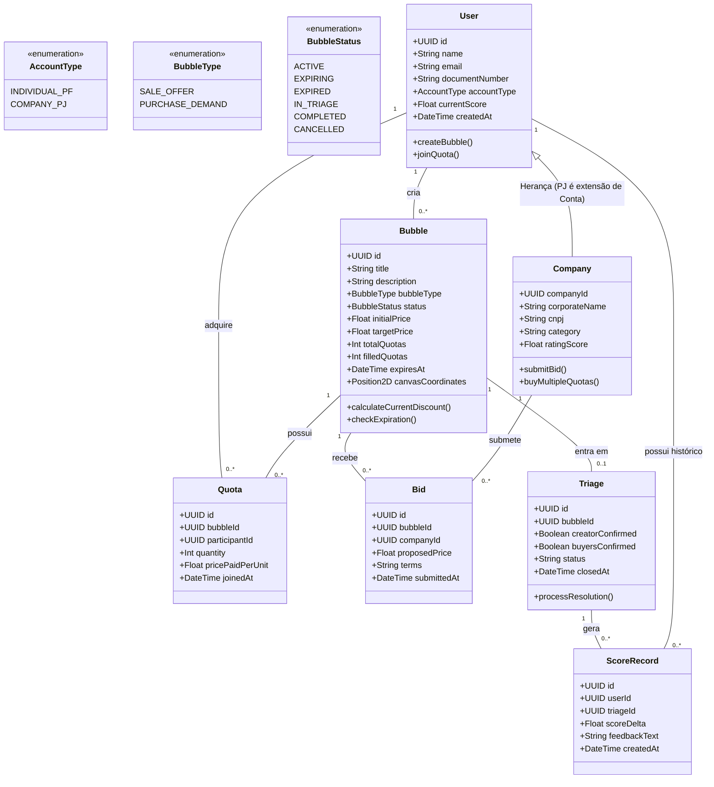

# Diagrama de Classes - Bolha Venda (Sales Bubble)

Este diagrama detalha a estrutura de modelo de dados orientada a objetos das entidades do domínio Bolha Venda.

```mermaid
classDiagram
    class AccountType {
        <<enumeration>>
        INDIVIDUAL_PF
        COMPANY_PJ
    }

    class BubbleType {
        <<enumeration>>
        SALE_OFFER
        PURCHASE_DEMAND
    }

    class BubbleStatus {
        <<enumeration>>
        ACTIVE
        EXPIRING
        EXPIRED
        IN_TRIAGE
        COMPLETED
        CANCELLED
    }

    class User {
        +UUID id
        +String name
        +String email
        +String documentNumber
        +AccountType accountType
        +Float currentScore
        +DateTime createdAt
        +createBubble()
        +joinQuota()
    }

    class Company {
        +UUID companyId
        +String corporateName
        +String cnpj
        +String category
        +Float ratingScore
        +submitBid()
        +buyMultipleQuotas()
    }

    class Bubble {
        +UUID id
        +String title
        +String description
        +BubbleType bubbleType
        +BubbleStatus status
        +Float initialPrice
        +Float targetPrice
        +Int totalQuotas
        +Int filledQuotas
        +DateTime expiresAt
        +Position2D canvasCoordinates
        +calculateCurrentDiscount()
        +checkExpiration()
    }

    class Quota {
        +UUID id
        +UUID bubbleId
        +UUID participantId
        +Int quantity
        +Float pricePaidPerUnit
        +DateTime joinedAt
    }

    class Bid {
        +UUID id
        +UUID bubbleId
        +UUID companyId
        +Float proposedPrice
        +String terms
        +DateTime submittedAt
    }

    class Triage {
        +UUID id
        +UUID bubbleId
        +Boolean creatorConfirmed
        +Boolean buyersConfirmed
        +String status
        +DateTime closedAt
        +processResolution()
    }

    class ScoreRecord {
        +UUID id
        +UUID userId
        +UUID triageId
        +Float scoreDelta
        +String feedbackText
        +DateTime createdAt
    }

    User <|-- Company : Herança (PJ é extensão de Conta)
    User "1" -- "0..*" Bubble : cria
    User "1" -- "0..*" Quota : adquire
    Bubble "1" -- "0..*" Quota : possui
    Bubble "1" -- "0..*" Bid : recebe
    Company "1" -- "0..*" Bid : submete
    Bubble "1" -- "0..1" Triage : entra em
    Triage "1" -- "0..*" ScoreRecord : gera
    User "1" -- "0..*" ScoreRecord : possui histórico
```
