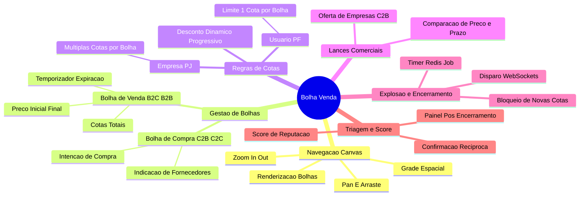

# Mapa Mental de Requisitos - Bolha Venda (Sales Bubble)

> 🎨 **Diagrama Interativo Archify**: [Visualizar Diagrama Interativo HTML (Archify)](file:///c:/Users/al_ja/OneDrive/Documents/work/Pessoal/IA/Vault/bolha-venda/002-llm/003%20diagrams/html/requirements.html)

Este diagrama sintetiza o mapeamento de módulos e requisitos funcionais do ecossistema.

