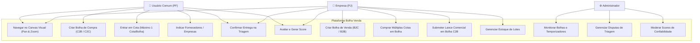

# Diagrama de Casos de Uso - Bolha Venda (Sales Bubble)

Este diagrama representa os principais Atores e seus respectivos Casos de Uso dentro do sistema Bolha Venda.

```mermaid
graph TD
    %% Atores
    UserPF["👤 Usuário Comum (PF)"]
    CompanyPJ["🏢 Empresa (PJ)"]
    Admin["⚙️ Administrador"]

    subgraph Plataforma Bolha Venda
        %% Casos de Uso de Usuário PF
        UC01["Navegar no Canvas Visual (Pan & Zoom)"]
        UC02["Criar Bolha de Compra (C2B / C2C)"]
        UC03["Entrar em Cota (Máximo 1 Cota/Bolha)"]
        UC04["Indicar Fornecedores / Empresas"]
        UC05["Confirmar Entrega na Triagem"]
        UC06["Avaliar e Gerar Score"]

        %% Casos de Uso de Empresa PJ
        UC07["Criar Bolha de Venda (B2C / B2B)"]
        UC08["Comprar Múltiplas Cotas em Bolha"]
        UC09["Submeter Lance Comercial em Bolha C2B"]
        UC10["Gerenciar Estoque de Lotes"]

        %% Casos de Uso de Admin
        UC11["Monitorar Bolhas e Temporizadores"]
        UC12["Gerenciar Disputas de Triagem"]
        UC13["Moderar Scores de Confiabilidade"]
    end

    %% Relacionamentos PF
    UserPF --> UC01
    UserPF --> UC02
    UserPF --> UC03
    UserPF --> UC04
    UserPF --> UC05
    UserPF --> UC06

    %% Relacionamentos PJ
    CompanyPJ --> UC01
    CompanyPJ --> UC07
    CompanyPJ --> UC08
    CompanyPJ --> UC09
    CompanyPJ --> UC10
    CompanyPJ --> UC05
    CompanyPJ --> UC06

    %% Relacionamentos Admin
    Admin --> UC11
    Admin --> UC12
    Admin --> UC13
```
