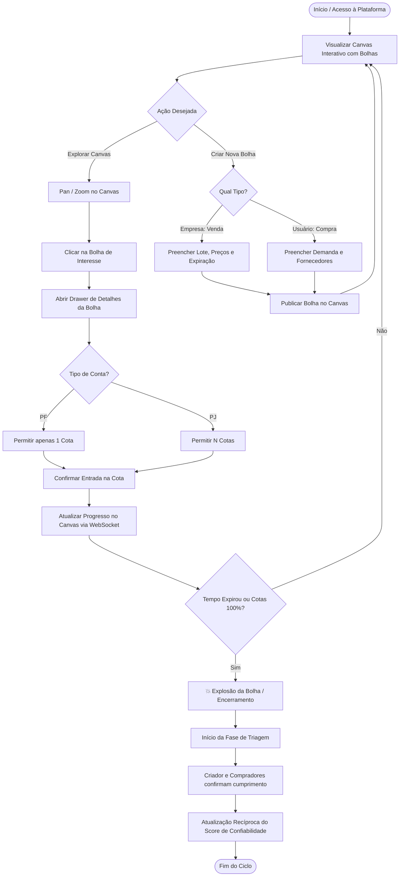

# Fluxo do Usuário (Use Flows) - Bolha Venda (Sales Bubble)

> 🎨 **Diagrama Interativo Archify**: [Visualizar Diagrama Interativo HTML (Archify)](file:///c:/Users/al_ja/OneDrive/Documents/work/Pessoal/IA/Vault/bolha-venda/002-llm/003%20diagrams/html/use-flows.html)

Este diagrama representa a jornada do usuário navegando no canvas até o encerramento da bolha e triagem.

