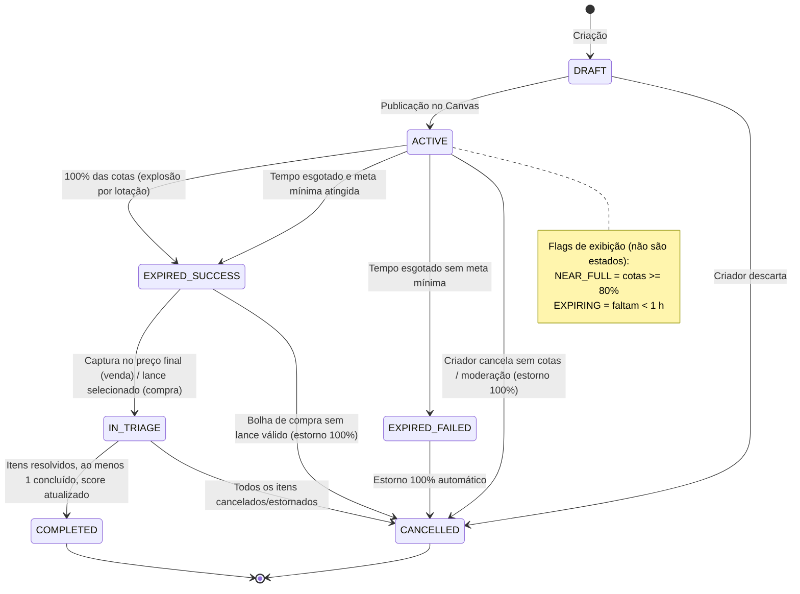
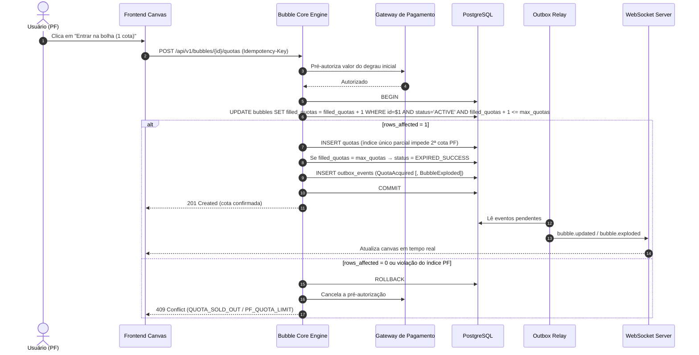

# Documento de Requisitos do Produto (PRD) — Bolha Venda (Sales Bubble)

**Projeto:** Bolha Venda (Plataforma Interativa de Vendas e Compras Coletivas)
**Versão:** 2.1 (validada e corrigida)
**Status:** Em revisão — aprovação no Gate A (PO + Tech Lead + Jurídico)
**Data:** 06 de Outubro de 2026 (v2.0: 10/08/2026)
**Autor:** Squad Gerencial & Arquitetura de Produto
**Documentos relacionados:** [Spec do Produto](SPEC.md) · [Relatório de validação](002%20Docs/03-requisitos/validacao-prd.md) · [Plano de Projeto](002%20Docs/planing-project.md)

> **Convenção:** itens marcados **(Proposto — ADR-xxxx)** são decisões recomendadas, pendentes de aprovação no Gate A. Os ADRs ficam em `002 Docs/05-arquitetura/adr/`.

---

## 1. Sumário Executivo

O **Bolha Venda** reinterpreta as compras e vendas coletivas por meio de um **Canvas Interativo Visual (Whiteboard Infinito)**. A plataforma conecta Pessoas Físicas (CPF) e Pessoas Jurídicas (CNPJ) nas modalidades **B2C, B2B, C2B e C2C**. Nela, os usuários criam "bolhas" de oportunidade cujo preço por cota cai em degraus conforme novas cotas são adquiridas.

O sistema combina três peças:
- **Canvas em tempo real:** WebGL com culling espacial via QuadTree, a 60 FPS.
- **Temporizadores orientados a eventos:** BullMQ + Redis, com o PostgreSQL como fonte da verdade.
- **Pós-encerramento:** um módulo de **Triagem & Score de Reputação**.

Com isso, ataca dois problemas: a falta de transparência e o alto custo de aquisição das ofertas coletivas tradicionais.

---

## 2. Declaração do Problema (Problem Statement)

### 2.1 Quem enfrenta o problema?
- **Consumidores Finais (PF / Solopreneurs):** buscam descontos reais em lote, mas não têm poder de barganha individual nem visibilidade de outros compradores com o mesmo interesse.
- **Empresas e Fornecedores (PJ / Atacado e Varejo):** enfrentam alto Custo de Aquisição de Clientes (CAC) e incerteza de demanda ao lançar lotes promocionais sem garantia de volume mínimo.

### 2.2 Qual é o problema?
Plataformas de e-commerce tradicionais são estáticas e unilaterais. Não há mecanismo nativo para agrupar a demanda de compradores (C2B), nem transparência visual do desconto em tempo real conforme as cotas são preenchidas.

### 2.3 Evidências e Impactos (hipóteses a validar no Discovery — ver `01-negocio/business-case.md`)
- **Perda de conversão:** compradores desistem de compras em grande volume por falta de parceiros de lote.
- **Risco comercial:** vendedores concedem descontos sem garantia de atingir a quantidade mínima vendida.

---

## 3. Personas e Usuários Alvo

### 3.1 Persona Primária: Consumidor Coletivo (PF — Carlos Silva)
- **Perfil:** entusiasta de tecnologia e de compras em grupo.
- **Necessidades:** entrar em bolhas existentes com 1 cota, acompanhar a queda do preço em tempo real e ser notificado no encerramento.
- **Restrição:** limite estrito de **1 cota por bolha**, para evitar monopólio ou especulação.

### 3.2 Persona Secundária: Empresa / Fornecedor (PJ — TecnoLotes Ltda)
- **Perfil:** distribuidora ou fabricante com estoque para desovar ou lotes em promoção.
- **Necessidades:**
  - criar bolhas de venda com degraus de preço;
  - comprar **múltiplas cotas** quando atua como compradora B2B;
  - dar lances comerciais em bolhas de compra C2B.
- **Restrições:**
  - CNPJ com situação cadastral **ATIVA**, verificado no cadastro e revalidado a cada 30 dias **(Proposto — ADR-0008)**;
  - teto de cotas por PJ em cada bolha: `max_pj_share`, padrão 50% da capacidade **(Proposto — ADR-0006)**.

### 3.3 Demais usuários
- **Visitante:** navega no canvas sem login; não participa.
- **Moderador (plataforma):** suspende bolhas e contas, decide contestações de score.

---

## 4. Contexto Estratégico & Viabilidade Jurídica

### 4.1 Enquadramento Legal no Brasil
> Análise técnica preliminar. Os pontos marcados ⚖️ exigem parecer de advogado antes do Gate A (ver relatório de validação, §3).

- **Código de Defesa do Consumidor (CDC — Lei nº 8.078/1990):**
  - **B2C e C2B (consumidor comprando de empresa):** aplicação integral.
  - **Oferta vinculante (arts. 30 e 31):** as condições da bolha (degraus, meta, prazo, regras de cotas) vinculam o fornecedor.
  - **Direito de Arrependimento de 7 dias (art. 49):** contado do recebimento do produto.
  - ⚖️ **B2B:** aplicar o CDC quando a PJ é destinatária final é análise caso a caso.
- **Bolhas não concluídas:** se a bolha expira sem atingir a meta mínima (`min_quotas`), ou se a triagem é cancelada, os valores pré-autorizados ou cobrados são **100% estornados, sem retenção**.
- **Código Civil (Lei nº 10.406/2002):** regula B2B e C2C pela boa-fé objetiva (arts. 421 e 422). A bolha é oferta pública e a adesão à cota é aceitação sob condição (atingir a meta) — arts. 427 a 435.
- **Marco Civil da Internet (Lei nº 12.965/2014):** a plataforma é provedora de aplicação intermediadora (art. 19). ⚖️ Em relações de consumo, a plataforma pode ser considerada parte da cadeia de fornecimento: validar com advogado o alcance dessa responsabilidade.
- **LGPD (Lei nº 13.709/2018):**
  - **Proteção de documentos e e-mail:** CPF, CNPJ e e-mail são cifrados em coluna, com hash para busca.
  - **Exibição no canvas:** os participantes aparecem só por **pseudônimo**. O pseudônimo continua sendo dado pessoal: não equivale a anonimização.
  - **CNPJ de MEI:** recebe a mesma proteção do CPF.
  - **Direitos do titular:** acesso, correção, portabilidade e exclusão, observada a retenção legal.
  - **Incidentes:** plano de resposta com comunicação à ANPD.

---

## 5. Visão Geral da Solução & Arquitetura Técnica

### 5.1 Arquitetura Orientada a Eventos
Arquitetura lógica abaixo. No R1, ela é implementada como **monólito modular** (NestJS), com um módulo por contexto e workers em processo separado, sem microsserviços **(Proposto — ADR-0001)**.

```text
[ Web Client / Mobile Browser (PWA) ]
       |         ^
       | HTTPS   | WebSockets (Socket.io + Redis adapter)
       v         |
[ API Gateway / Load Balancer ]
       |
       +--------------------+--------------------+--------------------+
       v                    v                    v                    v
[ Identity ]       [ Bubble Core Engine ]   [ Payment ]        [ Triage & Reputation ]
 (contas, CNPJ)     (bolhas, cotas, preço,   (gateway, estorno, (triagem, score,
                     lances, timers)          repasse)           contestação)
       +--------------------+--------------------+--------------------+
                                     |
                         +-----------+-----------+
                         v                       v
                 [ PostgreSQL 16 ]        [ Redis 7 + BullMQ ]
             (fonte da verdade, ACID,    (timers, pub/sub WS,
              outbox de eventos)          cache)
                                     |
                         [ Gateway de pagamento terceirizado ]
```

### 5.2 Componentes Chave da Engenharia
1. **Frontend Canvas Visual:** renderiza até 500 bolhas simultâneas a ≥ 60 FPS em pan/zoom, com WebGL (PixiJS) e culling por QuadTree. Inclui uma lista alternativa acessível, sincronizada com o canvas.
2. **Bubble Core Engine:** máquina de estados revisada **(Proposto — ADR-0009)**:
   `DRAFT → ACTIVE → EXPIRED_SUCCESS | EXPIRED_FAILED`; `EXPIRED_SUCCESS → IN_TRIAGE → COMPLETED | CANCELLED`; `EXPIRED_FAILED → CANCELLED`.
   `NEAR_FULL` (≥ 80% das cotas) e `EXPIRING` (< 1 h) são **flags de exibição**, não estados.
3. **Prevenção de Overbooking:** `UPDATE` condicional atômico no PostgreSQL mais um índice único parcial (1 cota ativa por PF por bolha). Sem lock distribuído **(Proposto — ADR-0002)**.
4. **Timer Engine (BullMQ + Redis):** delayed jobs disparam a explosão em $T_{final}$. Um reconciliador periódico consulta o PostgreSQL para garantir a explosão mesmo se o Redis perder jobs **(Proposto — ADR-0011)**.
5. **Eventos confiáveis:** os eventos de domínio são gravados na mesma transação (outbox) e só depois publicados no WebSocket e nas filas **(Proposto — ADR-0010)**.

---

## 6. Requisitos Funcionais (RF)

> Detalhamento completo (RF-xxx, RN-xxx, critérios de aceite) na ERS: `002 Docs/03-requisitos/ers.md`. Comportamento detalhado na [Spec](SPEC.md).

### RF01 — Autenticação, Perfil e Privacidade
- **RF01.1:** Cadastro de Usuários (CPF) e Empresas (CNPJ). O CNPJ é validado por provedor externo e exige situação ATIVA.
- **RF01.2:** Autenticação via JWT (access token curto + refresh rotativo) e login social OAuth2 (Google).
- **RF01.3:** Pseudônimo público gerado para cada conta, o único identificador exibido no canvas.
- **RF01.4:** O titular pode exportar seus dados e solicitar a exclusão da conta, observada a retenção legal.

### RF02 — Canvas Interativo
- **RF02.1:** Canvas estilo whiteboard com zoom/pan (mouse, trackpad e toque), atualizado via WebSockets.
- **RF02.2:** Cada bolha exibe tipo (Venda/Compra), progresso de cotas e meta, temporizador, preço atual, próximo degrau, preço-alvo e as flags `NEAR_FULL`/`EXPIRING`.
- **RF02.3:** Lista alternativa navegável por teclado e leitor de tela, com o mesmo conteúdo do canvas visível.

### RF03 — Regras de Cotas
- **RF03.1:** Usuários PF podem ter **no máximo 1 cota** ativa por bolha.
- **RF03.2:** Empresas PJ podem adquirir **múltiplas cotas** por bolha, até `max_pj_share` da capacidade **(Proposto — ADR-0006)**.
- **RF03.3:** Cada cota adquirida ou liberada recalcula, imediatamente e para todos, o preço atual e o degrau atingido.
- **RF03.4:** O participante pode sair da cota enquanto a bolha está `ACTIVE` e fora da última hora (`EXPIRING`). A saída libera a pré-autorização.
- **RF03.5:** Aquisições concorrentes nunca excedem a capacidade. A requisição excedente recebe "Cotas esgotadas".

### RF04 — Lances Comerciais (C2B / B2B)
- **RF04.1:** Empresas submetem lances (preço por cota, prazo de entrega, condições) em bolhas de compra. Lances acima do preço-alvo são rejeitados.
- **RF04.2:** Após a explosão com sucesso, o criador tem **24 h** para escolher o lance. Sem escolha, vence o de menor preço (empate: o mais antigo). Sem lance válido, a bolha é cancelada com estorno **(Proposto — ADR-0005)**.
- **RF04.3:** Nos lances visíveis, as empresas concorrentes aparecem por pseudônimo até a seleção.

### RF05 — Encerramento, Triagem e Score
- **RF05.1:** A bolha explode quando:
  - **(a) o tempo expira:** `EXPIRED_SUCCESS` se a meta mínima foi atingida, senão `EXPIRED_FAILED`;
  - **(b) 100% das cotas são preenchidas:** `EXPIRED_SUCCESS`, na mesma transação da última cota.
- **RF05.2:** Na **Triagem**, cada comprador acompanha seu item, sempre com prazos:
  1. captura do pagamento;
  2. registro de envio pelo vendedor;
  3. confirmação do recebimento;
  4. janela de arrependimento;
  5. repasse ao vendedor.
- **RF05.3:** O **Score de Reputação** (0–1000) é atualizado por eventos com pesos publicados **(Proposto — ADR-0007)**. Cada evento pode ser contestado em até **5 dias**; a contestação procedente reverte o evento.

### RF06 — Criação e Publicação de Bolhas *(novo)*
- **RF06.1:** **Bolha de Venda:** criada por PJ (B2C/B2B) ou PF (C2C), com produto, imagem, descrição, capacidade, meta mínima, degraus de preço (do preço inicial ao preço-alvo, não crescentes), prazo de envio e duração.
- **RF06.2:** **Bolha de Compra:** criada por PF ou PJ, com item desejado, capacidade, meta mínima, preço-alvo (preço máximo aceitável) e duração. Pode indicar fornecedores a notificar.
- **RF06.3:** Duração entre **1 h e 5 dias** (venda) ou **1 h e 4 dias** (compra, por causa das 24 h de seleção de lance). O máximo é limitado pela validade da pré-autorização de cartão e deve ser confirmado com o gateway.
- **RF06.4:** A bolha nasce em `DRAFT` e só fica visível ao ser publicada (`ACTIVE`). O criador pode cancelá-la enquanto não houver cotas.

### RF07 — Pagamento, Estorno e Repasse *(novo)*
- **RF07.1:**
  - **Cartão:** a adesão à cota pré-autoriza o valor do degrau inicial (venda) ou do preço-alvo (compra).
  - **Pix:** a adesão cobra esse mesmo valor.
- **RF07.2:** Na explosão com sucesso, o sistema captura o **preço final único** (degrau atingido ou lance vencedor) e devolve a diferença.
- **RF07.3:** Bolha falha ou cancelada: estorno de 100% de todas as reservas e cobranças.
- **RF07.4:** O repasse ao vendedor, já descontada a taxa da plataforma, ocorre após o fim da janela de arrependimento **(Proposto — ADR-0003)**.

### RF08 — Notificações *(novo)*
- **RF08.1:** Notificações in-app e por e-mail para:
  - explosão (sucesso ou falha);
  - mudança de degrau;
  - flag `EXPIRING` em bolhas em que o usuário participa;
  - novo lance;
  - seleção de lance;
  - prazos da triagem;
  - mudança de score.

### RF09 — Moderação *(novo)*
- **RF09.1:** Moderadores podem suspender bolhas (com estorno total) e contas, e decidir contestações de score. Toda ação fica em trilha de auditoria.

---

## 7. Requisitos Não-Funcionais (RNF)

- **RNF01 — Desempenho:**
  - **Canvas:** 500 bolhas renderizadas com frame time p95 ≤ 16,7 ms (≥ 60 FPS) durante pan/zoom, em dois dispositivos de referência — notebook com GPU integrada e smartphone Android de gama média (especificação exata definida no S0).
  - **Tempo real:** atualização de cota com latência p99 < 200 ms, medida do commit no servidor até a renderização no cliente.
- **RNF02 — Concorrência e pontualidade:**
  - A compra da última cota é estritamente atômica: 100 requisições simultâneas por 1 cota resultam em exatamente 1 sucesso.
  - A explosão por tempo ocorre em ≤ 2 s após $T_{final}$, mesmo com reinício de worker.
- **RNF03 — Segurança e privacidade:**
  - CPF, CNPJ e e-mail cifrados em coluna.
  - TLS em todo tráfego e logs sem dados pessoais.
  - Conformidade com a LGPD (base legal por finalidade, direitos do titular, plano de incidente).
- **RNF04 — Disponibilidade:** API e WebSocket com SLO de 99,5% mensal no R1; RPO ≤ 15 min, RTO ≤ 4 h.
- **RNF05 — Acessibilidade:** WCAG 2.1 nível AA. Cor nunca é o único canal de status, e as animações respeitam `prefers-reduced-motion`.
- **RNF06 — Compatibilidade:** últimas 2 versões de Chrome, Edge, Firefox e Safari (desktop e mobile); PWA instalável.

---

## 8. Diagramas de Fluxo e Sequência do Sistema

### 8.1 Diagrama de Estados da Bolha (revisado — ADR-0009)


### 8.2 Diagrama de Sequência — Compra da Última Cota (ADR-0002)


---

## 9. Fora de Escopo (Out of Scope) — Release 1.0

- **Processamento financeiro próprio** (adquirência, custódia ou escrow próprios). O fechamento usa **gateway terceirizado** (Pagar.me, com Stripe como alternativa), que está **dentro** do escopo.
- **Aplicativo nativo iOS/Android.** A R1 é **PWA responsivo**.
- **Integração com ERP/WMS** de varejistas.
- **Logística e frete integrados.** O vendedor informa o código de rastreio.
- **Chat livre** entre as partes (a triagem usa ações estruturadas).

---

## 10. Métricas de Sucesso & Critérios de Aceite

| Tipo | Métrica | Definição | Meta |
| :--- | :--- | :--- | :--- |
| **Primária** | Taxa de sucesso de bolhas | `EXPIRED_SUCCESS ÷ bolhas publicadas`, coorte mensal | > 65% |
| Secundária | Tempo até o sucesso | Mediana de `t(EXPIRED_SUCCESS) − t(ACTIVE)` | < 48 h |
| Secundária | Taxa de conclusão da triagem | `COMPLETED ÷ IN_TRIAGE`, coorte mensal | > 90% |
| Técnica | Latência de tempo real | p99 commit → renderização do update de cota | < 200 ms |
| Técnica | Pontualidade da explosão | p99 de `exploded_at − expires_at` | ≤ 2 s |
| Guardrail | Taxa de estorno por cancelamento na triagem | estornos na triagem ÷ itens de triagem | < 5% |
| Guardrail | Contestações procedentes | contestações procedentes ÷ eventos de score | < 2% |

As metas são hipóteses para o beta. Serão recalibradas com 60 dias de dados reais.

---

## 11. Histórico de Revisões

| Versão | Data | Alterações |
| :--- | :--- | :--- |
| 2.0 | 10/08/2026 | Engenharia e arquitetura completa |
| 2.1 | 06/10/2026 | Validação com o AlterEgo (22 achados). Máquina de estados revisada; concorrência unificada (ADR-0002); novos RF06–RF09 (criação de bolha, pagamento/estorno, notificações, moderação); RF03.4–3.5, RF04.2–4.3 e RF01.3–1.4; RNF quantificados (percentis, dispositivos, disponibilidade, a11y); métricas redefinidas e guardrails; ressalvas jurídicas; fora de escopo ajustado. Detalhes no relatório de validação. |

---

*Documento em `bolha-venda/002-llm/PRD.MD`. Spec detalhada em `002-llm/SPEC.md`.*
