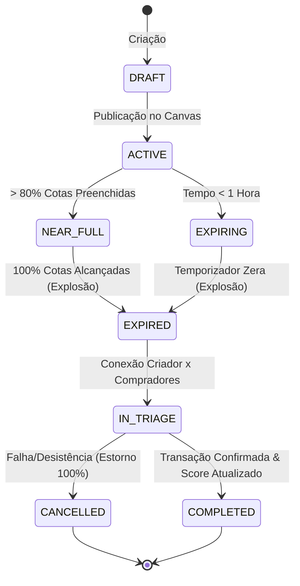
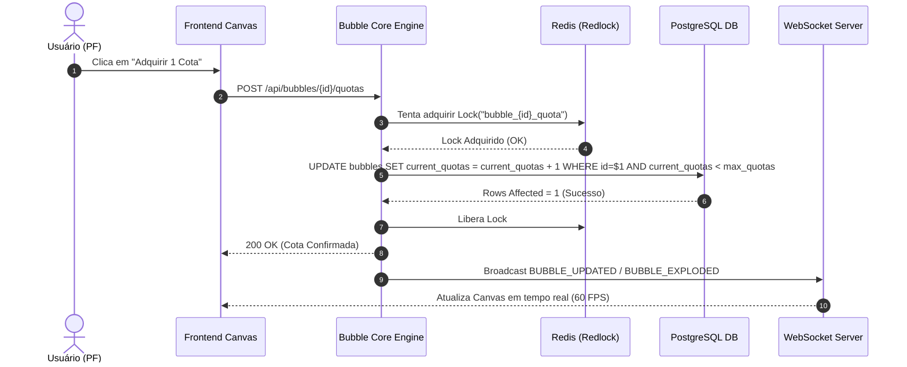

# Documento de Requisitos do Produto (PRD) — Bolha Venda (Sales Bubble)

**Projeto:** Bolha Venda (Plataforma Interativa de Vendas e Compras Coletivas)  
**Versão:** 2.0 (Engenharia e Arquitetura Completa)  
**Status:** Especificado & Pronto para Engenharia  
**Data:** 10 de Agosto de 2026  
**Autor:** Squad Gerencial & Arquitetura de Produto  

---

## 1. Sumário Executivo

O **Bolha Venda** é uma plataforma inovadora que reinterpreta o conceito de compras e vendas coletivas através de um **Canvas Interativo Visual (Whiteboard Infinito)**. A plataforma conecta Pessoas Físicas (CPF) e Pessoas Jurídicas (CNPJ) nas modalidades **B2C, B2B, C2B e C2C**, permitindo a criação de "bolhas" dinâmicas de oportunidade com preços progressivamente menores conforme novas cotas são adquiridas. 

Ao unir renderização em tempo real (60 FPS via QuadTree), temporizadores de expiração orientados a eventos (BullMQ + Redis) e um módulo pós-encerramento de **Triagem & Score de Reputação**, o sistema resolve a falta de transparência e o alto custo de aquisição em ofertas coletivas tradicionais.

---

## 2. Declaração do Problema (Problem Statement)

### 2.1 Quem enfrenta o problema?
- **Consumidores Finais (PF / Solopreneurs):** Buscam descontos reais em lote, mas não possuem poder de barganha individual nem visibilidade de outros compradores com o mesmo interesse.
- **Empresas e Fornecedores (PJ / Atacado e Varejo):** Enfrentam alto Custo de Aquisição de Clientes (CAC) e incerteza de demanda ao lançar lotes promocionais sem garantia de volume mínimo.

### 2.2 Qual é o problema?
- Plataformas de e-commerce tradicionais são estáticas e unilaterais. Não há mecanismo nativo para agrupamento orgânico de demanda por compradores (C2B), nem transparência visual do desconto em tempo real conforme cotas são preenchidas.

### 2.3 Evidências e Impactos
- **Perda de conversão:** Compradores desistem de compras em grande volume por falta de parceiros de lote.
- **Risco comercial:** Vendedores concedem descontos sem a garantia contratual de atingir a quantidade mínima vendida.

---

## 3. Personas e Usuários Alvo

### 3.1 Persona Primária: Consumidor Coletivo (PF — Carlos Silva)
- **Perfil:** Usuário entusiasta de tecnologia e compras em grupo.
- **Necessidades:** Entrar em bolhas existentes com apenas 1 cota por bolha, acompanhar a queda do preço em tempo real e receber notificações instantâneas do encerramento.
- **Restrição:** Limite estrito de **1 cota por bolha** para evitar monopólio ou especulação.

### 3.2 Persona Secundária: Empresa / Fornecedor (PJ — TecnoLotes Ltda)
- **Perfil:** Distribuidora ou fabricante com estoque para desovar ou lotes em promoção.
- **Necessidades:** Criar bolhas de venda com preço inicial e preço-alvo de desconto, comprar **múltiplas cotas** (se atuando como compradora B2B) e dar lances comerciais em bolhas de compra C2B.
- **Validação:** Exigência de CNPJ ativo verificado junto à Receita Federal.

---

## 4. Contexto Estratégico & Viabilidade Jurídica

### 4.1 Enquadramento Legal no Brasil
- **Código de Defesa do Consumidor (CDC - Lei nº 8.078/1990):** Aplicação integral nas relações B2C e C2B. Garantia do **Direito de Arrependimento de 7 dias** (Art. 49) após o recebimento.
- **Tratamento de Bolhas Não Concluídas:** Se a bolha expirar sem atingir a meta de cotas/tempo, todos os valores pré-reservados são 100% estornados sem retenção.
- **Código Civil (Lei nº 10.406/2002):** Regula transações B2B e C2C sob o princípio da boa-fé objetiva e oferta sob condição suspensiva/resolutiva (Art. 427 a 435).
- **Marco Civil da Internet (Lei nº 12.965/2014):** A plataforma atua como provedora de aplicação intermediadora (Art. 19).
- **LGPD (Lei nº 13.709/2018):** Dados de CPF/CNPJ encriptados. No canvas público, participantes são exibidos de forma anonimizada/pseudonimizada.

---

## 5. Visão Geral da Solução & Arquitetura Técnica

### 5.1 Arquitetura Orientada a Eventos (Event-Driven Architecture)
```text
[ Web Client / Mobile Browser ]
       |         ^
       | HTTP    | WebSockets (Socket.io)
       v         |
[ API Gateway / Load Balancer ]
       |
       +-----------------------+-----------------------+
       |                       |                       |
       v                       v                       v
[ Auth & User Service ]  [ Bubble Core Engine ]  [ Triage & Score Service ]
       |                       |                       |
       +-----------------------+-----------------------+
                               |
                   +-----------+-----------+
                   |                       |
                   v                       v
           [ PostgreSQL DB ]        [ Redis Cache & BullMQ ]
          (Persistência ACID)       (Timers & WS PubSub)
```

### 5.2 Componentes Chave da Engenharia
1. **Frontend Canvas Visual (Spatial Grid QuadTree):** Renderiza até 500 bolhas simultâneas mantendo no mínimo 60 FPS com suporte a Pan e Zoom fluídos.
2. **Bubble Core Engine (Gerenciamento de Estados):**
   `DRAFT -> ACTIVE -> NEAR_FULL / EXPIRING -> EXPIRED (Exploded) -> IN_TRIAGE -> COMPLETED / CANCELLED`
3. **Prevenção de Overbooking (Lock Distribuído):** Controle atômico via `Redlock (Redis)` ou transação PostgreSQL `SELECT FOR UPDATE` na aquisição de cotas concorrentes.
4. **Schedule & Timer Engine (BullMQ + Redis):** Jobs atrasados em tempo real para disparar a "Explosão da Bolha" exatamente no timestamp $T_{final}$.

---

## 6. Requisitos Funcionais (RF)

### RF01 — Autenticação e Perfil
- **RF01.1:** Permissão para cadastro de Usuários (CPF) e Empresas (CNPJ).
- **RF01.2:** Autenticação segura via JSON Web Tokens (JWT) e OAuth2.

### RF02 — Canvas Interativo
- **RF02.1:** Canvas no estilo whiteboard com zoom/pan e atualização via WebSockets.
- **RF02.2:** Exibição dinâmica das bolhas (progresso de cotas, temporizador, tipo Venda/Compra, preço atual e preço alvo).

### RF03 — Regras de Cotas
- **RF03.1:** Usuários PF podem adquirir **no máximo 1 cota** por bolha.
- **RF03.2:** Empresas PJ podem adquirir **múltiplas cotas** por bolha.
- **RF03.3:** Atualização instantânea da curva de desconto conforme cotas são preenchidas.

### RF04 — Lances Comerciais (C2B / B2B)
- **RF04.1:** Empresas podem submeter lances comerciais (preço/prazo) em bolhas de compra criadas por usuários.

### RF05 — Encerramento, Triagem e Score
- **RF05.1:** Quando o tempo expira ou 100% das cotas são vendidas, a bolha "explode" (status `EXPIRED`).
- **RF05.2:** Abertura da etapa de **Triagem** pós-encerramento para conferência de pagamento e envio.
- **RF05.3:** Atualização do **Score de Reputação** dos envolvidos com canal transparente para contestação em até 5 dias.

---

## 7. Requisitos Não-Funcionais (RNF)

- **RNF01 (Desempenho):** Renderização de 500 bolhas no canvas em 60 FPS. Atualização via WebSockets em menos de 200ms.
- **RNF02 (Concorrência):** Tratar a compra da última cota de forma estritamente atômica sem overbooking.
- **RNF03 (Segurança):** Criptografia de dados sensíveis e conformidade LGPD.

---

## 8. Diagramas de Fluxo e Sequência do Sistema

### 8.1 Diagrama de Estados da Bolha


### 8.2 Diagrama de Sequência — Compra da Última Cota (Lock Atômico)


---

## 9. Fora de Escopo (Out of Scope)

- **Processamento financeiro próprio (Gateways Internos):** Na V1/V2, o fechamento é feito via integração de gateway terceirizado (Pagar.me/Stripe) ou arranjo de triagem indicado nos Termos.
- **Aplicativo Nativo iOS/Android:** A V1/V2 focará 100% em **PWA Responsivo (Web/Mobile)**.

---

## 10. Métricas de Sucesso & Critérios de Aceite

- **Métrica Primária:** Taxa de Conclusão de Bolhas (meta: > 65% das bolhas criadas explodem com sucesso).
- **Métrica Secundária:** Tempo médio para atingir 100% das cotas (meta: < 48 horas).
- **Métrica de Latência:** Transição do Canvas via WebSocket < 200ms em 99% dos disparos.

---

*Documento gravado fisicamente em `bolha-venda/PRD.MD` e pronto para indexação vetorial no RAG ChromaDB.*